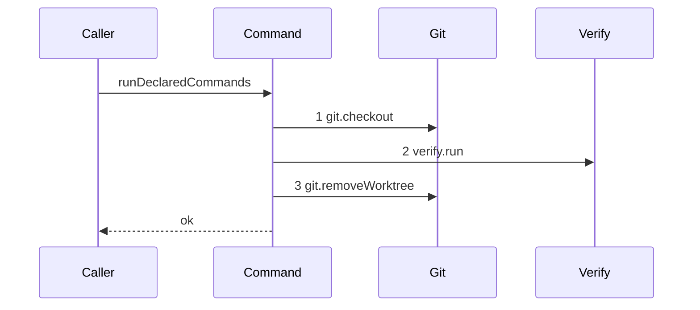

# Story 1 — One declared command runs

Epic: `.agents/plan/epics/051.2-the-command-gate.md`
Depends on: Story 2 (`02-no-declared-command-runs`) — it creates the module, its test file, its two
doubles and this epic's `authoredEpics` entry, and its zero-step diagram is the contract this story's
loop must not break. EPIC 051.1 Story 1 (`01-the-five-git-primitives`) for `git.checkout`, which
allocates the directory and returns it, and for `git.removeWorktree`. EPIC 050.6, implemented, for
`DEFAULT_TIMEOUT_MS` on `src/services/process/index.ts`, and the re-authored EPIC 107 for the
`Verify` contract — neither of those two epics is authored into stories yet, so no story stem of
either resolves. EPIC 050.1 Story 6 (`06-the-conformance-harness`) and Story 7
(`07-the-conformance-runner`) for the recorder and the runner.
Kind: story-implement

Diagrams: run-commands-success-one

Seams: run-commands-success-one: +git.checkout, +verify.run, +git.removeWorktree

This story writes the loop. It leaves the outcome predicate and its refusal to Story 3
(`03-a-declared-command-fails`): the loop here runs every declared command in its own checkout and
discards what the check reported.

**The drawn set of this path is one diagram.** `commands.run` branches on the length of the declared
list alone. A list of none is Story 2 (`02-no-declared-command-runs`), a list of one is this diagram,
and a list of two or more produces this diagram's tokens repeated, which the grammar refuses to draw
and which cases 2, 3 and 4 assert instead. The refusal reaches the same seams in the same order, so
it is not drawn either; the epic's `## Sequence` states why.

## The ship path

### `run-commands-success-one`

Fixture: one declared command, `"true"`, against a bare repository seeded by `seedRepositories` and
the pinned commit `fixtureObjectIds.commit1`. The length of one is what makes each of the three
tokens appear exactly once.



The shape asserts three things. The checkout precedes the check, so no command ever runs in a
directory it did not receive fresh. The removal follows the check, so the directory outlives exactly
one command. And the three calls are one iteration: the loop body is checkout, run, remove, and a
body that hoisted the checkout out of the loop would produce one `git.checkout` for a list of three,
which case 3 refuses by value.

**No method of this path carries a label, and `verify.run` carries no command-string projection.**
`.agents/plan/authoring.md` admits one unlabelled call per diagram per method, and each of the three
appears once here and once in Story 2's empty diagram, which holds none. A projection was considered
and refused, for three reasons that each stand alone. `.agents/plan/authoring.md` requires a
projection to name a value the call receives, and `CheckRequest` at
`.agents/plan/epics/107-verify-service.md:28` holds exactly four: `command`, `cwd`, `timeoutMs` and
`signal`. `command` is an array, so `test/helpers/sequence-conformance.ts:14` — `field` renders it
through `String`, which joins with commas, and the `Seams:` token grammar of
`scripts/verify-epic-sequence.ts` admits no comma inside a label, so such a token could never be
declared; a declared command string also holds spaces and colons freely, which the token grammar
splits on. `cwd` is a `mkdtemp` path, so it is not assertable as a fixed token at all. `timeoutMs`
and `signal` are constant across every call this epic makes, so neither separates anything.
`test/helpers/sequence-conformance.ts:50` — `projections` gains no entry in this epic.

Add `test/sequence/scenarios/run-commands-success-one.ts`.

## Change

### 1 — the loop

**`src/commands/checkpoint/run-declared-commands.ts` — replace the empty body of Story 2
(`02-no-declared-command-runs`) with the loop, and delete its two `void` statements.**

```ts
for (const command of input.commands) {
  const targetDir = await dependencies.git.checkout({
    gitDir: input.gitDir,
    oid: input.oid,
  });
  try {
    await dependencies.verify.run({
      command: ["/bin/sh", "-c", command],
      cwd: targetDir,
      timeoutMs: DEFAULT_TIMEOUT_MS,
      signal: null,
    });
  } finally {
    await dependencies.git.removeWorktree({ gitDir: input.gitDir, targetDir });
  }
}
```

Add one import: `import { DEFAULT_TIMEOUT_MS } from "../../services/process/index.ts";`. A command
may import a constant from a service interface file under the import matrix of `AGENTS.md`. Add no
`node:` import at all: `eslint.config.js:342` — `node:fs` restricts `src/commands/**` and
`src/queries/**`, and this loop names no path, because `git.checkout` allocates the directory and
returns it and `git.removeWorktree` deletes it.

**The loop iterates the values, not the entries.** Story 3 (`03-a-declared-command-fails`) changes it
to `input.commands.entries()` when it needs the index for its refusal, and that is the only reason
the index exists.

**The argv is built and never parsed.** `src/domain/verify-block.ts:29` — `commands` declares each
item as one complete command string, and `["/bin/sh", "-c", <the declared string>]` hands it to a
shell whole. `src/services/git/launcher.ts:47` — `LAUNCHER_SCRIPT` already builds the same argv form
for git. The unit inspects no character of the string, so a `&&` chain, a pipe and a leading `!` are
the plan author's shell and not a rule of the daemon.

**`signal: null` is required by the contract and is not a decision of this story.**
`.agents/plan/epics/107-verify-service.md:28` declares `CheckRequest` as
`Readonly<{ command: readonly string[]; cwd: string; timeoutMs: number; signal: AbortSignal | null }>`,
so the field has no default and every caller supplies it. This epic decides no cancellation, so the
value is `null`.

**The `try` wraps the check alone, and the removal is the `finally`.** The removal therefore runs at
ordinal 3, and a checkout that itself failed leaves nothing to remove — `git.checkout` rolls back its
own allocation when `worktree add` fails, per EPIC 051.1 Story 1
(`01-the-five-git-primitives`).

**A `finally` discards the exception it wrapped and skips everything after the block, and that is why
Story 3 replaces this shape rather than adding to it.** Here the substitution has no product
meaning: this story raises no refusal, and the only throw `verify.run` has is
`VerifyError("request-invalid")` at `.agents/plan/epics/107-verify-service.md:31`, which is raised
before anything starts and which this unit's inputs cannot trigger. The moment a refusal exists the
`finally` would mask it, so Story 3 gives each call its own `try` and applies the precedence the
epic declares. Do not pre-empt that restructure here.

### 2 — what this story does not touch

**Do not implement the predicate, the refusal or the error class.** Story 3
(`03-a-declared-command-fails`) owns all three. `verify.run`'s return value is discarded here.

**Do not touch `scripts/epic-sequence-range.ts`.** Story 2 (`02-no-declared-command-runs`) appends to
`authoredEpics` and Story 3 (`03-a-declared-command-fails`) appends to `shippedEpics`.

**Do not touch `src/commands/checkpoint/accept-execution.ts`.** It does not exist, `commands.run`
has no caller in this epic, and EPIC 051.4 composes it.

**Do not touch `src/main.ts`.** No route reaches this unit.

## Constraints

- Run the commands one at a time, in declared order, awaiting each. A `Promise.all` would break assertions 3, 4 and 5 of the epic's gate at once.
- Open no transaction. This unit takes no `Storage` and no `Transaction`: it is git and subprocess I/O, and `AGENTS.md` forbids both inside a storage transaction.
- Name no path, and import no `node:fs` and no `node:path`. The directory comes from `git.checkout`'s return value and goes back to `git.removeWorktree`.
- Read no clock. `DEFAULT_TIMEOUT_MS` is a constant and this unit records no timestamp.
- Call `git.checkout`, `verify.run` and `git.removeWorktree` exactly once each per declared command, and pass `git.removeWorktree` the exact string that iteration's `git.checkout` returned.
- Pass `timeoutMs: DEFAULT_TIMEOUT_MS` and add no budget of your own. The epic decides no per-node budget.
- Do not inspect the command string. No trim, no split, no prefix test.
- Do not break Story 2's zero-step diagram. `for (const command of input.commands)` iterates nothing for an empty array; do not add a guard, and do not hoist the checkout above the loop.

## Verify

```
node --test src/commands/checkpoint/run-declared-commands.test.ts test/sequence/conformance.test.ts
```

Extend `src/commands/checkpoint/run-declared-commands.test.ts`, which Story 2
(`02-no-declared-command-runs`) creates together with its `CheckoutGit` and `Verify` doubles and its
real-`Git` fixture. Cases 5, 6, 7 and 8 use the real `createBinaryGit` over
`createGitRunner(paths, createSupervisedRunner())` and a real `GitPaths` from `buildGitPaths`, with
`seedRepositories(tools)` for the bare repository and `const OID = fixtureObjectIds.commit1;`. Case 8
uses the real `SupervisedVerify` too.

Add, each as a separate `it`:

1. `"verify.run receives the declared string through /bin/sh -c, the checkout's own directory and the default timeout"` — one declared command `"npm test"`. Assert the recorded `CheckRequest.command` deep-equals `["/bin/sh", "-c", "npm test"]`, `timeoutMs` equals `120_000`, `signal` is `null`, and `cwd` equals **the exact string the recorded `git.checkout` call returned**. The first three by value, and `120_000` written as the literal beside an `assert.equal(DEFAULT_TIMEOUT_MS, 120_000)` so a moved constant fails here and not silently. `cwd` is asserted against the returned value because the directory is minted by the git service, so no literal path is assertable.

2. `"a list of one makes one call of each, and a list of three makes three"` — with the doubles: `commands: ["true"]` gives `checkout`, `run` and `removeWorktree` counts of `1`, `1` and `1`; `commands: ["a", "b", "c"]` gives `3`, `3` and `3`. This is the behavioural control that Story 2 cases 2 and 3 (`02-no-declared-command-runs`) defer here: it proves those absence assertions detect a loop that does reach the seams.

3. `"the run order matches the declared list"` — the three commands `["a", "b", "c"]`. Assert the recorded interleaving deep-equals `["checkout", "run:a", "remove:0", "checkout", "run:b", "remove:1", "checkout", "run:c", "remove:2"]`, where `remove:<n>` is the index of the returned path in the ordered list of paths `checkout` handed out. One assertion pins the order of the list, the order inside each iteration, and that each removal names the directory its own iteration created — so a hoisted checkout, a reordered body and a crossed-over removal all fail it.

4. `"each declared command runs in its own directory"` — the three commands of case 3. Assert the three recorded `cwd` values deep-equal, in order, the three values `git.checkout` returned, and assert `new Set(cwds).size === 3`. The set assertion is what the epic's gate row 3 names; the ordered deep-equal is what makes it exact.

5. `"a file one command writes is absent to the next"` — the real `Git`, and a `Verify` double that writes `marker` into its `cwd` on the first call and asserts `existsSync(join(cwd, "marker")) === false` on the second. Two declared commands. Assert the second call saw no marker, and assert the double was called twice, so a case where the second call never happened cannot pass. The control, inside one call: the same double asserts the marker **is** present in the directory it just wrote.

6. `"each checkout directory is a fresh worktree of the pinned commit, and the worktree root holds one entry while a command runs"` — the real `Git`, and a `Verify` double that records `readFileSync(join(cwd, "README.md"), "utf8")` and `readdirSync(paths.worktreeDirectory).length` per call. Two declared commands. Assert both recorded contents equal `"kanthord fixture\n"`, the blob of `fixtureObjectIds.commit1` seeded at `test/helpers/remote/seed.ts:139` — `blob1`, and assert both recorded lengths are `1`. The second half is the behavioural control that Story 2 case 3 defers here. The control on the first half: the same assertion against `fixtureObjectIds.commit2`, whose `README.md` is `"kanthord fixture second\n"`, fails.

7. `"every checkout directory is removed after the run and the bare home holds no worktrees entry"` — the real `Git`, three declared commands. Assert `existsSync` is false for each of the three returned paths, assert `readdirSync(paths.worktreeDirectory)` deep-equals `[]`, and assert `readdirSync(join(gitDir, "worktrees"))` deep-equals `[]` or that the directory is absent. The control: assert, inside the third `verify.run` call, that its own directory exists and that `worktrees/` holds exactly one entry, so both absence assertions are proven to detect a present one.

8. `"a command beginning with an exclamation mark is passed through unchanged"` — the real `Git` and the real `SupervisedVerify`, with the two declared commands `["true", "! false"]`. Assert `runDeclaredCommands` resolves, and assert the two argv values the runner received deep-equal `[["/bin/sh", "-c", "true"], ["/bin/sh", "-c", "! false"]]`. **This case proves that the daemon inspects no character of the command string, which is the epic's gate row 8. It does not prove that a `! `-prefixed command is _accepted_, because this story applies no rule at all** — row 8b is Story 3's (`03-a-declared-command-fails`).

Add `test/sequence/scenarios/run-commands-success-one.ts`, building the fixture the diagram names,
running the real `runDeclaredCommands` behind `recordSeams` over the `CheckoutGit` double and the
`Verify` double returning `result: "passed"`, and returning the recorder and the result. The scenario
is asynchronous, so its default export returns a `Promise`; it becomes due, and its replay is proven,
when Story 3 (`03-a-declared-command-fails`) appends `"051.2"` to `shippedEpics`.

`pnpm run verify` exits 0.

Proof: PASS line delivered — `src/commands/checkpoint/run-declared-commands.test.ts` in
`PASS EPIC-051.2`.
