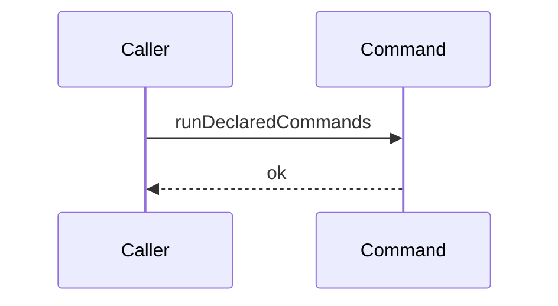

# Story 2 — No declared command runs

Epic: `.agents/plan/epics/051.2-the-command-gate.md`
Depends on: nothing of this epic — **it is first in dispatch order**, because it creates the module
every later story edits and it appends this epic to `authoredEpics`, which must precede the epic's
first scenario file. It needs EPIC 051.1 Story 1 (`01-the-five-git-primitives`) for the `checkout`
and `removeWorktree` signatures it declares against, EPIC 050.6, implemented, for
`DEFAULT_TIMEOUT_MS` on `src/services/process/index.ts`, and the re-authored EPIC 107 for the
`Verify` contract. Neither EPIC 050.6 nor EPIC 107 is authored into stories yet, so no story stem of
either resolves.
Kind: story-implement

Diagrams: run-commands-success-none

This story carries no `Seams:` line, because its diagram holds no step.

**The drawn set of this path is one diagram.** An empty declared list has one behaviour and no
branch.

## The ship path

### `run-commands-success-none`

Fixture: a declared list of length zero. The length of zero is the whole fixture: nothing else about
the input can change what this path does.



**A diagram with no step is the strongest statement the grammar has**, per
`.agents/plan/authoring.md`: the recorder's token list is empty, so any call the implementation makes
on an empty declared list fails the comparison by inequality. That is why this path is drawn rather
than described. `Git` and `Verify` are recorded dependencies of the scenario — the diagram names no
participant for them because no arrow reaches one, and a participant nothing addresses would read as
a call the recorder never saw.

**This diagram is what makes the empty list a different path and not a shorter one.** `worker.md`
section 2 states that an empty `commands` list asserts nothing. A unit that checked the pinned commit
out and then ran nothing would satisfy every assertion of Story 1
(`01-one-declared-command-runs`), and this diagram is the only artefact that refuses it. Story 1's
loop lands on top of the contract it sets.

Add `test/sequence/scenarios/run-commands-success-none.ts`.

## Change

### 1 — the module and its contract

**Create `src/commands/checkpoint/run-declared-commands.ts`** (greenfield).
`src/commands/checkpoint/` does not exist; create the directory.

```ts
import type { Verify } from "../../services/verify/index.ts";

type CheckoutGit = Readonly<{
  checkout(input: Readonly<{ gitDir: string; oid: string }>): Promise<string>;
  removeWorktree(
    input: Readonly<{ gitDir: string; targetDir: string }>,
  ): Promise<void>;
}>;

export type RunDeclaredCommandsDependencies = Readonly<{
  git: CheckoutGit;
  verify: Verify;
}>;

export type RunDeclaredCommandsInput = Readonly<{
  gitDir: string;
  oid: string;
  commands: readonly string[];
}>;

export async function runDeclaredCommands(
  dependencies: RunDeclaredCommandsDependencies,
  input: RunDeclaredCommandsInput,
): Promise<void> {
  void dependencies;
  void input;
}
```

**The body does nothing, and it is the whole of this story's production change.** Story 1
(`01-one-declared-command-runs`) replaces it with the loop and removes the two `void` statements.
`void` on an otherwise unused parameter is the shipped pattern at
`src/services/verify/not-implemented.ts:10` — `request`.

**The unit names no path and holds no home root.** `git.checkout` allocates its own directory and
returns it, per EPIC 051.1 Story 1 (`01-the-five-git-primitives`), so the input carries no `runId`,
no `attemptNo` and no naming rule, and the dependency object carries no `homeRoot`. That is what lets
this file import no `node:fs` and no `node:path`: `eslint.config.js:342` — `node:fs` restricts
`src/commands/**` and `src/queries/**`, and a command that had to mint or delete a directory could
not be written at all.

`CheckoutGit` is **not** exported, matching `src/commands/run/expire-runs.ts:12` —
`ExecutionExpiry`: a nested unit narrows the service interface it needs to the methods it calls, and
the real `Git` is structurally assignable to it. `Verify` is imported whole, because the unit calls
its one method.

**Import nothing from another module under `src/commands/`.**
`src/domain/layout.test.ts:185` — `commandsDir` asserts it.

### 2 — the sequence range names this epic as authored

**`scripts/epic-sequence-range.ts` — append `"051.2"` to `authoredEpics`.** The list is at
`scripts/epic-sequence-range.ts:1` — `authoredEpics`. Append the one element after the last one
present and change no existing element.
`scripts/epic-sequence-range.ts:9` — `shippedEpics` is **not** touched here; Story 3
(`03-a-declared-command-fails`) appends to it once both scenarios exist.

**This edit precedes the epic's first scenario file and cannot follow it.**
`test/sequence/conformance.test.ts:118` — `liveIds` refuses a scenario file whose id names no live
diagram of an epic in `authoredEpics`, so adding
`test/sequence/scenarios/run-commands-success-none.ts` before the range names this epic makes
`pnpm test` red. EPIC 050.1 Story 7 (`07-the-conformance-runner`) states the division:
`authoredEpics` names every epic whose stories exist, `shippedEpics` names every epic whose code
exists.

**`"051.2"` goes last, and the list must stay in sequence order.** EPIC 051.1 Story 4
(`04-the-candidate-ref-is-deleted`) appends `"051.1"` after `"051"`, and this epic follows EPIC 051.1
by sequence order, so appending at the end is in order. **Report a list whose last element sorts
after `051.2` as a defect of the epic that inserted it**, and do not reorder existing elements from
here: `test/sequence/conformance.test.ts:264` — `slice` requires `shippedEpics` to stay a prefix, so
an out-of-order element makes Story 3's append illegal.

**`test/sequence/conformance.test.ts` — extend the authored half of the range assertion.** The array
literal at `test/sequence/conformance.test.ts:255` — `authoredEpics` gains `"051.2"` as its last
element, leaving every existing element unchanged. Leave
`test/sequence/conformance.test.ts:263` — `shippedEpics` alone.

**Do not write the loop, the checkout, the check call, the removal, the predicate or the error
class.** Story 1 (`01-one-declared-command-runs`) owns the first four and Story 3
(`03-a-declared-command-fails`) owns the last two.

**Do not touch `src/main.ts`.** No route reaches this unit, so the composition root binds nothing.
EPIC 051.4 owns the binding.

## Constraints

- The body reaches no seam for **any** input, not only for an empty list. Story 1 is what makes a non-empty list do work, and this story must not anticipate it.
- Add no early-return guard on `commands.length`. Story 1's `for` loop over `entries()` yields nothing for an empty array, so a guard would be a line that traces to no requirement and that Story 1 would have to delete.
- Declare the full signature. A signature that grew story by story would make Story 1 a contract change rather than a body change, and `RunDeclaredCommandsInput` is what the scenario of this story builds.
- Import no `node:fs` and no `node:path`. The unit names no path.
- Append to `authoredEpics` only. `shippedEpics` is Story 3's.
- Carry a control for every absence. Cases 2 and 3 prove nothing on their own.

## Verify

```
node --test src/commands/checkpoint/run-declared-commands.test.ts test/sequence/conformance.test.ts
```

Create `src/commands/checkpoint/run-declared-commands.test.ts`. Suite name
`"src/commands/checkpoint/run-declared-commands.test"`. Declare in this file the two doubles every
later story of the epic reuses: a hand-written `CheckoutGit` whose `checkout` records
`{ gitDir, oid }`, returns a path it minted itself with `mkdtempSync`, and whose `removeWorktree`
records `{ gitDir, targetDir }`, both into one ordered array shared with the `Verify` double; and a
hand-written `Verify` whose `run` records each `CheckRequest` into that same array and returns the
`CheckOutput` the case names. Case 3 uses the real `createBinaryGit` over
`createGitRunner(paths, createSupervisedRunner())` and a real `GitPaths` from `buildGitPaths` on a
fresh `mkdtemp` home, with `seedRepositories(tools)` for the bare repository, mirroring
`src/services/git/ref-update.test.ts:41` — `seedRepositories`.

Add, each as a separate `it`:

1. `"runDeclaredCommands resolves and returns undefined"` — call it with `commands: []` and assert the resolved value is `undefined`. This is the case that opens RED: the module does not exist yet.

2. `"an empty command list makes no checkout call, no verify call and no removal call"` — call `runDeclaredCommands` with `commands: []`. Assert the `CheckoutGit` double's `checkout` call count is `0`, its `removeWorktree` call count is `0`, and the `Verify` double's `run` call count is `0`. Three counts, all by value. **The control is on the instrument, in this same case**: before the call, invoke `double.checkout({ gitDir, oid: OID })` and `double.removeWorktree({ gitDir, targetDir })` directly and assert the recorded counts are `1` and `1`, then reset the recorder. Without it, case 2 passes for a double that counts nothing. **The behavioural control is Story 1 case 2 (`01-one-declared-command-runs`)**, which asserts that a non-empty list does reach all three seams; it cannot live here, because this story's body reaches nothing for any input. Story 1's `node --test` list re-runs this file, so a loop that reached a seam on an empty list fails there.

3. `"an empty command list creates no worktree"` — with the real `Git`, assert `readdirSync(paths.worktreeDirectory)` deep-equals `[]` before the call and `[]` after it, and assert `readdirSync(join(gitDir, "worktrees"))` deep-equals `[]` or that the directory is absent. **The control is in the same case**: call `git.checkout({ gitDir, oid: OID })` directly, assert the worktree root now holds exactly one entry, then call `git.removeWorktree` on the returned path and assert the root is empty again. Without the control the absence assertions pass against a mistyped path, and with it the real allocation is proven observable at exactly the place this story asserts nothing appears.

4. `"the sequence range names EPIC 051.2 as authored and not as shipped"` — assert `authoredEpics.at(-1)` equals `"051.2"`, assert `shippedEpics.includes("051.2") === false`, and assert `authoredEpics.slice(0, shippedEpics.length)` deep-equals `shippedEpics`. Three assertions, so this story cannot append to the wrong list and cannot break the prefix.

Add `test/sequence/scenarios/run-commands-success-none.ts`, building the fixture the diagram names —
a declared list of length zero — running the real `runDeclaredCommands` behind `recordSeams` over the
two doubles, and returning the recorder and the result. The recorder's token list is empty, and the
result is `undefined`, which `test/helpers/sequence-conformance.ts:303` — `resultTerminal` reports as
the terminal `ok`. The scenario is asynchronous; it becomes due when Story 3
(`03-a-declared-command-fails`) appends `"051.2"` to `shippedEpics`.

`pnpm run verify` exits 0.

Proof: PASS line delivered — `src/commands/checkpoint/run-declared-commands.test.ts` in
`PASS EPIC-051.2`.
