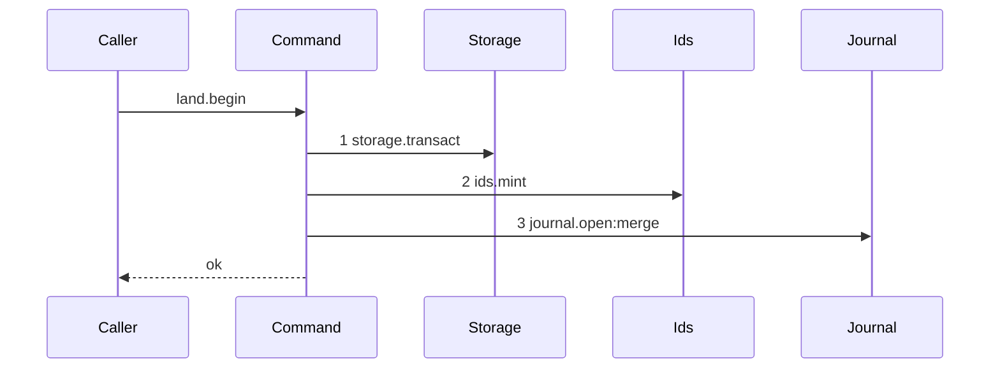

# Story 3 — The land opens its journal row

Epic: `.agents/plan/epics/051.3-the-checkpoint-and-the-land.md`
Depends on: EPIC 051 Story 1 (`01-migration-13`), which widens the `git_operation.intent` CHECK with `cut` and leaves `merge` in place; EPIC 050.1 Story 6 (`06-the-conformance-harness`), which is the harness this scenario runs on.
Kind: story-implement

Diagrams: land-begin

Seams: land-begin: +storage.transact, +ids.mint, +journal.open:merge

This story leaves both settles to Story 4 (`04-the-accepted-settle`) and Story 5 (`05-the-contended-settle`), and the compare and swap to EPIC 051.4, whose `acceptExecution` injects this unit and orders it.

**The drawn set is every branch of `land.begin`.** The unit takes no decision: it mints one id and
inserts one row, and every value it writes arrives on its input. It has no refusal, so no second
diagram exists.

## The ship path

### `land-begin`

Fixture: the loopback bare repository of `test/helpers/remote/seed.ts:124` — `seedRepositories`,
registered as `repo_a`; the graph of `test/helpers/rows.ts:21` — `seedRegistry` and
`test/helpers/rows.ts:102` — `seedGraph`, giving initiative `I`, objective `O` (`objective_a`) and
task `T` (`task_a`); an active `execution` run `R` (`run_b`) over `T` at fence `1` with one
`run_base` row naming `repo_a` at the fixture's `commit1`; one open attempt `A` (`attempt_a`); a
`workspace_branch` row on `O` with `origin_oid` and `head_oid` both at `commit1`. The input names
`nextOid` as the fixture's `commit2`.



The shape asserts three things. The unit opens exactly one transaction, and it is step 1, so no read
precedes it. The id is minted **inside** that transaction, immediately before the insert, so a
crash between the mint and the insert leaves no orphan id and no row. And nothing else is reached:
no `Git` participant appears, because the compare and swap sits outside every transaction and belongs
to the composing story.

Add `test/sequence/scenarios/land-begin.ts`.

## Change

**`src/commands/checkpoint/land-execution.ts` — add the file and the `landBegin` unit.**
`src/commands/checkpoint/` does not exist today; the directories under `src/commands/` are `actor`,
`node`, `outcome`, `plan`, `project`, `provider`, `repository`, `run` and `startup`.
`eslint.config.js` classifies the layer by the glob `src/commands/**`, so a new subdirectory needs no
configuration edit.

### 1 — the dependency object and the input

```ts
export type LandBeginDependencies = Readonly<{
  storage: Storage;
  journal: GitJournal;
  ids: IdGenerator;
  runDirectory: string;
}>;

export type LandBeginInput = Readonly<{
  nodeId: string;
  objectiveId: string;
  runId: string;
  repositoryId: string;
  ref: string;
  baseOid: string;
  nextOid: string;
}>;

export type LandBeginResult = Readonly<{
  journalRowId: string;
  pidFile: string;
}>;

export function landBegin(
  dependencies: LandBeginDependencies,
  input: LandBeginInput,
): LandBeginResult;
```

`runDirectory` is a bound value and not a seam: `src/main.ts:232` — `runDirectory` already builds
`join(settings.home, "git", "run")` for the git service, and the same value is bound here.

### 2 — the body

Inside one `dependencies.storage.transact` callback, and nothing outside it:

1. `const journalRowId = dependencies.ids.mint("gitOperation");` — the identity kind the shipped
   `git_operation` rows already use.
2. `const pidFile = join(dependencies.runDirectory, \`land-${journalRowId}.pid\`);`— a pure path
join, invisible at the seam.`src/services/git/authenticated.test.ts:359`—`pidFile` is the
   shipped naming convention for a land pid file.
3. `dependencies.journal.open(transaction, { ... })` with
   `src/services/git/index.ts:199` — `OpenJournalRowInput` filled as:

   | field               | value                |
   | ------------------- | -------------------- |
   | `id`                | `journalRowId`       |
   | `repositoryId`      | `input.repositoryId` |
   | `intent`            | `"merge"`            |
   | `nodeId`            | `input.nodeId`       |
   | `runId`             | `input.runId`        |
   | `candidateId`       | `null`               |
   | `leaseFence`        | `0`                  |
   | `ref`               | `input.ref`          |
   | `baseOid`           | `input.baseOid`      |
   | `proposedHeadOid`   | `input.nextOid`      |
   | `expectedRemoteOid` | `null`               |
   | `childToken`        | `pidFile`            |

   `leaseFence` is `0`, not the run fence. The column is the external-drive precondition mode, and
   `src/commands/startup/reconcile-journal.test.ts:110` — `openRow` already seeds `lease_fence: 0`
   for a `merge` row. The run fence of a land is derived at reconcile time from `run.fence`, which
   this epic's Decisions state and Story 6 (`06-startup-reconciles-an-open-merge-row`) implements.

4. Return `{ journalRowId, pidFile }`. The transaction commits when the callback returns, and control
   reaches the caller with the row committed as `open`.

### 3 — the projection

`test/helpers/sequence-conformance.ts:50` — `projections` gains one entry:

```ts
  "journal.open": (input, context) => [field(input, "intent", context)],
```

`intent` is a value the call actually receives, so the projection satisfies the rule that a
projection never names a call site. `journal.listOpen` gains none: its last argument is the
transaction, and a projection would throw on it.

## Constraints

- One transaction, opened as the first seam call, and committed before `landBegin` returns. No git
  call and no second transaction.
- `intent` is `"merge"`. Do not introduce a new intent value; `git_operation.intent` at
  `src/services/storage/migration-0003-execution-and-journal.ts:130` — `intent` admits `merge`
  already, and widening it needs a rebuild.
- `leaseFence` is `0` and is not the run fence.
- Mint the id inside the transaction, immediately before the insert. The diagram pins that order.
- `landBegin` takes no `Git` and no `Clock`. `git_operation` carries no created timestamp.

## Verify

```
node --test src/commands/checkpoint/land-execution.test.ts test/sequence/conformance.test.ts
```

Add `src/commands/checkpoint/land-execution.test.ts`. Build storage with
`test/helpers/database.ts:32` — `createMigratedStorage`, a real
`src/services/git/journal.ts:10` — `createGitJournal`, and a mock id generator returning a pinned
ULID. Read rows back with `test/helpers/database.ts:87` — `tableRows` and snapshot with
`test/helpers/database.ts:117` — `databaseBytes`.

Add, each as a separate `it`:

1. `"land.begin writes one open merge journal row naming the run, the node and the ref"` — call
   `landBegin` over the fixture and `deepEqual` the stored `git_operation` row against the full
   expected object: `intent: "merge"`, `state: "open"`, `node_id: "task_a"`, `run_id: "run_b"`,
   `repository_id: "repo_a"`, `ref: "refs/heads/objective_a"`, `base_oid: commit1`,
   `proposed_head_oid: commit2`, `lease_fence: 0`, `candidate_id: null`,
   `expected_remote_oid: null`, `result_head_oid: null`, `outcome: null`, `completed_at: null`, and
   `child_token` equal to the returned `pidFile`.

2. `"the merge journal row is open before any ref move"` — assert `state === "open"` by reading the
   row after `landBegin` returns and before any `git` call is made, and assert the returned
   `journalRowId` equals the stored `id`.

3. `"land.begin opens exactly one transaction and it commits before control returns"` — wrap the
   storage in a double that records `transact` entry and exit. Assert the recorded span list has
   length `1` and that its exit precedes the assertion, then assert the row is readable from a
   **new** transaction opened after `landBegin` returned, which is what proves the commit.

4. `"land.begin takes no Git and is synchronous"` — assert
   `Object.keys(dependencies)` of a constructed `LandBeginDependencies` deep-equals
   `["storage", "journal", "ids", "runDirectory"]`, and that the value `landBegin` returns is not a
   thenable. `LandBeginDependencies` declares no `git` key, so the absence is a type fact and a
   `Git` double could not be passed at all; this case asserts the shape a reader would otherwise
   have to infer.

5. `"the child token is the pid file the caller passes to refUpdate"` — assert the stored
   `child_token` equals the returned `pidFile`, and that the path is
   `join(runDirectory, \`land-${journalRowId}.pid\`)`by value. Story 5
EPIC 051.4's`acceptExecution`passes exactly that value to`git.refUpdate` and removes the file
after the settle, and Story 6 (`06-startup-reconciles-an-open-merge-row`) removes it after a
   crash.

6. `"land.begin mints the journal id inside the transaction"` — an id generator whose `mint` throws
   leaves no `git_operation` row, asserted by count `0`, and `databaseBytes` is deep-equal to the
   snapshot taken before the call.

Add `test/sequence/scenarios/land-begin.ts`, building the fixture above, running the real `landBegin`
over real SQLite behind `test/helpers/sequence-conformance.ts:99` — `recordSeams`, and returning the
recorder and the result.

`pnpm run verify` exits 0.

Proof: PASS line delivered — `src/commands/checkpoint/land-execution.test.ts` and
`test/sequence/conformance.test.ts` in `PASS EPIC-051.3`.
