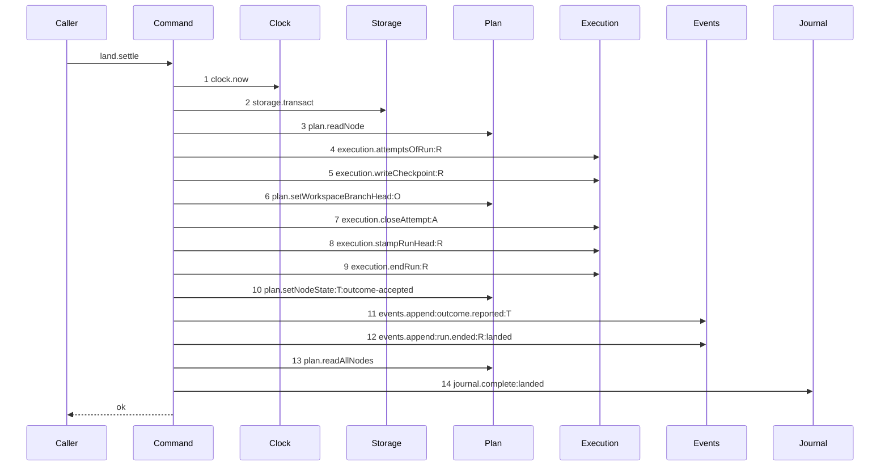

# Story 4 — The accepted settle

Epic: `.agents/plan/epics/051.3-the-checkpoint-and-the-land.md`
Depends on: Story 1 (`01-migration-14`), Story 2 (`02-the-checkpoint-row`) for `execution.writeCheckpoint`, Story 3 (`03-the-land-opens-its-journal-row`) for the file and the journal row it completes; EPIC 051 Story 2 (`02-the-workspace-branch-record`) for `plan.setWorkspaceBranchHead`; EPIC 050.2 Story 2 (`02-the-authority-seams`) for the `execution.endRun` fence raise and the primitive projection; EPIC 050.2 Story 5 (`05-the-release`) for the `run.ended` event type; EPIC 050.1 Story 6 (`06-the-conformance-harness`).
Kind: story-implement

Diagrams: land-settle-accepted

Seams: land-settle-accepted: +clock.now, +storage.transact, +plan.readNode, +execution.attemptsOfRun:R, +execution.writeCheckpoint:R, +plan.setWorkspaceBranchHead:O, +execution.closeAttempt:A, +execution.stampRunHead:R, +execution.endRun:R, +plan.setNodeState:T:outcome-accepted, +events.append:outcome.reported:T, +events.append:run.ended:R:landed, +plan.readAllNodes, +journal.complete:landed

This story leaves the contended half to Story 5 (`05-the-contended-settle`) and the composition to
EPIC 051.4, whose `acceptExecution` injects this unit, orders it around the compare and swap and
removes the pid file it returns.

**The drawn set is every branch of the accepted settle whose seam set differs.** The settle of an
**atomic objective** takes the same thirteen steps in the same order, and differs only in the two
values the node transition carries — `to` is `awaiting_approval` where a task writes `done`, and the
trigger is `objective-land-accepted` where a task writes `outcome-accepted`. Both are labels of one
call, so the objective branch changes a value and not the call set; the fixture is a task, case 6 of
`## Verify` asserts the objective branch by value, and the epic's `## Stories` entry gives this story
one diagram. There is no refusal branch: a settle that reaches an invariant violation throws, and a
throw rolls the whole transaction back.

## The ship path

### `land-settle-accepted`

Fixture: the fixture of `land-begin` (Story 3), plus the `open` `merge` journal row that
`land.begin` wrote, plus the objective ref `refs/heads/objective_a` already moved to `commit2` in the
bare home. `T` is `running`, `R` is active at fence `1`, `A` is the one open attempt.



**Steps 7 to 12 are the shipped accepted report, moved here whole.**
`src/commands/outcome/report-outcome.ts:234` — `closeAttempt`, `:275` — `endRun`, `:258` —
`setNodeState` and `:296` — `append` sit in one transaction today, and the epic moves the node
transition into this settle. An event that describes a transition must sit in the transaction of that
transition, so `outcome.reported` moves with it, and the run end moves with it because
`AGENTS.md` gives a journaled write two transactions and never a third for its caller to end the run
in. EPIC 051.4 removes all six writes from `reportOutcome`'s own path when it wires the route.

**No new event type is registered.** `outcome.reported` is shipped and `run.ended` arrives with
EPIC 050.2 Story 5 (`05-the-release`). An event for the checkpoint itself would be a third event with
no requirement behind it; a consumer reads `outcome.reported.objectId` and joins the `checkpoint`
table.

**Step 1 is drawn, and it is outside the transaction.** `clock` is an injected capability, so the
recorder sees the call wherever it runs; a read placed before `storage.transact` is still a step, and
only its ordinal states that it is outside. Reading it once, first, is what makes every timestamp of
the transaction one value.

`plan.readNode` carries no label: `src/services/plan/index.ts:78` — `readNode` takes the node id as a
primitive last argument, and `test/helpers/sequence-conformance.ts:121` — `input` applies a
projection only when that argument is an object.

Step 2 is the one transaction, and every later step sits inside it: the checkpoint, the head, the
node transition, the event and the journal completion commit together or not at all. A separate
update of `workspace_branch.head_oid` would let the next claim take a stale base.

Step 3 is the only read, and it supplies four values the writes need:
`src/services/plan/index.ts:55` — `SetNodeStateInput` requires `from`, `to` and
`cause: { revision, importId }`; `node.kind` selects the terminal; and `node.parentId` is the
objective the branch record is keyed on.

Step 4 reads the attempt list once, before the first mutation, and the accounting is built from it
with the closed attempt substituted. EPIC 050.4 Story 6 (`06-the-report-drops-the-lease`) makes the
same one-read change to `reportOutcome`, which reads the list twice today.

**Step 5 is the first mutation, and the ordinal is load-bearing.** Case 3 of `## Verify` injects a
failure immediately after it and asserts the head, the node state and the event count are unchanged,
which is the assertion that the nine writes are one transaction.

**Step 13 builds the response, and it is here because this is the last transaction of the path.**
`src/commands/outcome/report-outcome.ts:310` — `readAllNodes` is the sibling scan that gives
`NodeReportResult` its `objectiveState` and `objectiveProjection`, and it must sit inside a
transaction. EPIC 051.4's `acceptExecution` opens none of its own — its gate row 9b asserts exactly
two spans, and both are this unit's and `land.begin`'s — and `reportOutcome`'s prelude transaction
closes before the git write. This unit already holds `plan: PlanStore`, so the read costs one seam
token and no new dependency. It runs **after** step 10, so the projection sees the transition this
settle just wrote.

Step 14 is last: the journal row records that the git write is settled, and settling it before the
database effects are written would make a crash between the two look reconciled. It returns the pid
file the land recorded, and the unit hands it back to its caller; removing that file is git I/O and
belongs outside every transaction, so it is EPIC 051.4's step and not one of these fourteen.

Add `test/sequence/scenarios/land-settle-accepted.ts`.

## Change

**`src/commands/checkpoint/land-execution.ts` — add the `landSettle` unit, in its accepted
disposition.** Story 5 (`05-the-contended-settle`) adds the contended disposition to the same
function; this story writes the `accepted` arm and the shared signature.

### 1 — the signature

```ts
export type LandSettleDependencies = Readonly<{
  storage: Storage;
  plan: PlanStore;
  execution: Execution;
  events: EventLog;
  journal: GitJournal;
  clock: Clock;
}>;

export type LandSettleInput = Readonly<{
  disposition: "accepted" | "contended";
  journalRowId: string;
  nodeId: string;
  runId: string;
  attemptId: string;
  fence: number;
  repositoryId: string;
  baseOid: string;
  acceptedOid: string;
  landedOid: string;
  actorKind: "human" | "harness" | "daemon";
  actorId: string;
}>;

export type LandSettleResult = Readonly<{
  clearedToken: string | null;
  result: NodeReportResult | null;
}>;

export function landSettle(
  dependencies: LandSettleDependencies,
  input: LandSettleInput,
): LandSettleResult;
```

**The actor is on the input, not hard-coded.** The normal path passes the reporting harness actor
that `reportOutcome` authenticated; the startup path of Story 6
(`06-startup-reconciles-an-open-merge-row`) passes `actorKind: "daemon"` and the startup actor id.
That is what keeps a recovered land distinguishable from a reported one in the event log, with no
extra field and no second event.

**The unit derives the objective from the node it reads**, and the input carries no `objectiveId`.
A task's objective is its `parentId` and an atomic objective is its own, so the one read of step 3
answers it. A caller obliged to supply the value would need a plan read of its own, and Story 6
(`06-startup-reconciles-an-open-merge-row`) has none.

**The unit returns the pid-file token.** `src/services/git/index.ts:262` — `complete` and
`src/services/git/index.ts:266` — `discard` each return the row's `child_token` before clearing it,
and `src/commands/startup/reconcile-journal.ts:233` — `removeClearedToken` is the shipped pattern:
the column is cleared inside the transaction and the file is removed outside it. Dropping the return
value clears the column and leaks the file.

`disposition` is a real input and not a notation device: it is the verdict of the compare and swap,
which only the caller observed, and the two arms write disjoint effects.

### 2 — the accepted body

`const now = dependencies.clock.now();` is read **before** the transaction, so the timestamp of every
write inside it is one value. It is step 1 of the diagram. Inside one
`dependencies.storage.transact` callback:

1. `const node = dependencies.plan.readNode(transaction, input.nodeId);` — throw when it is `null`.
   It supplies `node.kind`, `node.state`, `node.revision` and `node.parentId`.
   1b. `const attempts = dependencies.execution.attemptsOfRun(transaction, input.runId);` — one read,
   kept for the accounting of step 5.
2. `dependencies.execution.writeCheckpoint(transaction, { kind: "execution", nodeId: input.nodeId, runId: input.runId, attemptId: input.attemptId, fence: input.fence, createdAt: now, repositoryId: input.repositoryId, baseOid: input.baseOid, acceptedOid: input.acceptedOid, landedOid: input.landedOid })`.
   `caller` and `subject` are not passed and the store writes both `null`.
3. `dependencies.plan.setWorkspaceBranchHead(transaction, { nodeId: objectiveId, headOid: input.landedOid })`,
   where `objectiveId` is `node.kind === "objective" ? node.id : node.parentId`. The key is the
   **objective**, because `workspace_branch` is keyed on it, and the value is the oid the swap
   actually reached.
   3b. `const attempt = dependencies.execution.closeAttempt(transaction, { attemptId: input.attemptId, outcome: "accepted", at: now, headOid: input.acceptedOid });`
   3c. `dependencies.execution.stampRunHead(transaction, { runId: input.runId, headOid: input.acceptedOid });`
   — the shipped accepted-report write at
   `src/commands/outcome/report-outcome.ts:270` — `stampRunHead`. Dropping it would silently change
   what `run.head_oid` means on the accepted path.
   3d. `dependencies.execution.endRun(transaction, { runId: input.runId, outcome: "done", at: now });`
   The fence rises here, and the checkpoint of step 2 already carries `input.fence`, which is the
   pre-raise value. `.agents/plan/epics/050.5-the-lease-table-removal.md:115` records that the raise
   belongs to EPIC 050.2 Story 2 (`02-the-authority-seams`).
4. `dependencies.plan.setNodeState(transaction, { id: input.nodeId, from: "running", to, trigger, blockReason: null, at: now, cause: { revision: node.revision, importId: null } })`,
   with the pair chosen by `node.kind`:

   | `node.kind` | `to`                  | `trigger`                   |
   | ----------- | --------------------- | --------------------------- |
   | `task`      | `"done"`              | `"outcome-accepted"`        |
   | `objective` | `"awaiting_approval"` | `"objective-land-accepted"` |

   `src/domain/external-transition.ts:60` — `outcome-accepted` sits on a `level: "task"` row, so an
   objective cannot use it, and `src/domain/transition.ts:160` — `to` is the `running` to `done`
   legality row, which is `task: true` and `objective: false`.

   **`object-reported` is not reused, and `objectiveOutcome` is not called.**
   `src/domain/external-transition.ts:90` — `object-reported` carries
   `childAggregation: "every-task-terminal-one-done"`, and an atomic objective has no child, so the
   trigger would record an aggregation that never happened. `src/domain/outcome.ts:17` —
   `objectiveOutcome` takes a `TerminalState` projected from those same absent children. Section 3b
   below adds the trigger instead.

5. `dependencies.events.append(transaction, { subjectKind: "node", subjectId: input.nodeId, type: "outcome.reported", actorKind: input.actorKind, actorId: input.actorId, payload })`,
   with the shipped payload of `src/commands/outcome/report-outcome.ts:296` — `append`:
   `{ runId, attemptId: attempt.id, attemptNo: attempt.attemptNo, outcome: "accepted", reason: null, objectId: input.acceptedOid, attemptsRemaining, fromState: "running", toState: to }`.
   `attemptsRemaining` is `Math.max(0, run.attemptLimit - accounting.counter)` over the list of step
   1b with the closed attempt substituted, exactly as the shipped command computes it.
6. `dependencies.events.append(transaction, { subjectKind: "run", subjectId: input.runId, type: "run.ended", actorKind: input.actorKind, actorId: input.actorId, payload: { runId: input.runId, nodeId: input.nodeId, fence: ended.fence, outcome: "done", reason: "landed" } })`.
   `reason` is `"landed"` and not `null`: EPIC 050.2 Story 5 (`05-the-release`) states that every
   release path writes `null` and that the report path supplies a value. The recorder appends
   `String(payload.reason)` as a third label, so the value is part of the drawn token.
7. `const nodes = dependencies.plan.readAllNodes(transaction);` and build the `NodeReportResult` from
   it exactly as `src/commands/outcome/report-outcome.ts:310` — `readAllNodes` does today: filter the
   siblings of `node.parentId`, sort with `compareIds`, derive `objectiveState` and
   `objectiveProjection`, and take `attemptId`, `attemptNo` and `attemptsRemaining` from the values
   steps 1b and 4 already hold.
8. `const clearedToken = dependencies.journal.complete(transaction, { id: input.journalRowId, resultHeadOid: input.landedOid, outcome: "landed", completedAt: now });`
   Return `{ clearedToken, result }` from the callback and from the unit.

**The accepted arm returns the response because nothing else on the path can build it.**
`NodeReportResult` is `src/domain/outcome-report.ts:83` — `NodeReportResult`, the ten-field value
`node.report` answers with. EPIC 051.4 Story 8 (`08-the-report-route-enforces-the-gate`) removes the
accepted arm's `plan.readAllNodes` from `reportOutcome` along with its five writes, and it opens no
second transaction to replace it: a repeated `storage.transact` token is refused by the parser, and
`AGENTS.md` gives the journaled write two transactions and never a third. `result` is `null` on the
contended arm, which Story 5 (`05-the-contended-settle`) states.

**The settle ends the run and closes the attempt, and the epic's Decisions must be amended.** The
epic states that `land-settle-accepted` never ends the run, and it gives one reason: Story 6
(`06-startup-reconciles-an-open-merge-row`) derives the checkpoint fence from `run.fence` at reconcile
time. That derivation is unaffected. It runs only when the settle did **not** run — that is the crash
it reconciles — so the run is still active and its fence is still the value `land.begin` saw. Leaving
the run active is not a free alternative either: `acceptExecution` writes git, so `AGENTS.md` gives it
two transactions and never a third, and no other command may open one after the land. A task would
otherwise reach `done` holding an active run and an open attempt.

### 3 — no event type is registered

`outcome.reported` is shipped at `src/domain/event-type.ts:19` — `outcome.reported`, and `run.ended`
arrives with EPIC 050.2 Story 5 (`05-the-release`). This story adds neither, so `eventTypes`,
`eventPayloads`, the payload fixture and the openapi component count are all unchanged.

`src/http/contract/event-payload.test.ts` asserts by literal string scan over `src/commands` and
`src/services` that every declared non-retired type has a producer. This story adds a **second**
producer of both types, which that scan admits.

### 3b — one new external trigger

`src/domain/external-transition.ts:4` — `externalTriggerIds` gains `"objective-land-accepted"`, and
`externalTransitions` gains its row:

```ts
{
  level: "objective",
  from: "running",
  to: "awaiting_approval",
  trigger: "objective-land-accepted",
  precondition: {
    runDriver: "external",
    activeRun: true,
    leaseFence: "valid",
    actorKind: "harness",
    attemptLimit: "under",
    reportedObjectId: "required",
    childAggregation: "not-applicable",
  },
},
```

`childAggregation` is `"not-applicable"`, which is the whole reason the trigger exists: an atomic
objective aggregates nothing. `src/domain/transition.ts:152` — `to` already makes objective `running`
to `awaiting_approval` legal, so the legality table does not change.

`src/domain/node-trigger.ts:135` — `triggerTransition` resolves a trigger to the **first** row that
names it, so one trigger id carries one level. That is why the objective needs its own id rather than
a second row under `outcome-accepted`.

Three shipped counts move by one, and Story 5 (`05-the-contended-settle`) moves them by two more:
`src/domain/external-transition.test.ts:181` — `externalTriggerIds`, `:201` —
`externalTransitions` and `:520` — `keys`.

### 4 — the trigger consumers

`src/domain/external-transition.ts:215` — `externalTriggerConsumer` maps `"outcome-accepted"` to
`["src/commands/outcome/report-outcome.ts"]`. Append `"src/commands/checkpoint/land-execution.ts"`,
and add a key for `"objective-land-accepted"` naming that file alone. The shipped case
`"every consumer file holds its own trigger id as a literal"` reads each named file and requires the
literal, which the table of step 2.4 writes.

`"object-reported"` is **not** touched, so `src/domain/external-transition.test.ts:545` —
`deepEqual` keeps its pinned value.

### 5 — the projections

`test/helpers/sequence-conformance.ts:50` — `projections` gains three entries:

```ts
  "execution.writeCheckpoint": (input, context) => [field(input, "runId", context)],
  "plan.setWorkspaceBranchHead": (input, context) => [field(input, "nodeId", context)],
  "journal.complete": (input, context) => [field(input, "outcome", context)],
  "execution.stampRunHead": (input, context) => [field(input, "runId", context)],
```

`execution.stampRunHead` has no entry today, so the recorder emits it bare — which is why EPIC 050.4
Story 6 (`06-the-report-drops-the-lease`) draws `execution.stampRunHead:R` that the harness cannot
produce. Adding the entry fixes that diagram as well as this one.

`plan.readNode` gains none. Its last argument is the node id as a primitive, so
`test/helpers/sequence-conformance.ts:121` — `input` records a bare token whatever the table holds.

`journal.complete` projects `outcome` and not `intent`, because
`src/services/git/index.ts:214` — `CompleteJournalRowInput` carries no `intent`, and adding one to a
production interface so a diagram can separate two calls is forbidden. No shipped or authored diagram
holds a `journal.complete` token, so no existing diagram changes.

## Constraints

- One transaction. The checkpoint, the head advance, the node transition, the event and the journal
  completion are inside it, and the clock read is outside it. Both are drawn steps.
- Return the token `journal.complete` gives back. Do not remove the pid file here: the unit runs
  inside a transaction and the removal is git I/O.
- The objective is derived from the node read, never taken from the input.
- `execution.writeCheckpoint` is the first mutation. Do not move a write in front of it.
- `plan.setWorkspaceBranchHead` takes the **objective** id and the **landed** oid. Passing the node
  id would write no row, and passing the accepted oid would record a head the ref does not hold.
- The attempt closes as `"accepted"` with `headOid` set, the run ends with outcome `"done"`, and the
  fence rises exactly once through `execution.endRun`. Do not write `fence` directly.
- The checkpoint carries `input.fence`, the pre-raise value. Do not read the fence back after the
  run ends.
- Do not write `caller` or `subject`.
- The node transition uses the trigger `"outcome-accepted"`. Do not invent a trigger id;
  `src/domain/external-transition.ts:4` — `externalTriggerIds` is closed and adding a member changes
  a shipped domain contract this epic does not own.

## Verify

```
node --test src/commands/checkpoint/land-execution.test.ts src/domain/event-type.test.ts src/domain/external-transition.test.ts src/http/contract/event-payload.test.ts src/http/contract/openapi.test.ts test/sequence/conformance.test.ts
```

Extend `src/commands/checkpoint/land-execution.test.ts` from Story 3, which already builds real
SQLite through `test/helpers/database.ts:32` — `createMigratedStorage`, the real journal and a mock
id generator. Add a real `SqliteExecution`, a real `SqlitePlanStore`, a real `SqliteEventLog` and
`test/helpers/clock.ts:5` — `createMockClock` at `NOW = 1700000000000`.

Add, each as a separate `it`:

1. `"an accepted settle writes the checkpoint with the five binding facts"` — `deepEqual` the stored
   `checkpoint` row against the full expected object: `kind: "execution"`, `node_id: "task_a"`,
   `run_id: "run_b"`, `attempt_id: "attempt_a"`, `fence: 1`, `caller: null`, `subject: null`,
   `created_at: NOW`, `repository_id: "repo_a"`, `base_oid: commit1`, `accepted_oid: commit2`,
   `landed_oid: commit2`, `graph_revision: null`, `patch_blob: null`.

2. `"an accepted settle advances workspace_branch.head_oid to the landed oid"` — assert
   `head_oid === commit2` and `origin_oid === commit1` by value, so the immutable column is proven
   untouched in the same case.

3. `"a failure after writeCheckpoint leaves the head, the node state and the event count unchanged"`
   — inject a `plan` double whose `setWorkspaceBranchHead` throws. Assert the call throws, then
   assert `workspace_branch.head_oid === commit1`, `node.state === "running"`, the `event` row count
   equals the count taken before the call, the `checkpoint` row count is `0`, and `databaseBytes` is
   deep-equal to the pre-call snapshot. One case, five assertions: the transaction property is what
   they jointly prove.

4. `"for an internal run the branch head equals the oid the objective ref names"` — read
   `refs/heads/objective_a` from the loopback bare home with `SeedRoot.git` and assert it equals the
   stored `head_oid`. SQLite cannot constrain this across tables, so this assertion is the whole
   enforcement.

5. `"the merge journal row is complete after the accepted settle"` — assert `state === "complete"`,
   `outcome === "landed"`, `result_head_oid === commit2`, `completed_at === NOW` and
   `child_token === null`.

6. `"an accepted settle on an atomic objective writes awaiting_approval under objective-land-accepted"`
   — the fixture with the objective as the run node and no task child. Assert
   `node.state === "awaiting_approval"`, that the recorded transition names the trigger
   `objective-land-accepted`, that the checkpoint's `node_id` is the objective, and that
   `workspace_branch.head_oid` of that same objective moved. This is the branch the diagram does not
   draw.

6b. `"objective-land-accepted carries no child aggregation"` — assert its precondition's
`childAggregation` is `"not-applicable"`, and assert `object-reported` still carries
`"every-task-terminal-one-done"`. The control proves the new trigger is not a copy that widened
the old one.

7. `"the accepted settle appends outcome.reported and run.ended with their declared payloads"` —
   `deepEqual` both appended payloads against the pinned objects and assert
   `eventPayloads["outcome.reported"].parse` and `eventPayloads["run.ended"].parse` do not throw.
   Assert `attemptsRemaining` by value against a seeded `attempt_limit`.

8. `"the accepted settle registers no event type"` — assert `eventTypes` is unchanged in length and
   content against a pinned copy, and that `retiredEventTypes` is empty. Without it, an
   implementation is free to invent a checkpoint event this story rejected.

9. `"outcome-accepted and objective-land-accepted both name the land command"` — assert
   `externalTriggerConsumer["outcome-accepted"]` deep-equals
   `["src/commands/outcome/report-outcome.ts", "src/commands/checkpoint/land-execution.ts"]`, and
   that `externalTriggerConsumer["objective-land-accepted"]` deep-equals
   `["src/commands/checkpoint/land-execution.ts"]`.

10. `"the accepted settle ends the run, closes the attempt and raises the fence by one"` — seed
    `fence: 1`. Assert `run.state === "ended"` with `outcome === "done"`, `run.fence === 2`,
    `run.head_oid === commit2`, `attempt.outcome === "accepted"` and
    `attempt.head_oid === commit2`. Assert in the same case that the stored checkpoint's `fence` is
    `1`, the pre-raise value, so the ordering of steps 2 and 9 is observable.

11. `"the accepted settle returns the pid-file token and clears the column"` — assert the returned
    `clearedToken` equals the `child_token` the fixture's journal row held, and that the stored
    column is `null` afterwards. Without this case the file leaks and only the column is proven.

12. `"object-reported names the land command as a consumer"` — assert
    `externalTriggerConsumer["object-reported"]` deep-equals
    `["src/commands/outcome/report-objective.ts", "src/commands/checkpoint/land-execution.ts"]`,
    beside case 9's assertion for `outcome-accepted`.

13. `"an accepted settle returns the node report result the route answers with"` — assert the returned
    `result` deep-equals the full ten-field `NodeReportResult` by value, with `objectiveProjection`
    computed over a fixture holding one terminal sibling and one non-terminal, and assert the read
    happens **after** the transition by asserting `state` is `done` and not `running`. The control is
    Story 5 (`05-the-contended-settle`) case 4, where `result` is `null`.

Add `test/sequence/scenarios/land-settle-accepted.ts`, building the fixture the diagram names,
running the real `landSettle` over real SQLite behind the recorder, and returning the recorder and
the result.

`pnpm run verify` exits 0.

Proof: PASS line delivered — `src/commands/checkpoint/land-execution.test.ts` and
`test/sequence/conformance.test.ts` in `PASS EPIC-051.3`.
