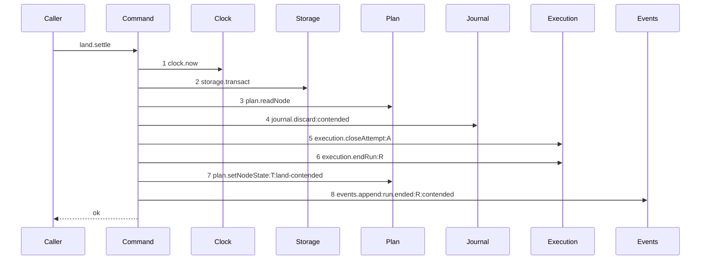

# Story 5 — The contended settle

Epic: `.agents/plan/epics/051.3-the-checkpoint-and-the-land.md`
Depends on: Story 3 (`03-the-land-opens-its-journal-row`) and Story 4 (`04-the-accepted-settle`), which add the file and the shared `landSettle` signature; EPIC 050.2 Story 2 (`02-the-authority-seams`), where `execution.endRun` gains the fence raise; EPIC 050.2 Story 7 (`07-the-worker-contract`), which registers `run.ended`; EPIC 050.1 Story 6 (`06-the-conformance-harness`).
Kind: story-implement

Diagrams: land-settle-contended

Seams: land-settle-contended: +clock.now, +storage.transact, +plan.readNode, +journal.discard:contended, +execution.closeAttempt:A, +execution.endRun:R, +plan.setNodeState:T:land-contended, +events.append:run.ended:R:contended

This story leaves the composition and the outer refusal to EPIC 051.4, whose
`report-refusal-contended` carries the `contended` terminal.

**The drawn set is every branch of the contended settle.** The settle is unconditional: the caller
has already observed the lost swap, so the unit takes no decision and has no refusal.

**An atomic objective can reach a contention, and this story gives it a legal transition.**
`src/domain/transition.ts:136` — `to` makes `running` to `ready` legal for a task and illegal for an
objective today, and no other row returns an objective from `running` to a claimable state. An atomic
objective that lands accepted can equally lose its swap, so leaving it stranded in `running` would
contradict this epic's own Goal — a failed swap "returns the node to `ready`" — and
`.agents/plan/authoring.md` requires a change to carry the repairs it forces. Section 3b below sets
the objective column of that legality row and adds the objective trigger. The objective branch takes
the same eight steps with one label changed, so it is a value and not a call set, and case 8 asserts
it.

## The ship path

### `land-settle-contended`

Fixture: the fixture of `land-settle-accepted` (Story 4), with one change — the objective ref
`refs/heads/objective_a` stands at a third oid the fixture creates, so the swap from `commit1`
lost and the ref was never moved.



Step 1 is the clock read of Story 4, outside the transaction and still a recorded call. Step 3
carries no label, for the reason Story 4 gives: `plan.readNode` takes the node id as a primitive.

**Step 8 carries three labels, and the third is the payload reason.**
`test/helpers/sequence-conformance.ts:72` — `events.append` appends `String(payload.reason)` whenever
the payload holds the key, and `run.ended` declares `reason: z.string().nullable()` per EPIC 050.2
Story 5 (`05-the-release`). This story writes `reason: "contended"`, which is the value that story
says the report path supplies.

**No `execution.writeCheckpoint` and no `plan.setWorkspaceBranchHead` appear, and that absence is the
assertion.** A lost swap wrote nothing to the ref, so there is no accepted commit to record and no
head to advance.

Step 4 **discards** where the accepted settle completes: the git write did not happen, so the row
records an operation that was abandoned, not one that finished. Steps 5 to 7 are the shipped shape of
ending a run — `src/commands/node/release-node.ts:166` — `closeAttempt` orders the attempt close,
the run end and the state write the same way, and EPIC 050.2 Story 5 (`05-the-release`) draws it.
Step 8 projects the run id, because `run.ended` is a run event, and it is appended **after**
`execution.endRun`, so its `fence` payload field is the raised fence and not the pre-end one.

The settle returns `ok`. A settle that refused would leave the outer with no way to distinguish a
failed settle from a lost swap, and the contended outcome is expressed in the terminal of
EPIC 051.4's `report-refusal-contended`.

Add `test/sequence/scenarios/land-settle-contended.ts`.

## Change

**`src/commands/checkpoint/land-execution.ts` — add the `contended` arm of `landSettle`.** The
signature, the dependency object and the pre-transaction `clock.now` read are Story 4's and do not
change. `input.landedOid` is unread on this arm; `input.acceptedOid` is what the attempt records.

Inside the one `dependencies.storage.transact` callback:

1. `const node = dependencies.plan.readNode(transaction, input.nodeId);` — throw when it is `null`.
   It supplies `node.revision` for the transition cause and `node.kind` for the invariant check
   above.
2. `const clearedToken = dependencies.journal.discard(transaction, { id: input.journalRowId, outcome: "contended", completedAt: now });`
   Return `{ clearedToken }` from the callback and from the unit, exactly as the accepted arm does.
   The caller removes the file.
3. `dependencies.execution.closeAttempt(transaction, { attemptId: input.attemptId, outcome: "cancelled", at: now })`.
   `cancelled` is a member of the shipped `attempt.outcome` CHECK at
   `src/services/storage/migration-0007-external-execution.ts:44` — `outcome`, and
   `worker.md` section 9 classes a contended land as `infrastructure`, which consumes no attempt.
   `headOid` is not passed, so `src/services/execution/sqlite.ts:287` — `closeAttempt` takes its
   no-head branch and the attempt records no head for work that never landed.
4. `dependencies.execution.endRun(transaction, { runId: input.runId, outcome: "cancelled", at: now })`.
   The fence rises here. `.agents/plan/epics/050.5-the-lease-table-removal.md:115` records that the
   raise belongs to EPIC 050.2 Story 2 (`02-the-authority-seams`); this story consumes it and does
   not write it.
5. `dependencies.plan.setNodeState(transaction, { id: input.nodeId, from: "running", to: "ready", trigger, blockReason: null, at: now, cause: { revision: node.revision, importId: null } })`,
   with the trigger chosen by `node.kind`: `"land-contended"` for a task and
   `"objective-land-contended"` for an objective. Both are added by section 3b.

   **`report-cancelled` is not reused.** `src/domain/external-transition.ts:180` —
   `report-cancelled` is `actorKind: "harness"` and describes a worker that reported a cancellation.
   A contention is a daemon verdict on a compare and swap the worker never saw, and
   `src/domain/outcome-report.ts:41` — `taskReportEffect` reaches that trigger only from a
   `cancelled` **report**. Recording a contention under it would make the audit log claim a report
   that never arrived.

6. `dependencies.events.append(transaction, { subjectKind: "run", subjectId: input.runId, type: "run.ended", actorKind: "daemon", actorId: input.actorId, payload: { runId: input.runId, nodeId: input.nodeId, fence: ended.fence, outcome: "cancelled", reason: "contended" } })`.
   The shape is the one EPIC 050.2 Story 5 (`05-the-release`) registers. `ended.fence` is the fence
   `execution.endRun` returned, so it is the raised value.

**No new event type is registered.** `run.ended` arrives with EPIC 050.2, and this story is a second
producer of it.

### 3b — two new external triggers, and one legality row

`src/domain/external-transition.ts:4` — `externalTriggerIds` gains `"land-contended"` and
`"objective-land-contended"`, and `externalTransitions` gains a row for each: `running` to `ready`,
`level: "task"` and `level: "objective"`, with
`runDriver: "external"`, `activeRun: true`, `leaseFence: "valid"`, `actorKind: "daemon"`,
`attemptLimit: "under"`, `reportedObjectId: "absent"` and
`childAggregation: "not-applicable"`.

`actorKind` is `"daemon"` because the daemon decides a contention, and
`src/domain/external-transition.ts:150` — `claim-expired` is the shipped precedent for a
daemon-decided external transition.

Two ids and not one: `src/domain/node-trigger.ts:135` — `triggerTransition` resolves a trigger to the
**first** row that names it, so one id carries one level.

`src/domain/transition.ts:136` — `to` is the `running` to `ready` legality row. Its `objective`
column becomes `true`. `transitions.length` stays `56`, and
`src/domain/transition.test.ts:61` — `transitions` therefore does not move. The widening is safe
because a write reaches the table only through a trigger, and no shipped trigger names an objective
`running` to `ready`.

`src/domain/external-transition.ts:215` — `externalTriggerConsumer` gains a key for each new id,
naming `"src/commands/checkpoint/land-execution.ts"` alone. `"report-cancelled"` is **not** touched.
The shipped case `"every consumer file holds its own trigger id as a literal"` reads the file and
requires both literals, which step 5 writes.

With Story 4's `objective-land-accepted`, three shipped counts move by three:
`src/domain/external-transition.test.ts:181` — `externalTriggerIds` and `:201` —
`externalTransitions` go from `10` to `13`, and `:520` — `keys` with them.

### The projection

`test/helpers/sequence-conformance.ts:50` — `projections` gains one entry:

```ts
  "journal.discard": (input, context) => [field(input, "outcome", context)],
```

It projects `outcome` for the reason Story 4 gives for `journal.complete`:
`src/services/git/index.ts:221` — `DiscardJournalRowInput` carries no `intent`.

`execution.closeAttempt` keeps its shipped projection of `attemptId` at
`test/helpers/sequence-conformance.ts:64` — `closeAttempt`. Widening it to carry the outcome would
change the token of every authored diagram that already draws
`execution.closeAttempt:A` — EPIC 050.2 Story 5 (`05-the-release`), EPIC 050.4 Stories 5 and 6, and
EPIC 050.5 Stories 1 and 2 — so the outcome is asserted by this story's tests instead.

## Constraints

- One transaction. All six writes are inside it.
- No `execution.writeCheckpoint` and no `plan.setWorkspaceBranchHead` on this arm.
- The journal row is **discarded**, never completed.
- The attempt outcome is `"cancelled"` and no `headOid` is passed. A contended land consumes no
  attempt.
- The fence rises exactly once, through `execution.endRun`. Do not write `fence` here.
- The settle returns its cleared token. Do not throw, and do not return a refusal — including on the
  objective branch, which now has a legal transition.
- `reason` is `"contended"` and it is part of the drawn token. Changing it changes the diagram.
- Do not delete the candidate ref. `candidate.discard` is called by EPIC 051.4's outer command.

## Verify

```
node --test src/commands/checkpoint/land-execution.test.ts src/domain/external-transition.test.ts test/sequence/conformance.test.ts
```

Extend `src/commands/checkpoint/land-execution.test.ts`.

Add, each as a separate `it`:

1. `"a contended settle leaves the accepted ref unchanged, consumes no attempt, ends the run and raises the fence by one"`
   — read `refs/heads/objective_a` from the loopback bare home before and after and assert it is
   unchanged; assert the count of attempts of `run_b` is `1` and equal to the count before; assert
   `run.state === "ended"` with `outcome === "cancelled"`; assert `run.fence === 2` against a seeded
   fence of `1`. All four in one case, so no one of them can be satisfied alone.

2. `"a contended settle discards the journal row rather than completing it"` — assert
   `state === "discarded"`, `outcome === "contended"`, `result_head_oid === null` and
   `child_token === null`.

3. `"a contended settle returns a task to ready under land-contended"` — assert
   `node.state === "ready"` and that the recorded transition names the trigger `land-contended`.

4. `"a contended settle writes no checkpoint and does not move the branch head"` — assert the
   `checkpoint` row count is `0` and `workspace_branch.head_oid === commit1`. The control is Story 4
   case 2, which asserts both move on the accepted path.

5. `"a contended settle closes the attempt as cancelled with no head"` — assert
   `attempt.outcome === "cancelled"` and `attempt.head_oid === null` by value.

6. `"the contended settle returns the pid-file token and clears the column"` — assert the call
   returns without throwing, that `clearedToken` equals the `child_token` the fixture's journal row
   held, and that the stored column is `null` afterwards.

7. `"the two contention triggers name the land command and report-cancelled is untouched"` — assert
   `externalTriggerConsumer["land-contended"]` and
   `externalTriggerConsumer["objective-land-contended"]` each deep-equal
   `["src/commands/checkpoint/land-execution.ts"]`, and that
   `externalTriggerConsumer["report-cancelled"]` still deep-equals
   `["src/commands/outcome/report-outcome.ts"]`. The third assertion is the control that the new
   triggers replaced a reuse rather than adding to one.

7b. `"the three new triggers move the pinned counts from 10 to 13"` — assert
`externalTriggerIds.length === 13`, `externalTransitions.length === 13` and
`Object.keys(externalTriggerConsumer).length === 13`, and assert `transitions.length` is still
`56`.

8. `"a contended settle on an atomic objective returns it to ready under objective-land-contended"`
   — the objective fixture. Assert `node.state === "ready"`, that the recorded transition names
   `objective-land-contended`, that the run ended with the fence raised by one, and that a fresh
   `claimNode` on that objective then succeeds. The last assertion is what proves the objective is
   claimable again and not merely relabelled.

8b. `"canTransition admits an objective from running to ready and still refuses an initiative"` —
assert `canTransition("objective", "running", "ready")` is `true` and
`canTransition("initiative", "running", "ready")` is `false`. The control keeps the widening to
one level.

9. `"the run.ended payload carries the raised fence, the outcome and the reason"` — seed
   `fence: 1`, and `deepEqual` the appended payload against
   `{ runId, nodeId, fence: 2, outcome: "cancelled", reason: "contended" }`. The fence value is what
   makes the ordering of steps 6 and 8 observable.

Add `test/sequence/scenarios/land-settle-contended.ts`, building the fixture the diagram names,
running the real `landSettle` over real SQLite behind the recorder, and returning the recorder and
the result.

`pnpm run verify` exits 0.

Proof: PASS line delivered — `src/commands/checkpoint/land-execution.test.ts` and
`test/sequence/conformance.test.ts` in `PASS EPIC-051.3`.
