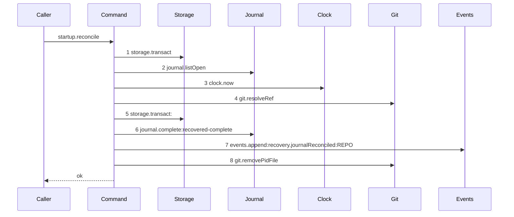
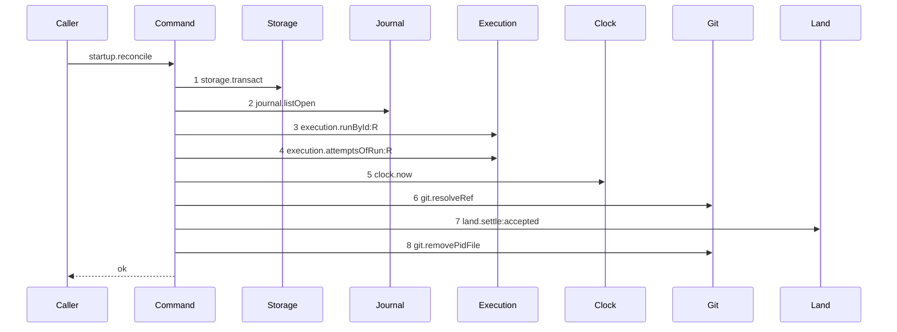

# Story 6 — Startup reconciles an open merge row

Epic: `.agents/plan/epics/051.3-the-checkpoint-and-the-land.md`
Depends on: Story 3 (`03-the-land-opens-its-journal-row`), whose row it finds, and Story 4 (`04-the-accepted-settle`), whose unit it calls; EPIC 050.2 Story 2 (`02-the-authority-seams`), for `execution.runById` and for the primitive projection the recorder needs; EPIC 050.1 Story 6 (`06-the-conformance-harness`).
Kind: story-implement

Diagrams: reconcile-merge-land

Baselines: reconcile-merge-land <- baseline-reconcile-merge

Seams: reconcile-merge-land: +execution.runById:R, +execution.attemptsOfRun:R, +land.settle:accepted, -storage.transact:#2, -journal.complete:recovered-complete, -events.append:recovery.journalReconciled:REPO

This story changes one path of `reconcileJournal`: the `merge` row whose ref reached its
`proposed_head_oid`. The `cut` path is EPIC 051 Story 8's
(`08-startup-reconciles-an-open-cut-row`), and the `sync`, `publish`, `revert`,
discarded, absent and unexpected paths are untouched.

**The drawn set is every branch of the merge-landed path.** The other five verdicts of the shipped
ladder — base, absent, unexpected, publish and unreadable — each stop at a step the drawn path does
not reach, and each is asserted by the shipped cases of
`src/commands/startup/reconcile-journal.test.ts:252` — `it` onward, unchanged. A `merge` row whose
ref did **not** reach the proposed head keeps the shipped `discarded` arm, and case 2 of
`## Verify` asserts it.

## The shipped path

### `baseline-reconcile-merge`

Superseded by: EPIC 051.3 reconcile-merge-land

Shipped path: `src/commands/startup/reconcile-journal.ts:36` — `reconcileJournal`, through
`src/commands/startup/reconcile-journal.ts:231`. Fixture:
`test/helpers/recovery.ts:48` — `createRecoveryFixture`, one repository `repo_a` with a bare home,
and exactly one `git_operation` row shaped like
`src/commands/startup/reconcile-journal.test.ts:110` — `openRow` — `intent: "merge"`,
`state: "open"`, `base_oid: commit1`, `proposed_head_oid: commit2`, and `child_token` naming a real
pid file the fixture writes — whose ref `refs/heads/objective_a` reads `commit2`.



Each step, with its caller anchor, its callee anchor and the fixture state that reaches it:

1. `src/commands/startup/reconcile-journal.ts:40` — `transact` →
   `src/services/storage/index.ts:33` — `transact`. Reached unconditionally.
2. `src/commands/startup/reconcile-journal.ts:41` — `listOpen` →
   `src/services/git/journal.ts:58` — `listOpen`. Reached unconditionally, and it returns the one
   seeded row.
3. `src/commands/startup/reconcile-journal.ts:43` — `now` →
   `src/services/clock/index.ts:2` — `now`. Reached unconditionally, once for the whole pass.
4. `src/commands/startup/reconcile-journal.ts:80` — `resolveRef` →
   `src/services/git/index.ts:179` — `resolveRef`. Reached because the row's intent is not
   `publish`, so the guard at
   `src/commands/startup/reconcile-journal.ts:52` — `publish` does not fire.
5. `src/commands/startup/reconcile-journal.ts:184` — `transact`, inside the local helper invoked at
   `src/commands/startup/reconcile-journal.ts:95` — `settle`. Reached because the fixture's ref reads
   `commit2`, so the comparison at
   `src/commands/startup/reconcile-journal.ts:94` — `proposedHeadOid` is true.
6. `src/commands/startup/reconcile-journal.ts:188` — `complete` →
   `src/services/git/journal.ts:36` — `complete`, with the outcome literal at
   `src/commands/startup/reconcile-journal.ts:191` — `recovered-complete`.
7. `src/commands/startup/reconcile-journal.ts:215` — `append` →
   `src/services/event/index.ts:50` — `append`, with the type literal at
   `src/commands/startup/reconcile-journal.ts:218` — `recovery.journalReconciled`. The payload holds
   no `reason` key, so the token carries two labels.
8. `src/commands/startup/reconcile-journal.ts:238` — `removePidFile` → the `Git` service, through
   `src/commands/startup/reconcile-journal.ts:233` — `removeClearedToken` invoked at
   `src/commands/startup/reconcile-journal.ts:103` — `removeClearedToken`. Reached because the
   fixture's `child_token` is non-null and
   `src/commands/startup/reconcile-journal.ts:237` — `token` guards the call.

Step 5 sits textually below step 7 because
`src/commands/startup/reconcile-journal.ts:176` — `settle` is declared after the command. The trace
is invocation order, so the ordinals above are the runtime order and not the file order.

**This baseline records that the shipped command applies no transition at all.** It completes the
journal row and appends one recovery event, and it writes nothing else — no checkpoint, no branch
head, no node state. That absence is what this story replaces, and it is why the change is new work
rather than a parameter change.

### `reconcile-merge-land`

Supersedes: EPIC 051.3 baseline-reconcile-merge

Fixture: the fixture of `baseline-reconcile-merge`, plus the rows a crashed land leaves behind — an
active `execution` run `R` (`run_b`) over task `T` (`task_a`) at fence `1`, one `run_base` row naming
`repo_a` at `commit1`, one **closed** attempt and one **open** attempt `A` on `R`, `T` in `running`,
and a `workspace_branch` row on objective `O` (`objective_a`) whose `head_oid` is still `commit1`.
The `git_operation` row now carries `node_id: "task_a"` and `run_id: "run_b"`, which the crashed
`land.begin` wrote.



Steps 3 and 4 carry the run alias, and the harness change of EPIC 050.2 Story 2
(`02-the-authority-seams`) is what lets them.
`execution.runById(transaction, runId)` and `src/services/execution/index.ts:115` — `attemptsOfRun`
both take the run id as a primitive last argument, and
`test/helpers/sequence-conformance.ts:121` — `input` calls a projection only when that argument is an
object today. That story extends the recorder to call a declared projection whatever the argument's
type is, which is also what makes the `execution.runById:R` and `execution.attemptsOfRun:R` tokens of
EPIC 050.2, EPIC 050.4 and EPIC 050.5 emittable. `plan.readNode` gains no entry and stays bare.

**Steps 3 and 4 sit inside the listing transaction, and that is the ruling.** The two derivations the
epic requires — `fence` from `run.fence` and `attempt_id` from the open attempt of the run — are
reads, and putting them in the transaction that already lists the rows keeps `storage.transact` to
one occurrence at this level. Read in a transaction of their own they would need the
`:#<n>` discriminator, which `.agents/plan/authoring.md` refuses outside a baseline.

**They run for every `merge` row carrying a run id, whatever verdict that row later takes.** The two
reads therefore join the base, absent and unexpected merge paths as well, and no drawn diagram covers
those. What must not change is their **behaviour**, so the derivation never throws: it records what
it found, and the "exactly one open attempt" rule gates the landed arm alone. A row whose run is
absent, whose `node_id` is null, or whose open-attempt count is not one is recorded as underivable
and falls through to the shipped ladder unchanged.

**Step 7 replaces steps 5, 6 and 7 of the baseline.** `land.settle` is the same nested unit Story 4
(`04-the-accepted-settle`) writes, so it opens its own transaction, writes the checkpoint, advances
the head, records the transition and the event, and completes the journal row. Its interior is
invisible here and is proven by `land-settle-accepted`.

**The recovery event of the baseline does not survive on this path, and the actor carries the
provenance instead.** The settle owns the whole completion, and appending
`recovery.journalReconciled` beside it would need a second transaction at this level or a
recovery-only branch of the settle that no diagram draws. What distinguishes a recovered land is the
actor: this command passes `actorKind: "daemon"` and `input.actor`, where
`reportOutcome` passes the authenticated harness actor, so both `outcome.reported` and `run.ended`
carry it on the event row. The recovery report's `completed` counter and its findings name the row as
well. The other five verdicts keep `recovery.journalReconciled` unchanged.

Step 8 is the shipped pid-file removal, unchanged: `land.settle` returns the cleared token exactly as
`journal.complete` did, and `removeClearedToken` removes the file outside every transaction.

The derived `fence` equals the value the land recorded, and two facts make that true. The reconcile
runs **because** the settle did not — that is the crash it repairs — so the run is still `active` and
its fence still holds the value `land.begin` saw, even though a completed settle would have ended the
run and raised it. And `src/commands/startup/recover-home.ts:21` — `reconcile` runs before
`src/commands/startup/recover-home.ts:22` — `leases`, so the one other pass that ends a run runs
after this one. Step 3 reads the fence before step 7 raises it, so the checkpoint records the
pre-raise value exactly as a normal land does.

Add `test/sequence/scenarios/reconcile-merge-land.ts`.

## Change

### 1 — `listOpen` projects the run and the node

`src/services/git/journal.ts:60` — `SELECT`: add `o.node_id` and `o.run_id` to the `SELECT` list,
between `o.repository_id` and `r.home_path`. Extend
`src/services/git/journal.ts:118` — `mapOpenRow` with
`nodeId: value.node_id as string | null` and `runId: value.run_id as string | null`, and
`src/services/git/index.ts:238` — `OpenJournalRow` with the same two fields.

Both are nullable, because
`src/services/storage/migration-0003-execution-and-journal.ts:131` — `node_id` and `:132` — `run_id`
are nullable columns: `git_operation` is polymorphic, and a `sync` or `publish` row has neither.

Leave `src/services/git/journal.ts:52` — `listInFlight` alone. Its consumer,
`src/commands/startup/reap-orphans.ts:40` — `pidFile`, reads the child token and nothing else.

**No column is added to `git_operation`.** The table carries no `attempt_id` and no fence, and this
epic adds neither: a `cut`, `sync` or `publish` row has no run, no attempt and no caller to put in
one. Both values are derived at reconcile time instead.

### 2 — the dependency object

`src/commands/startup/reconcile-journal.ts:16` — `ReconcileJournalDependencies` gains two keys:

```ts
execution: Execution;
land: Readonly<{ settle: (input: LandSettleInput) => LandSettleResult }>;
```

`land` and not `plan`: the plan writes of the settle belong to the settle, and duplicating them here
would give the epic two writers of the same effect and two places to keep in step. The objective id
the branch record needs is derived inside the settle from the node it reads — Story 4
(`04-the-accepted-settle`) — so this command needs no plan read of its own.

### 3 — the derivation, inside the listing transaction

`src/commands/startup/reconcile-journal.ts:40` — `transact` returns the row list today. Widen the
callback to return the rows **and** a derivation map, built inside the same transaction. For every
row whose `intent === "merge"` and whose `runId` is not `null`:

1. `const run = dependencies.execution.runById(transaction, row.runId);` — the fence source. It is
   added by EPIC 050.2 Story 2 (`02-the-authority-seams`), and it returns `null` for a run id no row
   holds.
2. `const open = dependencies.execution.attemptsOfRun(transaction, row.runId).filter((attempt) => attempt.outcome === null);`
   `src/services/storage/migration-0007-external-execution.ts:47` — `UNIQUE` constrains
   `(run_id, attempt_no)` and nothing about open attempts, so one open attempt per run is protocol
   and not schema. The epic states it rather than assuming it, and case 4 asserts the derivation
   picks the attempt the crashed land opened.
3. Record `{ runId: row.runId, nodeId: row.nodeId, attemptId: open[0]?.id ?? null, fence: run?.fence ?? null }`.

**The derivation never throws, and that is what keeps the other verdicts unchanged.** A row is
**derivable** only when `row.nodeId` is not `null`, `run` is not `null`, `run.state` is `"active"`
and `open.length === 1`. Every other row is recorded as underivable, and the landed arm below skips
it. A `merge` row whose `runId` is `null` is not read at all.

### 4 — the land arm

Inside the existing loop, at
`src/commands/startup/reconcile-journal.ts:94` — `proposedHeadOid`, before the shipped `settle` call:
when the row's `intent` is `"merge"` **and** the row is derivable, call

```ts
dependencies.land.settle({
  disposition: "accepted",
  journalRowId: row.id,
  nodeId: derived.nodeId,
  runId: derived.runId,
  attemptId: derived.attemptId,
  fence: derived.fence,
  repositoryId: row.repositoryId,
  baseOid: row.baseOid,
  acceptedOid: row.proposedHeadOid,
  landedOid: observed,
  actorKind: "daemon",
  actorId: input.actor,
});
```

then remove the returned `clearedToken` through the shipped
`src/commands/startup/reconcile-journal.ts:233` — `removeClearedToken`, `completed++`, and
`continue`.

A `merge` row that reached its proposed head but is **not** derivable falls through to the shipped
`settle(..., "complete", observed)` arm, so it completes and appends `recovery.journalReconciled`
exactly as today, and it writes no checkpoint. It also gains a finding, `checkpoint-underivable`,
naming the row, so a crash that lost the derivable state is visible rather than silent.

Every other verdict of the ladder is unchanged, including a `merge` row whose ref reads the base, is
absent, or matches neither.

### 5 — the composition root

`src/main.ts` binds `execution` and `land.settle` into the reconcile step. `land.settle` is bound to
`landSettle` with its own dependency object, exactly as EPIC 051.4 binds it into
`acceptExecution`.

## Constraints

- `listOpen` gains two projections and no filter change. `listInFlight` is untouched.
- `nodeId` and `runId` on `OpenJournalRow` are nullable. Do not type them `string`.
- No column is added to `git_operation`.
- The derivation reads sit in the listing transaction. Do not open a second transaction for them.
- The derivation never throws. A row it cannot derive falls through to the shipped ladder with a
  `checkpoint-underivable` finding. Throwing would abort a pass that previously discarded the row.
- Remove the token `land.settle` returns, outside every transaction, exactly as
  `removeClearedToken` does for the shipped arms.
- The fence is `run.fence` read at reconcile time. Do not read it from `git_operation.lease_fence`,
  which is the external-drive precondition mode and is `0` for a land row.
- `reconcile` keeps its position between `sweep` and `leases` at
  `src/commands/startup/recover-home.ts:21` — `reconcile`. Moving it after `leases` would make the
  derived fence differ from the value the land recorded.
- The other five verdicts keep their shipped behaviour, their shipped counters and their shipped
  events.

## Verify

```
node --test src/commands/startup/reconcile-journal.test.ts src/services/git/journal.test.ts src/main.test.ts test/sequence/conformance.test.ts
```

Extend `src/commands/startup/reconcile-journal.test.ts`, which builds its fixture with
`test/helpers/recovery.ts:48` — `createRecoveryFixture` and drives a hand-written `Git` mock at
`src/commands/startup/reconcile-journal.test.ts:37` — `gitMock`. The eleven shipped cases stay,
unchanged apart from the two new dependency keys.

Add, each as a separate `it`:

1. `"startup completes an open merge row whose ref moved and writes the checkpoint it owed"` — seed
   the crashed-land fixture. Assert the `checkpoint` row count is `1` and `deepEqual` its columns
   against the pinned object; assert `workspace_branch.head_oid === commit2`; assert
   `node.state === "done"`; assert the journal row is `complete`; assert `result.completed === 1`.

1b. `"a recovered land completes the run lifecycle and records the daemon actor"` — on the same
fixture assert `run.state === "ended"` with `outcome === "done"` and the fence raised by one, the
attempt closed as `accepted`, and that both `outcome.reported` and `run.ended` carry
`actor_kind: "daemon"` and `actor_id` equal to the startup actor. The control is Story 4 case 7,
where the same two events carry the harness actor. Without this case recovery writes the
checkpoint and leaves the run active.

2. `"startup discards an open merge row whose ref did not move and leaves the node state unchanged"`
   — the same fixture with the ref reading `commit1`. Assert the journal row is `discarded`, the
   `checkpoint` count is `0`, `workspace_branch.head_oid === commit1`, and `node.state === "running"`
   both before and after. This is the control for case 1: without it, case 1 passes for a pass that
   lands unconditionally.

3. `"a merge row carrying no run id keeps the shipped ladder"` — seed the shipped
   `src/commands/startup/reconcile-journal.test.ts:110` — `openRow` with `run_id: null` and a ref at
   the proposed head. Assert the journal row is `complete` with outcome `recovered-complete` and that
   the `checkpoint` count is `0`.

4. `"the derived attempt id is the attempt the crashed land opened"` — seed `run_b` holding one
   attempt closed as `rejected` and one open attempt. Assert the stored checkpoint's `attempt_id`
   equals the open attempt's id, and that it does not equal the closed one's.

5. `"a run holding two open attempts falls through to the shipped ladder with a finding"` — assert
   the journal row is `complete` with outcome `recovered-complete`, the `checkpoint` count is `0`,
   the node state is unchanged, and `result.findings` holds one entry whose code is
   `checkpoint-underivable`. The control is case 1, where the same fixture with one open attempt
   lands.

6. `"the derived fence equals the value the land recorded"` — seed `run.fence = 1` and assert the
   stored checkpoint's `fence` is `1`.

7. `"running the leases pass first would derive a different fence"` — the control for case 6: run
   the leases pass over the same fixture, assert `run.fence === 2`, and assert the value a reconcile
   would then derive differs from the value case 6 pinned. This is what makes the pass order at
   `src/commands/startup/recover-home.ts:21` — `reconcile` a tested property and not a comment.

8. `"listOpen projects the node id and the run id"` — extend `src/services/git/journal.test.ts`:
   seed one row with both set and one with both null, and `deepEqual` the projected
   `OpenJournalRow` objects against the pinned expectations.

9. `"listInFlight is unchanged"` — assert its projected row shape holds no `nodeId` and no `runId`.
   Without it, case 8 passes for a change that widened both queries.

10. `"the shipped verdict ladder is unchanged for sync, publish, revert, absent and unexpected"` —
    assert the eleven shipped cases still pass by running them against the widened dependency object,
    and assert `result.leftOpen`, `result.discarded` and `result.refusesNewWork` match their shipped
    values in each.

11. `"the derivation reads the run for every merge row and changes no other verdict"` — three
    fixtures in one case: a merge row whose ref reads the base, one whose ref is absent, and one
    whose ref matches neither, each carrying a run id. Assert `result.discarded`, `result.leftOpen`,
    `result.refusesNewWork` and the stored row state equal their shipped values, and assert the
    `checkpoint` count is `0` for all three.

12. `"the conformance runner replays each of the four diagrams of this epic by equality"` — this is
    the epic's gate row 24, owned here because this story dispatches last and is the first point at
    which all four scenarios exist. The shipped runner at
    `test/sequence/conformance.test.ts:267` — `it` carries the replay half. Add the mutation half:
    for each of `land-begin`, `land-settle-accepted`, `land-settle-contended` and
    `reconcile-merge-land`, drive the scenario with one recorded token removed and one pair
    transposed, and assert `assertConformance` throws both times. Eight assertions in one case, so a
    comparison that silently passes cannot ship.

13. `"startup removes the pid file the crashed land left"` — assert the file the fixture's
    `child_token` names does not exist after the pass, and that it existed before it.

14. `"main.ts binds execution and land.settle into the reconcile step"` — extend `src/main.test.ts`:
    assert the reconcile step the composition root builds carries both keys, and drive one crashed-
    land fixture through the real startup path asserting the checkpoint is written. Without it, the
    widened dependency object is proven only by a test that constructs it by hand.

Add `test/sequence/scenarios/reconcile-merge-land.ts`, building the fixture the diagram names,
running the real `reconcileJournal` over real SQLite behind the recorder, binding `land.settle` to an
**unrecorded** dependency object, and returning the recorder and the result.

`pnpm run verify` exits 0.

Proof: PASS line delivered — `src/commands/startup/reconcile-journal.test.ts` and
`test/sequence/conformance.test.ts` in `PASS EPIC-051.3`.
