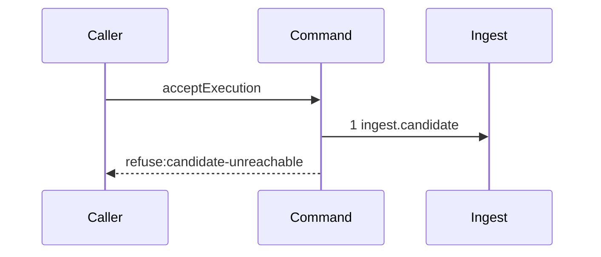

# Story 1 — The gate refuses an unreachable candidate

Epic: `.agents/plan/epics/051.4-the-acceptance-gate-and-the-report-route.md`
Depends on: EPIC 051.1, for `ingest.candidate` and `candidate.discard`; EPIC 050.2, for the run and the fence.
Kind: story-implement

Diagrams: report-refusal-candidate-unreachable

Seams: report-refusal-candidate-unreachable: +ingest.candidate

This story adds the command file, its refusal union and its first gate step. Story 2 adds the
repository step, and every later story adds one step of the ordered gate.

## The path

`acceptExecution` is written from nothing, so this diagram has an empty prior set, it draws no
`baseline-` diagram, and every one of its tokens is `+`.

### `report-refusal-candidate-unreachable`

Fixture: run `R` on task `T`, one open attempt `A`, and **no** ref at
`refs/kanthord/candidate/<runId>/<attemptNo>` in the loopback bare home. The report names an oid.
`ingest.candidate` refuses, and the command returns that refusal without reaching a second seam.



**The drawn set is every branch of this path.** `ingest.candidate` refuses
`candidate-unreachable` on two inner paths — a missing ref and a ref that does not reach the reported
oid — and both produce the same outer token at the same position, so one outer diagram covers both.
The inner difference is that the second discards the ref and the first does not, and that discard is
drawn inside EPIC 051.1's `ingest-candidate-unreachable`, never here.

`ingest.candidate` is a nested command. The scenario binds it to unrecorded dependencies, so the ref
resolve and the reachability read inside it are invisible at this seam.

Add `test/sequence/scenarios/report-refusal-candidate-unreachable.ts`.

## Change

**`src/commands/checkpoint/accept-execution.ts` — add the command, its refusal union and the first
gate step.** The file does not exist; neither does `src/commands/checkpoint/`.

### 1 — the dependency object and the input

Five keys, in the shape `AGENTS.md` fixes — dependencies first, input second:

```ts
export type AcceptExecutionDependencies = Readonly<{
  git: Git;
  ingest: Ingest;
  candidate: Candidate;
  commands: Commands;
  land: Land;
}>;

export async function acceptExecution(
  dependencies: AcceptExecutionDependencies,
  input: AcceptExecutionInput,
): Promise<AcceptExecutionResult>;
```

`Ingest`, `Candidate`, `Commands` and `Land` are the nested-unit interfaces EPIC 051.1, EPIC 051.2 and
EPIC 051.3 declare. `AcceptExecutionResult` is `NodeReportResult`, imported from
`src/domain/outcome-report.ts:83` — `NodeReportResult`, because Story 8 returns it straight to the
caller of `node.report`.

**There is no `storage` key and no `execution` key.** `acceptExecution` is the journaled write of this
family and it holds exactly two transaction spans, both opened inside `land.begin` and `land.settle`
— `.agents/plan/epics/051.4-the-acceptance-gate-and-the-report-route.md:67` — `acceptExecution`, and
gate row 9b asserts the count. Every value the gate needs before the land arrives on the input, read
by `reportOutcome` inside its own prelude transaction.

**The command is `async`.** It writes git, and `AGENTS.md` forbids git I/O inside a storage
transaction.

### 2 — the refusal union and the error class

```ts
export type AcceptExecutionRefusal =
  | "candidate-unreachable"
  | "multi-repository-unsupported"
  | "ancestry-broken"
  | "path-undeclared"
  | "command-failed"
  | "contended";
```

`AcceptExecutionError` reproduces the shape of
`src/commands/outcome/report-outcome.ts:87` — `ReportOutcomeError`: a `refusal` field, a `details`
field typed `unknown`, and `this.name` set to `"AcceptExecutionError"`. The recorder derives the
diagram terminal from `error.refusal` at
`test/helpers/sequence-conformance.ts:305` — `refusal`, so the field name is load-bearing and not a
style choice.

Declare all six members in this story. The later stories throw them; a union that grows story by
story leaves five `## Verify` runs typechecking against a union that does not yet hold the member
under test.

### 3 — the first gate step

Call `dependencies.ingest.candidate({ gitDir, runId, attemptNo, reportedOid })` first, before every
other seam. It returns the resolved candidate ref on success, and it refuses `candidate-unreachable`
on both of its inner paths. Rethrow its refusal as `AcceptExecutionError("candidate-unreachable", …)`.

### 4 — the conformance runner awaits its scenario

`test/sequence/conformance.test.ts:282` — `scenario` destructures the scenario's return value with no
`await`. Every diagram of this epic is over an `async` command, so the destructuring yields
`undefined` for `recorder` and `result`. Two lines change together:
`test/sequence/conformance.test.ts:278` — `scenario` types the default export as
`() => Readonly<{ recorder; result }>`, which becomes
`() => Readonly<{ recorder; result }> | Promise<Readonly<{ recorder; result }>>`, and `:282` becomes
`await scenario();`. `await` on a non-promise is the identity, so every shipped synchronous scenario
is unaffected. The enclosing `it` at `test/sequence/conformance.test.ts:270` — `every due scenario conforms` already admits
the `await`.

**Verify before editing, and report a divergence rather than re-applying.** EPIC 051 draws the first
`async` path of the family, so this edit may already be in the tree when this story dispatches.

## Constraints

- `ingest.candidate` is step 1 and nothing precedes it. The ordered gate of `worker.md` section 8
  starts at reachability, and a git read of the objective branch before it would read a branch the
  report may have no right to name.
- Open no transaction, in this story or in any later one. Gate row 9b asserts `acceptExecution` opens
  exactly two spans, and both belong to the land.
- Do not draw or perform a discard here. The discard of the ref-exists path lives inside
  `ingest.candidate`, and the missing-ref path has no ref to delete.
- Declare all six refusal members now, and throw only `candidate-unreachable`.
- Add no `storage`, `execution` or `plan` key. Every pre-land value arrives on the input, and the
  response comes back from `land.settle`.

## Verify

```
node --test src/commands/checkpoint/accept-execution.test.ts test/sequence/conformance.test.ts
```

`src/commands/checkpoint/accept-execution.test.ts` is a new file. Build its fixture from
`test/helpers/database.ts:32` — `createMigratedStorage`, `test/helpers/rows.ts:21` — `seedRegistry`,
`test/helpers/rows.ts:102` — `seedGraph` and `test/helpers/rows.ts:329` — `seedNodeState`, and drive
git against the loopback fixture of EPIC 005. `test/helpers/rows.ts` holds no `seedRunBaseRow`, so a
`run` row is written with a raw `INSERT`, as `test/sequence/scenarios/expiry-pass-one-due.ts:24` does.
`gitDir` arrives on the input; `reportOutcome` reads it from `repository.home_path`, as
`src/commands/startup/sweep-remnants.ts:35` — `repository` does.

Add, each as a separate `it`:

1. `"a reported oid that the candidate ref does not reach refuses candidate-unreachable"` — assert
   `error instanceof AcceptExecutionError` and `error.refusal === "candidate-unreachable"`.

2. `"a missing candidate ref reaches no git read of the objective branch"` — substitute a `Git` double
   that counts every method call, and assert `resolveRef`, `isAncestor` and `changedPaths` each
   record `0`. The control is case 1 of Story 3, where `isAncestor` records `1`; without it this
   assertion passes for a command that reaches no seam at all.

3. `"the missing-ref path performs no discard"` — assert the `Git` double's `deleteRef` call count is
   `0`, and assert the candidate namespace is byte-identical before and after through
   `git.listRefs({ prefix: "refs/kanthord/candidate/" })`.

4. `"AcceptExecutionRefusal declares the six codes"` — the union is an erased type, so assert instead
   that `errorStatuses` will carry all six by naming them in one array literal in the test and
   asserting its length is `6`. Story 9 makes the same six a runtime key set; this case pins the
   spelling so the two cannot drift.

5. `"the conformance runner awaits an async scenario"` — a scenario returning a `Promise` conforms.
   Without the `await` of change step 4 the runner destructures `undefined` and throws
   `Cannot destructure property 'recorder'`.

Add `test/sequence/scenarios/report-refusal-candidate-unreachable.ts`, building the fixture the
diagram names, running the real `acceptExecution` over real SQLite and the loopback git fixture behind
the recorder, binding `ingest`, `candidate`, `commands` and `land` to unrecorded dependencies as
`test/sequence/scenarios/claim-success-task.ts:81` — `expiry` does, catching the
`AcceptExecutionError` and returning it as `result`, as
`test/sequence/scenarios/claim-refusal-objective-busy.ts:161` — `catch` does.

`pnpm run verify` exits 0.

Proof: PASS line delivered — `src/commands/checkpoint/accept-execution.test.ts` in `PASS EPIC-051.4`.
