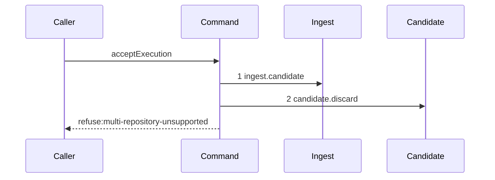

# Story 2 — The gate refuses a foreign repository

Epic: `.agents/plan/epics/051.4-the-acceptance-gate-and-the-report-route.md`
Depends on: Story 1 (`01-the-gate-refuses-an-unreachable-candidate`), for the command file and the
refusal union; EPIC 051.1 Story 6 (`06-the-acceptance-verdicts`), for `repositoryVerdict`; EPIC 051.1
Story 4 (`04-the-candidate-ref-is-deleted`), for `candidate.discard`.
Kind: story-implement

Diagrams: report-refusal-multi-repository

Seams: report-refusal-multi-repository: +ingest.candidate, +candidate.discard

This story adds the second gate step and the discard every later refusal repeats. Story 3 adds the
ancestry read that follows it.

## The path

`acceptExecution` is written from nothing, so this diagram has an empty prior set, it draws no
`baseline-` diagram, and every one of its tokens is `+`.

### `report-refusal-multi-repository`

Fixture: run `R` on task `T`, one open attempt `A`, a candidate ref that reaches the reported oid, and
one `run_base` row naming `repository_alpha`. The report names `repository_beta`. The fixture records
one base row because the writer produces one, not because the schema forbids two: the primary key
`(run_id, repository_id)` at
`src/services/storage/migration-0012-run-model.ts:40` — `PRIMARY` forbids a duplicate pair and
**permits** two rows for one run under two repository ids, exactly as EPIC 051.1 Story 6
(`06-the-acceptance-verdicts`) states.



**The drawn set is every branch of this path.** `repositoryVerdict` is pure, so its refusal has one
shape whatever the mismatch is. The passing branch reaches step 2 of Story 3 and is that story's
diagram.

**`acceptExecution` reads no `run_base` row and opens no transaction.** Gate row 9b asserts it opens
exactly two transaction spans, and
`.agents/plan/epics/051.4-the-acceptance-gate-and-the-report-route.md:67` — `acceptExecution` states
that those two are `land.begin`'s and `land.settle`'s. A `storage.transact` here would be a third.
`reportOutcome` therefore reads the base rows inside its own prelude transaction and passes
`baseRepositoryIds` and `baseOid` on the input — that read is step 8 of Story 8's diagram, and this
story only adds the store method it calls.

Add `test/sequence/scenarios/report-refusal-multi-repository.ts`.

## Change

### 1 — `src/services/execution/index.ts` — add `runBases`

Add after `src/services/execution/index.ts:115` — `attemptsOfRun`, which it mirrors:

```ts
runBases(transaction: Transaction, runId: string): readonly RunBaseRow[];
```

**It is synchronous and returns an array, not a `Promise`.** Every method of
`src/services/execution/index.ts:95` — `Execution` is transaction-bound and synchronous. The epic's
seam list writes `Promise<RunBaseRow[]>`; that is a slip, recorded in `index.md`. `RunBaseRow` is
`src/domain/run.ts:53` — `RunBaseRow`.

`src/services/execution/sqlite.ts:92` — `SqliteExecution` is one class implementing the whole
interface, so `runBases` is a method on it beside
`src/services/execution/sqlite.ts:314` — `attemptsOfRun`:

```sql
SELECT run_id, repository_id, oid FROM run_base WHERE run_id = ? ORDER BY repository_id ASC
```

The order is explicit and bytewise, per the determinism rule of `AGENTS.md`. Add a
`RUN_BASE_COLUMNS` constant beside `src/services/execution/sqlite.ts:25` — `ATTEMPT_COLUMNS` and a
`toRunBaseRecord` mapper beside `src/services/execution/sqlite.ts:80` — `toAttemptRecord`.
`test/helpers/execution.ts:220` — `createBackedExecutionFake` mirrors the real SQL and gains the same
method; `test/helpers/execution.ts:31` — `createExecutionFake` gains a refusing stub through
`test/helpers/execution.ts:38` — `unexpected`.

**This story adds the method and no caller.** Story 8 is its one call site, exactly as EPIC 051.1
ships `ingest.candidate` with none.

### 2 — the input grows, and `acceptExecution` calls `repositoryVerdict`

`AcceptExecutionInput` gains `reportedRepositoryId: string` and
`baseRepositoryIds: readonly string[]`. After `ingest.candidate` returns:

```ts
const verdict = repositoryVerdict({
  reportedRepositoryId: input.reportedRepositoryId,
  baseRepositoryIds: input.baseRepositoryIds,
});
```

That is the signature at EPIC 051.1 Story 6 (`06-the-acceptance-verdicts`): it takes a **list**, it
passes only when the list holds exactly one entry equal to the reported id, and **every other case
refuses, including the empty list**. Its refusal carries `reported: string` and
`base: readonly string[]`, sorted with `comparePaths`.

On a refusal, call `dependencies.candidate.discard({ gitDir: input.gitDir, ref })` with the ref
`ingest.candidate` returned, then throw
`AcceptExecutionError("multi-repository-unsupported", …)` carrying the verdict's `reported` and
`base` in `details` verbatim.

**A zero-row base set is a refusal here and not a thrown invariant**, because the verdict decides it.
`acceptExecution` adds no rule of its own on top.

## Constraints

- Open no transaction. Gate row 9b asserts exactly two spans, and both belong to the land.
- Pass `baseRepositoryIds` as the list `repositoryVerdict` declares. Do not collapse it to a scalar
  and do not pre-check its length: the verdict owns both the cardinality rule and the equality rule.
- Copy `reported` and `base` out of the verdict unchanged. Re-sorting in the command is a second
  definition of order.
- Discard before throwing. A thrown refusal that skipped the discard leaves the object alive and lets
  a later report name it.
- Change no `run_base` column and add no migration. The table ships at
  `src/services/storage/migration-0012-run-model.ts:36` — `run_base`.

## Verify

```
node --test src/commands/checkpoint/accept-execution.test.ts src/services/execution/sqlite.test.ts src/http/server/node/report-node.test.ts test/sequence/conformance.test.ts
```

Extend `src/commands/checkpoint/accept-execution.test.ts` from Story 1, and
`src/services/execution/sqlite.test.ts` for the store method.

Add, each as a separate `it`:

1. `"runBases returns the run's base rows ordered by repository id"` — seed one run holding one row
   and another holding two under two repository ids, and assert both returned arrays by value. The
   two-row case is legal against the primary key, which is why the cardinality rule lives in
   `repositoryVerdict` and not in the schema. Assert a run with no row returns `[]`.

2. `"a report naming a repository that is not the run's sole base row refuses multi-repository-unsupported"`
   — assert `error.refusal === "multi-repository-unsupported"` and assert `error.details` deep-equals
   `{ reported: "repository_beta", base: ["repository_alpha"] }` by value.

3. `"a report naming the base repository passes the repository step"` — the control for case 2. Assert
   the command reaches `git.isAncestor`, by a `Git` double call count of `1`. Without it, case 2
   passes for a command that refuses every report.

4. `"an empty base list refuses"` — `repositoryVerdict` refuses zero rows, so the command does too.

5. `"the candidate ref is deleted on a repository refusal"` — list `refs/kanthord/candidate/` before
   and after through `git.listRefs` and assert the ref is present before and absent after. The control
   is Story 1 case 3, where no ref exists and none is deleted.

6. `"a foreign repository and the base repository are each answered over the node.report route"` — two
   cases posting to `/v1/node/:id/report` through `test/helpers/app.ts:176` — `createTestApp`: the
   foreign one answers `409` with `multi-repository-unsupported`, the matching one lands. The epic's
   gate row 3 says **two cases over the real route**, so this case and not case 2 is what discharges
   it.

7. `"acceptExecution opens no transaction of its own"` — a `Storage` double recording transaction
   spans across a repository refusal, asserting zero spans. Gate row 9b asserts two on the landing
   path; this is the refusal half.

Add `test/sequence/scenarios/report-refusal-multi-repository.ts`, building the fixture the diagram
names, running the real command over the loopback git fixture behind the recorder, binding `ingest`,
`candidate`, `commands` and `land` to unrecorded dependencies as
`test/sequence/scenarios/claim-success-task.ts:81` — `expiry` does, and returning the recorder and the
caught `AcceptExecutionError`.

`pnpm run verify` exits 0.

Proof: PASS line delivered — `src/commands/checkpoint/accept-execution.test.ts` in `PASS EPIC-051.4`.
