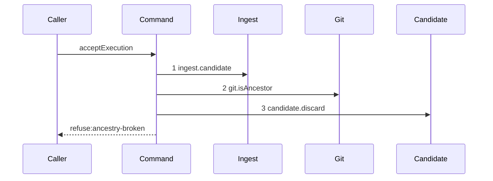

# Story 3 — The gate refuses broken ancestry

Epic: `.agents/plan/epics/051.4-the-acceptance-gate-and-the-report-route.md`
Depends on: Story 2 (`02-the-gate-refuses-a-foreign-repository`), for the repository step; EPIC 051.1
Story 1 (`01-the-five-git-primitives`), for `git.isAncestor`; EPIC 051.1 Story 6
(`06-the-acceptance-verdicts`), for `ancestryVerdict`.
Kind: story-implement

Diagrams: report-refusal-ancestry-broken

Seams: report-refusal-ancestry-broken: +ingest.candidate, +git.isAncestor, +candidate.discard

This story adds the third gate step. Story 4 adds the name-only diff that follows it.

## The path

`acceptExecution` is written from nothing, so this diagram has an empty prior set, it draws no
`baseline-` diagram, and every one of its tokens is `+`.

### `report-refusal-ancestry-broken`

Fixture: run `R` on task `T`, one open attempt `A`, a candidate ref reaching the reported oid, and an
input whose `baseRepositoryIds` holds the reported repository alone, at base oid `B`. The candidate
head sits on a branch cut **before** `B`, so it is not a descendant of `B`.



**The drawn set is every branch of this path.** `ancestryVerdict` is pure and takes one boolean, so it
has one refusing shape. The passing branch reaches step 6 of Story 4 and is that story's diagram.

**Step 4 carries no label, per EPIC 051.1's decision.** `git.isAncestor` appears once in this diagram,
and a `:ancestry` label would name the call site rather than a value the call receives, which
`.agents/plan/authoring.md` refuses. The reachability call of the same method sits inside
`ingest.candidate`, which is a nested unit, so the token is not repeated at this seam.

Add `test/sequence/scenarios/report-refusal-ancestry-broken.ts`.

## Change

**`src/commands/checkpoint/accept-execution.ts` — add the ancestry read and the verdict.**

After the repository step of Story 2 passes:

```ts
const descends = await dependencies.git.isAncestor({
  gitDir: input.gitDir,
  ancestorOid: input.baseOid,
  descendantOid: input.reportedOid,
});
```

`AcceptExecutionInput` gains `baseOid: string`. It is the `oid` column of the run's single `run_base`
row — `src/domain/run.ts:48` — `runBaseRow` declares `runId`, `repositoryId` and `oid` — read by
`reportOutcome` and passed in. Pass `descends` to
`ancestryVerdict` of `src/domain/execution-acceptance.ts`. On a refusal, call
`dependencies.candidate.discard` and then throw
`AcceptExecutionError("ancestry-broken", …)`, carrying `base.oid` and the reported oid in `details`.

**The ancestor is the recorded base, never the branch head.** The epic states the reason: the base is
what the worker started from, and a head that moved is the contention case, detected at the swap.
Reading `refs/heads/<objectiveId>` here would report `ancestry-broken` for work that is merely late,
and it would add a `git.resolveRef` token this diagram does not hold.

## Constraints

- Read the base oid from `input.baseOid`. Do not resolve the objective branch: the branch head is the
  contention input, and it belongs at the swap.
- Open no transaction.
- Discard before throwing.
- Add no label to `git.isAncestor`, and declare no projection for it.
- Do not touch `ancestryVerdict`. It is pure, EPIC 051.1 owns it, and this story is only its call site.

## Verify

```
node --test src/commands/checkpoint/accept-execution.test.ts test/sequence/conformance.test.ts
```

Extend `src/commands/checkpoint/accept-execution.test.ts`, driving the real `Git` service against the
loopback fixture of EPIC 005 so the ancestry relation is a real one.

Add, each as a separate `it`:

1. `"a candidate head that is not a descendant of the recorded base refuses ancestry-broken"` — assert
   `error.refusal === "ancestry-broken"` and assert `error.details` deep-equals
   `{ base: B, head: reportedOid }` by value.

2. `"a candidate head that descends from the recorded base passes the ancestry step"` — the control
   for case 1. Assert the command reaches `git.changedPaths`, by a `Git` double call count of `1`.

3. `"a candidate head equal to the recorded base passes"` — equality is an ancestor, so a report that
   changed nothing is not `ancestry-broken`. Without this case the boundary is untested in the
   direction that matters.

4. `"the ancestry is verified against the recorded base and not against the branch head"` — the case
   the epic's gate names. Claim the node so `run_base` records `B`, then move
   `refs/heads/<objectiveId>` forward to `B2` before the report, and report a head that descends from
   `B` but not from `B2`. Assert the refusal does **not** fire, and assert the `Git` double records
   `isAncestor` with `ancestorOid === B`, by value. A command reading the moved head would refuse.

5. `"the candidate ref is deleted on an ancestry refusal"` — list `refs/kanthord/candidate/` before
   and after and assert the ref is present before and absent after.

Add `test/sequence/scenarios/report-refusal-ancestry-broken.ts`, building the fixture the diagram
names, running the real command over real SQLite and the loopback git fixture behind the recorder,
binding `ingest`, `candidate`, `commands` and `land` to unrecorded dependencies, and returning the
recorder and the caught `AcceptExecutionError`.

`pnpm run verify` exits 0.

Proof: PASS line delivered — `src/commands/checkpoint/accept-execution.test.ts` in `PASS EPIC-051.4`.
