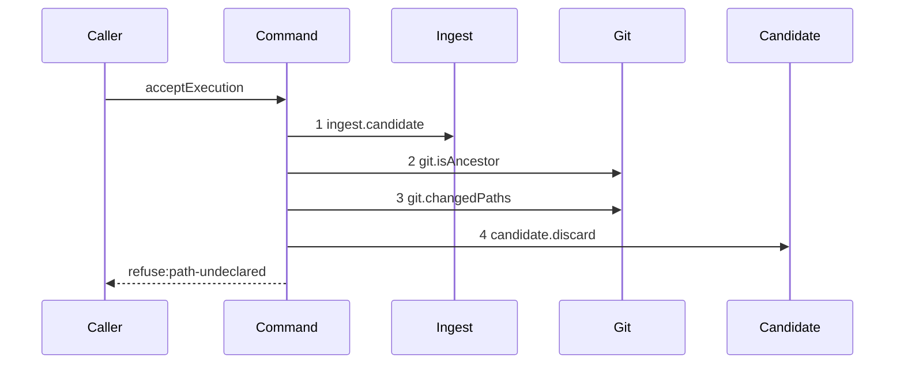

# Story 4 — The gate refuses an undeclared path

Epic: `.agents/plan/epics/051.4-the-acceptance-gate-and-the-report-route.md`
Depends on: Story 3 (`03-the-gate-refuses-broken-ancestry`), for the ancestry step; EPIC 051.1 Story 1
(`01-the-five-git-primitives`), for `git.changedPaths`; EPIC 051.1 Story 6
(`06-the-acceptance-verdicts`), for `declaredPathVerdict`.
Kind: story-implement

Diagrams: report-refusal-path-undeclared

Seams: report-refusal-path-undeclared: +ingest.candidate, +git.isAncestor, +git.changedPaths, +candidate.discard

This story adds the fourth gate step. Story 5 adds the command run that follows it.

## The path

`acceptExecution` is written from nothing, so this diagram has an empty prior set, it draws no
`baseline-` diagram, and every one of its tokens is `+`.

### `report-refusal-path-undeclared`

Fixture: run `R` on task `T`, one open attempt `A`, a candidate ref reaching the reported oid, and a
candidate head that descends from base oid `B`. `T` declares `verify.paths: ["/src/a.ts"]`, and the
commit touches `src/a.ts` and `src/b.ts`. **The declared entry is absolute and the changed entry is
repository-relative**: `verifyPath` at `src/domain/verify-block.ts:5` — `verifyPath` refuses a path
that does not start with `/`, and `declaredPathVerdict` declares a changed path `p` when `declared`
holds the exact string `` `/${p}` ``.



**The drawn set is every branch of this path.** `declaredPathVerdict` is pure and takes two lists, so
its refusal has one shape whatever the gap is. The passing branch reaches step 4 of Story 5 and is
that story's diagram.

**Steps 2 and 3 are two methods on one participant, not one method twice**, so no discriminator is
needed and neither carries a label.

Add `test/sequence/scenarios/report-refusal-path-undeclared.ts`.

## Change

**`src/commands/checkpoint/accept-execution.ts` — add the name-only diff and the verdict.**

After the ancestry step of Story 3 passes:

```ts
const changed = await dependencies.git.changedPaths({
  gitDir: input.gitDir,
  baseOid: input.baseOid,
  headOid: input.reportedOid,
});
```

Pass `changed` and `input.declaredPaths` to `declaredPathVerdict` of
`src/domain/execution-acceptance.ts`. On a refusal, call `dependencies.candidate.discard` and throw
`AcceptExecutionError("path-undeclared", …)`, carrying the verdict's `undeclared` list in `details`
verbatim — it is already sorted with `comparePaths`, in repository-relative form.

**The diff runs from the recorded base to the candidate, and both oids are input values.**
`input.baseOid` is the run's recorded base and `input.reportedOid` is the oid `ingest.candidate`
pinned. No git read supplies either.

`AcceptExecutionInput` gains `declaredPaths: readonly string[]`, the node's `verify.paths` value in
its absolute form. `acceptExecution` receives it rather than reading the node, because it holds no
`plan` key and opens no transaction.

## Constraints

- The diff is name-only and it compares `input.baseOid` against the reported oid. A diff against the
  branch head would show another run's work as this run's changed set.
- Do not re-sort the undeclared paths, and do not convert their form. `declaredPathVerdict` sorts with
  `comparePaths` and returns them repository-relative.
- Pass `declaredPaths` absolute, exactly as `verify.paths` stores them. Stripping the leading `/`
  makes every path undeclared.
- Add no `plan` key and open no transaction.
- Discard before throwing.
- Do not restate the rename rule or the empty-`paths` rule. EPIC 051.1 owns both inside
  `declaredPathVerdict`, and this story is its call site.

## Verify

```
node --test src/commands/checkpoint/accept-execution.test.ts test/sequence/conformance.test.ts
```

Extend `src/commands/checkpoint/accept-execution.test.ts`, driving the **real** `Git` service against
the loopback fixture, never a hand-built path list.

Add, each as a separate `it`:

1. `"the changed-path set comes from a name-only diff of the recorded base against the candidate"` —
   build two real commits in the loopback fixture, one touching `src/a.ts` and one touching
   `src/b.ts`, and assert the value passed to `declaredPathVerdict` deep-equals `["src/a.ts",
"src/b.ts"]`, repository-relative. The epic's gate requires this end-to-end case so
   `declaredPathVerdict` is never fed a hand-built list.

2. `"an undeclared path refuses path-undeclared"` — assert `error.refusal === "path-undeclared"`.

3. `"the refusal lists every undeclared path sorted"` — three undeclared paths whose bytewise order
   differs from their commit order; assert `error.details.undeclared` deep-equals the sorted list by
   value, repository-relative. EPIC 051.1 asserts this at the function boundary only; this case
   asserts it over the real diff.

4. `"a commit touching only declared paths passes the path step"` — the control for case 2. Assert
   the command reaches `commands.run`, by a call count of `1`.

5. `"the candidate ref is deleted on a path refusal"` — list `refs/kanthord/candidate/` before and
   after and assert the ref is present before and absent after.

6. `"an undeclared path is refused over the node.report route and the refusal lists every path"` —
   post to `/v1/node/:id/report` through `test/helpers/app.ts:176` — `createTestApp`, assert the
   status is `409` and `response.body.error.code` is `path-undeclared`, and assert
   `response.body.error.details.undeclared` deep-equals the sorted list. The epic's gate row 7 says
   **over the real route**, so this case and not case 3 is what discharges it.

Add `test/sequence/scenarios/report-refusal-path-undeclared.ts`, building the fixture the diagram
names, running the real command over real SQLite and the loopback git fixture behind the recorder,
binding `ingest`, `candidate`, `commands` and `land` to unrecorded dependencies, and returning the
recorder and the caught `AcceptExecutionError`.

`pnpm run verify` exits 0.

Proof: PASS line delivered — `src/commands/checkpoint/accept-execution.test.ts` in `PASS EPIC-051.4`.
