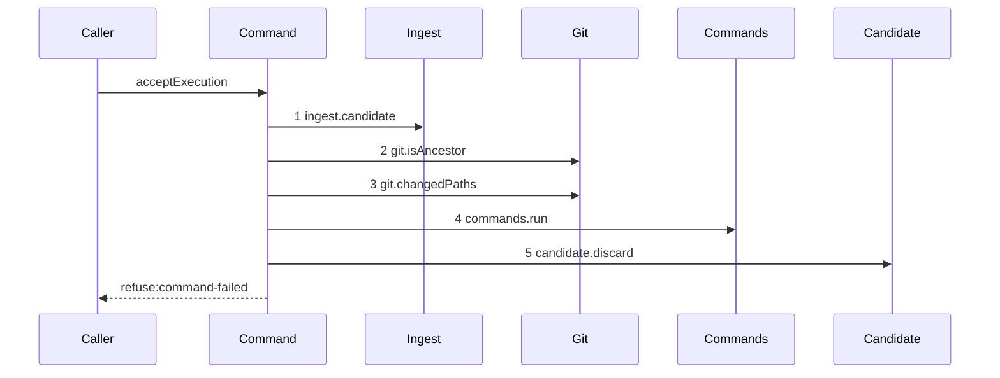

# Story 5 — The gate refuses a failed command

Epic: `.agents/plan/epics/051.4-the-acceptance-gate-and-the-report-route.md`
Depends on: Story 4 (`04-the-gate-refuses-an-undeclared-path`), for the path step; EPIC 051.2 Story 3
(`03-a-declared-command-fails`), for `commands.run` and its refusal shape.
Kind: story-implement

Diagrams: report-refusal-command-failed

Seams: report-refusal-command-failed: +ingest.candidate, +git.isAncestor, +git.changedPaths, +commands.run, +candidate.discard

This story adds the fifth gate step. Story 6 adds the land that follows it.

## The path

`acceptExecution` is written from nothing, so this diagram has an empty prior set, it draws no
`baseline-` diagram, and every one of its tokens is `+`.

### `report-refusal-command-failed`

Fixture: run `R` on task `T`, one open attempt `A`, a candidate ref reaching the reported oid, a
candidate head descending from base oid `B` touching only declared paths, and `T` declaring **one**
command that exits non-zero. The fixture states a length of one, because a list
of two produces two identical `commands.run` tokens at this seam — `commands.run` is one nested call
per gate, so the list length is invisible here and the fixture states it for the reader.



**The drawn set is every branch of this path.** EPIC 051.2 draws three inner paths for `commands.run`
— one command passing, no command, and one command failing — and the first two produce the same outer
token at the same position and reach step 5 of Story 6, which is that story's diagram. Only the
failing inner path stops here.

`commands.run` is a nested command, so the per-command checkout, the `verify.run` and the worktree
removal inside it are invisible at this seam.

Add `test/sequence/scenarios/report-refusal-command-failed.ts`.

## Change

**`src/commands/checkpoint/accept-execution.ts` — add the command run.**

After the path step of Story 4 passes:

```ts
await dependencies.commands.run({
  gitDir: input.gitDir,
  oid: input.reportedOid,
  commands: input.commands,
});
```

`commands.run` refuses `command-failed` itself. Its `details` is
`{ commandIndex: number; command: string }` — EPIC 051.2 Story 3
(`03-a-declared-command-fails`) declares that shape and pins it by value — so rethrow as
`AcceptExecutionError("command-failed", …)` carrying `commandIndex` and `command` verbatim. The key is
`commandIndex` and not `index`. `AcceptExecutionInput` gains `commands: readonly string[]`, the node's
declared `verify.commands`, for the reason Story 4 states.

**Every non-`passed` outcome is `command-failed`, and this story adds no seventh code.**
`.agents/plan/epics/051.2-the-command-gate.md` maps every non-passing `CheckOutcome` to
`command-failed` and delegates the question of a separate daemon-fault code to this epic. **This epic
answers it: no seventh code, and the six of `## Goal` are the whole set.** A code that separated a
daemon fault from a command failure would need a retry rule and an attempt-consumption rule, and
EPIC 054 owns attempt classification.

## Constraints

- The land is not reached when a command fails. `land.begin`, `git.refUpdate` and `land.settle` must each record zero calls on this path.
- Copy the index and the command string from `commands.run`'s refusal without reformatting them. A
  worker reads them to find which of its declared commands failed.
- Discard before throwing.
- Add no seventh refusal code, and change nothing in `commands.run`. EPIC 051.2 owns its inner paths.
- The `commands.run` call sits outside the transaction Story 2 opened.

## Verify

```
node --test src/commands/checkpoint/accept-execution.test.ts test/sequence/conformance.test.ts
```

Extend `src/commands/checkpoint/accept-execution.test.ts`.

Add, each as a separate `it`:

1. `"a failed declared command refuses command-failed"` — assert
   `error.refusal === "command-failed"` and assert `error.details` deep-equals
   `{ commandIndex: 0, command: "exit 1" }` by value. The key is `commandIndex`, copied from
   `commands.run` unchanged.

2. `"the land is never reached when a command fails"` — assert the `land` double's `begin` and
   `settle` counts and the `Git` double's `refUpdate` count are each `0`. The control is case 5 of
   Story 6, where `refUpdate` records one call by value.

3. `"a passing command list reaches the land"` — the control for case 2.

4. `"an empty command list reaches the land"` — the second inner path of `commands.run` produces the
   same outer token at the same position, so this case proves the outer diagram covers it.

5. `"the candidate ref is deleted on a command refusal"` — list `refs/kanthord/candidate/` before and
   after and assert the ref is present before and absent after.

6. `"a failed command is refused over the node.report route and the land is never reached"` — post to
   `/v1/node/:id/report` through `test/helpers/app.ts:176` — `createTestApp`, assert the status is
   `409` and the code is `command-failed`, and assert the `Git` double's `refUpdate` call count is
   `0`. The epic's gate row 8 says **over the real route**, so this case and not case 1 is what
   discharges it.

Add `test/sequence/scenarios/report-refusal-command-failed.ts`, building the fixture the diagram
names with a command list of length one, running the real command over real SQLite and the loopback
git fixture behind the recorder, binding `ingest`, `candidate`, `commands` and `land` to unrecorded
dependencies, and returning the recorder and the caught `AcceptExecutionError`.

`pnpm run verify` exits 0.

Proof: PASS line delivered — `src/commands/checkpoint/accept-execution.test.ts` in `PASS EPIC-051.4`.
