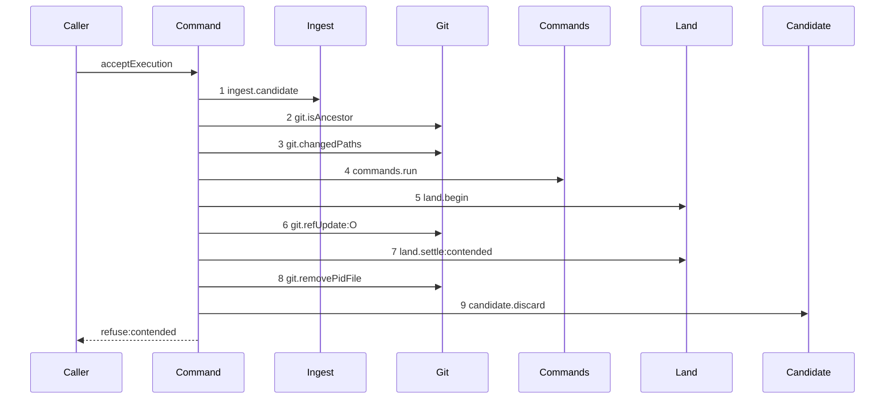

# Story 6 — The gate refuses a contended land

Epic: `.agents/plan/epics/051.4-the-acceptance-gate-and-the-report-route.md`
Depends on: Story 5 (`05-the-gate-refuses-a-failed-command`), for the command step; EPIC 051.3
Story 3 (`03-the-land-opens-its-journal-row`), for `land.begin`; EPIC 051.3 Story 5
(`05-the-contended-settle`), for the contended arm of `land.settle`.
Kind: story-implement

Diagrams: report-refusal-contended

Seams: report-refusal-contended: +ingest.candidate, +git.isAncestor, +git.changedPaths, +commands.run, +land.begin, +git.refUpdate:O, +land.settle:contended, +git.removePidFile, +candidate.discard

This story adds the four land steps and the trailing discard. Story 7 draws the same shape with the
accepted settle and the `ok` terminal.

## The path

`acceptExecution` is written from nothing, so this diagram has an empty prior set, it draws no
`baseline-` diagram, and every one of its tokens is `+`.

### `report-refusal-contended`

Fixture: the loopback bare repository of `test/helpers/remote/seed.ts:124` — `seedRepositories`
registered as `repo_a`; initiative `I`, objective `O` and task `T` from
`test/helpers/rows.ts:102` — `seedGraph`; an active `execution` run `R` over `T` at fence `1` with one
`run_base` row naming `repo_a` at `commit1`; one open attempt `A`; a `workspace_branch` row on `O`
with `origin_oid` and `head_oid` at `commit1`; a candidate ref reaching the reported oid; the reported
head descending from `commit1` and touching only declared paths; one declared command that exits
zero; and `refs/heads/objective_a` **moved off `commit1`** after the claim, so the compare and swap
fails. This is EPIC 051.3 Story 3 (`03-the-land-opens-its-journal-row`)'s fixture, extended with the
candidate ref and the moved branch.



**The drawn set is every branch of this path.** The swap has two outcomes —
`src/services/git/index.ts:55` — `RefUpdateResult` is `{ updated: true }` or `{ updated: false }` —
and the `true` branch is Story 7's diagram. There is no third.

**`acceptExecution` is the journaled write, and it composes the three land calls itself.**
`.agents/plan/stories/051.3-the-checkpoint-and-the-land/index.md:134` — `There is no`
states it: that epic ships `land.begin` and `land.settle` as nested units
with no caller, and "a command whose only work is to sequence three calls its one caller could
sequence itself has no second reason to exist." Its story entries for a composed outer were deleted
with the diagrams. **The `land.execute` line in both epic files is the stale half**, recorded in
`index.md`.

**Step 6 carries the objective-branch alias and not a `:land` label.**
`.agents/plan/stories/051.3-the-checkpoint-and-the-land/index.md:144` — `git.refUpdate`
fixes the projection over `ref`, because no `RefUpdateInput` field names the call site, and it hands
the `:land` correction to this epic. `ref` is `refs/heads/objective_a`, which the scenario aliases to
`O` — the same alias `land-settle-accepted` uses for `plan.setWorkspaceBranchHead:O`.

**Step 8 removes the token the settle returned, not the one the begin returned.**
`.agents/plan/stories/051.3-the-checkpoint-and-the-land/04-the-accepted-settle.md:170` — `The unit returns the pid-file token` states it: `journal.complete` and `journal.discard` each return
the row's `child_token` **before** clearing it, and
`src/commands/startup/reconcile-journal.ts:233` — `removeClearedToken` is the shipped pattern — the
column is cleared inside the transaction and the file is removed outside it. Removing
`begun.pidFile` instead would clear the column and leak the file whenever the two ever diverge.

**Steps 5 and 7 open the only two transactions this command holds, and it opens none of its own.**
Each nested unit opens exactly one, neither is visible at this seam, and gate row 9b asserts the count
is exactly two.

Add `test/sequence/scenarios/report-refusal-contended.ts`.

## Change

### 1 — `test/helpers/sequence-conformance.ts` — declare two projections

`test/helpers/sequence-conformance.ts:50` — `projections` is the one table, declared per method and
never per test.

```ts
"git.refUpdate": (input, context) => [field(input, "ref", context)],
"land.settle": (input, context) => [field(input, "disposition", context)],
```

The field is **`disposition`**, not `outcome`:
`.agents/plan/stories/051.3-the-checkpoint-and-the-land/04-the-accepted-settle.md:134` —
`disposition` declares it on `LandSettleInput`, and it is what makes `land.settle:accepted` and
`land.settle:contended` two tokens of one method. A projection over `outcome` throws
`land.settle input holds no outcome` at
`test/helpers/sequence-conformance.ts:24` — `input holds no`.

**Verify each before adding, and report a divergence rather than re-applying.** EPIC 051.3 Story 6
(`06-startup-reconciles-an-open-merge-row`) draws `land.settle:accepted`, so it may have landed that
entry first; EPIC 051 draws `git.refUpdate` for the branch cut, so it may have landed the other.

### 2 — `src/commands/checkpoint/accept-execution.ts` — add the four land steps

After the command step of Story 5 passes:

```ts
const begun = await dependencies.land.begin({ ... });
const swap = await dependencies.git.refUpdate({
  gitDir,
  ref: `refs/heads/${objectiveId}`,
  expectedOid: base.oid,
  nextOid: reportedOid,
  pidFile: begun.pidFile,
});
```

The three fields `worker.md` section 8 names are here: `ref` is the objective branch, `expectedOid` is
the run's recorded base for that repository, and `nextOid` is the pinned and verified head.
`pidFile` is the value `land.begin` returned, and
`.agents/plan/stories/051.3-the-checkpoint-and-the-land/03-the-land-opens-its-journal-row.md:189` —
`the child token is the pid file the caller passes to refUpdate` asserts that the journal row's
`child_token` equals it.

On `swap.updated === false`, call
`const settled = await dependencies.land.settle({ disposition: "contended", journalRowId: begun.journalRowId, nodeId, runId, attemptId, fence, repositoryId, baseOid, acceptedOid, landedOid, actorKind, actorId })`
— the full field set of
`.agents/plan/stories/051.3-the-checkpoint-and-the-land/04-the-accepted-settle.md:134` —
`disposition`. Then, when `settled.clearedToken !== null`, call
`dependencies.git.removePidFile({ pidFile: settled.clearedToken })`, then
`dependencies.candidate.discard({ gitDir, ref })`, then throw
`AcceptExecutionError("contended", …)` carrying `expected` and `observed` in `details` —
`observedOid` is on `src/services/git/index.ts:57` — `observedOid`.

**`actorKind` and `actorId` arrive on `acceptExecution`'s input and are forwarded.**
`.agents/plan/stories/051.3-the-checkpoint-and-the-land/index.md:163` — `LandSettleInput` puts them
there so `outcome.reported` and `run.ended` record whether a report or the startup reconcile wrote
them; `reportOutcome` passes the authenticated harness actor. `actorKind` is
`"human" | "harness" | "daemon"` on that input, and `acceptExecution` forwards the two the report
carries.

**Ordering: settle, remove the pid file, discard, then throw.** The settle records the contention,
the removal clears the child token's file, and the discard removes the ref. A throw between any two
leaves a half-settled journaled write.

## Constraints

- Open no transaction. `land.begin` and `land.settle` each own one, and gate row 9b asserts
  `acceptExecution` holds exactly those two spans and no third.
- `expectedOid` is the recorded base and never the current branch head. A swap that expected the head
  would always succeed and would silently overwrite another run's land.
- Pass `begun.pidFile` to `git.refUpdate` unchanged. `land.begin` stores it as the journal row's
  `child_token`, and a different value breaks that identity.
- Remove `settled.clearedToken`, never `begun.pidFile`, and skip the removal when it is `null`. The
  settle clears the column and hands the value back precisely so the caller removes the file the row
  actually named.
- Call `land.settle` exactly once. Two calls with one outcome carry one token, and the parser refuses
  a repeat.
- Do not translate the contended settle into a refusal at step 7. It returns `{ clearedToken }`; the
  outer terminal carries the refusal.
- Remove the pid file on this path as well as on the accepted one. A contended land opened the same
  file.
- Change nothing inside `land-execution.ts`. EPIC 051.3 owns it and its diagrams.

## Verify

```
node --test src/commands/checkpoint/accept-execution.test.ts test/helpers/sequence-conformance.test.ts test/sequence/conformance.test.ts
```

Extend `src/commands/checkpoint/accept-execution.test.ts` and
`test/helpers/sequence-conformance.test.ts`.

Add, each as a separate `it`:

1. `"land.settle projects its disposition and git.refUpdate projects its ref"` — the recorder emits
   `land.settle:accepted` for `{ disposition: "accepted" }`, `land.settle:contended` for
   `{ disposition: "contended" }`, and `git.refUpdate:O` for a `ref` the aliases map to `O`. All three
   in one case, so no label can be produced while another is not. A fourth assertion drives the
   projection over an input carrying `outcome` and asserts it throws, which is the control that pins
   the field name.

2. `"a contended land refuses contended"` — assert `error.refusal === "contended"` and assert
   `error.details` deep-equals `{ expected: commit1, observed: commit3 }` by value.

3. `"a contended land deletes the candidate ref"` — list `refs/kanthord/candidate/` before and after
   and assert the ref is present before and absent after.

4. `"a contended land leaves the accepted ref unchanged"` — assert `refs/heads/objective_a` resolves
   to `commit3` after the report, by value. Cases 2, 3 and 4 are the three assertions the epic's gate
   row 9 names.

5. `"the compare and swap names the objective branch, the recorded base and the pinned head"` — assert
   the `Git` double's `refUpdate` input deep-equals `ref: "refs/heads/objective_a"`,
   `expectedOid: commit1` and `nextOid: reportedOid` on its three named fields, and `pidFile` equal to
   `land.begin`'s returned `pidFile`. This is gate row 9a, which EPIC 051.3 moved here.

6. `"the git write sits in no transaction"` — a `Storage` double recording transaction spans,
   asserting the `refUpdate` ordinal falls in no open span. This is half of gate row 9b, which
   EPIC 051.3 moved here; case 9 is the other half.

7. `"the pid file removed is the token the settle returned"` — assert `git.removePidFile` recorded one
   call whose `pidFile` equals `settled.clearedToken` by value, assert the file does not exist after
   the report, and assert it existed before the settle. The control drives a settle returning
   `clearedToken: null` and asserts `removePidFile` records zero calls. This is half of the epic's
   gate row 9c; Story 7 carries the accepted half.

8. `"the settle runs before the removal and the removal before the discard"` — assert the ordered call
   record is `["land.settle", "git.removePidFile", "candidate.discard"]`.

9. `"acceptExecution opens exactly two transaction spans"` — a `Storage` double recording spans across
   a contended land, asserting the count is `2` and that both are opened by `land.begin` and
   `land.settle`. With case 6 this is the whole of gate row 9b.

Add `test/sequence/scenarios/report-refusal-contended.ts`, building the fixture the diagram names,
running the real command over real SQLite and the loopback git fixture behind the recorder, aliasing
`refs/heads/objective_a` to `O`, binding `ingest`, `candidate`, `commands` and `land` to unrecorded
dependencies, and returning the recorder and the caught `AcceptExecutionError`.

`pnpm run verify` exits 0.

Proof: PASS line delivered — `src/commands/checkpoint/accept-execution.test.ts` in `PASS EPIC-051.4`.
