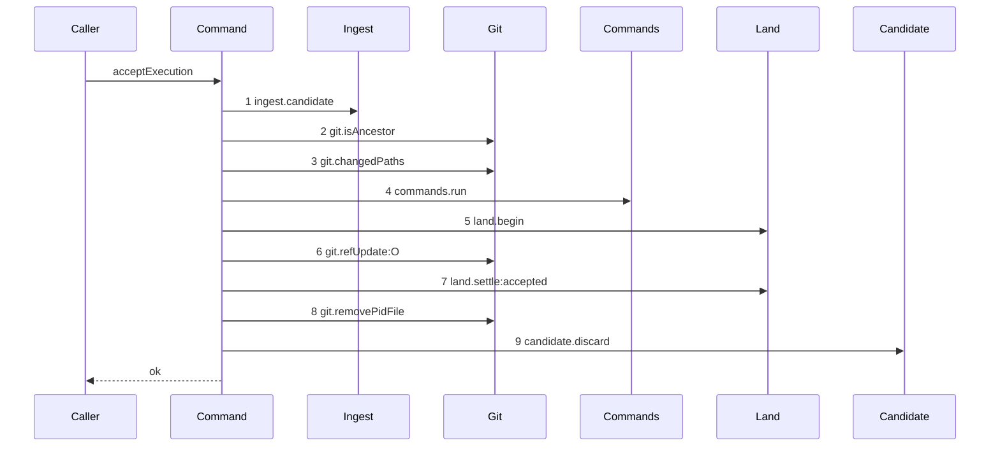

# Story 7 — The gate accepts and writes the checkpoint

Epic: `.agents/plan/epics/051.4-the-acceptance-gate-and-the-report-route.md`
Depends on: Story 6 (`06-the-gate-refuses-a-contended-land`), for the four land steps and the two
projections; EPIC 051.3 Story 4 (`04-the-accepted-settle`), for the accepted arm of `land.settle`,
the `checkpoint` row and the `objective-land-accepted` trigger.
Kind: story-implement

Diagrams: report-execution-checkpoint

Seams: report-execution-checkpoint: +ingest.candidate, +git.isAncestor, +git.changedPaths, +commands.run, +land.begin, +git.refUpdate:O, +land.settle:accepted, +git.removePidFile, +candidate.discard

This story completes `acceptExecution`. Story 8 wires it into `node.report`, and this story's scenario
drives the command directly rather than over the route.

**This story declares a `Seams:` line, and the epic's story list says it declares none.** The epic's
reasoning is that every token was introduced by an earlier story. That reasoning holds over the range
and not over the path: `.agents/plan/authoring.md` decides a sign over the diagram's own prior set,
and this diagram's prior set is empty, so every one of its nine tokens is `+`. The exemption for a
story that only composes covers a diagram whose every step is a nested command, and steps 2, 3, 6 and
8 are direct seam calls of `acceptExecution`. Without the line, the gate finds nine tokens that are
`+` in no story. The amendment is recorded in `index.md`.

## The path

`acceptExecution` is written from nothing, so this diagram has an empty prior set, it draws no
`baseline-` diagram, and every one of its tokens is `+`.

### `report-execution-checkpoint`

Fixture: Story 6's fixture with one change — `refs/heads/objective_a` is still at `commit1`, so the
compare and swap succeeds.



**The drawn set is every branch of this path.** This is the one path of the six gate steps on which
none refuses. Every earlier refusal has its own diagram in Stories 1 to 6, and the swap's other
outcome is Story 6's.

**This diagram differs from Story 6's at step 7 and at the terminal, and nowhere else.** That is its
whole statement: the ordered gate does not change shape when it passes, and the settle's `outcome` is
what separates the two paths. EPIC 051.3 draws each settle's interior as `land-settle-accepted` and
`land-settle-contended`.

**The discard runs on acceptance too.** The epic and `worker.md` section 8 step 2 both state that the
daemon deletes the ref on acceptance, on rejection and on contention.

Add `test/sequence/scenarios/report-execution-checkpoint.ts`.

## Change

### 1 — `src/commands/checkpoint/accept-execution.ts` — the accepted settle

On `swap.updated === true`:

```ts
const settled = await dependencies.land.settle({
  disposition: "accepted",
  journalRowId: begun.journalRowId,
  landedOid: swap.oid,
  actorKind: input.actorKind,
  actorId: input.actorId,
  ...
});
if (settled.clearedToken !== null) {
  await dependencies.git.removePidFile({ pidFile: settled.clearedToken });
}
await dependencies.candidate.discard({ gitDir: input.gitDir, ref });
return settled.result;
```

The settle writes the checkpoint, advances `workspace_branch.head_oid`, closes the attempt as
`accepted`, stamps the run head, ends the run with outcome `done`, raises the fence, records the node
transition and appends `outcome.reported` and `run.ended` — all in one transaction, per
`.agents/plan/stories/051.3-the-checkpoint-and-the-land/04-the-accepted-settle.md:9` — `Seams`. It
returns `{ clearedToken }` and nothing else.

**The accepted settle builds the `NodeReportResult`, and that is an amendment EPIC 051.3 Story 4
(`04-the-accepted-settle`) needs.** `LandSettleResult` at
`.agents/plan/stories/051.3-the-checkpoint-and-the-land/04-the-accepted-settle.md:148` —
`LandSettleResult` is `{ clearedToken: string | null }` today, and nothing in the family builds the
ten-field result `src/commands/outcome/report-outcome.ts:329` — `nodeId` returns. Its
`objectiveProjection` comes from `src/commands/outcome/report-outcome.ts:310` — `readAllNodes`, a read
that must sit inside a transaction, and the accepted settle's transaction is the only one left on this
path: `acceptExecution` opens none, and `reportOutcome`'s prelude closes before the land. The settle
already holds `plan: PlanStore` at
`.agents/plan/stories/051.3-the-checkpoint-and-the-land/04-the-accepted-settle.md:126` — `plan`, so
the read costs it one seam token and no new dependency. `LandSettleResult` therefore becomes
`{ clearedToken: string | null; result: NodeReportResult | null }`, `null` on the contended arm.
**The amendment is recorded in `index.md` and a human applies it before dispatch.**

### 2 — the ordered short-circuit is asserted by a decision table

**The table lives in `src/commands/checkpoint/accept-execution.test.ts`, not in
`src/domain/execution-acceptance.test.ts`.** The epic's Decisions name the second file, and three of
the six conditions are not predicates that module exports: `candidate-unreachable` is decided inside
`ingest.candidate`, `command-failed` inside `commands.run`, and `contended` by the compare and swap. A
pure domain test cannot reach them, so the table drives the real gate. Both files stay in the Proof —
`execution-acceptance.test.ts` is EPIC 051.1's, for the three pure verdicts. The amendment is recorded
in `index.md`.

Every pair of conditions that can trigger at once is one case, and each asserts the earlier
condition's code. A refusal is decided by predicates the recorder cannot see, so
`.agents/plan/authoring.md` puts precedence in a table and not in a diagram.

The six conditions are ordered `candidate-unreachable`, `multi-repository-unsupported`,
`ancestry-broken`, `path-undeclared`, `command-failed`, `contended`, and every pair of them can be
made to hold at once, so the table holds fifteen cases.

### 3 — the ref a worker wrote outside the namespace

The case writes `refs/heads/<objectiveId>` directly before the report, then reports, and asserts the
daemon still lands by compare and swap from the recorded base. **The assertion is that the daemon
ignores the ref, not that the worker cannot write one** — `worker.md` section 11 states no hook stops
it. Where the worker's write moved the objective branch, the swap is contended and the daemon says so;
where it wrote any other ref, nothing changes.

## Constraints

- Steps 1 to 6, 8 and 9 must stay token-identical to Story 6's diagram. A step that appears on one and
  not the other means the gate's shape depends on its outcome, which it must not.
- Open no transaction. `land.begin` and `land.settle` are the two spans gate row 9b counts.
- Remove `settled.clearedToken`, never `begun.pidFile`, and skip the removal when it is `null`.
- Remove the pid file and discard the candidate on this path too. An accepted candidate left in the
  namespace is an object a later report can name.
- Write the decision table over pairs only. A three-way interaction is a separate claim, and this
  epic's refusals do not have one — each is decided by one predicate over values the earlier steps
  already fixed.
- Do not call `objectiveOutcome`, and do not change `src/domain/outcome.ts`. See case 3.

## Verify

```
node --test src/commands/checkpoint/accept-execution.test.ts test/sequence/conformance.test.ts
```

Extend `src/commands/checkpoint/accept-execution.test.ts`.

Add, each as a separate `it`:

1. `"a successful acceptance deletes the candidate ref"` — list `refs/kanthord/candidate/` before and
   after and assert the ref is present before and absent after.

2. `"a successful acceptance moves a task to done under outcome-accepted"` — assert the node state is
   `done` **and** the transition's trigger is `outcome-accepted`, both by value. The epic's gate
   row 10 names the trigger, so the state alone does not discharge it.

3. `"a successful acceptance moves an atomic objective to awaiting_approval under its own trigger"` —
   drive `acceptExecution` against an atomic objective and assert the state is `awaiting_approval` and
   the transition's trigger is `objective-land-accepted`. **It does not reach that state through
   `objectiveOutcome`**: `src/domain/outcome.ts:17` — `objectiveOutcome` takes a `TerminalState`
   projected from the node's children, and an atomic objective holds none, so the land writes the
   constant under its own trigger. Assert the trigger by value, so a later change routing this through
   `objectiveOutcome` fails rather than passing on the matching state. Cases 1, 2 and 3 are the three
   the epic's gate row 10 names.

4. `"a ref the worker wrote outside refs/kanthord/candidate changes no outcome"` — write
   `refs/kanthord/scratch/x` directly, then report, and assert the daemon lands by
   compare and swap from the recorded base: the node reaches `done`, and the `land` double's `execute`
   input carries `baseOid: B`.

5. `"the real land completes its journal row, moves the ref and writes the checkpoint"` — run the real
   `land.begin` and `land.settle` and assert the `merge` journal row is `complete`,
   `refs/heads/objective_a` resolves to the accepted oid, and exactly one `checkpoint` row exists
   naming the run, the attempt and the fence.

6. `"the pid file is removed after an accepted settle"` — assert `git.removePidFile` recorded one call
   whose `pidFile` equals `settled.clearedToken`, that the file existed before the settle and is
   absent after. This is the accepted half of the epic's gate row 9c; Story 6 case 7 is the contended
   half, and row 9c requires both.

7. `"a successful acceptance ends the run and closes the attempt"` — assert the run state is `ended`
   with outcome `done`, the attempt outcome is `accepted`, and the fence rose by exactly one. The
   settle owns all four writes, so this case proves `acceptExecution` adds none of its own.

8. `"the ordered gate reports the earlier of every pair of conditions"` — the decision table over the
   **real gate**, fifteen cases in one `it`, each naming its two conditions and its expected code.
   Assert the count is `15`, so a pair dropped from the table fails rather than passing silently.

9. `"a report reaching no condition lands"` — the control for case 8. Without it the table passes for
   a gate that refuses everything.

Add `test/sequence/scenarios/report-execution-checkpoint.ts`, building the fixture the diagram names,
running the real `acceptExecution` **directly** over real SQLite and the loopback git fixture behind
the recorder — not over the `node.report` route — binding `ingest`, `candidate`, `commands` and `land`
to unrecorded dependencies, and returning the recorder and the result.

`pnpm run verify` exits 0.

Proof: PASS line delivered — `src/commands/checkpoint/accept-execution.test.ts` in
`PASS EPIC-051.4`.
