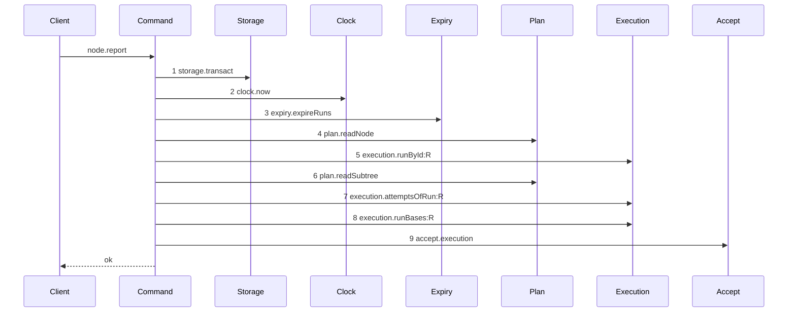

# Story 8 — The report route enforces the gate

Epic: `.agents/plan/epics/051.4-the-acceptance-gate-and-the-report-route.md`
Depends on: Story 7 (`07-the-gate-accepts-and-writes-the-checkpoint`), for the whole gate; EPIC 050.2
Story 6 (`06-the-report-prelude`), for the authority prelude; EPIC 050.4 Story 6
(`06-the-report-drops-the-lease`), for the diagram this one supersedes.
Kind: story-implement

Diagrams: report-checkpoint-gate

Supersedes: EPIC 050.4 report-lease-free

Seams: report-checkpoint-gate: +execution.runBases:R, +accept.execution, -execution.closeAttempt:A, -plan.setNodeState:T:outcome-accepted, -execution.stampRunHead:R, -execution.endRun:R, -events.append:outcome.reported:T, -plan.readAllNodes

This story wires the gate to the wire and maps its refusals. Story 9 puts `repositoryId` and the six
codes on the contract.

**A path EPIC 050.4 already drew has no `baseline-` diagram.** Its prior set is `report-lease-free`,
so this story declares `Supersedes:` where a first change declares `Baselines:`, and the seven
removals are measured over that diagram's tokens.

## The path

### `report-checkpoint-gate`

Supersedes: EPIC 050.4 report-lease-free

Fixture: task `T` running under run `R` with one open attempt `A`, presented by run id and fence, the
report `accepted` with an `objectId` and a `repositoryId`, and every input `acceptExecution` needs
already valid — the candidate ref reaches the reported oid, the base row names the reported
repository, the head descends from the base, the diff touches declared paths only, the one declared
command exits zero, and the objective branch is unmoved. The accepted member is the fixture because it
is the one member this story changes.



**Steps 1 to 6 are the prefix EPIC 050.2 Story 6 (`06-the-report-prelude`) pinned and EPIC 050.4
Story 6 (`06-the-report-drops-the-lease`) reproduced, token for token and in its order.** They are context tokens: the prior diagram holds each at one count and one
label, so no sign of this story governs them.

**Step 7 stays, and it is a context token.** `report-lease-free` holds it, and the accepted arm still
needs it: `acceptExecution` passes `attemptId` and `attemptNo` down — `attemptNo` builds the candidate
ref `refs/kanthord/candidate/<runId>/<attemptNo>` that `ingest.candidate` resolves, and `attemptId` is
a required field of
`.agents/plan/stories/051.3-the-checkpoint-and-the-land/04-the-accepted-settle.md:138` — `attemptId`.
The settle reads the attempt list again for its own accounting; that read is inside it and supplies
nothing to this command before the land.

**`execution.attemptsOfRun:R` is producible.** EPIC 050.2 Story 2 (`02-the-authority-seams`) changes
the recorder to apply a declared projection whatever the argument's type is, and adds an
`execution.attemptsOfRun` entry reading the argument directly. Reasoning from the current recorder,
where a primitive last argument yields a bare token, is reasoning from a pre-prerequisite tree.

**Step 8 is new, and it is here because `acceptExecution` may not open a transaction.**
`.agents/plan/epics/051.4-the-acceptance-gate-and-the-report-route.md:67` — `acceptExecution` gives it
exactly the two spans of `land.begin` and `land.settle`, and gate row 9b asserts the count, so the
`run_base` read belongs in this command's prelude transaction. It supplies `baseOid` and
`baseRepositoryIds` on `AcceptExecutionInput`. Story 2 (`02-the-gate-refuses-a-foreign-repository`)
adds the store method; this story is its one call site.

**`gitDir` is read with raw SQL and draws no step.** The bare home is
`repository.home_path`, and `src/commands/startup/sweep-remnants.ts:35` — `repository` is the shipped
pattern for reading it inside a command; EPIC 051.1 Story 5
(`05-the-candidate-namespace-has-a-reaper`) reproduces it. A raw `transaction.get` is not a call on an
injected capability, so the recorder never sees it.

**The drawn set is every branch of this path that this story changes.** The report union has six
members and the prelude runs for all of them, and only the `accepted` member on an execution node
reaches step 7. The other five keep the tail `report-lease-free` drew, unchanged in the source and
unchanged in their order; they are not a second diagram of this story, because this story changes no
step of them.

**The six removals are removals from this path, not from the file.** `.agents/plan/authoring.md`
fixes a sign relative to the path. `execution.closeAttempt`,
`plan.setNodeState`, `execution.stampRunHead`, `execution.endRun`, `events.append` and
`plan.readAllNodes` all survive in `report-outcome.ts` on the rejected, failed and cancelled arms;
what leaves is the accepted arm's use of them, and `land.settle:accepted` is what now performs the
equivalent writes inside the transaction that writes the checkpoint. Two writers of one effect is the
defect this avoids.

**Step 9 sits outside the transaction of step 1.** `accept.execution` writes git, and `AGENTS.md`
forbids git I/O inside a storage transaction. The prelude's transaction closes before step 9 runs, and
the diagram still holds one `storage.transact` token, which is what the parser requires.

Add `test/sequence/scenarios/report-checkpoint-gate.ts`.

## Change

### 1 — the earlier tree, superseded

`.agents/plan/stories/050.4-the-node-lease-removal/06-the-report-drops-the-lease.md` — its
`### \`report-lease-free\``section gains`Superseded by: EPIC 051.4 report-checkpoint-gate`on the
line after its`Supersedes:` line.

**That edit turns `scripts/verify-epic-sequence.ts` red on its own**, with
`supersession names an epic outside the authored set: EPIC 051.4` at
`scripts/verify-epic-sequence.ts:507` — `supersession names an epic outside the authored set`, because
`scripts/epic-sequence-range.ts:1` — `authoredEpics` ends at `"050.5"`. It therefore lands **after**
Story 9 has extended the range, and Story 9 dispatches first for that reason as well as for the
contract coupling. Verify before editing, and report a divergence rather than re-applying.

Delete `test/sequence/scenarios/report-lease-free.ts` in this story.
`test/sequence/conformance.test.ts:115` — `superseded` refuses a scenario naming a superseded live
diagram, and `test/sequence/conformance.test.ts:72` — `Superseded` treats the diagram as superseded
only once the superseding epic is in `shippedEpics`. So the file must exist while EPIC 050.4 is the
head and must be gone once this epic ships, which is why the deletion is a step of this story and not
an edit to that one. **Its `Add \`test/sequence/scenarios/report-lease-free.ts\`.` line stays**:
deleting it would leave EPIC 050.4 owning a live diagram with no scenario.

### 2 — `src/commands/outcome/report-outcome.ts` — the nested callable and the branch

**`accept` joins the dependency object**, at
`src/commands/outcome/report-outcome.ts:52` — `ReportOutcomeDependencies`, in the shape
`src/commands/outcome/report-outcome.ts:59` — `reportObjective` sets, with one difference: it takes no
transaction.

```ts
accept: {
  execution: (input: AcceptExecutionInput) => Promise<AcceptExecutionResult>;
}
```

The key is `accept` and the method is `execution`, so the diagram token is `accept.execution`. A
function-valued dependency would draw `accept.call`, which
`.agents/plan/authoring.md` refuses outside a `baseline-` id.

**`reportOutcome` becomes `async`.** `src/commands/outcome/report-outcome.ts:103` — `reportOutcome`
returns `ReportOutcomeResult` today and every statement of it sits inside the `storage.transact`
callback opened at `src/commands/outcome/report-outcome.ts:107` — `transact`. `accept.execution`
writes git, so it cannot run inside that callback. Restructure so the callback returns a discriminated
value and the git call runs after it:

```ts
const decided = dependencies.storage.transact((transaction) => {
  // the prelude and every shipped branch, unchanged
  // the accepted-execution branch returns { kind: "accept", input: … }
  // every other branch returns { kind: "done", result: … }
});
if (decided.kind === "accept") {
  return dependencies.accept.execution(decided.input);
}
return decided.result;
```

`Promise<ReportOutcomeResult>` is the new return type.

**The prelude gains three reads, all inside the transaction it already opens.**
`execution.attemptsOfRun(transaction, run.id)` is unchanged and still finds the open attempt;
`execution.runBases(transaction, run.id)` is new and supplies `baseOid` and `baseRepositoryIds`; and a
raw `transaction.get("SELECT home_path FROM repository WHERE id = ?", [repositoryId])` supplies
`gitDir`. The raw read follows `src/commands/startup/sweep-remnants.ts:35` — `repository` and draws no
step, because it is not a call on an injected capability.

**The accepted branch is taken after the authority check and nowhere earlier.** The stale-fence
refusal must precede every git read, and `assertRunAuthority` is pure and runs inside the transaction,
so a report with a stale fence reaches no `Git` method.

**The six calls the accepted arm stops making.** Each survives for the other arms; only the accepted
path stops reaching it:
`src/commands/outcome/report-outcome.ts:234` — `closeAttempt`,
`src/commands/outcome/report-outcome.ts:258` — `setNodeState`,
`src/commands/outcome/report-outcome.ts:270` — `stampRunHead`,
`src/commands/outcome/report-outcome.ts:275` — `endRun`,
`src/commands/outcome/report-outcome.ts:291` — `append`,
`src/commands/outcome/report-outcome.ts:310` — `readAllNodes`.

**What replaces the data each removed call supplied.** `land.settle:accepted` of EPIC 051.3 Story 4
(`04-the-accepted-settle`) writes the checkpoint, advances `workspace_branch.head_oid`, closes the
attempt, stamps the run head, ends the run, records the node transition and appends `outcome.reported`
and `run.ended`, all in the transaction that writes the checkpoint, and it returns the
`NodeReportResult` that `src/commands/outcome/report-outcome.ts:329` — `nodeId` builds today. Story 7
(`07-the-gate-accepts-and-writes-the-checkpoint`) states that amendment to EPIC 051.3 Story 4
(`04-the-accepted-settle`) and `index.md` records it: `LandSettleResult` gains
`result: NodeReportResult | null`, built from a `plan.readAllNodes` inside the settle's own
transaction, which is the only one left on this path. `attemptId`, `attemptNo` and
`attemptsRemaining` come from that value, and no caller of `reportOutcome` reads any other field of
the removed calls. `src/commands/outcome/report-outcome.ts:241` — `accountAttempts` and
`src/commands/outcome/report-outcome.ts:247` — `taskReportEffect` are pure and stay for the other four
arms; the accepted arm stops calling them.

**Add the six refusal codes to `ReportOutcomeRefusal`** at
`src/commands/outcome/report-outcome.ts:79` — `ReportOutcomeRefusal`, and rethrow an
`AcceptExecutionError` as a `ReportOutcomeError` carrying its `refusal` and its `details` unchanged.

**Add `repositoryId` to the `accepted` member** of
`src/commands/outcome/report-outcome.ts:26` — `accepted`, so the command's body union matches the
schema Story 9 writes.

### 3 — `src/http/server/node/report-node.ts` — the handler keeps one key

`src/http/server/node/report-node.ts:11` — `ReportNodeHandlerDependencies` keeps exactly one key. Its
type becomes `(input: ReportOutcomeInput) => Promise<ReportOutcomeResult>` at
`src/http/server/node/report-node.ts:12` — `reportOutcome`, and the call at
`src/http/server/node/report-node.ts:32` — `reportOutcome` gains an `await`. The handler is already
`async`. **Add no second key**: a handler parses, calls exactly one command and formats, and a second
injected command is the defect the epic's gate row 13 exists to catch.

### 4 — `src/http/server/node/refusals.ts` — map the six codes

`src/http/server/node/refusals.ts:67` — `reportOutcomeRefusal` gains six branches, each
`httpError(<code>, error.message, error.details)`. Every one of the six is a 409, and
`src/http/contract/errors.ts:41` — `PreconditionCode` makes a `details` argument mandatory for a 409,
so each branch passes the `details` its throw site built. Story 9 adds the codes to `errorStatuses`;
until it lands, `httpError` refuses an unknown code and this story's edit does not compile — so
Story 9 dispatches with this one, per `index.md`.

### 5 — `src/main.ts` — bind the nested command

`src/main.ts:301` — `boundReportOutcome` becomes `async` and its dependency literal at
`src/main.ts:306` — `storage` gains `accept: { execution: boundAcceptExecution }`, with
`boundAcceptExecution` constructed above it in the shape
`src/main.ts:292` — `boundReportObjective` sets. The handler binding at
`src/main.ts:535` — `node.report` keeps its one key.

## Constraints

- Reproduce steps 1 to 6 token for token from `report-lease-free`. A token that differs with no sign
  covering it is a stale copy in this story, and the fix is this diagram, never the prior one.
- The handler's dependency record holds exactly one key. Do not inject `acceptExecution` into the
  handler.
- `accept.execution` runs after the transaction commits. A git write inside `storage.transact` holds
  the write lock across git I/O.
- The five non-accepted members keep the shipped tail unchanged, in the source and in its order. This
  story deletes no line of it.
- Keep the prelude's refusal order. The stale-fence refusal precedes every git read, and moving the
  accepted branch earlier would break that.
- Do not touch `errorStatuses` or `exitCodes`. Story 9 owns both.

## Verify

```
node --test src/commands/outcome/report-outcome.test.ts src/http/server/node/report-node.test.ts test/sequence/conformance.test.ts
```

Extend `src/commands/outcome/report-outcome.test.ts`, suite at
`src/commands/outcome/report-outcome.test.ts:558` — `describe`, whose driver is
`src/commands/outcome/report-outcome.test.ts:315` — `ReportInput` and whose fixture is
`src/commands/outcome/report-outcome.test.ts:185` — `createReportFixture`. Extend
`src/http/server/node/report-node.test.ts`, whose harness is
`src/http/server/node/report-node.test.ts:48` — `buildApp`.

Add, each as a separate `it`:

1. `"reportOutcome receives acceptExecution as an injected callable"` — substitute a recording double
   for `accept.execution`, report `accepted`, and assert it recorded exactly one call whose input
   deep-equals the run id, the attempt number, the reported oid, the reported repository, the declared
   paths and the declared commands, by value.

2. `"the report handler's dependency record holds exactly one key"` — assert
   `Object.keys(dependencies)` deep-equals `["reportOutcome"]`. Asserted by value: a second command on
   the handler is the defect this case exists to catch.

3. `"the node.report route refuses a stale fence before any git read"` — post a report whose
   `runFence` is stale and assert the refusal, then assert the `Git` double's total call count is `0`.
   The control is case 5, where the same double records calls.

4. `"a stale-fence report leaves the database byte-identical"` — `databaseBytes` at
   `test/helpers/database.ts:117` — `databaseBytes`, deep-equal before and after. The refusal diagram
   proves no write seam is reached; this proves the operation wrote nothing.

5. `"each of the six refusal codes is reachable over the real route"` — six cases in one `it`, one per
   code, each driving the real route to the state that produces it, asserting the HTTP status is `409`
   and `response.body.error.code` by value. Assert the count is `6`.

6. `"a rejected, a failed and a cancelled report keep the shipped tail"` — assert the recorded seam
   order for each is the shipped one, and assert `accept.execution` recorded zero calls.

7. `"an accepted report reaches none of the six tail calls, and reads the attempts once"` — assert the
   recorder's counts for `closeAttempt`, `setNodeState`, `stampRunHead`, `endRun`, `append` and
   `readAllNodes` are each `0` on the accepted arm, and that `attemptsOfRun` records exactly `1`. Case
   6 is its control on the other three arms.

8. `"an accepted report returns what acceptExecution returned"` — assert the response body
   deep-equals the double's return value, so `reportOutcome` builds no second projection.

9. `"every shipped report case still passes"` — carry the file's twenty-one cases across, `await`ing
   the now-async command and adding `repositoryId` to each accepted body.

10. `"the composition root binds acceptExecution into reportOutcome"` — assert `main.ts`'s handler
    record for `node.report` still holds one key, and drive the built daemon so an accepted report
    reaches the real `acceptExecution`. Without this case the `src/main.ts` edit has no proof.

11. `"report-lease-free has no scenario file"` — assert
    `test/sequence/scenarios/report-lease-free.ts` does not exist, that
    `06-the-report-drops-the-lease.md` holds `Superseded by: EPIC 051.4 report-checkpoint-gate`, and
    that this story holds the matching `Supersedes:`. The three assertions the epic's gate row 23
    names, in one case.

Add `test/sequence/scenarios/report-checkpoint-gate.ts`, building the fixture the diagram names,
running the real `reportOutcome` over real SQLite and the loopback git fixture behind the recorder,
binding `accept`, `expiry`, `reportObjective` and `closeObjective` to unrecorded dependencies, and
returning the recorder and the result.

`pnpm run verify` exits 0.

Proof: PASS line delivered — `src/commands/outcome/report-outcome.test.ts` and
`src/http/server/node/report-node.test.ts` in `PASS EPIC-051.4`.
