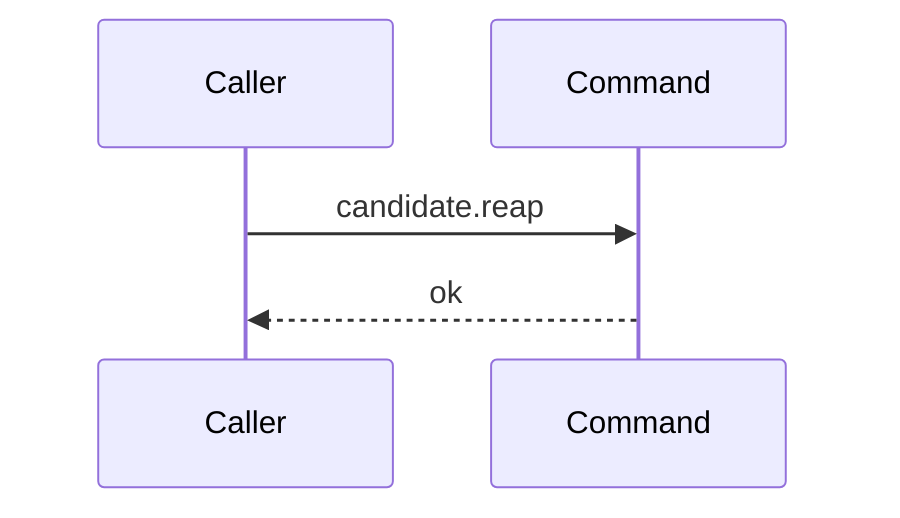

# Story 3 — An expiry pass that ended no run reaps nothing

Epic: `.agents/plan/epics/051.5-the-targeted-post-expiry-candidate-cleanup.md`
Depends on: Story 1 (`01-the-expired-run-is-a-domain-type`), for `ExpiredRun` in `src/domain/run.ts`
and `candidateRunPrefix`; Story 2 (`02-the-run-base-home-is-one-read`), for
`execution.runBaseHomes`; Story 10 (`10-the-conformance-harness-admits-an-incremental-supersession`),
for `"051.5"` in `authoredEpics`, without which `scripts/verify-epic-sequence.ts` refuses this
epic's scenario file.
Kind: story-implement

Diagrams: reap-candidates-no-expired-run

This story writes the command and the empty-input path. Story 4
(`04-an-ended-run-with-no-candidate-ref-reaches-no-deletion`) draws the listing path and adds the
unresolved-home finding; Story 5 (`05-an-ended-runs-candidate-ref-is-deleted`) adds the deletion and
the other three finding buckets.

**This story declares no `Seams:` line, and that is not an omission.** Its diagram holds zero steps,
so it holds zero tokens, and `.agents/plan/authoring.md` declares a sign per token. A `Seams:` line
here would name nothing.

## The path

`reapRunCandidates` is written from nothing, so this diagram has an empty prior set and draws no
`baseline-` diagram.

### `reap-candidates-no-expired-run`

Fixture: `reapRunCandidates` called with `expired` equal to `[]`. Nothing is seeded, because the
early return reads nothing.



**The drawn set is every branch of the empty-input path.** The input list is either empty or not; this
diagram is the first branch and Stories 4 and 5 draw the second.

**A diagram with no step is the strongest statement available**, per `.agents/plan/authoring.md`. It
asserts the path reaches no seam at all, so any call the implementation makes on `storage`,
`execution`, `git` or `candidate` fails the comparison. Declaring `Storage`, `Execution`, `Git` or
`Candidate` as a participant here would be legal syntax and a weaker claim; the two declared
participants are the ends, which `test/helpers/sequence-conformance.ts:172` — `sequenceEnds` exempts
from the dependency-key check.

Add `test/sequence/scenarios/reap-candidates-no-expired-run.ts`.

## Change

**Create `src/commands/checkpoint/reap-run-candidates.ts`.** The directory is created by EPIC 051.1
Story 4 (`04-the-candidate-ref-is-deleted`); this file is a new `verb-noun.ts` in it exporting one
`verbNoun`.

### 1 — the contract

```ts
export type ReapFindingCode =
  | "reap-read-failed"
  | "reap-home-unresolved"
  | "reap-list-failed"
  | "reap-discard-failed";

export type ReapFinding = Readonly<{
  code: ReapFindingCode;
  runId: string | null;
  ref: string | null;
  detail: string;
}>;

export type ReapRunCandidatesResult = Readonly<{
  deleted: readonly string[];
  findings: readonly ReapFinding[];
}>;

type CandidateDiscard = Readonly<{
  discard(input: Readonly<{ gitDir: string; ref: string }>): Promise<void>;
}>;

export type ReapRunCandidatesDependencies = Readonly<{
  storage: Storage;
  execution: Execution;
  git: Git;
  candidate: CandidateDiscard;
}>;

export async function reapRunCandidates(
  dependencies: ReapRunCandidatesDependencies,
  expired: readonly ExpiredRun[],
): Promise<ReapRunCandidatesResult>;
```

Four decisions are fixed here and are not the implementer's:

- **`ReapFinding` is this command's own type, not `src/domain/recovery.ts:31` — `RecoveryFinding`.**
  That union's `step` is a startup-recovery step and its `repositoryId` is the axis a namespace sweep
  reports on. This command's axis is the run, it runs at claim time and not at startup, and it never
  learns a repository id — `execution.runBaseHomes` returns a home path and no id.
- **`runId` and `ref` are both nullable, and each finding fills the ones it knows.** The read failure
  knows neither, the home and list failures know the run, and the discard failure knows both. One
  shape with two nullable fields lets every bucket be asserted by whole-object equality.
- **`candidate` is a locally declared structural type**, because
  `eslint.config.js:174` — `boundaries/dependencies` defaults to `disallow` and lists no
  command-to-command policy, so `CandidateDiscard` of EPIC 051.1 cannot be imported here. This is the
  same duplication `src/commands/run/expire-runs.ts:12` — `ExecutionExpiry` already carries, and
  `candidate` is an **object with a method** and never a function-valued key:
  `test/helpers/sequence-conformance.ts:113` — `typeof` returns a function dependency unwrapped, so a
  function would record no token and the reap step could never be observed.
- **`execution` and `git` are the full service interfaces**, which
  `eslint.config.js:221` — `command` permits, matching the shape EPIC 051.1 Story 8
  (`08-the-candidate-namespace-is-enumerated`) gives `sweepCandidates`.

### 2 — the empty-input early return

The first statement of the body:

```ts
if (expired.length === 0) return { deleted: [], findings: [] };
```

**The zero-work decision lives here and in no caller.** A caller that guarded on
`expired.length > 0` would duplicate it and give the conformance runner two traces for one claim path,
which is why the epic's gate row 14 asserts the call is unconditional.

### 3 — the read and the listing

After the early return:

```ts
const homes = dependencies.storage.transact((transaction) =>
  dependencies.execution.runBaseHomes(
    transaction,
    expired.map((run) => run.runId),
  ),
);
const homesByRun = new Map<string, string[]>();
for (const home of homes) {
  const list = homesByRun.get(home.runId) ?? [];
  list.push(home.homePath);
  homesByRun.set(home.runId, list);
}

for (const run of expired) {
  for (const gitDir of homesByRun.get(run.runId) ?? []) {
    await dependencies.git.listRefs({
      gitDir,
      prefix: candidateRunPrefix(run.runId),
    });
  }
}

return { deleted: [], findings: [] };
```

**The group is a list of homes per run, never one home per run.** Story 2
(`02-the-run-base-home-is-one-read`) rules that `execution.runBaseHomes` does not dedupe, because
`run_base` declares `PRIMARY KEY (run_id, repository_id)` and permits two rows for one run. A
`Map<string, string>` would collapse them silently and keep whichever row sorted last, which
contradicts that ruling and would leave the ref in the other home forever. Iterating every home
listed for the run is the only reading that does not lose one. `src/domain/run.ts:32` — `baseCount`
bounds an execution run to one base row, so the second home is an invalid state the reap reports
rather than hides — and the drawn fixture holds exactly one home per run, so the diagram's
`git.listRefs:candidate` token stays unique.

**The loop walks `expired`, never `homes`.** The caller's list arrives in the bytewise run-id order
`src/services/execution/sqlite.ts:156` — `Buffer.compare` produces, so walking it makes the git call order
reproducible and gives a run with no base row a position of its own. Walking `homes` would drop that
run silently and would order the calls by a second key.

**One transaction, and no git call inside it.** The `transact` callback returns the rows and closes;
every `await` is below it. Two transactions would make this a journaled write, and it has no journal
row. `AGENTS.md` `### Rules the import matrix cannot express` exempts a best-effort git deletion on
six conditions, and this command satisfies all six at every call site this epic wires: eligibility is
the committed `state = 'ended'` the expiry pass wrote, a failure leaves a ref, and
`candidate.sweep` at startup is guaranteed to retry it.

**The list is not bound and no ref is deleted yet.** Story 4 binds it and adds the unresolved-home
finding; Story 5 adds the discard.

## Constraints

- Return before `storage.transact` on an empty list. A transaction opened and immediately closed
  still emits `storage.transact`, and the diagram refuses it.
- Open exactly one transaction, and open it after the early return.
- Call no git method inside the `transact` callback.
- Do not insert `"051.5"` into `authoredEpics` here, and do not insert it in Story 10 either. The
  entry is already applied, and Story 10 now verifies it rather than adding it. See `index.md`.
- Do not append an event. `run.expired` already records the ending inside the expiry transaction, and
  an event after the commit would sit in a second transaction with no journal row.
- Do not add a `try`/`catch` and do not push a finding. Stories 4 and 5 own the buckets, and a `catch`
  with no bucket swallows a fault.
- Wire nothing into `src/main.ts`. The command has no caller until Story 6
  (`06-the-branch-base-claim-reaps`) binds `candidate.reap` there, and a binding added here is dead
  code.
- Do not read `repository` with raw SQL. `execution.runBaseHomes` is the seam, and a second read would
  add a token the diagrams do not hold.

## Verify

```
node --test src/commands/checkpoint/reap-run-candidates.test.ts test/sequence/conformance.test.ts
```

Create `src/commands/checkpoint/reap-run-candidates.test.ts`, suite name
`"src/commands/checkpoint/reap-run-candidates.test"`. Build real SQLite with
`test/helpers/database.ts:32` — `createMigratedStorage`, seed with
`test/helpers/rows.ts:21` — `seedRegistry` and `test/helpers/rows.ts:102` — `seedGraph`, and dispose
with `t.after(() => fixture.dispose())`. The transaction double is modelled on
`src/commands/project/create-project.test.ts:59` — `transactionSpy`.

Add, each as a separate `it`:

1. `"an empty expired list opens no transaction and calls no git method"` — wrap `storage` in a double
   whose `transact` increments a counter, and `git` in a double whose every member increments one
   shared counter. Call `reapRunCandidates(dependencies, [])` and assert the result deep-equals
   `{ deleted: [], findings: [] }`, the transaction counter is `0` and the git counter is `0`. In the
   **same** case, seed one run with a base row, call it again with a one-run list, and assert the
   transaction counter is `1` and the git counter is `1`. The second half is the control: without it
   both zeros pass for a command nothing ever calls.

2. `"a one-run list reads the base home and lists that run's namespace"` — assert the recorded
   `git.listRefs` input deep-equals
   `{ gitDir: "<the seeded home_path>", prefix: "refs/kanthord/candidate/<the run id>/" }`, by value.
   The prefix is what binds `candidateRunPrefix` to the call.

3. `"the transaction closes before the first git call"` — one shared log; the `storage` double pushes
   `"transact:enter"` and `"transact:exit"` around the callback, and the `git` double pushes
   `"listRefs"`. Assert the log deep-equals `["transact:enter", "transact:exit", "listRefs"]` for a
   one-run fixture.

4. `"a run with no base row reaches no git call"` — one run, no `run_base` row. Assert the git counter
   is `0` and the result deep-equals `{ deleted: [], findings: [] }`. The control is case 2's run,
   which is listed.

5. `"the reap writes no row"` — snapshot `test/helpers/database.ts:117` — `databaseBytes` before and
   after a one-run reap and assert deep equality. **The control is a nearby forbidden write**: in the
   same case, insert one `run_base` row inside a `storage.transact` and assert the two snapshots now
   differ. Without it the equality passes for a `databaseBytes` that reads a constant.

Add `test/sequence/scenarios/reap-candidates-no-expired-run.ts`. It is a default-exported `async`
function that wraps `{ storage, execution, git, candidate }` with
`test/helpers/sequence-conformance.ts:99` — `recordSeams`, binds `candidate` to the real
`discardCandidate` over the **unrecorded** `git`, awaits `reapRunCandidates(recorder.dependencies, [])`
and returns `{ recorder, result }`. Build the storage with
`test/helpers/database.ts:32` — `createMigratedStorage` and dispose it in a `finally`; seed no row,
because the early return reads none. The storage is built anyway, so the recorder carries its four
dependency keys and the zero-token claim is made against the real objects rather than against a
dependency set that holds none.

`pnpm run verify` exits 0.

Proof: PASS line delivered — `src/commands/checkpoint/reap-run-candidates.test.ts` in
`PASS EPIC-051.5`.
