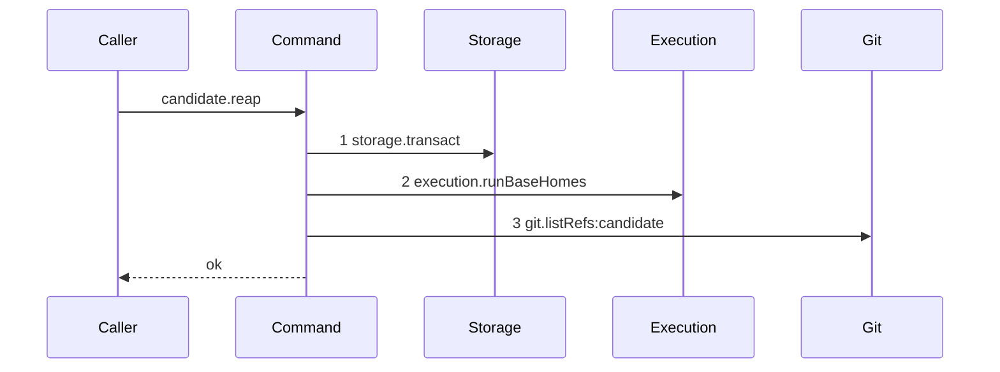

# Story 4 — An ended run with no candidate ref reaches no deletion

Epic: `.agents/plan/epics/051.5-the-targeted-post-expiry-candidate-cleanup.md`
Depends on: Story 3 (`03-an-expiry-pass-that-ended-no-run-reaps-nothing`), which writes the command,
the one transaction and the listing loop this story draws.
Kind: story-implement

Diagrams: reap-candidates-no-ref

Seams: reap-candidates-no-ref: +storage.transact, +execution.runBaseHomes, +git.listRefs:candidate

This story draws the listing path and adds the unresolved-home finding. Story 5
(`05-an-ended-runs-candidate-ref-is-deleted`) adds the deletion and the other three buckets.

## The path

`reapRunCandidates` is written from nothing, so this diagram has an empty prior set, draws no
`baseline-` diagram, and every one of its three tokens is `+`.

### `reap-candidates-no-ref`

Fixture: one repository, the bare home of a private `cpSync` copy of
`test/helpers/remote/seed.ts:124` — `seedRepositories`, holding **no** ref under
`refs/kanthord/candidate/`. One run, `state = 'ended'`, with one `run_base` row on that repository.
`expired` holds that one run. **The fixture states one ended run**, because a second would emit
`git.listRefs:candidate` twice and `test/helpers/sequence-conformance.ts:284` — `duplicate` refuses a
repeated token; case 5 asserts the longer list instead.



**The drawn set is every branch of the non-empty-input path whose namespace holds no ref.** One ended
run resolves a home or it does not; a resolved home lists refs or lists none. This diagram is the
resolved-and-empty branch and Story 5 draws the resolved-and-non-empty branch.

**The unresolved-home branch is carried by cases 3 and 4 and by no diagram, and its seam set is a
strict prefix of this one rather than the same set.** It stops one step earlier, at
`execution.runBaseHomes`, and never reaches step 3. The epic rules it at
`.agents/plan/epics/051.5-the-targeted-post-expiry-candidate-cleanup.md:36` — `fourth`, and the
standard supplies the reason: it is the branch a guard adds, and
`.agents/plan/authoring.md:327` — `guard` rules such a branch is proven by a case, **because drawing
it would give this story a second live diagram** — which
`scripts/verify-epic-sequence.ts:487` — `two` refuses. The same rule puts Story 5's four finding
buckets in cases and in no diagram. Do not draw it, and do not read the prefix relation as a licence
to skip a branch whose seam set genuinely diverges.

**`Candidate` is not a participant.** The namespace holds no ref, so the deletion is never reached,
and declaring the key would weaken the claim from "no discard exists on this path" to "no discard was
drawn".

**The token is `git.listRefs:candidate` and not a per-run label.** The projection maps every ref
under `refs/kanthord/candidate/` to `candidate`, so a per-run prefix collapses to the namespace and
one ended run yields one unique token.

Add `test/sequence/scenarios/reap-candidates-no-ref.ts`.

## Change

### 1 — `src/commands/checkpoint/reap-run-candidates.ts` — bind the listing and report an unresolved home

Replace the loop body Story 3 wrote:

```ts
const findings: ReapFinding[] = [];

for (const run of expired) {
  const gitDir = homeByRun.get(run.runId);
  if (gitDir === undefined) {
    findings.push({
      code: "reap-home-unresolved",
      runId: run.runId,
      ref: null,
      detail: `no run_base row resolves a home for ${run.runId}`,
    });
    continue;
  }
  const refs = await dependencies.git.listRefs({
    gitDir,
    prefix: candidateRunPrefix(run.runId),
  });
  void refs;
}

return { deleted: [], findings };
```

`void refs;` is deleted by Story 5, which consumes the list. It is here so this story's edit compiles
without an unused binding and without a deletion the diagram does not draw.

**`detail` is a fixed sentence and not an error message.** No exception is caught on this arm — the
run simply has no base row — so there is nothing to stringify, and gate row 7 asserts the finding by
whole-object equality.

**A structural run is the ordinary producer of this finding, and it is correct.** A structural worker
submits a graph patch and creates no commit, so it pushes no candidate and holds no `run_base` row.
`execution.runBaseHomes` returns no row for it, the reap lists nothing, and the deletion count stays
zero. That is why this story carries the structural case rather than a fourth diagram: its seam set is
this diagram's minus step 3.

### 2 — the `git.listRefs` projection

The diagram's third token needs `git.listRefs` to project its `prefix`.
`test/helpers/sequence-conformance.ts:50` — `projections` holds no `git` entry today, and two
unshipped stories disagree about which shape lands:
`.agents/plan/stories/051.1-the-candidate-and-the-git-primitives/04-the-candidate-ref-is-deleted.md:129` —
`git.listRefs` declares `refNamespace(input, "prefix", context)`, while
`.agents/plan/stories/051-the-workspace-branch/06-the-first-execution-claim.md:242` — `refNamespace`
asks EPIC 051.1 to alias its candidate refs by value instead.

Read the shipped table and take exactly one of these three, in this order:

1. `projections` already holds `"git.listRefs"` returning `refNamespace(input, "prefix", context)` —
   change nothing, and the scenario needs no alias.
2. `projections` already holds `"git.listRefs"` returning `field(input, "prefix", context)` — change
   nothing, and the scenario's alias map maps the fixture's prefix value
   `refs/kanthord/candidate/<the run id>/` to `candidate`.
3. `projections` holds no `"git.listRefs"` entry — add
   `"git.listRefs": (input, context) => [field(input, "prefix", context)],` beside the
   `execution.*` rows, and use the alias map of option 2.

Option 3 uses `field` and not `refNamespace`, so it lands whether or not EPIC 051.1 shipped the
namespace helper, and it introduces no table row a later epic must reconcile.

## Constraints

- Push the unresolved-home finding and **continue**. A `throw` here would stop every later run, and
  the epic rules that a failure on one run never stops a later run.
- Reach no `candidate.discard` on this path. Story 5 adds it, and this diagram's absence of the token
  is what proves the empty listing deletes nothing.
- Keep the one transaction and the single `runBaseHomes` call. A per-run read would emit
  `execution.runBaseHomes` twice, and the parser refuses the repeat.
- Do not change the empty-input early return of Story 3.
- Add no `RecoveryFinding` step value. `ReapFinding` is this command's own type.
- Do not add a `refNamespace` helper. Options 1 to 3 above are the whole decision, and none of them
  introduces one.

## Verify

```
node --test src/commands/checkpoint/reap-run-candidates.test.ts test/sequence/conformance.test.ts
```

Extend `src/commands/checkpoint/reap-run-candidates.test.ts`. The private bare home is a `cpSync`
copy of `test/helpers/remote/seed.ts:124` — `seedRepositories`, its `home_path` written onto the
seeded `repository` row, and the `Git` is built through `src/services/git/binary.ts:24` —
`createBinaryGit`. Seed the base row with `seedRunBase` of Story 2
(`02-the-run-base-home-is-one-read`).

Add, each as a separate `it`:

1. `"one ended run with an empty namespace opens one transaction, lists once and deletes nothing"` —
   assert the transaction count is `1`, the recorded `git.listRefs` inputs deep-equal
   `[{ gitDir: "<the copied bare home>", prefix: "refs/kanthord/candidate/<the run id>/" }]`, and a
   `candidate.discard` call counter is `0`. **The control for that zero is a second reap in the same
   case**, over the same doubles, against a run whose namespace holds one ref, asserting the counter
   rises to `1`. The listing count alone is not the control: it proves the command enumerates, and
   says nothing about whether the discard spy would register a deletion if one happened. Story 5 adds
   the deletion, so until then this control drives the spy through the real listing and asserts the
   spy itself works — order the two halves so the empty-namespace reap runs first.

2. `"the listed prefix is the run's own namespace and not the whole one"` — seed a second ended run
   with a base row on the same home, reap both, and assert the two recorded prefixes deep-equal
   `["refs/kanthord/candidate/<run a>/", "refs/kanthord/candidate/<run b>/"]` in bytewise run-id
   order. Neither is `refs/kanthord/candidate/`, which is the control against a global sweep.

3. `"a structural expired run reaches the base read and no listing, and returns one finding"` — one
   expired run with **no** `run_base` row, in a list with one execution run that has one. Assert
   `execution.runBaseHomes` recorded exactly one call carrying **both** run ids, the recorded
   `git.listRefs` inputs have length `1` and name the execution run's prefix, and `result.findings`
   deep-equals
   `[{ code: "reap-home-unresolved", runId: "<the structural run id>", ref: null, detail: "no run_base row resolves a home for <the structural run id>" }]`.
   The execution run is the control for the skip.

4. `"an unresolved home does not stop a later run"` — order the same two runs so the structural one
   sorts first, and assert the execution run was still listed. Without this the skip could be a
   short-circuit.

5. `"a list of three ended runs lists three namespaces in bytewise run id order"` — the longer list
   the drawn fixture cannot hold. Assert the three recorded prefixes by value, in order.

6. `"the reap over an empty namespace writes no row"` — snapshot
   `test/helpers/database.ts:117` — `databaseBytes` before and after and assert deep equality. **The
   control is a nearby forbidden write**: in the same case, update the run's `outcome` inside a
   `storage.transact` and assert the two snapshots now differ.

Add `test/sequence/scenarios/reap-candidates-no-ref.ts`, building the one-repository, one-ended-run,
no-ref fixture the diagram names, running the real `reapRunCandidates` over real SQLite and the
private bare home behind `test/helpers/sequence-conformance.ts:99` — `recordSeams`, binding
`candidate` to the real `discardCandidate` over the **unrecorded** `git`, aliasing the run id and —
under options 2 and 3 of `## Change` step 2 — the candidate prefix to `candidate`, and returning
`{ recorder, result }`. Dispose the fixture in a `finally`.

`pnpm run verify` exits 0.

Proof: PASS line delivered — `src/commands/checkpoint/reap-run-candidates.test.ts` in
`PASS EPIC-051.5`.
