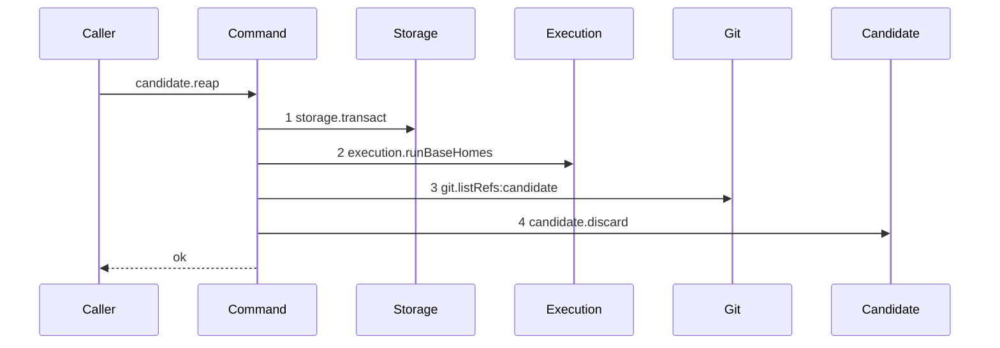

# Story 5 — An ended run's candidate ref is deleted

Epic: `.agents/plan/epics/051.5-the-targeted-post-expiry-candidate-cleanup.md`
Depends on: Story 4 (`04-an-ended-run-with-no-candidate-ref-reaches-no-deletion`), for the listing
loop, the `git.listRefs` projection and the unresolved-home finding.
Kind: story-implement

Diagrams: reap-candidates-one-ref

Seams: reap-candidates-one-ref: +storage.transact, +execution.runBaseHomes, +git.listRefs:candidate, +candidate.discard

This story completes `reapRunCandidates`. Story 6 (`06-the-branch-base-claim-reaps`) is its first
caller.

## The path

`reapRunCandidates` is written from nothing, so this diagram has an empty prior set, draws no
`baseline-` diagram, and every one of its four tokens is `+`.

### `reap-candidates-one-ref`

Fixture: Story 4's fixture with one change — `refs/kanthord/candidate/<the run id>/1` exists in the
bare home. **One ended run and one ref**, because a second ref of the same run would emit
`candidate.discard` twice and `test/helpers/sequence-conformance.ts:284` — `duplicate` refuses a
repeated token; cases 2 and 3 assert the multi-ref and multi-run lists instead.



**The drawn set is every branch of the non-empty-input path whose namespace holds a ref.** This
diagram and Story 4's differ at step 4 and nowhere else, and that is the whole statement: the read and
the listing do not change shape when there is something to delete. The four finding buckets are not
branches of the drawn path — each returns the same terminal and reaches a prefix of these four steps —
so cases 4 to 9 carry them and no diagram does.

**This diagram proves no seam is reached after the discard. It does not prove the ref is gone.** Case
1 carries that, by listing the namespace before and after against the loopback fixture.

Add `test/sequence/scenarios/reap-candidates-one-ref.ts`.

## Change

### 1 — `src/commands/checkpoint/reap-run-candidates.ts` — the deletion

Delete `void refs;` of Story 4 and replace it with the inner loop, and add the `deleted` accumulator
beside `findings`:

```ts
const deleted: string[] = [];
```

```ts
for (const ref of refs) {
  await dependencies.candidate.discard({ gitDir, ref });
  deleted.push(ref);
}
```

It sits **inside** the per-home loop of Story 3
(`03-an-expiry-pass-that-ended-no-run-reaps-nothing`), so `gitDir` is the home those refs were listed
from. A run based on two repositories therefore has each home's refs deleted against that home.

The final statement becomes `return { deleted, findings };`, and `deleted` holds the refs in the order
the deletions happened — the run order of `expired`, and within one run the order
`git.listRefs` returned, which
`.agents/plan/stories/051.1-the-candidate-and-the-git-primitives/01-the-five-git-primitives.md:180` —
`--sort=refname` fixes to refname order and never to the file system's.

**It calls `candidate.discard`, never `git.deleteRef`.** `candidate.discard` is the only caller of the
primitive, which keeps `git.deleteRef:candidate` in one diagram of the family.

### 2 — the four finding buckets

Each failure is a finding and never a throw. Add one helper and three `try` blocks.

```ts
function detailOf(error: unknown): string {
  return error instanceof Error ? error.message : String(error);
}
```

**The read failure** wraps the transaction of Story 3 and returns immediately, because no run id is
known and every later step needs the homes:

```ts
let homes: readonly RunBaseHome[];
try {
  homes = dependencies.storage.transact((transaction) =>
    dependencies.execution.runBaseHomes(
      transaction,
      expired.map((run) => run.runId),
    ),
  );
} catch (error) {
  return {
    deleted: [],
    findings: [
      {
        code: "reap-read-failed",
        runId: null,
        ref: null,
        detail: detailOf(error),
      },
    ],
  };
}
```

**The listing failure** ends that run and continues to the next:

```ts
let refs: readonly string[];
try {
  refs = await dependencies.git.listRefs({
    gitDir,
    prefix: candidateRunPrefix(run.runId),
  });
} catch (error) {
  findings.push({
    code: "reap-list-failed",
    runId: run.runId,
    ref: null,
    detail: detailOf(error),
  });
  continue;
}
```

**The discard failure** ends that ref and continues to the next ref of the same run:

```ts
for (const ref of refs) {
  try {
    await dependencies.candidate.discard({ gitDir, ref });
    deleted.push(ref);
  } catch (error) {
    findings.push({
      code: "reap-discard-failed",
      runId: run.runId,
      ref,
      detail: detailOf(error),
    });
  }
}
```

`reap-home-unresolved` is Story 4's, unchanged.

**`push` after the `await`, never before it.** A ref pushed onto `deleted` before the discard resolves
would be reported deleted on the arm that throws.

**Three `try` blocks and no fourth.** The command has no outer `try`, and it has no `finally`:
`.agents/plan/stories/051.2-the-command-gate/index.md:98` — `finally` rules that a `finally` discards
the exception it wrapped, and a bucket per failure site is what makes each one nameable.

**The caller discards the value.** The return exists so each bucket is asserted by value rather than
by absence, which is what gate row 9 requires.

### 3 — the reap is total, and the type says so

`reapRunCandidates` returns `Promise<ReapRunCandidatesResult>` and rejects on nothing this epic can
produce. The three `try` blocks cover every `await` and the one transaction, and no other statement
can throw: `homeByRun.get` is a map read, `candidateRunPrefix` is pure, and `expired.map` walks a
frozen list.

## Constraints

- Never throw. Every failure is a finding, and gate row 9 asserts `reapRunCandidates` throws in none
  of the four injections.
- A failure on one run never stops a later run, and a failure on one ref never stops a later ref of
  the same run. `continue`, never `break` and never `return`, except on `reap-read-failed`.
- `reap-read-failed` returns `{ deleted: [], findings: [one] }`. Nothing was deleted before the read,
  so `deleted` is empty by construction and not by accident.
- Keep the one transaction. The three buckets add no `storage.transact`.
- Keep the empty-input early return and the loop over `expired`.
- Append no event, and write no row.
- Do not widen `ReapFindingCode`. Four codes, and a fifth is a later epic's.

## Verify

```
node --test src/commands/checkpoint/reap-run-candidates.test.ts test/sequence/conformance.test.ts
```

Extend `src/commands/checkpoint/reap-run-candidates.test.ts`. Push a candidate ref into the private
bare home with `git update-ref` through `src/services/git/run.ts:49` — `createGitRunner`, and list the
whole namespace with `git.listRefs({ gitDir, prefix: CANDIDATE_REF_PREFIX })` for the before-and-after
assertions.

Add, each as a separate `it`:

1. `"the candidate ref of an ended run is deleted and another run's ref is left"` — push
   `refs/kanthord/candidate/<run a>/1` and `refs/kanthord/candidate/<run b>/1`, reap `[run a]` alone,
   and assert the whole namespace deep-equals both refs before and
   `["refs/kanthord/candidate/<run b>/1"]` after, and that `result.deleted` deep-equals
   `["refs/kanthord/candidate/<run a>/1"]`. Run b's ref is the control for the per-run prefix.

2. `"every attempt of one ended run is deleted in one pass"` — push attempts `1`, `2` and `10` of one
   run, reap it, and assert `result.deleted` deep-equals
   `["refs/kanthord/candidate/<run a>/1", "refs/kanthord/candidate/<run a>/10", "refs/kanthord/candidate/<run a>/2"]`
   — refname order, not numeric — and the namespace is empty after. The expiry knows no attempt
   number, so this is the proof the per-run prefix collects them all.

3. `"two ended runs are deleted in bytewise run id order"` — one ref each, reap both, and assert
   `result.deleted` deep-equals the two refs in run-id order.

4. `"a failing base read returns one reap-read-failed finding and deletes nothing"` — a `storage`
   double whose `transact` throws `new Error("read refused")`. Assert `result` deep-equals
   `{ deleted: [], findings: [{ code: "reap-read-failed", runId: null, ref: null, detail: "read refused" }] }`
   and that the call resolved rather than rejected, and assert the git call counter is `0`.

5. `"a failing listing returns one reap-list-failed finding naming the run"` — a `git` double whose
   `listRefs` throws `new Error("list refused")`. Assert `result.findings` deep-equals
   `[{ code: "reap-list-failed", runId: "<the run id>", ref: null, detail: "list refused" }]` and
   `result.deleted` deep-equals `[]`.

6. `"a failing discard returns one reap-discard-failed finding naming the ref"` — a `candidate` double
   whose `discard` throws `new Error("discard refused")`. Assert `result.findings` deep-equals
   `[{ code: "reap-discard-failed", runId: "<the run id>", ref: "refs/kanthord/candidate/<the run id>/1", detail: "discard refused" }]`,
   `result.deleted` deep-equals `[]`, and the ref still resolves in the bare home.

7. `"a failed run does not stop a later run"` — two ended runs **whose base rows name two different
   repositories**, so their homes are distinct paths, and a `git` double whose `listRefs` throws only
   for the first run's `gitDir`. Assert `result.findings` has length `1` naming the first run and
   `result.deleted` deep-equals the second run's ref. The two homes must differ: with both runs based
   on one repository the double rejects both listings, and the case would pass for a command that
   stops at the first failure.

8. `"a failed ref does not stop a later ref of the same run"` — two attempts of one run, the
   `candidate` double throwing only for attempt `1`. Assert `result.findings` has length `1` naming
   attempt `1` and `result.deleted` deep-equals `["refs/kanthord/candidate/<the run id>/2"]`.

9. `"the reap throws in none of the four injections"` — the control for cases 4 to 8. Run the four
   injections in one case, each wrapped so a rejection fails the case, and assert the four returned
   `findings[0].code` values deep-equal
   `["reap-read-failed", "reap-home-unresolved", "reap-list-failed", "reap-discard-failed"]`. Assert
   the count is `4`, so a bucket dropped from the set fails rather than passing silently.

10. `"the transaction span closes before every deletion"` — one shared log; the `storage` double
    pushes `"transact:enter"` and `"transact:exit"` around the callback and records one span per
    `transact` call, and the `candidate` double pushes the deletion ordinal. Assert the span list has
    length `1` and the deletion ordinal list is non-empty **first**, then assert every deletion
    ordinal falls after the index of `"transact:exit"` in the shared log.

11. `"a run that is active is not in the input, so the snapshot race does not exist here"` — the
    closure of the window
    `.agents/plan/stories/051.1-the-candidate-and-the-git-primitives/08-the-candidate-namespace-is-enumerated.md:178` —
    `snapshot` delegates here. Assert `reapRunCandidates` reads no `run.state` and no active set: read
    `src/commands/checkpoint/reap-run-candidates.ts` with `fs.readFileSync` and assert it holds
    neither the substring `"active"` nor `"state"`. The control is the substring `"runBaseHomes"`,
    which the same read finds. The input is a list of runs the expiry pass already committed as
    `ended`, so no member of it can become active, and the command needs no liveness check.

Add `test/sequence/scenarios/reap-candidates-one-ref.ts`, building the one-repository, one-ended-run,
one-ref fixture the diagram names, running the real `reapRunCandidates` over real SQLite and the
private bare home behind `test/helpers/sequence-conformance.ts:99` — `recordSeams`, binding
`candidate` to the real `discardCandidate` over the **unrecorded** `git` so its `git.deleteRef` emits
no token, aliasing the run id and the candidate prefix as Story 4's scenario does, and returning
`{ recorder, result }`. Dispose the fixture in a `finally`.

`pnpm run verify` exits 0.

Proof: PASS line delivered — `src/commands/checkpoint/reap-run-candidates.test.ts` in
`PASS EPIC-051.5`.
