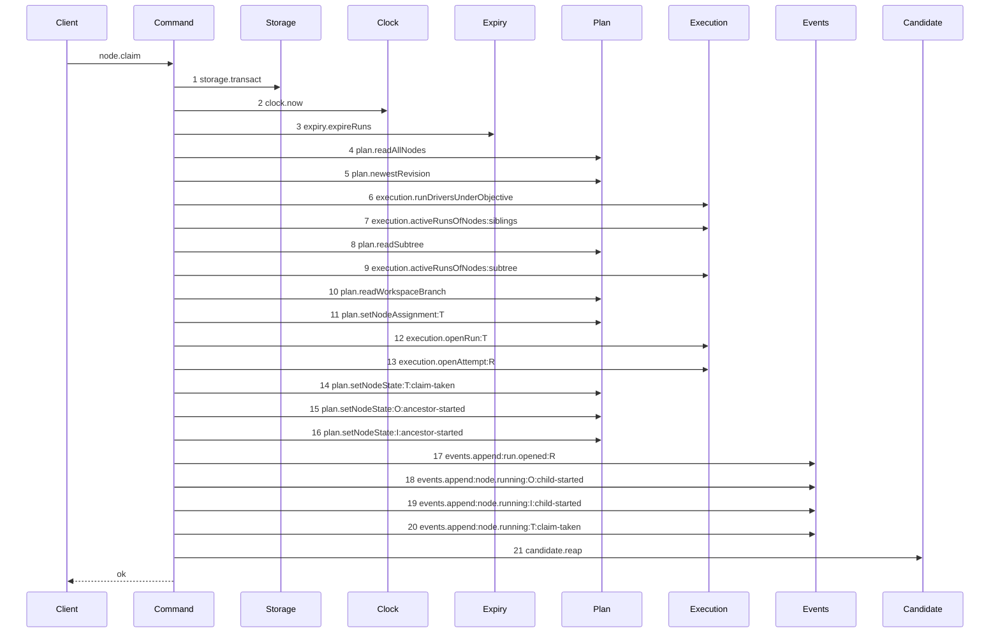

# Story 6 — The branch-base claim reaps

Epic: `.agents/plan/epics/051.5-the-targeted-post-expiry-candidate-cleanup.md`
Depends on: Story 5 (`05-an-ended-runs-candidate-ref-is-deleted`), for the finished command;
Story 10 (`10-the-conformance-harness-admits-an-incremental-supersession`), whose per-diagram
supersession is what lets this story swap one scenario and stay green; EPIC 051 Story 3
(`03-the-claim-reads-the-workspace-head`), whose diagram this supersedes, and EPIC 051 Story 4
(`04-the-claims-begin`), whose `ClaimBegunClaimed` this story widens.
Kind: story-implement

Diagrams: claim-branch-base-reap

Seams: claim-branch-base-reap: +candidate.reap

This story wires the reap onto the record-present arm and binds `candidate.reap` in `src/main.ts`.
Story 7 (`07-the-first-execution-claim-reaps`) wires the cut arm, and Story 8
(`08-the-initiative-claim-reaps`) proves the empty-list call.

## The path

`claim-branch-base-task` is EPIC 051's diagram, so this path has **no `baseline-` diagram**: its prior
set is that live diagram, and this story declares `Supersedes:` where a first change declares
`Baselines:`.

### `claim-branch-base-reap`

Supersedes: EPIC 051 claim-branch-base-task

Fixture: the fixture of `claim-branch-base-task`, plus one due run. Initiative `I` holds objective
`O`, which holds tasks `T` and `S`. Every node is `ready`, no node is assigned, and `T` declares
`deliverable: implementation`, so the run kind is `execution` and the cascade covers `O` and `I`. One
`workspace_branch` row exists on `O` with `origin_oid` and `head_oid` both at the loopback fixture's
`commit1`, so the record read returns a row and the claim stays one transaction. **One further run is
`state = 'active'` with `expires_at` at or before `now`, on a node outside this claim's subtree, and
it carries one `run_base` row**, so the expiry pass ends exactly one run and the reap has one run to
resolve.



**The drawn set is every branch of the record-present execution claim that ends `ok`.** EPIC 051
Story 3 fixed that set for the twenty steps and this story adds one step to every one of them. The
record-absent branch is Story 7's, the initiative branch is Story 8's, and each refusal of this path
stops inside step 1's transaction and reaches no step 21.

**This diagram differs from `claim-branch-base-task` at step 21 and nowhere else.** Steps 1 to 20 are
context tokens: their count, their labels and their order are unchanged, so no story declares them.

**Step 21 sits outside the transaction step 1 opened.** The whole of steps 1 to 20 is the
`claimBegin` body, which returns when the record read finds a row, and the transaction commits with
that return. `candidate.reap` is git I/O and `AGENTS.md` forbids git I/O inside a storage
transaction, so it cannot be anywhere but after the commit — which is also what condition 6 of the
six-condition exemption requires, because the claim has settled its own outcome by then.

**`Candidate` becomes a participant because `candidate` becomes a dependency key.**
`test/helpers/sequence-conformance.ts:105` — `dependencyKeys` reads `Object.keys(dependencies)` at
construction, so the participant is admitted by the widened dependency type and needs no harness
change.

Add `test/sequence/scenarios/claim-branch-base-reap.ts`, and delete **both**
`test/sequence/scenarios/claim-branch-base-task.ts` and
`test/sequence/scenarios/claim-lease-free-initiative.ts`. Step 5 of `## Change` says why the second
deletion belongs here and not to Story 8.

## Change

### 1 — `src/commands/node/claim-node.ts` — the `candidate` dependency

Add one key to `ClaimNodeDependencies`, and its structural type beside
`src/commands/node/claim-node.ts:75` — `Expiry`:

```ts
export type CandidateReap = Readonly<{
  reap(expired: readonly ExpiredRun[]): Promise<unknown>;
}>;
```

```ts
candidate: CandidateReap;
```

**The return type is `Promise<unknown>`, and that is deliberate.**
`eslint.config.js:221` — `command` allows a command to import `domain/` and a service interface and
never another command, so `ReapRunCandidatesResult` is unnameable here. The claim discards the value,
so `unknown` states exactly what the claim knows. This is the same shape
`src/commands/node/claim-node.ts:79` — `unknown` carried for the expiry result before Story 1
(`01-the-expired-run-is-a-domain-type`) moved `ExpiredRun` into the domain — and `ExpiredRun` is now
nameable, so the **argument** is typed and only the result is not.

**`candidate` is an object with a method, never a function-valued key.**
`test/helpers/sequence-conformance.ts:113` — `typeof` returns a function dependency unwrapped, so a
function would record no token and step 21 could never be observed.

**Beware the local name.** `candidate` is the lambda parameter of roughly fifteen array predicates in
this file, at `src/commands/node/claim-node.ts:150` — `candidate` among others. Do not rename any of
them, and do not shadow `dependencies.candidate`; every reap reads it through `dependencies.`.

### 2 — `claimBegin` carries the runs its transaction ended

**This is an amendment to EPIC 051 Story 4 (`04-the-claims-begin`), and a human ratifies it before
dispatch.** `.agents/plan/stories/051-the-workspace-branch/04-the-claims-begin.md:138` —
`ClaimBegunClaimed` and
`.agents/plan/stories/051-the-workspace-branch/04-the-claims-begin.md:143` — `ClaimBegunCut` carry no
expiry result, and
`.agents/plan/stories/051-the-workspace-branch/04-the-claims-begin.md:171` — `claimed` returns
`{ kind: "claimed", result }` from inside the transaction. The expiry pass is step 3 of every claim
diagram and therefore runs inside `claimBegin`, so `claimNode` cannot see the list unless
`claimBegin` returns it. Both variants gain one member:

```ts
  expired: readonly ExpiredRun[];
```

`claimBegin` binds `src/commands/node/claim-node.ts:147` — `expireRuns` as
`const expired = dependencies.expiry.expireRuns(transaction, { now });` and puts it on both returns.
The seam trace does not move: the call already happens at step 3, and binding a return value is not a
message.

**The alternative is worse and is not taken.** Reading the ended runs back after the commit would add
a second transaction and a seam token to every claim path, and no committed column identifies _which_
pass ended a run.

### 3 — the reap on the record-present arm

`claimNode`'s body becomes:

```ts
const begun = claimBegin(dependencies, input);
if (begun.kind === "claimed") {
  await dependencies.candidate.reap(begun.expired);
  return begun.result;
}
```

**This is a second reap call site, and the epic's one-source-line ruling is not violated.** That
ruling governs the contended and accepted arms of the **cut** path, which Story 7 wires on one line
below the settle. The record-present arm returns from a different place, and `claim-branch-base-task`
and `claim-lease-free-initiative` both take it, so it needs its own statement. Two call sites, three
paths, and each path reaches exactly one — which is what the three diagrams assert.

**The reap is `await`ed before the return, not after it.** A floating promise would let the claim
resolve while the deletion is in flight, and the diagram would record step 21 at an ordinal the
harness cannot fix — `test/helpers/sequence-conformance.ts:132` — `tokens` pushes at invocation, so
an unawaited call still emits its token but its effect would outlive the operation.

**It is a plain statement, and never a `try`/`finally`.**
`.agents/plan/stories/051.2-the-command-gate/index.md:98` — `finally` rules that a `finally` discards
the exception it wrapped. The reap throws nothing by construction — Story 5 makes it total — so
nothing needs catching.

### 4 — `src/main.ts` — bind `candidate.reap`

The `node.claim` binding gains one key:

```ts
  candidate: {
    reap: (expired) =>
      reapRunCandidates(
        {
          storage,
          execution,
          git,
          candidate: {
            discard: (input) => discardCandidate({ git }, input),
          },
        },
        expired,
      ),
  },
```

`src/main.ts` is the only place that names an implementation, and this is where `candidate.reap` is
bound to Story 5's command and its inner `candidate.discard` to EPIC 051.1 Story 4's
(`04-the-candidate-ref-is-deleted`). **The root binds the callable; the command decides the moment.**

### 5 — one statement changes two traces, so this story retires two scenarios

`claim-branch-base-task` is not the only diagram that runs through the `begun.kind === "claimed"`
return. `claim-lease-free-initiative` of EPIC 050.4 Story 2
(`02-the-claim-of-an-initiative-drops-the-lease`) takes the same arm: an initiative claim reads no
workspace branch and never reaches the cut. **Step 3's statement therefore adds a thirteenth step to
that path too, in this story.**

Its scenario cannot stay. `"050.4"` is shipped, and under Story 10's rule
(`10-the-conformance-harness-admits-an-incremental-supersession`)
`claim-lease-free-initiative` is superseded only once `claim-initiative-reap.ts` exists — which Story
8 (`08-the-initiative-claim-reaps`) adds. Left in place, the runner would replay a twelve-step trace
against a thirteen-step claim and this story could not keep its `pnpm run verify` promise.

**Delete `test/sequence/scenarios/claim-lease-free-initiative.ts` here.** Story 10's third
supersession clause — a predecessor whose own scenario file is already gone is retired — is what makes
the deletion legal before its replacement lands. Story 8 adds `claim-initiative-reap.ts`, and between
the two stories that path has no conformance coverage and nothing is red; case 3 of Story 8 and gate
row 16 close it.

### 6 — every live claim scenario gains the `candidate` key

`ClaimNodeDependencies` gains a required member, so **every scenario that builds one stops type
checking until it carries `candidate`.** At this point in the range the live, due scenarios that build
that object are `claim-branch-base-task` and `claim-lease-free-initiative` — both deleted above —
`claim-first-execution`, which Story 7 (`07-the-first-execution-claim-reaps`) replaces, and
**`claim-lease-free-objective-busy` of EPIC 050.4 Story 3
(`03-the-objective-busy-refusal-drops-the-lease`), which this epic supersedes not at all.**

Add `candidate` to `test/sequence/scenarios/claim-lease-free-objective-busy.ts` and to
`test/sequence/scenarios/claim-first-execution.ts`, bound to the real `reapRunCandidates` over
unrecorded dependencies, exactly as this story's own scenario binds it.

**Neither trace moves.** The `objective-busy` sibling refusal throws from inside the transaction, at
`src/commands/node/claim-node.ts:303` — `ClaimNodeError`, so it returns through neither arm and reaches
no reap; `claim-first-execution`'s tail changes in Story 7 and not here. Adding a recorded dependency
key emits no token by itself: `test/helpers/sequence-conformance.ts:105` — `dependencyKeys` only widens
the admissible participant set. Case 8 asserts both traces are unchanged.

`claim-cut-begin`, `claim-cut-settle` and `claim-cut-settle-contested` drive `claimBegin` and
`claimSettle` rather than `claimNode`, so they build no `ClaimNodeDependencies` and need no edit —
except that `claim-cut-begin`'s result now carries `expired`, which changes no token.

### 7 — the test helper gains an overridable `candidate`

`src/commands/node/claim-node.test.ts:216` — `ClaimInput` gains
`candidate?: CandidateReap;`, and `src/commands/node/claim-node.test.ts:228` — `claim` passes
`candidate: input.candidate ?? { reap: async () => ({ deleted: [], findings: [] }) }`. Every existing
case of that suite flows through this one choke point and must keep passing untouched, so the default
is a Fake that returns the safe empty result. A case that names a value passes a Mock.

`src/commands/node/claim-node.test.ts:228` — `claim` also becomes `async` and returns
`Promise<ClaimNodeResult>`, because EPIC 051 Story 6 (`06-the-first-execution-claim`) already made
`claimNode` asynchronous; `src/commands/node/claim-node.test.ts:280` — `refused` follows.

## Constraints

- Steps 1 to 20 must stay token-identical to `claim-branch-base-task`. A step that appears on one and
  not the other means the claim's shape depends on the reap, which it must not.
- Call the reap **unconditionally** on this arm. Do not guard it on `begun.expired.length > 0`; the
  zero-work decision lives in the command, and gate row 14 asserts the unconditional call.
- Do not call the reap inside the `claimBegin` transaction, and do not open a second transaction in
  `claimNode`.
- Add `expired` to **both** variants of the `claimBegin` result. The cut variant needs it for
  Story 7, and a member on one variant only forces a narrowing at the call site.
- Do not put the expired list on `ClaimNodeResult`. That type is a wire response.
- Do not change `ExpireRunsDependencies`, `expireRuns` or `expireDueRuns`. `expireRuns` names no
  `Git`, takes the caller's transaction and stays synchronous.
- Delete `test/sequence/scenarios/claim-branch-base-task.ts` **and**
  `test/sequence/scenarios/claim-lease-free-initiative.ts` in this story, not later. Both
  `Superseded by:` lines are already applied, at
  `.agents/plan/stories/051-the-workspace-branch/03-the-claim-reads-the-workspace-head.md:26` —
  `Superseded` and
  `.agents/plan/stories/050.4-the-node-lease-removal/02-the-claim-of-an-initiative-drops-the-lease.md:21` —
  `Superseded`, and one statement changes both traces.
- Do not delete `test/sequence/scenarios/claim-lease-free-objective-busy.ts`. That diagram is
  superseded by nothing in this epic; it is widened, not retired.
- Do not touch `.agents/plan/stories/051-the-workspace-branch/03-the-claim-reads-the-workspace-head.md`.
  A human applied its `Superseded by:` line, and `scripts/lane-check.sh` denies the plan tree to both
  engineers.

## Verify

```
node --test src/commands/node/claim-node.test.ts test/sequence/conformance.test.ts
```

Extend `src/commands/node/claim-node.test.ts`, suite `"src/commands/node/claim-node.test"`, building
through `src/commands/node/claim-node.test.ts:100` — `createClaimFixture` and seeding with
`src/commands/node/claim-node.test.ts:125` — `seedReadyFixture`. `expiry` in that suite already
delegates to the **real** `expireRuns` over the backed execution fake, so seeding a due `run` row runs
a real expiry pass and needs no expiry double. Seed the due run with the column list at
`test/sequence/scenarios/expiry-pass-one-due.ts:25` — `INSERT`, its base row with `seedRunBase`, and
its candidate ref into a private `cpSync` copy of
`test/helpers/remote/seed.ts:124` — `seedRepositories`.

Add, each as a separate `it`:

1. `"a claim whose expiry pass ended one run deletes that run's candidate ref"` — seed the due run,
   its `run_base` row and `refs/kanthord/candidate/<the due run>/1`, claim `T`, and assert the result
   is a `ClaimNodeResult` whose `node.state` is `"running"`, that the due run's row is `state =
'ended'`, and that the ref is present before the claim and absent after. This is the runtime half of
   the deletion `.agents/plan/stories/050.1-the-claim/02-the-expiry-pass.md:98` — `Do` delegates.

2. `"the reap runs after the claim's transaction commits"` — a `storage` double recording spans, and a
   `candidate` Mock recording the ordinal at which `reap` was called against one shared log. Assert
   the span list has length `1`, the log's `"transact:exit"` precedes `"reap"`, and both are present.

3. `"expireRuns calls no git method inside the claim's transaction"` — a `git` double whose every
   member increments one shared counter, read once inside the `transact` callback through the
   `storage` double and once after `claimNode` resolves. Assert the in-span reading is `0` and the
   after reading is greater than `0`. The reap's own git calls are the control: without them the zero
   passes for a double nothing ever calls.

4. `"the reap receives the runs the pass ended, by value"` — a `candidate` Mock recording its
   argument. Assert the recorded argument deep-equals
   `[{ runId: "<the due run id>", nodeId: "<its node id>", fence: <its fence + 1> }]`. This is what
   binds `claimBegin`'s new `expired` member to the reap.

5. `"a claim whose expiry pass ended two runs reaps both in bytewise run id order"` — two due runs.
   Assert the recorded argument's `runId` values deep-equal the two ids in bytewise order, which is
   the order `src/services/execution/sqlite.ts:156` — `Buffer.compare` fixes.

6. `"the reap names no run this claim opened"` — assert the recorded reap argument holds no entry
   whose `runId` equals the id of the run the claim just opened, and — the control — that it does hold
   the due run's id. The new run is `active`, so the expiry pass cannot have ended it, and this case
   is what proves the reap acts on ended runs alone.

7. **the composition root binds every claim dependency** — a build-only check, and not an `it`. Run
   `pnpm run typecheck` from the repository root and require exit 0. That is what proves `src/main.ts`
   supplies the new `candidate` key and that every live claim scenario carries it:
   `ClaimNodeDependencies` is a `Readonly<>` with no optional member, so a missing binding is a type
   error at each call site. **Do not write this as a test that shells out to `node --test` over the
   file it lives in** — such a case re-enters the runner and spawns itself. It is work the loop runs as
   a build check, and the epic's `Gates:` line runs the same command over the whole tree.

8. `"widening the claim dependency moves no trace of an untouched claim path"` — replay
   `test/sequence/scenarios/claim-lease-free-objective-busy.ts` and
   `test/sequence/scenarios/claim-first-execution.ts` after step 6's edit and assert
   `assertConformance` passes for both, so their recorded token lists are byte-identical to the
   diagrams EPIC 050.4 and EPIC 051 drew. The control is this story's own scenario, whose list gained
   exactly one token; without it both passes would be consistent with a recorder that emits nothing.

Add `test/sequence/scenarios/claim-branch-base-reap.ts`, building the fixture the diagram names,
running the real `claimNode` over real SQLite and the real loopback bare repository behind
`test/helpers/sequence-conformance.ts:99` — `recordSeams`, binding `expiry` to unrecorded dependencies
exactly as `test/sequence/scenarios/claim-success-task.ts:81` — `expiry` does, binding `candidate` to
the real `reapRunCandidates` over the **unrecorded** `storage`, `execution` and `git` so its interior
produces no token, spreading `registry` back in unrecorded, and returning `{ recorder, result }`.
Dispose the fixture in a `finally`. Delete
`test/sequence/scenarios/claim-branch-base-task.ts` and
`test/sequence/scenarios/claim-lease-free-initiative.ts`, and add the `candidate` key to
`test/sequence/scenarios/claim-lease-free-objective-busy.ts` and
`test/sequence/scenarios/claim-first-execution.ts`.

`pnpm run verify` exits 0.

Proof: PASS line delivered — `src/commands/node/claim-node.test.ts` in `PASS EPIC-051.5`.
