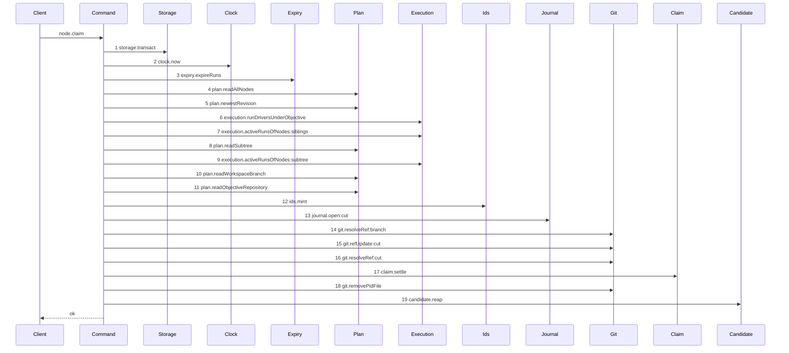

# Story 7 — The first execution claim reaps

Epic: `.agents/plan/epics/051.5-the-targeted-post-expiry-candidate-cleanup.md`
Depends on: Story 6 (`06-the-branch-base-claim-reaps`), for the `candidate` dependency key, the
`expired` member on the `claimBegin` result and the `src/main.ts` binding; EPIC 051 Story 6
(`06-the-first-execution-claim`), whose diagram this supersedes, and EPIC 051 Story 7
(`07-the-loser-of-two-first-claims-refuses`), whose settle returns rather than throws.
Kind: story-implement

Diagrams: claim-first-execution-reap

Seams: claim-first-execution-reap: +candidate.reap

This story wires the reap onto the cut arm. Story 9
(`09-the-contended-cut-reaps-before-it-refuses`) proves the contended arm reaches the same nineteen
steps and still refuses.

## The path

`claim-first-execution` is EPIC 051's diagram, so this path has **no `baseline-` diagram**: its prior
set is that live diagram, and this story declares `Supersedes:`.

### `claim-first-execution-reap`

Supersedes: EPIC 051 claim-first-execution

Fixture: the fixture of `claim-first-execution`, plus one due run. Initiative `I` holds objective `O`,
which holds tasks `T` and `S`; every node is `ready`; **no `workspace_branch` row exists**; repository
`repo_a` is the loopback bare repository whose `refs/heads/main` stands at `commit1` and which holds no
`refs/heads/objective_a`, so the create-only swap wins and the settle accepts. **One further run is
`state = 'active'` with `expires_at` at or before `now`, on a node outside this claim's subtree, and it
carries one `run_base` row**, so the begin's expiry pass ends exactly one run.



**The drawn set is every branch of the record-absent execution claim that ends `ok`.** Once the begin
returns `kind: "cut"` the composed path has exactly two outcomes: the settle returns a record, which is
this diagram, or it returns `{ disposition: "contended" }` and the command refuses. The refusing arm
reaches the **same nineteen steps in the same order** — only the settle's own interior and the terminal
differ — so under `.agents/plan/authoring.md` it is not a second diagram. That is the ruling
`.agents/plan/stories/051-the-workspace-branch/06-the-first-execution-claim.md:22` — `same` made for
the eighteen-step version, and this story extends it by one step. Story 9 asserts it.

**This diagram differs from `claim-first-execution` at step 19 and nowhere else.** Steps 1 to 18 are
context tokens.

**Step 19 sits after the second transaction commits, and after the pid file is removed.** `claim.settle`
at step 17 is the claim's second and last transaction; it commits with the settle's return.
`git.removePidFile` at step 18 already sits outside it, and the reap follows on the same footing —
git I/O with no journal row, on a deletion whose eligibility is the committed `state = 'ended'` the
begin wrote.

Add `test/sequence/scenarios/claim-first-execution-reap.ts`, and delete
`test/sequence/scenarios/claim-first-execution.ts`.

## Change

### 1 — `src/commands/node/claim-node.ts` — one statement, after the guard block

The tail of `claimNode` becomes:

```ts
const settled = dependencies.claim.settle({
  begun,
  observedOid,
  actorId: input.actorId,
  actorKind: input.actorKind,
});
if (settled.clearedToken !== null) {
  await dependencies.git.removePidFile({ pidFile: settled.clearedToken });
}
await dependencies.candidate.reap(begun.expired);
```

Three placements are fixed here and none is the implementer's:

- **The reap statement follows the `if (settled.clearedToken !== null)` block, not the
  `removePidFile` line inside it.** `.agents/plan/stories/051-the-workspace-branch/06-the-first-execution-claim.md:119` —
  `settle` guards the pid removal on a non-null token, and a reap placed inside that block would not
  run on the arm where the token is `null`. Gate row 14 asserts the call is unconditional.
- **The reap precedes the refusal Story 9 adds.** Nothing has to be caught to reach it: the settle
  raises nothing and returns `{ disposition: "contended" }`, and the composed command throws after the
  settle returns. Story 9 inserts the raise **below** this statement, so both arms reach it on one
  source line.

**A throw between the begin and the settle reaps nothing, and that is what condition 6 requires.** A
git failure at step 15 or a `null` at step 14 or step 16 leaves the `cut` journal row `open`, so the
claim's logical outcome is not settled and `AGENTS.md` `### Rules the import matrix cannot express`
forbids the deletion. Placing the reap after the guard block is what excludes those arms; a `finally`
would have reaped inside them. EPIC 051 Story 8 (`08-startup-reconciles-an-open-cut-row`) reconciles the
row and `candidate.sweep` sweeps the ref, so the residue is bounded and temporary.

### 2 — nothing else moves

`claimBegin` already carries `expired` on the cut variant, from Story 6
(`06-the-branch-base-claim-reaps`). The `candidate` dependency key, its type and the `src/main.ts`
binding are Story 6's. This story adds one statement and one scenario file, and deletes one.

## Constraints

- Steps 1 to 18 must stay token-identical to `claim-first-execution`.
- One statement, unguarded, after the `clearedToken` block. Not inside it, not inside a `try`, not
  inside a `finally`.
- Do not `await` `claim.settle`. The epic's snippet writes
  `await dependencies.claim.settle(…)`; the type EPIC 051 Story 6 declares at
  `.agents/plan/stories/051-the-workspace-branch/06-the-first-execution-claim.md:119` — `settle` is
  `(input: ClaimSettleInput) => ClaimSettleResult`, synchronous. No case owns this, because an
  `await` on a synchronous value changes no recorded token and no observable order; report the epic
  snippet rather than following it.
- Do not move `git.removePidFile`, and do not remove its `null` guard.
- Do not add the `objective-busy` raise here. Story 9 owns it, and adding it early would put a refusal
  on a path this diagram ends `ok`.
- Do not reap on the arms that leave the `cut` journal row `open`. There is nothing to do for this:
  those arms throw above the settle, so they never reach the statement. Do not add a `catch` that
  would.
- Reap `begun.expired`, never a list read back from the database. No committed column identifies which
  pass ended a run.
- Delete `test/sequence/scenarios/claim-first-execution.ts` in this story. Its `Superseded by:` line at
  `.agents/plan/stories/051-the-workspace-branch/06-the-first-execution-claim.md:31` — `Superseded` is
  already applied, so Story 10's per-diagram rule supersedes that diagram the moment
  `claim-first-execution-reap.ts` exists.
- Do not touch `.agents/plan/stories/051-the-workspace-branch/06-the-first-execution-claim.md`.

## Verify

```
node --test src/commands/node/claim-node.test.ts test/sequence/conformance.test.ts
```

Extend `src/commands/node/claim-node.test.ts`. The fixture deletes the `workspace_branch` row so the
claim takes the cut path, and the bare home is a private `cpSync` copy of
`test/helpers/remote/seed.ts:124` — `seedRepositories`.

Add, each as a separate `it`:

1. `"a first execution claim deletes the candidate ref of the run its begin expired"` — seed the due
   run, its base row and its candidate ref, claim `T` over the cut path, and assert the result is a
   `ClaimNodeResult`, `refs/heads/objective_a` resolves to `commit1`, and the due run's ref is present
   before and absent after.

2. `"the reap runs after the settle's transaction commits and after the pid file is removed"` — one
   shared log: the `storage` double pushes `"transact:enter"` and `"transact:exit"`, the `git` double
   pushes `"removePidFile"`, and the `candidate` Mock pushes `"reap"`. Assert the log's last three
   entries deep-equal `["transact:exit", "removePidFile", "reap"]`, and that exactly two spans were
   recorded.

3. `"a claim whose reap returns only findings still resolves and still opened the run"` — a `git`
   double whose `listRefs` rejects, so the real `reapRunCandidates` returns one `reap-list-failed`
   finding and no deletion. Assert `claimNode` resolves to its `ClaimNodeResult`, the new `run` row
   exists and is `active`, the node reached `running`, and the due run's candidate ref is **still
   present**. Case 1 is the control: without it the "still resolves" passes for a reap that never ran.

4. `"a reap that rejects would fail this case, and it does not"` — bind `candidate.reap` to a Mock that
   returns a rejected promise, and assert `claimNode` **rejects** with that error. This is the control
   for case 3: it proves case 3's resolution comes from the command being total, not from the claim
   swallowing a rejection. The production reap never rejects, which Story 5 case 9 proves.

5. `"the reap is reached on the arm where the settle cleared no token"` — a `claim.settle` Mock
   returning `clearedToken: null`. Assert `git.removePidFile` recorded zero calls and the
   `candidate.reap` Mock recorded exactly one. This is what proves the statement sits after the guard
   block and not inside it.

6. `"an arm that leaves the cut journal row open reaches no reap"` — a `git` double whose `refUpdate`
   rejects. Assert `claimNode` rejects, the `cut` journal row is still `open`, the `candidate.reap`
   Mock recorded zero calls, and the due run's candidate ref is still present. Case 1 is the control.

Add `test/sequence/scenarios/claim-first-execution-reap.ts`, building the fixture the diagram names,
running the real `claimNode` over real SQLite and the real loopback bare repository behind
`test/helpers/sequence-conformance.ts:99` — `recordSeams`, binding `claim.settle` to an **unrecorded**
dependency object so its interior produces no token, binding `expiry` and `candidate` to unrecorded
dependencies the same way, spreading `registry` back in unrecorded, and returning
`{ recorder, result }`. Dispose the fixture in a `finally`. Delete
`test/sequence/scenarios/claim-first-execution.ts`.

`pnpm run verify` exits 0.

Proof: PASS line delivered — `src/commands/node/claim-node.test.ts` in `PASS EPIC-051.5`.
