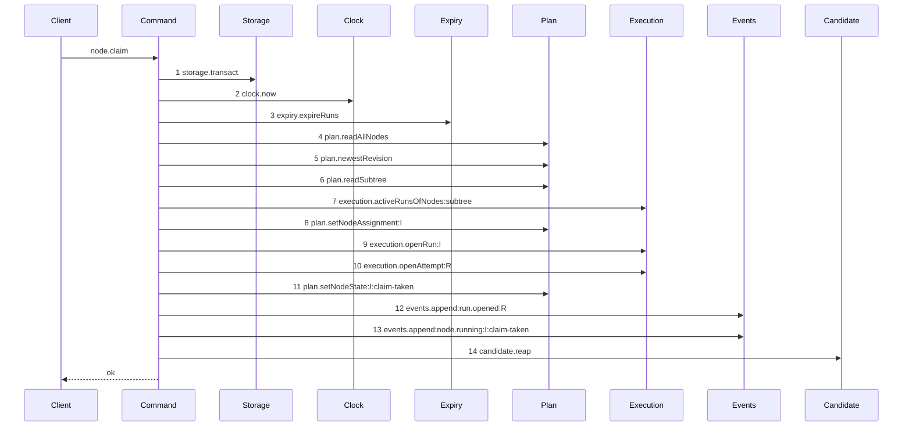

# Story 8 — The initiative claim reaps

Epic: `.agents/plan/epics/051.5-the-targeted-post-expiry-candidate-cleanup.md`
Depends on: Story 6 (`06-the-branch-base-claim-reaps`), for the reap statement on the record-present
arm, which this path also takes; EPIC 050.4 Story 2
(`02-the-claim-of-an-initiative-drops-the-lease`), whose diagram this supersedes.
Kind: story-implement

Diagrams: claim-initiative-reap

Seams: claim-initiative-reap: +candidate.reap

This story adds no production statement. It draws the third claim path through Story 6's statement and
proves the empty-list call, and it is the last of the three scenario swaps.

## The path

`claim-lease-free-initiative` is EPIC 050.4's diagram, so this path has **no `baseline-` diagram**: its
prior set is that live diagram, and this story declares `Supersedes:`.

### `claim-initiative-reap`

Supersedes: EPIC 050.4 claim-lease-free-initiative

Fixture: the fixture of `claim-lease-free-initiative`, unchanged. Initiative `I` is `ready`,
unassigned, the root, and it declares `deliverable: expansion`, so the run kind is `structural`, no
cascade exists, and the run holds no `run_base` row and exactly one attempt. **No run is due**, so the expiry
pass ends nothing and the reap receives an empty list.



**The drawn set is every branch of the initiative claim that ends `ok`.** EPIC 050.4 Story 2 fixed
that set for the thirteen steps and this story adds one step to it. An initiative claim reads no
workspace branch and never reaches the cut, so it takes the record-present arm Story 6 wired.

**This diagram differs from `claim-lease-free-initiative` at step 14 and nowhere else.** Steps 1 to 13
are context tokens.

**The reap appears even though this fixture expires nothing.** The call is unconditional in
`claimNode`, and the zero-work decision lives in `reapRunCandidates` — whose own empty-input path is
the zero-step diagram of Story 3 (`03-an-expiry-pass-that-ended-no-run-reaps-nothing`). One step here
and no step there is exactly the division the epic decided: the caller does not branch on the list
length, and the command does not work when the list is empty.

**A structural run holds no `run_base` row, and that is not this fixture's subject.** This claim
_opens_ a structural run; it does not expire one. The structural-skip case belongs to Story 4
(`04-an-ended-run-with-no-candidate-ref-reaches-no-deletion`), whose seam set covers it.

Add `test/sequence/scenarios/claim-initiative-reap.ts`. **Story 6
(`06-the-branch-base-claim-reaps`) already deleted
`test/sequence/scenarios/claim-lease-free-initiative.ts`**, because one statement changed this path's
trace and that path's trace at once; this story adds the replacement it retired the predecessor for.

## Change

### 1 — no production edit

`claimNode` already reaps on the record-present arm, from Story 6
(`06-the-branch-base-claim-reaps`) step 3. An initiative claim returns through
`begun.kind === "claimed"`, so it reaches that statement with no change. **Add no second statement and
no branch on the node kind.** A story that needed one would mean the reap is not total over the claim
terminals, which is the property the epic's `## Goal` states.

### 2 — the scenario, and the deletion that is not this story's

Add `test/sequence/scenarios/claim-initiative-reap.ts`.

**Do not delete `test/sequence/scenarios/claim-lease-free-initiative.ts` — Story 6
(`06-the-branch-base-claim-reaps`) already did.** The `Superseded by:` line at
`.agents/plan/stories/050.4-the-node-lease-removal/02-the-claim-of-an-initiative-drops-the-lease.md:25` —
`Superseded` is already applied, and Story 6's statement changed this path's trace, so the predecessor
could not survive that story. Story 10's third supersession clause retires a predecessor whose own
scenario is gone, so between Story 6 and this story the diagram is retired and this path carries no
scenario. Adding the replacement here is what restores its coverage, and case 3 asserts the fourteen
steps.

## Constraints

- Steps 1 to 13 must stay token-identical to `claim-lease-free-initiative`. A step that appears on one
  and not the other means the initiative claim's shape changed, which this story must not do.
- Write no production code. If the initiative claim does not reach step 13 without an edit, the reap
  is on the wrong arm and Story 6 is the defect to report — not a second call site to add here.
- Do not seed a due run in the drawn fixture. The empty-list call is this diagram's whole addition
  beyond Story 6's.
- Do not touch
  `.agents/plan/stories/050.4-the-node-lease-removal/02-the-claim-of-an-initiative-drops-the-lease.md`.
- Delete no scenario file. Story 6 (`06-the-branch-base-claim-reaps`) owns every deletion of this
  epic's claim family except `claim-first-execution.ts`, which is Story 7's.
- Do not change `test/sequence/scenarios/claim-success-initiative.ts`. It belongs to EPIC 050.1, whose
  diagram `claim-lease-free-initiative` already supersedes.

## Verify

```
node --test src/commands/node/claim-node.test.ts test/sequence/conformance.test.ts
```

Extend `src/commands/node/claim-node.test.ts`.

Add, each as a separate `it`:

1. `"a claim whose expiry pass ended no run reaches the reap exactly once with an empty list"` — a
   `candidate` Mock recording every argument. Claim `I` over a fixture with no due run and assert the
   recorded arguments deep-equal `[[]]`: one call, and its argument the empty list. The call is
   unconditional, so this is what proves no claim branches on the list length.

2. `"an initiative claim reaps through the same statement as a task claim"` — claim `I` and then claim
   `T` on separate fixtures with one due run each, and assert both `candidate` Mocks recorded exactly
   one call whose argument deep-equals the due run's projection. Two paths, one statement.

3. `"an initiative claim opens exactly one transaction and reaps after it"` — a `storage` double
   recording spans and one shared log. Assert the span list has length `1` and `"transact:exit"`
   precedes `"reap"`.

4. `"an initiative claim with one due run whose base row is absent returns the claim result"` — seed
   the due run with **no** `run_base` row, claim `I`, and assert the result is a `ClaimNodeResult` and
   the node reached `running`. The reap's unresolved-home finding is discarded by the claim, which is
   what makes it a finding and not a refusal; Story 4 case 3 asserts the finding itself.

5. **the claim family's scenario set is complete** — a build-only check, and not an `it`. Assert on
   disk that `test/sequence/scenarios/` holds `claim-branch-base-reap.ts`,
   `claim-first-execution-reap.ts` and `claim-initiative-reap.ts`, holds none of
   `claim-branch-base-task.ts`, `claim-first-execution.ts` or `claim-lease-free-initiative.ts`, and
   and **still holds `claim-lease-free-objective-busy.ts`**, which this epic supersedes not at all. Then run `pnpm run verify` and require exit 0. **Do not
   write this as a test that shells out to `node --test` over the file it lives in** — such a case
   re-enters the runner and spawns itself. Gate row 16c asserts the intermediate states over a fixture
   tree; this check asserts the real tree at the last scenario boundary.

Add `test/sequence/scenarios/claim-initiative-reap.ts`, building the fixture the diagram names,
running the real `claimNode` over real SQLite behind
`test/helpers/sequence-conformance.ts:99` — `recordSeams`, binding `expiry` to unrecorded dependencies
as `test/sequence/scenarios/claim-success-initiative.ts:65` — `Expiry` does, binding `candidate` to
the real `reapRunCandidates` over the **unrecorded** `storage`, `execution` and `git`, spreading the
expansion-capable `registry` back in unrecorded, and returning `{ recorder, result }`. Dispose the
fixture in a `finally`. Delete `test/sequence/scenarios/claim-lease-free-initiative.ts`.

`pnpm run verify` exits 0.

Proof: PASS line delivered — `src/commands/node/claim-node.test.ts` in `PASS EPIC-051.5`.
