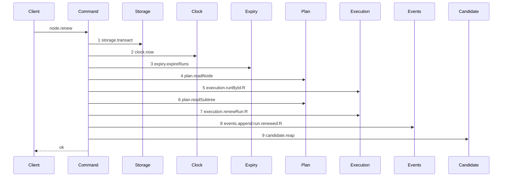

# Story 1 — The renew reaps

Epic: `.agents/plan/epics/051.6-the-post-expiry-reap-on-the-run-operations.md`
Depends on: EPIC 050.2 Story 3 (`03-the-renew`), for the expiry prelude and the rename; EPIC 050.4 Story 4 (`04-the-renew-drops-the-lease`), for the diagram this one supersedes, **and for the applied amendment that repairs `renew-lease-free`'s prelude order** — see the ruling below; EPIC 051.5 Story 1, for `ExpiredRun` in `src/domain/run.ts`; EPIC 051.5 Story 3, for `reapRunCandidates`; EPIC 051.5 Story 10 (`10-the-conformance-harness-admits-an-incremental-supersession`), for the per-diagram supersession this epic's three-story swap needs.
Kind: story-implement

Diagrams: renew-reap

Supersedes: EPIC 050.4 renew-lease-free

Seams: renew-reap: +candidate.reap

This story leaves the release reap to Story 2 (`02-the-release-reaps`) and the report reap to Story 3
(`03-the-report-reaps-on-every-settled-terminal`). It makes **no** range edit: `"051.6"` is already in
`authoredEpics`, and the `shippedEpics` append is Story 3's.

**EPIC 050.2 Story 3 renamed `heartbeat-node.ts` to `src/commands/run/renew-run.ts`**, so every
citation below names the shipped `heartbeat-node.ts` and locates the code by the symbol that survives
the rename. `src/http/server/node/renew-node.ts` becomes `src/http/server/node/renew-node.ts` in
the same story, and it is cited the same way.

**A path an earlier epic already drew has no `baseline-` diagram.** Its prior set is
`renew-lease-free`, so this story declares `Supersedes:` where a first change declares `Baselines:`,
and the one addition is measured over that diagram's tokens.

## The path

### `renew-reap`

Supersedes: EPIC 050.4 renew-lease-free

Fixture: the fixture of `renew-lease-free`. Task `T` under objective `O`, running, with an active
`execution` run `R` over `T` at a live fence, `expires_at` ahead of `now` and `max_lifetime_at` well
ahead of it, so no refusal fires. Beside it sits one **active** run `E` over a second task, whose
`expires_at` is **behind** `now`, whose `run_base` row names the loopback bare repository and whose
candidate ref exists. `E` is `running` when the command is called, so the expiry pass of step 3 is what
ends it, and step 9 receives a one-element list. **A run already `ended` before the call is not a run
this pass ends**, and it would make every positive case of this story vacuous.



**Step 9 is the only addition, and it sits outside the transaction of step 1.** `candidate.reap`
writes git, and `AGENTS.md` forbids git I/O inside a storage transaction. The transaction of step 1
closes after step 8, and the diagram still holds one `storage.transact` token, which is what the
parser requires.

**`candidate.reap` carries no label, and that is deliberate.** `test/helpers/sequence-conformance.ts:50`
— `projections` declares a projection per method, and it holds no `candidate.reap` entry.
`test/helpers/sequence-conformance.ts:126` — `projection === undefined` then yields an empty label
list, so the token is the bare `candidate.reap`. The method therefore admits one call per diagram,
which is exactly the count this path makes.

**The drawn set is every branch of this path.** `node.renew` has two other live diagrams and neither
moves. `renew-refusal-lifetime-exceeded` of EPIC 050.2 Story 4 (`04-the-lifetime-refusal`) raises
inside the one transaction, so it commits no expiry and reaches no reap; case 4 asserts the zero count
rather than a diagram, which `.agents/plan/authoring.md:327` — `It does not prove the behaviour a guard adds`
names as the instrument. The objective arm of the renew shares this trace, because
`renewObjectiveLease` left with EPIC 050.4 Story 4 and no objective-only seam call remains.

**This diagram preserves the prelude order EPIC 050.2 Story 3 ruled, and EPIC 050.4's amendment
restored.** `renew-lease-free` drew `4 execution.runById:R`, `5 plan.readSubtree`, `6 plan.readNode` before that
amendment, and now draws the order this diagram holds. EPIC 050.2 orders the callback as the clock read, the expiry pass,
`plan.readNode`, `execution.runById`, then `plan.readSubtree`, at
`.agents/plan/stories/050.2-the-run-renew-release-and-report/03-the-renew.md:206` — `expireRuns`, and its own diagram draws that order. EPIC 050.4 Story 3 deletes lease
calls and reorders nothing: its `## Change` holds deletions only, and its prose at
`.agents/plan/stories/050.4-the-node-lease-removal/04-the-renew-drops-the-lease.md:47` — `Three steps leave the superseded diagram` claims only removals. The step-6 placement is
therefore a transcription defect in that diagram, and this diagram draws the order EPIC 050.2 ruled.

**The rationale is continuity and the change boundary, not a broken refusal code.** A tempting
argument says the step-6 order makes `node-not-found` and `initiative-not-claimable` unreachable. It
does not. `assertRunAuthority` is a pure function and draws no step, so a command may read the node
third and still throw both refusals before it calls the authority check. **The step-6 order can
therefore produce a green implementation**, which is what makes the defect dangerous rather than
self-correcting: an implementing agent that follows
`.agents/plan/authoring.md:346` — `authoritative over the prose of that` would reorder three
reads, pass every case, and ship a change nobody planned. What decides the order is that EPIC 050.2
ruled it, its diagram, its `## Change`, its constraints and its cases all agree, and EPIC 050.4 gives
no reason for a reorder.

**The three moved tokens need no sign.** `.agents/plan/authoring.md:287` —
`A context token is not declared` makes a token both diagrams hold, at one count and one label, belong
to no story, and `scripts/verify-epic-sequence.ts:679` — `sign owners` decides ownership over token
presence and never over an ordinal. `plan.readNode`, `execution.runById:R` and `plan.readSubtree` each
appear in both token lists at one count and one label, so `+candidate.reap` stays the whole `Seams:`
line.

**The repair is applied: EPIC 050.4 Story 4 (`04-the-renew-drops-the-lease`) now draws the ruled order.** Clean signs did not make
the discrepancy harmless — `.agents/plan/authoring.md:239` — `shipped code is drawn once` makes the
previous epic's diagram the record of what shipped, and this story supersedes that record rather than
EPIC 050.2's. The amendment landed in that story: it records that the story deletes lease seams and
does not reorder the prelude, corrects `renew-lease-free` to `4 plan.readNode`, `5 execution.runById:R`,
`6 plan.readSubtree`, corrects its "step 6" prose, leaves its `Seams:` line unchanged, and leaves EPIC
050.2 untouched. See `.agents/plan/stories/050.4-the-node-lease-removal/04-the-renew-drops-the-lease.md:51` — `Amended`. **This story reproduces that corrected order token for token**,
and it must not be dispatched against a tree where the amendment is absent: verify the order before
drawing, and report a divergence. This story cannot apply the amendment itself —
`scripts/lane-check.sh` denies `.agents/plan/**` to every implementation role, so the plan owner
applies it outside the implementation lane, and did.

Add `test/sequence/scenarios/renew-reap.ts`.

## Change

**`src/commands/run/renew-run.ts` — reap after the transaction commits.** The boundary is the
transaction return: everything inside the callback keeps its shipped shape and its shipped order, and
the whole change is the value the callback carries out plus one statement after it.

### 1 — the two seam declarations

**Tighten the command's own `Expiry`.** EPIC 050.2 Story 3 gives this command an `expiry` key on
`RenewRunDependencies` at `src/commands/run/renew-run.ts:22` — `RenewRunDependencies`, and
its `Expiry` copies the shipped declaration at
`src/commands/node/claim-node.ts:75` — `Expiry`, whose return is
`src/commands/node/claim-node.ts:79` — `readonly unknown[]`. A command cannot read `runId` off
`unknown`, so change this command's own declaration to

```ts
export type Expiry = Readonly<{
  expireRuns(
    transaction: Transaction,
    input: Readonly<{ now: number }>,
  ): readonly ExpiredRun[];
}>;
```

over the `src/domain/run.ts` type EPIC 051.5 Story 1 moves there. This is the command's own type and
not an export of another module: `.agents/plan/stories/051.2-the-command-gate/index.md:102` — `Expiry`
rules that a nested unit narrows the interface it needs and does not export the narrowing, and
`eslint.config.js:221` — `command` forbids a command importing another command. Do not touch
`src/commands/node/claim-node.ts`; EPIC 051.5 Story 1 tightens that one.

**Add the `candidate` key** beside `expiry` on the same dependency type:

```ts
candidate: Readonly<{ reap(runs: readonly ExpiredRun[]): Promise<unknown> }>;
```

The key is `candidate` and the method is `reap`, so the diagram token is `candidate.reap`. A
function-valued dependency would draw `candidate.call`, which
`.agents/plan/authoring.md:229` — `A function-valued dependency` admits only inside a `baseline-` id.
The return is `unknown` because this command discards it:
`.agents/plan/epics/051.5-the-targeted-post-expiry-candidate-cleanup.md:61` — `findings` states the
value exists so each bucket is asserted by value in `reapRunCandidates`' own test, never by a caller.

### 2 — the callback carries the expired-run list out

`src/commands/run/renew-run.ts:64` — `storage.transact` opens the one transaction, and
`src/commands/run/renew-run.ts:109` — `return` is where the callback returns its result today.
Bind the value `expiry.expireRuns` already returns, and return it beside the result:

```ts
const { result, expired } = dependencies.storage.transact((transaction) => {
  const now = dependencies.clock.now();
  const expired = dependencies.expiry.expireRuns(transaction, { now });
  /* the shipped prelude, the authority check and the run renewal, unchanged */
  return { result: /* the shipped RenewRunResult */, expired };
});
await dependencies.candidate.reap(expired);
return result;
```

**Binding the value is not a seam change.** `expiry.expireRuns` already returns the list at
`src/commands/node/claim-node.ts:147` — `expireRuns`, where every shipped caller discards it. The
call, its arguments and its position do not move, so `+candidate.reap` is the one token this diagram
adds.

### 3 — the reap is a plain statement, and there is no `try`

Every refusal of this command is thrown inside the callback of
`src/commands/run/renew-run.ts:64` — `storage.transact`, so nothing is raised after the
transaction returns and no exception has to be caught to reach the reap. A `finally` here would mask a
**success**: `.agents/plan/stories/051.2-the-command-gate/index.md:98` — `finally` rules in this
repository that a `finally` discards the exception it wrapped and skips what follows it. The totality
of `reapRunCandidates` is what makes the bare statement safe, per
`.agents/plan/epics/051.5-the-targeted-post-expiry-candidate-cleanup.md:61` — `findings`, so this
command installs no rejection handler.

**The call is unconditional.** Do not guard it on `expired.length > 0`.
`.agents/plan/epics/051.5-the-targeted-post-expiry-candidate-cleanup.md:63` —
`reap-candidates-no-expired-run` makes `reapRunCandidates` return before `storage.transact` on an
empty list, which is where the zero-work decision belongs. A caller-side guard would duplicate it and
give the conformance runner two traces for one path.

### 4 — `renewRun` becomes `async`

`src/commands/run/renew-run.ts:63` — `RenewRunResult` is the shipped return type of the
function, and it becomes `Promise<RenewRunResult>`. `candidate.reap` resolves a promise, because
`.agents/plan/epics/051.1-the-candidate-and-the-git-primitives.md:95` — `git.listRefs` returns
`Promise<string[]>` and `reapRunCandidates` is therefore asynchronous.

### 5 — the handler gains one `await`

`src/http/server/node/renew-node.ts:9` — `renewRun` declares the injected callable as
`(input: RenewRunInput) => unknown`. Change it to
`(input: RenewRunInput) => Promise<RenewRunResult>`, and add `RenewRunResult` to the type import at
`src/http/server/node/renew-node.ts:5` — `RenewRunInput`. The call at
`src/http/server/node/renew-node.ts:29` — `renewRun` gains an `await`. The handler is already
asynchronous at `src/http/server/node/renew-node.ts:15` — `async`, and its `try` block at
`src/http/server/node/renew-node.ts:28` — `try` then catches a rejected refusal exactly as it
catches a thrown one. **Add no second key**: a handler parses, calls exactly one command and formats.

`src/cli/node/renew.ts` reaches the daemon over HTTP and does not change.

### 6 — `src/main.ts` binds the callable

`src/main.ts:588` — `node.renew` is the handler entry and
`src/main.ts:589` — `renewRun` is the closure. Add `candidate: { reap: boundReapRunCandidates }`
to its dependency literal, where `boundReapRunCandidates` is the one callable EPIC 051.5 Story 3
already constructs for the claim in the shape `src/main.ts:388` — `expiry` sets. The closure returns
the command's promise unchanged, so it needs no `async` keyword; the handler awaits it. Construct no
second reap callable, and add no file under `src/commands/`.

### 7 — the range, and the retired scenario

**`scripts/epic-sequence-range.ts:1` — `authoredEpics` already holds `"051.6"`, so this story edits
it not at all.** A human applied the whole authored range ahead of implementation, and
`test/sequence/conformance.test.ts:255` — `assert.deepEqual(authoredEpics` pins the value that
includes it. `scripts/verify-epic-sequence.ts:499` — `validateReferences` refuses a `Superseded by:`
line naming an epic outside `authoredEpics`, so the three lines a human applies to the earlier tree
already resolve. **Verify the entry is present and report a divergence rather than re-applying it.**
Do not touch `scripts/epic-sequence-range.ts:17` — `shippedEpics`; Story 3 appends to it and is last
in dispatch order for that reason.

**Delete `test/sequence/scenarios/renew-lease-free.ts`.** EPIC 051.5 Story 10 keys supersession on the
superseding scenario file, so `renew-lease-free` becomes superseded the moment
`test/sequence/scenarios/renew-reap.ts` exists and `"051.6"` is authored. Both files existing leaves a
scenario naming a superseded diagram, which
`test/sequence/conformance.test.ts:115` — `superseded` refuses. Add the new file and delete the old
one in the same turn. **The `Add \`test/sequence/scenarios/renew-lease-free.ts\`.`line of`04-the-renew-drops-the-lease.md`stays**: deleting it would leave EPIC 050.4 owning a live diagram
that names no scenario, which`scripts/verify-epic-sequence.ts:736`—`owner.source.includes` refuses.

## Constraints

- The reap is a plain statement after the transaction returns. No `try`, no `catch`, no `finally`, and no rejection handler.
- The reap call is unconditional. A guard on `expired.length` duplicates a decision `reapRunCandidates` already makes and gives the runner two traces.
- Do not move `expiry.expireRuns`, change its arguments, or reorder the prelude. Steps 2 to 8 keep the shipped source order.
- Reproduce steps 1 to 8 in the order this diagram draws, which is the order `.agents/plan/stories/050.2-the-run-renew-release-and-report/03-the-renew.md:206` — `expireRuns` states. `plan.readNode` precedes `execution.runById`, so `node-not-found` and `initiative-not-claimable` stay reachable in front of the authority check.
- Append no event on the reap path. `run.expired` already records each ending inside the expiry transaction.
- Do not touch `src/commands/checkpoint/reap-run-candidates.ts`, `execution.runBaseHomes` or `candidateRunPrefix`. EPIC 051.5 owns all three, and this story adds no file under `src/commands/`.
- Do not touch `src/commands/node/claim-node.ts`. EPIC 051.5 Story 1 tightens its `Expiry`.
- Do not touch `scripts/epic-sequence-range.ts:17` — `shippedEpics`.
- The handler's dependency record keeps exactly one key.

## Verify

```
node --test src/commands/run/renew-run.test.ts src/main.test.ts test/sequence/conformance.test.ts
```

Extend `src/commands/run/renew-run.test.ts` — the shipped
`src/commands/run/renew-run.test.ts`, suite at
`src/commands/run/renew-run.test.ts:227` — `describe`, whose fixture is
`src/commands/run/renew-run.test.ts:72` — `createFixture` over real SQLite through
`test/helpers/database.ts:32` — `createMigratedStorage`, and whose byte oracle is
`test/helpers/database.ts:117` — `databaseBytes`. The route cases run against the daemon
`src/main.test.ts:265` — `launchDaemon` spawns, over the client
`src/main.test.ts:240` — `clientDependencies` builds.

Add, each as a separate `it`:

1. `"a renew reaps the candidate ref of the run its expiry pass ended, over the real route"` — seed the
   fixture of the diagram: the running task `T` under run `R`, and one **active** run `E` whose
   `expires_at` is behind `now`, whose
   `run_base` row names the loopback bare repository and whose candidate ref
   `refs/kanthord/candidate/<E>/1` exists. Seed a second, **active** run `A2` with its own candidate ref
   as the control. Renew `T` through the daemon `launchDaemon` builds, and assert three values: the
   response body deep-equals the `RenewRunResult` for `T`; listing `refs/kanthord/candidate/` after
   the call holds no ref of `E`; and it still holds `refs/kanthord/candidate/<A2>/1`. The route is what
   proves the handler `await` and the `main.ts` binding. Gate row 1.

2. `"renewRun opens one transaction and reaps only after that transaction closes"` — substitute a
   storage double that records one `{ open, close }` span per `transact` call, and a recording
   `candidate.reap` that records its ordinal against that span list. Assert the span list has length
   `1`, assert the reap ordinal list is non-empty, then assert every reap ordinal falls after the one
   span closed. Assert both lists non-empty **before** the ordering assertion, so neither zero is
   vacuous. Gate row 2.

3. `"a renew whose reap returns only findings still renews the run"` — bind a git double that fails
   every listing, so `reapRunCandidates` returns an empty `deleted` list and one
   `reap-list-failed` finding and throws nothing. Assert the result deep-equals the same
   `RenewRunResult` as case 1, and assert the run row's `expires_at` moved forward to
   `Math.min(now + runTtlMs, max_lifetime_at)` by value. Case 1 is the control, where the same double
   lists successfully. Gate row 3.

4. `"a renew refused lifetime-exceeded reaps nothing and writes nothing"` — seed the fixture of case 1
   with `max_lifetime_at` behind `now`, capture `databaseBytes(fixture.storage)`, renew, and assert
   three values: the refusal is `lifetime-exceeded`; `candidate.reap` recorded exactly `0` calls; and
   `databaseBytes(fixture.storage)` deep-equals the capture. Then assert
   `refs/kanthord/candidate/<E>/1` is still present. Case 1 is the control for the zero call count.
   This is the Non-goal made assertable. Gate row 4.

5. `"a renew whose presented run its own expiry pass ended refuses run-ended and reaps nothing"` — seed
   run `R` itself active with `expires_at` behind `now`, plus the second such run `E` with its ref, so
   the pass would end both. Capture `databaseBytes`, renew
   `T`, and assert the refusal is `run-ended`, that `candidate.reap` recorded exactly `0` calls, that
   `databaseBytes` deep-equals the capture, and that `refs/kanthord/candidate/<E>/1` is still present.
   This proves the run the caller presents is never in the reaped set. Case 1 is the same-command
   control. Gate row 5.

**This story adds no range case.** `"051.6"` is already in `authoredEpics` and already pinned by
`test/sequence/conformance.test.ts:255` — `assert.deepEqual(authoredEpics`, so a sixth case would
duplicate a shipped assertion. Story 3 case 11 owns the `shippedEpics` proof, which is the one range
edit this epic still makes.

Add `test/sequence/scenarios/renew-reap.ts`, building the fixture the diagram names, running the real
`renewRun` over real SQLite and the loopback git fixture behind the recorder
`test/helpers/sequence-conformance.ts:99` — `recordSeams`, binding `expiry` and `candidate` to
unrecorded dependencies, and returning the recorder and the result.
`test/sequence/scenarios/claim-success-task.ts` is the shape, and the scenario is asynchronous, which
`test/sequence/conformance.test.ts:275` — `every due scenario conforms` already awaits. Delete
`test/sequence/scenarios/renew-lease-free.ts` in the same turn.

`pnpm run verify` exits 0.

Proof: PASS line delivered — `src/commands/run/renew-run.test.ts`, `src/main.test.ts` and
`test/sequence/conformance.test.ts` in `PASS EPIC-051.6`.
