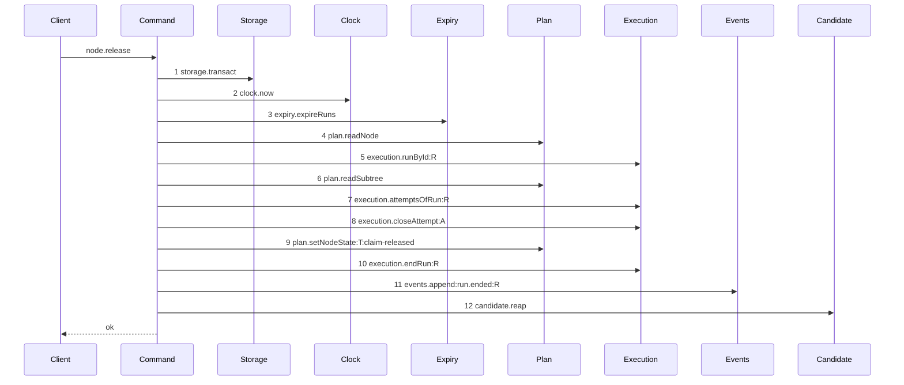

# Story 2 — The release reaps

Epic: `.agents/plan/epics/051.6-the-post-expiry-reap-on-the-run-operations.md`
Depends on: Story 1 (`01-the-renew-reaps`), for `"051.6"` in `authoredEpics`; EPIC 050.2 Story 5 (`05-the-release`), for the expiry prelude; EPIC 050.4 Story 5 (`05-the-release-drops-the-lease`), for the diagram this one supersedes, **and for the applied amendment that repairs `release-lease-free`'s prelude order** — see the ruling below; EPIC 051.5 Story 1, for `ExpiredRun` in `src/domain/run.ts`; EPIC 051.5 Story 3, for `reapRunCandidates`; EPIC 051.5 Story 10 (`10-the-conformance-harness-admits-an-incremental-supersession`), for the per-diagram supersession.
Kind: story-implement

Diagrams: release-reap

Supersedes: EPIC 050.4 release-lease-free

Seams: release-reap: +candidate.reap

This story leaves the report reap to Story 3 (`03-the-report-reaps-on-every-settled-terminal`). It
owns the empty-list case for **both** `renewRun` and `releaseNode`, because the epic's gate row 10
names one owner for the pair.

**A path an earlier epic already drew has no `baseline-` diagram.** Its prior set is
`release-lease-free`, so this story declares `Supersedes:` where a first change declares `Baselines:`.

## The path

### `release-reap`

Supersedes: EPIC 050.4 release-lease-free

Fixture: the fixture of `release-lease-free`. Task `T` running under run `R`, one open attempt `A`,
the attempt limit not reached. Beside it sits one **active** run `E` over a second task, whose
`expires_at` is **behind** `now`, whose `run_base` row names the loopback bare repository and whose
candidate ref exists. `E` is `running` when the command is called, so the expiry pass of step 3 is what
ends it, and step 12 receives a one-element list. **A run already `ended` before the call is not a run
this pass ends**, and it would make every positive case of this story vacuous.



**Step 12 is the only addition, and it sits outside the transaction of step 1.** `candidate.reap`
writes git, and `AGENTS.md` forbids git I/O inside a storage transaction. Step 10 is still the last
write and step 11 the only event, so a release still appends exactly one terminal event and the reap
adds none.

**`candidate.reap` carries no label.** `test/helpers/sequence-conformance.ts:50` — `projections` holds
no `candidate.reap` entry, and `test/helpers/sequence-conformance.ts:126` — `projection === undefined`
then yields an empty label list. The method admits one call per diagram, which is the count this path
makes.

**The drawn set is every branch of this path that this story changes.** `node.release` has three
arms. The task arm the diagram draws, the exhausted task arm at
`src/commands/node/release-node.ts:123` — `projected.exhausted`, and the objective arm at
`src/commands/node/release-node.ts:82` — `releaseObjective`. All three reach the same one statement
after the same one transaction, because the reap is placed after the transaction returns and not
inside a branch. The exhausted arm differs from the drawn arm by `plan.setNodeState:T:blocked` and by
its `run.ended` payload, which are the branch tokens EPIC 050.2 Story 5 already left undrawn; this
story adds no step to either difference. The objective arm reaches its own extra reads and writes, and
case 2 asserts its reap by value rather than drawing a second diagram, because a second diagram of
this story would break the one-pair rule of `.agents/plan/authoring.md:128` — `It draws exactly one pair`.

**This diagram preserves the prelude order EPIC 050.2 Story 5 ruled, and EPIC 050.4's amendment
restored.** `release-lease-free` drew `4 execution.runById:R`, `5 plan.readSubtree`, `6 plan.readNode` before that
amendment, and now draws the order this diagram holds. EPIC 050.2 orders the callback as the clock read, the expiry pass,
`plan.readNode`, `execution.runById`, then `plan.readSubtree`, at
`.agents/plan/stories/050.2-the-run-renew-release-and-report/05-the-release.md:168` — `expireRuns`, and its own diagram draws that order. EPIC 050.4 Story 5 deletes lease
calls and reorders nothing: its `## Change` holds deletions only, and its prose at
`.agents/plan/stories/050.2-the-run-renew-release-and-report/05-the-release.md:141` — `Step 4 precedes step 5, and that order is the ruling` claims only removals. The step-6 placement is
therefore a transcription defect in that diagram, and this diagram draws the order EPIC 050.2 ruled.

**The rationale is continuity and the change boundary, not a broken refusal code.** A tempting
argument says the step-6 order makes `node-not-found` and `initiative-not-claimable` unreachable. It
does not. `assertRunAuthority` is a pure function and draws no step, so a command may read the node
third and still throw both refusals before it calls the authority check. **The step-6 order can
therefore produce a green implementation**, which is what makes the defect dangerous rather than
self-correcting: an implementing agent that follows
`.agents/plan/authoring.md:346` — `authoritative over the prose of that` would reorder three
reads, pass every case, and ship a change nobody planned. What decides the order is that EPIC 050.2
ruled it, its diagram, its `## Change`, its constraints and its cases all agree, and EPIC 050.4 gives
no reason for a reorder.

**The three moved tokens need no sign.** `.agents/plan/authoring.md:287` —
`A context token is not declared` makes a token both diagrams hold, at one count and one label, belong
to no story, and `scripts/verify-epic-sequence.ts:679` — `sign owners` decides ownership over token
presence and never over an ordinal. `plan.readNode`, `execution.runById:R` and `plan.readSubtree` each
appear in both token lists at one count and one label, so `+candidate.reap` stays the whole `Seams:`
line.

**The repair is applied: EPIC 050.4 Story 5 (`05-the-release-drops-the-lease`) now draws the ruled order.** Clean signs did not make
the discrepancy harmless — `.agents/plan/authoring.md:239` — `shipped code is drawn once` makes the
previous epic's diagram the record of what shipped, and this story supersedes that record rather than
EPIC 050.2's. The amendment landed in that story: it records that the story deletes lease seams and
does not reorder the prelude, corrects `release-lease-free` to `4 plan.readNode`, `5 execution.runById:R`,
`6 plan.readSubtree`, corrects its "step 6" prose, leaves its `Seams:` line unchanged, and leaves EPIC
050.2 untouched. See `.agents/plan/stories/050.4-the-node-lease-removal/05-the-release-drops-the-lease.md:63` — `Amended`. **This story reproduces that corrected order token for token**,
and it must not be dispatched against a tree where the amendment is absent: verify the order before
drawing, and report a divergence. This story cannot apply the amendment itself —
`scripts/lane-check.sh` denies `.agents/plan/**` to every implementation role, so the plan owner
applies it outside the implementation lane, and did.

Add `test/sequence/scenarios/release-reap.ts`.

## Change

**`src/commands/node/release-node.ts` — reap after the transaction commits.** The boundary is the
transaction return. Every branch inside the callback keeps its shipped shape and its shipped order,
and the whole change is the value the callback carries out plus one statement after it.

### 1 — the two seam declarations

**Tighten the command's own `Expiry`.** EPIC 050.2 Story 5 gives this command an `expiry` key on
`ReleaseNodeDependencies` at `src/commands/node/release-node.ts:24` — `ReleaseNodeDependencies`, and
its `Expiry` copies the shipped declaration at `src/commands/node/claim-node.ts:75` — `Expiry`, whose
return is `src/commands/node/claim-node.ts:79` — `readonly unknown[]`. A command cannot read `runId`
off `unknown`, so change this command's own declaration to

```ts
export type Expiry = Readonly<{
  expireRuns(
    transaction: Transaction,
    input: Readonly<{ now: number }>,
  ): readonly ExpiredRun[];
}>;
```

over the `src/domain/run.ts` type EPIC 051.5 Story 1 moves there. This is the command's own type:
`.agents/plan/stories/051.2-the-command-gate/index.md:102` — `Expiry` rules that a nested unit narrows
the interface it needs and does not export the narrowing, and
`eslint.config.js:221` — `command` forbids a command importing another command. Do not touch Story 1's
declaration in `src/commands/run/renew-run.ts`, and do not touch
`src/commands/node/claim-node.ts`.

**Add the `candidate` key** beside `expiry` on the same dependency type:

```ts
candidate: Readonly<{ reap(runs: readonly ExpiredRun[]): Promise<unknown> }>;
```

The key is `candidate` and the method is `reap`, so the token is `candidate.reap`. The return is
`unknown` because this command discards it, per
`.agents/plan/epics/051.5-the-targeted-post-expiry-candidate-cleanup.md:61` — `findings`.

### 2 — the callback carries the expired-run list out of all three arms

`src/commands/node/release-node.ts:62` — `storage.transact` opens the one transaction, and its
callback returns whichever of `src/commands/node/release-node.ts:80` — `releaseTask` and
`src/commands/node/release-node.ts:82` — `releaseObjective` ran. Bind the expiry result once, at the
top of the callback, and return it beside the branch result:

```ts
const { result, expired } = dependencies.storage.transact((transaction) => {
  const now = dependencies.clock.now();
  const expired = dependencies.expiry.expireRuns(transaction, { now });
  /* the shipped prelude, the authority check and the three arms, unchanged */
  return { result: /* the shipped ReleaseNodeResult */, expired };
});
await dependencies.candidate.reap(expired);
return result;
```

**One binding site serves all three arms.** `expired` is read at the top of the callback and returned
once, so the exhausted task arm, the released task arm and the objective arm reach the same value. Do
not thread it through `releaseTask` or `releaseObjective`; both keep their shipped signatures and
their shipped returns, and only the outer callback wraps the value.

**Binding the value is not a seam change.** `expiry.expireRuns` already returns the list at
`src/commands/node/claim-node.ts:147` — `expireRuns`, where every shipped caller discards it. The
call, its arguments and its position do not move, so `+candidate.reap` is the one token this diagram
adds.

### 3 — the reap is a plain statement, and there is no `try`

Every refusal of this command is thrown inside the callback of
`src/commands/node/release-node.ts:62` — `storage.transact`, so nothing is raised after the
transaction returns. A `finally` here would mask a **success**:
`.agents/plan/stories/051.2-the-command-gate/index.md:98` — `finally` rules in this repository that a
`finally` discards the exception it wrapped and skips what follows it. The totality of
`reapRunCandidates` is what makes the bare statement safe.

**The call is unconditional.** Do not guard it on `expired.length > 0`.
`.agents/plan/epics/051.5-the-targeted-post-expiry-candidate-cleanup.md:63` —
`reap-candidates-no-expired-run` makes `reapRunCandidates` return before `storage.transact` on an
empty list, which is where the zero-work decision belongs.

### 4 — the runs this release itself ends are not reaped, and no code enforces it

`releaseObjective` ends every active child run at
`src/commands/node/release-node.ts:268` — `endRun` and the objective's own run at
`src/commands/node/release-node.ts:274` — `endRun`. None of those runs is in the list
`expiry.expireRuns` returned, because that pass ran before them and returned only the runs **it**
ended. The exclusion is therefore a property of the value and not a filter to write. **Add no filter,
and add no second reap for the ended children.** Widening the reaped set to every run this
transaction ended is a different rule with a different eligibility proof, which
`.agents/plan/epics/051.1-the-candidate-and-the-git-primitives.md:36` —
`refs/kanthord/candidate/` assigns to `candidate.sweep`. Case 4 asserts the residue by value.

### 5 — `releaseNode` becomes `async`

`src/commands/node/release-node.ts:61` — `ReleaseNodeResult` is the shipped return type of the
function, and it becomes `Promise<ReleaseNodeResult>`. `candidate.reap` resolves a promise, because
`.agents/plan/epics/051.1-the-candidate-and-the-git-primitives.md:95` — `git.listRefs` returns
`Promise<string[]>` and `reapRunCandidates` is therefore asynchronous.

### 6 — the handler gains one `await`

`src/http/server/node/release-node.ts:9` — `releaseNode` declares the injected callable as
`(input: ReleaseNodeInput) => unknown`. Change it to
`(input: ReleaseNodeInput) => Promise<unknown>`, and add an `await` at
`src/http/server/node/release-node.ts:29` — `releaseNode`. The handler is already asynchronous at
`src/http/server/node/release-node.ts:15` — `async`, and its `try` block at
`src/http/server/node/release-node.ts:28` — `try` then catches a rejected refusal exactly as it
catches a thrown one. **The return stays `Promise<unknown>` and not `Promise<ReleaseNodeResult>`**,
because `src/main.ts:608` — `showNode` replaces `result.node` with a node view before the handler sees
it, so the closure's resolved type is not the command's result type. **Add no second key**: a handler
parses, calls exactly one command and formats.

`src/cli/node/release.ts` reaches the daemon over HTTP and does not change.

### 7 — `src/main.ts` binds the callable and awaits the command

`src/main.ts:602` — `node.release` is the handler entry, and its closure at
`src/main.ts:603` — `releaseNode` calls the command at
`src/main.ts:604` — `releaseNode` and then calls `src/main.ts:608` — `showNode` over the result.
Add `candidate: { reap: boundReapRunCandidates }` to the command's dependency literal at
`src/main.ts:605` — `storage`, where `boundReapRunCandidates` is the one callable EPIC 051.5 Story 3
already constructs for the claim. Make the closure `async` and `await` the command, because
`showNode` reads `result.node.id` and a promise carries no `node`. `showNode` itself stays
synchronous and keeps its own transaction.

### 8 — the retired scenario

**Delete `test/sequence/scenarios/release-lease-free.ts`.** EPIC 051.5 Story 10 keys supersession on
the superseding scenario file, so `release-lease-free` becomes superseded the moment
`test/sequence/scenarios/release-reap.ts` exists. Both files existing leaves a scenario naming a
superseded diagram, which `test/sequence/conformance.test.ts:115` — `superseded` refuses. Add the new
file and delete the old one in the same turn. **The
`Add \`test/sequence/scenarios/release-lease-free.ts\`.`line of`05-the-release-drops-the-lease.md`stays**: deleting it would leave EPIC 050.4 owning a live diagram that names no scenario, which`scripts/verify-epic-sequence.ts:736`—`owner.source.includes` refuses.

Do not touch `scripts/epic-sequence-range.ts`. Story 1 inserted `"051.6"` into `authoredEpics`, and
Story 3 appends it to `shippedEpics`.

## Constraints

- The reap is a plain statement after the transaction returns. No `try`, no `catch`, no `finally`, and no rejection handler.
- Bind `expired` once, at the top of the outer callback. Do not thread it into `releaseTask` or `releaseObjective`, and do not change either signature.
- The reap call is unconditional. A guard on `expired.length` duplicates a decision `reapRunCandidates` already makes.
- Add no filter over the reaped list. The runs this release ends are absent from it by construction, and a filter would claim a rule this epic does not take.
- Do not move `expiry.expireRuns`, change its arguments, or reorder the prelude. Steps 2 to 11 keep the shipped source order.
- Reproduce steps 1 to 11 in the order this diagram draws, which is the order `.agents/plan/stories/050.2-the-run-renew-release-and-report/05-the-release.md:168` — `expireRuns` states. `plan.readNode` precedes `execution.runById`.
- Append no event on the reap path. Step 11 stays the only event of the drawn arm.
- Do not touch `execution.endRun`, `execution.closeAttempt`, the child-run loop, or the exhausted arm's `blocked` outcome with `attempt-limit`.
- Do not touch `src/commands/checkpoint/reap-run-candidates.ts`, `src/commands/node/claim-node.ts` or `src/commands/run/renew-run.ts`'s own `Expiry`.
- The handler's dependency record keeps exactly one key.

## Verify

```
node --test src/commands/node/release-node.test.ts src/commands/run/renew-run.test.ts src/main.test.ts test/sequence/conformance.test.ts
```

Extend `src/commands/node/release-node.test.ts`, suite at
`src/commands/node/release-node.test.ts:318` — `describe`, whose fixture is
`src/commands/node/release-node.test.ts:80` — `createFixture` over real SQLite through
`test/helpers/database.ts:32` — `createMigratedStorage`, and whose byte oracle is
`test/helpers/database.ts:117` — `databaseBytes`. Case 5 also extends
`src/commands/run/renew-run.test.ts`, suite at
`src/commands/node/heartbeat-node.test.ts:227` — `describe`. The route case runs against the daemon
`src/main.test.ts:265` — `launchDaemon` spawns, over the client
`src/main.test.ts:240` — `clientDependencies` builds.

Add, each as a separate `it`:

1. `"a task release reaps the expired run's candidate ref and returns the node ready, over the real route"`
   — seed the fixture of the diagram: task `T` running under run `R` with one open attempt `A`, and one
   **active** run `E` whose `expires_at` is behind `now`, whose `run_base` row names the loopback bare
   repository and whose candidate
   ref `refs/kanthord/candidate/<E>/1` exists. Seed a second, **active** run `A2` with its own
   candidate ref as the control. Release `T` through the daemon `launchDaemon` builds, and assert three
   values in one case: the response body's node state is `"ready"`; listing
   `refs/kanthord/candidate/` after the call holds no ref of `E`; and it still holds
   `refs/kanthord/candidate/<A2>/1`. The route is what proves the handler `await` and the `main.ts`
   binding. Gate row 6.

2. `"an objective release reaps once with the expired-run list and still ends every active child run"`
   — seed objective `O` running under its own run, two child tasks each running under an active child
   run, and one **active** run `E` whose `expires_at` is behind `now`. Release `O`, and assert three
   values: `candidate.reap` recorded
   exactly `1` call; that call's argument deep-equals
   `[{ runId: E, nodeId: <E's node>, fence: <E's fence> }]`; and both child run rows are `ended` with
   outcome `released`. The **by-value** argument assertion is
   what stops a `candidate.reap([])` from passing. The task branch of case 1 is the control. Gate
   row 7.

3. `"a release whose presented run its own expiry pass ended refuses run-ended and reaps nothing"` —
   seed run `R` itself with `expires_at` behind `now`, plus the second such run `E` with its ref, so
   the pass would end both. Capture
   `databaseBytes(fixture.storage)`, release `T`, and assert the refusal is `run-ended`, that
   `candidate.reap` recorded exactly `0` calls, that `databaseBytes(fixture.storage)` deep-equals the
   capture, and that `refs/kanthord/candidate/<E>/1` is still present. Case 1 is the same-command
   control. Gate row 8.

4. `"a release leaves the candidate ref of every run it ended itself in place"` — two sub-assertions in
   one case. Release a task whose own run `R` has a candidate ref, and assert
   `refs/kanthord/candidate/<R>/1` is still present after. Then release an objective with two active
   child runs, each with its own candidate ref, and assert all three refs — the objective run's and
   both children's — are still present after. Case 1's deleted ref of `E` is the control that the
   listing assertion detects a deletion. This is the Non-goal made assertable. Gate row 9.

5. `"a release and a renew each reap once with an empty list when nothing expired"` — two cases, one per
   command, each in its own command's test file. Seed a fixture holding no past-due run, run the
   command, and assert `candidate.reap` recorded exactly `1` call whose argument deep-equals `[]`.
   Asserted by value, because the call is unconditional and neither command branches on the list
   length. Gate row 10.

Add `test/sequence/scenarios/release-reap.ts`, building the fixture the diagram names, running the
real `releaseNode` over real SQLite and the loopback git fixture behind the recorder
`test/helpers/sequence-conformance.ts:99` — `recordSeams`, binding `expiry` and `candidate` to
unrecorded dependencies, and returning the recorder and the result.
`test/sequence/scenarios/claim-success-task.ts` is the shape, and the scenario is asynchronous. Delete
`test/sequence/scenarios/release-lease-free.ts` in the same turn.

`pnpm run verify` exits 0.

Proof: PASS line delivered — `src/commands/node/release-node.test.ts`, `src/main.test.ts` and
`test/sequence/conformance.test.ts` in `PASS EPIC-051.6`.
