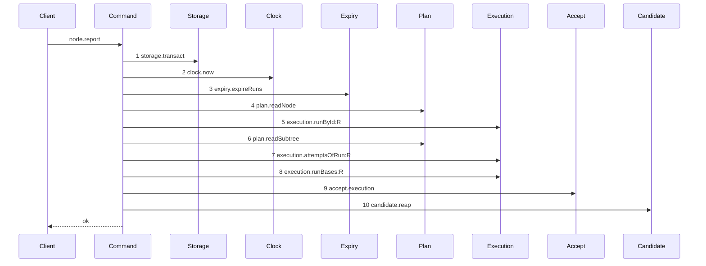

# Story 3 — The report reaps on every settled terminal that commits its prelude

Epic: `.agents/plan/epics/051.6-the-post-expiry-reap-on-the-run-operations.md`
Depends on: Story 1 (`01-the-renew-reaps`) and Story 2 (`02-the-release-reaps`), because it appends `"051.6"` to `shippedEpics` and both earlier stories must have landed; EPIC 050.2 Story 6 (`06-the-report-prelude`), for the expiry prelude; EPIC 051.4 Story 8 (`08-the-report-route-enforces-the-gate`), for the diagram this one supersedes and for `accept.execution` and `AcceptExecutionError`; EPIC 051.5 Story 1, for `ExpiredRun` in `src/domain/run.ts`; EPIC 051.5 Story 3, for `reapRunCandidates`; EPIC 051.5 Story 10 (`10-the-conformance-harness-admits-an-incremental-supersession`), for the per-diagram supersession.
Kind: story-implement

Diagrams: report-checkpoint-reap

Supersedes: EPIC 051.4 report-checkpoint-gate

Seams: report-checkpoint-reap: +candidate.reap

**This story is last in dispatch order.** It appends `"051.6"` to
`scripts/epic-sequence-range.ts:17` — `shippedEpics`, and
`test/sequence/conformance.test.ts:254` — `shippedEpics` requires `shippedEpics` to stay a prefix of
`authoredEpics`.

It owns four proofs that reach the other two commands: the ordering proof of gate row 15 on all
three, and the type-level proof of gate row 16 on all three. Stories 1 and 2 apply their own
tightenings; this story proves the set.

**A path an earlier epic already drew has no `baseline-` diagram.** Its prior set is
`report-checkpoint-gate`, so this story declares `Supersedes:` where a first change declares
`Baselines:`.

## The path

### `report-checkpoint-reap`

Supersedes: EPIC 051.4 report-checkpoint-gate

Fixture: the fixture of `report-checkpoint-gate`. Task `T` running under run `R` with one open attempt
`A`, presented by run id and fence, the report `accepted` with an `objectId` and a `repositoryId`, and
every input `acceptExecution` needs already valid. Beside it sits one **active** run `E` over a second
task, whose `expires_at` is **behind** `now`, whose `run_base` row names the loopback bare repository
and whose candidate ref exists. `E` is `running` when the command is called, so the expiry pass of
step 3 is what ends it, and step 10 receives a one-element list. **A run already `ended` before the
call is not a run this pass ends**, and it would make every positive case of this story vacuous.



**Steps 1 to 9 are the prefix EPIC 051.4 Story 8 drew, token for token and in its order.** They are
context tokens: the prior diagram holds each at one count and one label, so no sign of this story
governs them. Step 10 is the only addition.

**Step 10 sits outside the transaction of step 1, and after step 9 settles.** The prelude's
transaction closes before step 9 runs, per
`.agents/plan/stories/051.4-the-acceptance-gate-and-the-report-route/08-the-report-route-enforces-the-gate.md:102`
— `Step 9 sits outside the transaction of step 1`. The reap starts after step 9 settles, which puts it
after the git write of the terminal and satisfies condition 6 of
`AGENTS.md:106` — `six conditions`.

**`candidate.reap` carries no label.** `test/helpers/sequence-conformance.ts:50` — `projections` holds
no `candidate.reap` entry, and `test/helpers/sequence-conformance.ts:126` — `projection === undefined`
then yields an empty label list. The method admits one call per diagram, which is the count this path
makes on **both** arms of the decision below.

**The refusing arm is not a second diagram, and that is a ruling and not an omission.**
`test/helpers/sequence-conformance.ts:132` — `tokens.push` pushes the token before
`test/helpers/sequence-conformance.ts:136` — `Reflect.apply`, so a call that throws is still recorded.
`accept.execution` is therefore one step whether it returns or throws, and the refusing arm's trace is
steps 1 to 9 above followed by `candidate.reap` at ordinal 10. Only the terminal differs.
`.agents/plan/authoring.md:152` — `Draw a path only when its seam set or its seam order differs from a path already drawn`
is the rule that governs, and `.agents/plan/authoring.md:327` —
`It does not prove the behaviour a guard adds` names the case as the instrument. Case 2 carries the
arm. **EPIC 051.5 Story 9 reaches the same conclusion on the claim's contended cut**, so this is the
sibling precedent and not the counter-example.

**The drawn set is every branch of this path that this story changes.** The report union has six
members and the prelude runs for all of them. The accepted member on an execution node is the one that
reaches steps 8 and 9; the other five resolve inside the transaction of step 1 and then reach the same
step 10, because the reap is placed after the decision and not inside an arm. Their traces differ from
this one before step 8, which is a difference EPIC 051.4 Story 8 already left undrawn, and this story
adds no step to it. Case 4 asserts each of the five reaps once, by value.

Add `test/sequence/scenarios/report-checkpoint-reap.ts`.

## Change

**`src/commands/outcome/report-outcome.ts` — capture the settle, reap once, then raise or return.**
The boundary is one reap statement between the settle and the raise. EPIC 051.4 Story 8 left this
command returning `dependencies.accept.execution(decided.input)` on the accepted arm and
`decided.result` on every other. That shape reaches no statement after a typed refusal, so this story
introduces the capture that makes one statement serve both arms.

### 1 — the two seam declarations

**Tighten the command's own `Expiry`.** EPIC 050.2 Story 6 gives this command an `expiry` key on
`ReportOutcomeDependencies` at
`src/commands/outcome/report-outcome.ts:52` — `ReportOutcomeDependencies`, and its `Expiry` copies the
shipped declaration at `src/commands/node/claim-node.ts:75` — `Expiry`, whose return is
`src/commands/node/claim-node.ts:79` — `readonly unknown[]`. A command cannot read `runId` off
`unknown`, so change this command's own declaration to

```ts
export type Expiry = Readonly<{
  expireRuns(
    transaction: Transaction,
    input: Readonly<{ now: number }>,
  ): readonly ExpiredRun[];
}>;
```

over the `src/domain/run.ts` type EPIC 051.5 Story 1 moves there. This is the command's own type, per
`.agents/plan/stories/051.2-the-command-gate/index.md:102` — `Expiry` and
`eslint.config.js:221` — `command`. Do not touch the declarations Stories 1 and 2 wrote, and do not
touch `src/commands/node/claim-node.ts`.

**Add the `candidate` key** beside `expiry` on the same dependency type:

```ts
candidate: Readonly<{ reap(runs: readonly ExpiredRun[]): Promise<unknown> }>;
```

The key is `candidate` and the method is `reap`, so the token is `candidate.reap`. The return is
`unknown` because this command discards it, per
`.agents/plan/epics/051.5-the-targeted-post-expiry-candidate-cleanup.md:61` — `findings`.

### 2 — the transaction callback carries the expired-run list on both arms

`src/commands/outcome/report-outcome.ts:107` — `transact` is the one transaction, and EPIC 051.4
Story 8 makes its callback return a discriminated value: `{ kind: "accept", input }` on the accepted
execution arm and `{ kind: "done", result }` on every other. Add `expired` to **both** members, bound
once at the top of the callback:

```ts
const decided = dependencies.storage.transact((transaction) => {
  const now = dependencies.clock.now();
  const expired = dependencies.expiry.expireRuns(transaction, { now });
  /* the shipped prelude and every in-transaction arm, unchanged */
  // the accepted-execution arm returns { kind: "accept", input, expired }
  // every other arm returns { kind: "done", result, expired }
});
```

The objective arm at `src/commands/outcome/report-outcome.ts:122` — `node.kind` and every task arm
carry `expired` identically, so `decided.expired` reads on both members without a narrowing.

**Binding the value is not a seam change.** `expiry.expireRuns` already returns the list at
`src/commands/node/claim-node.ts:147` — `expireRuns`, where every shipped caller discards it. The
call, its arguments and its position do not move, so `+candidate.reap` is the one token this diagram
adds.

### 3 — the capture, one reap, then the raise or the return

Replace the two return statements EPIC 051.4 Story 8 left with a capture, one reap statement, and the
terminal:

```ts
let settled:
  | Readonly<{ kind: "ok"; result: ReportOutcomeResult }>
  | Readonly<{ kind: "refused"; error: ReportOutcomeError }>;
try {
  settled = {
    kind: "ok",
    result:
      decided.kind === "accept"
        ? await dependencies.accept.execution(decided.input)
        : decided.result,
  };
} catch (error) {
  if (!(error instanceof AcceptExecutionError)) throw error;
  settled = {
    kind: "refused",
    error: new ReportOutcomeError(error.refusal, error.message, error.details),
  };
}
await dependencies.candidate.reap(decided.expired);
if (settled.kind === "refused") throw settled.error;
return settled.result;
```

**The `catch` is where EPIC 051.4's translation moves, and the union member is a `ReportOutcomeError`.**
The epic's `## Decisions` illustrates this shape with `error: AcceptExecutionError` and a bare
`throw settled.error`, which would raise an `AcceptExecutionError` out of `reportOutcome` and lose the
translation EPIC 051.4 Story 8 owns at
`.agents/plan/stories/051.4-the-acceptance-gate-and-the-report-route/08-the-report-route-enforces-the-gate.md:200`
— `Add the six refusal codes to`. **That is an inconsistency in the epic's illustrative snippet, and
this story resolves it in the direction that keeps both cited sources true**: the `catch` constructs
the `ReportOutcomeError` carrying the caught `refusal` and `details` unchanged, and the one throw site
raises it. `.agents/plan/stories/051.2-the-command-gate/index.md:100` — `throws a typed error carrying`
requires the command to raise its own error type, and
`src/http/server/node/refusals.ts:67` — `reportOutcomeRefusal` maps a `ReportOutcomeError` and never an
`AcceptExecutionError`, so the untranslated throw would reach the handler as an unmapped fault. Case 2
pins the runtime class.

**One statement is the point, and it makes three properties structural.** The argument is the same
`decided.expired` on both arms, the call happens exactly once, and it starts only after
`accept.execution` settles. A second reap site inside the `catch` would make each of the three a
per-arm claim, and case 6 would have to prove the ordering twice.

**The `catch` only captures.** It rethrows anything that is not an `AcceptExecutionError`, so an
untyped throw leaves through `throw error` and reaches no reap. That is what
`AGENTS.md:106` — `six conditions` requires: an untyped throw out of `accept.execution` may leave a
`land` journal row `open`, the command's logical outcome is then unsettled, and condition 6 forbids
the deletion. Startup reconciles the row and `candidate.sweep` sweeps the ref.

**The reap statement sits outside the `try`.** A reap inside it, or inside a `finally`, would mask the
refusal the worker must see: `.agents/plan/stories/051.2-the-command-gate/index.md:98` — `finally`
rules in this repository that a `finally` discards the exception it wrapped. The reap is outside the
`try` because `reapRunCandidates` is total, per
`.agents/plan/epics/051.5-the-targeted-post-expiry-candidate-cleanup.md:61` — `findings`, and a reap
that throws is a defect in `reapRunCandidates` proven by that epic's own case set. Install no
rejection handler at this site.

**A prelude refusal reaches no reap at all.** Every refusal `assertRunAuthority` raises is thrown
inside the callback of `src/commands/outcome/report-outcome.ts:107` — `transact`, so `decided` never
exists and the expiry rolls back with the refusal. Case 3 asserts it.

**The local union is a variable and never a result.**
`.agents/plan/stories/051.2-the-command-gate/index.md:100` — `throws a typed error carrying` requires
a refusing command to throw, and this command still throws. `settled` is a local inside
`report-outcome.ts` and is not returned. `src/commands/outcome/report-outcome.ts:107` — `transact`
already holds EPIC 051.4 Story 8's `decided` in the same idiom, so this adds no new pattern to the
file.

**The call is unconditional.** Do not guard it on `decided.expired.length > 0`.
`.agents/plan/epics/051.5-the-targeted-post-expiry-candidate-cleanup.md:63` —
`reap-candidates-no-expired-run` makes `reapRunCandidates` return before `storage.transact` on an
empty list. Case 7 asserts the empty-list call by value.

### 4 — `reportOutcome` stays `async`, and the refusal codes do not move

`src/commands/outcome/report-outcome.ts:103` — `reportOutcome` already returns
`Promise<ReportOutcomeResult>` after EPIC 051.4 Story 8, so this story changes no signature. Do not
touch `src/commands/outcome/report-outcome.ts:79` — `ReportOutcomeRefusal`. The translation of an
`AcceptExecutionError` into a `ReportOutcomeError` carrying its `refusal` and its `details` unchanged
is EPIC 051.4 Story 8's, and this story **moves its site into the `catch` and delays its throw by one
statement**. The values do not change; the class the command raises does not change either. Section 3
above states the shape.

### 5 — the handler and the CLI do not change

`src/http/server/node/report-node.ts:32` — `reportOutcome` already awaits the command after EPIC
051.4 Story 8, and the handler's dependency record already holds exactly one key. `src/cli/` reaches
the daemon over HTTP. **Add no second key**, and add no `await` that is already there.

### 6 — `src/main.ts` binds the callable

`src/main.ts:301` — `boundReportOutcome` is the closure and
`src/main.ts:306` — `storage` opens its dependency literal. Add
`candidate: { reap: boundReapRunCandidates }` to it, where `boundReapRunCandidates` is the one
callable EPIC 051.5 Story 3 already constructs for the claim. The closure is already asynchronous
after EPIC 051.4 Story 8. Construct no second reap callable, and add no file under `src/commands/`.

### 7 — the range, and the retired scenario

**`scripts/epic-sequence-range.ts:17` — `shippedEpics`.** Append `"051.6"`.
`test/sequence/conformance.test.ts:254` — `shippedEpics` requires `shippedEpics` to stay a prefix of
`authoredEpics`, and Story 1 put `"051.6"` last in `authoredEpics`, so this story is last in dispatch
order.

**Delete `test/sequence/scenarios/report-checkpoint-gate.ts`.** EPIC 051.5 Story 10 keys supersession
on the superseding scenario file, so `report-checkpoint-gate` becomes superseded the moment
`test/sequence/scenarios/report-checkpoint-reap.ts` exists. Both files existing leaves a scenario
naming a superseded diagram, which `test/sequence/conformance.test.ts:115` — `superseded` refuses. Add
the new file and delete the old one in the same turn. **The
`Add \`test/sequence/scenarios/report-checkpoint-gate.ts\`.`line of`08-the-report-route-enforces-the-gate.md`stays**: deleting it would leave EPIC 051.4 owning a live
diagram that names no scenario, which`scripts/verify-epic-sequence.ts:736`—`owner.source.includes` refuses.

## Constraints

- One reap statement, outside the `try`, between the settle and the raise. No second site in the `catch`, and no `finally`.
- The `catch` captures an `AcceptExecutionError` and rethrows everything else. An untyped throw reaches no reap.
- The reap argument is `decided.expired` on both arms, read from the one binding at the top of the transaction callback.
- The reap call is unconditional. A guard on `decided.expired.length` duplicates a decision `reapRunCandidates` already makes.
- Install no rejection handler on `candidate.reap`. The contract is total, and a caller-side handler at four sites buys nothing it does not already give.
- Reproduce steps 1 to 9 token for token from `report-checkpoint-gate`. A token that differs with no sign covering it is a stale copy in this story, and the fix is this diagram and never the prior one.
- The five members that resolve inside the transaction keep their shipped tails unchanged, in the source and in their order.
- Append no event on the reap path. `run.expired` already records each ending inside the expiry transaction.
- Do not touch `src/commands/outcome/report-outcome.ts:79` — `ReportOutcomeRefusal`, the six-code translation, `src/http/server/node/refusals.ts`, or `src/http/server/node/report-node.ts`.
- Do not touch `src/commands/outcome/report-objective.ts` or `src/commands/outcome/close-objective.ts`. Both receive the caller's transaction and run no expiry pass, so `attest-lease-free` and `baseline-report-objective` are unchanged.
- Do not touch `src/commands/checkpoint/reap-run-candidates.ts`, `src/commands/node/claim-node.ts`, or the `Expiry` declarations of Stories 1 and 2.
- Do not touch EPIC 051.4's seven diagrams or `candidate.discard`. This story adds a call one level above `acceptExecution`.

## Verify

```
node --test src/commands/outcome/report-outcome.test.ts src/commands/run/renew-run.test.ts src/commands/node/release-node.test.ts src/main.test.ts test/sequence/conformance.test.ts
```

Extend `src/commands/outcome/report-outcome.test.ts`, suite at
`src/commands/outcome/report-outcome.test.ts:558` — `describe`, whose driver is
`src/commands/outcome/report-outcome.test.ts:315` — `ReportInput`, whose fixture is
`src/commands/outcome/report-outcome.test.ts:185` — `createReportFixture` over real SQLite through
`test/helpers/database.ts:32` — `createMigratedStorage`, whose event oracle is
`src/commands/outcome/report-outcome.test.ts:552` — `reportedAppends`, and whose byte oracle is
`test/helpers/database.ts:117` — `databaseBytes`. Case 6 also extends
`src/commands/run/renew-run.test.ts` and `src/commands/node/release-node.test.ts`. The route cases run
against the daemon `src/main.test.ts:265` — `launchDaemon` spawns, over the client
`src/main.test.ts:240` — `clientDependencies` builds. The type-level case follows the shipped
convention at `src/services/plan/sqlite.test.ts:97` — `ts-expect-error`, which is a comment the type
checker enforces and not an assertion call.

Add, each as a separate `it`:

1. `"an accepted report returns what acceptExecution returned and reaps the expired run's ref, over the real route"`
   — seed the fixture of the diagram, plus one **active** run `E` whose `expires_at` is behind `now` and
   whose `run_base` row names the
   loopback bare repository and whose candidate ref `refs/kanthord/candidate/<E>/1` exists, plus a
   second **active** run `A2` with its own candidate ref as the control. Report `accepted` through the
   daemon `launchDaemon` builds, and assert three values: the response body deep-equals the value
   `accept.execution` returned; listing `refs/kanthord/candidate/` after the call holds no ref of `E`;
   and it still holds `refs/kanthord/candidate/<A2>/1`. Gate row 11.

2. `"a report refused inside acceptExecution reaps before it raises"` — one `it`. Pin the expected
   reaped list as a literal, `EXPECTED = [{ runId: E, nodeId: <E's node>, fence: <E's fence> }]`. Drive
   the command twice over the same seeded fixture and the **same** recording `candidate.reap` double,
   once with `accept.execution` returning and once with it throwing an `AcceptExecutionError` carrying a
   pinned `refusal` and a pinned `details`. Assert six values: on the refusing run,
   `refs/kanthord/candidate/<E>/1` is absent afterwards; the raised error is an instance of
   `ReportOutcomeError` and **not** of `AcceptExecutionError`; its `refusal` and `details` deep-equal
   the pinned values; each run recorded exactly `1` `candidate.reap` call; both recorded arguments
   deep-equal `EXPECTED`; and the two runs' full recorded token lists deep-equal each other. **The
   pinned literal is what makes the cross-arm comparison implementable**: case 1 drives the real route
   and exposes no argument, so an accepting control at the command level, behind the same double, is
   what the comparison needs. **The token-list equality is what the undrawn refusing arm costs**, and
   it is the instrument
   `.agents/plan/epics/051.5-the-targeted-post-expiry-candidate-cleanup.md:138` — `same nineteen recorded steps`
   uses for the same reason on the claim's contended cut. Without it an extra seam call on the refusing
   arm alone reaches no oracle, because that arm has no diagram. Then add the control as a second `it`,
   `"a report whose acceptExecution throws an untyped error reaps nothing"`, where the double throws a
   plain `Error`: assert that error propagates unchanged and is neither a `ReportOutcomeError` nor an
   `AcceptExecutionError`, that `candidate.reap` recorded exactly `0` calls, and that
   `refs/kanthord/candidate/<E>/1` is still present. Gate row 12.

3. `"a report refused inside its prelude transaction reaps nothing and writes nothing"` — present a
   stale `runFence`, capture `databaseBytes(fixture.storage)`, report, and assert the refusal is
   `fence-stale`, that `candidate.reap` recorded exactly `0` calls, that
   `databaseBytes(fixture.storage)` deep-equals the capture, and that
   `refs/kanthord/candidate/<E>/1` is still present. Case 2 is the control for the zero call count.
   Gate row 13.

4. `"each of the five in-transaction report members reaps once and appends no additional event"` — five
   sub-assertions in one `it`, one per member: `rejected`, `failed` and `cancelled` on a task, and
   `attested` and `closed` on an objective. For each, assert `candidate.reap` recorded exactly `1`
   call whose argument deep-equals `[{ runId: E, nodeId: <E's node>, fence: <E's fence> }]`, and assert
   the appended event types deep-equal the shipped arm's list for that member, by value. Assert the
   member count is `5`. Then add the nested-command control as a second `it`,
   `"the objective attestation records no candidate.reap of its own"`, asserting `attest-lease-free`'s
   recorded token list holds no `candidate.reap`: `reportObjective` receives the caller's transaction
   and runs no expiry pass, so the objective arm reaps through `reportOutcome` and nowhere else. Gate
   row 14.

5. `"candidate.reap starts only after acceptExecution settles"` — two cases. Bind `accept.execution` to
   a deferred promise the test resolves by hand. In the first case, assert no `candidate.reap` call is
   recorded while the promise is pending, resolve it, then assert exactly `1` is recorded. In the
   second case, reject the deferred promise with an `AcceptExecutionError` and assert the same two
   facts, which is how the two arms are shown to share one statement. This is what the diagram cannot
   prove: `.agents/plan/authoring.md:27` — `An asynchronous seam needs begin and end records` makes an
   asynchronous seam drawn as one step record invocation only, so a missing `await` produces the
   identical token list. Gate row 15, first half.

6. `"candidate.reap starts only after the renew and the release transaction spans close"` — two cases,
   one per command, each in its own command's test file. Substitute a storage double that records one
   `{ open, close }` span per `transact` call and a recording `candidate.reap` that records its ordinal
   against that span list. Assert the span list has length `1`, assert the reap ordinal list is
   non-empty, then assert no `candidate.reap` ordinal precedes the span close. Gate row 15, second
   half.

7. `"reportOutcome reaps once with an empty list when nothing expired, and reaps nothing when its own presented run expired"`
   — two `it`s. The first seeds a fixture holding no past-due run, reports `accepted`, and asserts
   `candidate.reap` recorded exactly `1` call whose argument deep-equals `[]`. The second seeds run `R`
   itself with `expires_at` behind `now` plus the second such run `E` with its ref, captures
   `databaseBytes(fixture.storage)`,
   reports, and asserts the refusal is `run-ended`, that `candidate.reap` recorded exactly `0` calls,
   that `databaseBytes(fixture.storage)` deep-equals the capture, and that
   `refs/kanthord/candidate/<E>/1` is still present. Case 1 is the same-command control. Gate row 17.

8. `"the three run commands declare expireRuns as readonly ExpiredRun[]"` — three `// @ts-expect-error`
   assignments, one per command, each assigning a `readonly unknown[]`-returning `expireRuns` to that
   command's own `Expiry` type and asserting the type checker refuses it. Then assert a source scan
   over `src/commands/**/*.ts` finds no `readonly unknown[]` expiry return. Run the same scan once
   against a fixture string holding that exact text and assert it finds it, which is the control for
   the negative. Gate row 16.

9. `"the conformance runner replays the three reap diagrams and fails when the reap is removed"` — one
   `it`, six assertions. For each of `renew-reap`, `release-reap` and `report-checkpoint-reap`: call the
   scenario's default export and assert
   `test/helpers/sequence-conformance.ts:318` — `assertConformance` does not throw for the recorder it
   returned; then call `assertConformance` again with
   `{ tokens: recorder.tokens.filter((token) => token !== "candidate.reap") }` and assert it throws.
   **The mutation is applied to the recorded token list and never to the scenario's dependency bag.**
   `test/sequence/scenarios/claim-success-task.ts` builds its own fixture and takes no dependency
   override, so a mutation hook would be an API this story has no mandate to design; filtering the
   returned tokens needs none, is hermetic, and proves exactly what the row asks — that the comparison
   fails when the reap leaves the trace. Gate row 18.

10. `"the three superseded diagrams carry Superseded by and hold no scenario file"` — assert nine values
    in one `it`. For each of `renew-lease-free`, `release-lease-free` and `report-checkpoint-gate`:
    its story section holds `Superseded by: EPIC 051.6 <the reap id>`; this epic's owning story holds
    the matching `Supersedes:`; and `test/sequence/scenarios/<the superseded id>.ts` does not exist.
    **The control runs against a temporary fixture tree and never against the checked-out tree.** Build
    one with `mkdtemp`, copy `.agents/plan/epics`, `.agents/plan/stories` and
    `test/sequence/scenarios` into it, write `renew-lease-free.ts` back **inside the copy**, run
    `scripts/verify-epic-sequence.ts`'s `verifyEpicSequence` over that root, and assert it throws
    `scenario … names a superseded live diagram`. Remove the directory in the same case. Restoring a
    file under the real `test/sequence/scenarios/` would leave the repository dirty on a failure and
    would race a parallel test, which
    `AGENTS.md` `## Tests` forbids: a test is hermetic and uses its own `mktemp` directory.
    `.agents/plan/epics/051.5-the-targeted-post-expiry-candidate-cleanup.md:141` —
    `over the same fixture tree` is the sibling precedent for the same technique. Gate row 19.

11. `"shippedEpics holds 051.6 at its position in authoredEpics"` — extend
    `test/sequence/conformance.test.ts:254` — `shippedEpics is a prefix of authoredEpics`. Assert
    `shippedEpics.includes("051.6")` is `true`, assert
    `shippedEpics.indexOf("051.6") === authoredEpics.indexOf("051.6")`, and assert
    `authoredEpics.slice(0, shippedEpics.length)` deep-equals `shippedEpics`. This case exists because
    the `scripts/epic-sequence-range.ts:17` — `shippedEpics` edit is otherwise proven by nothing: EPIC
    051.5 Story 10 keys dueness on the scenario file, so the three diagrams are due without it.

Add `test/sequence/scenarios/report-checkpoint-reap.ts`, building the fixture the diagram names,
running the real `reportOutcome` over real SQLite and the loopback git fixture behind the recorder
`test/helpers/sequence-conformance.ts:99` — `recordSeams`, binding `accept`, `expiry`, `candidate`,
`reportObjective` and `closeObjective` to unrecorded dependencies, and returning the recorder and the
result. `test/sequence/scenarios/claim-success-task.ts` is the shape, and the scenario is
asynchronous. Delete `test/sequence/scenarios/report-checkpoint-gate.ts` in the same turn.

`pnpm run verify` exits 0.

Proof: PASS line delivered — `src/commands/outcome/report-outcome.test.ts`,
`src/commands/run/renew-run.test.ts`, `src/commands/node/release-node.test.ts`, `src/main.test.ts` and
`test/sequence/conformance.test.ts` in `PASS EPIC-051.6`.
