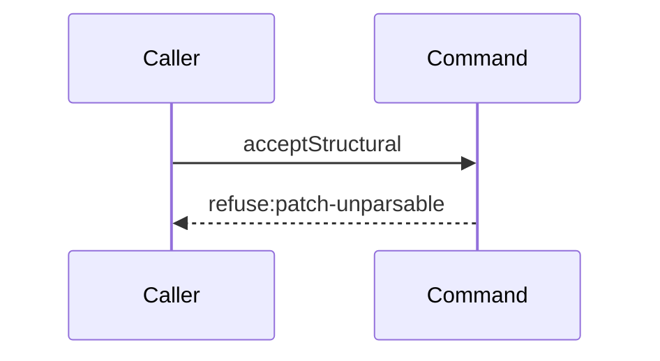

# Story 2 — An unparsable patch reaches no seam

Epic: `.agents/plan/epics/052.1-the-structural-acceptance.md`
Depends on: Story 1 (`01-the-lowering`), for the `authoredEpics` entry that makes this story's
scenario file legal; EPIC 052 Story 1 (`01-the-patch-shape-and-its-canonical-form`), for `graphPatch`,
`renderGraphPatch` and the duplicate-id refusal; EPIC 051.4 Story 7
(`07-the-gate-accepts-and-writes-the-checkpoint`), for the `src/commands/checkpoint/` directory and
the nested-callable precedent.
Kind: story-implement

Diagrams: accept-structural-refusal-unparsable

This story creates the command, its dependency type, its error class and its two pure refusals.
Stories 3 to 9 fill the body in refusal order, and EPIC 052.2 Story 2
(`02-the-report-route-carries-a-patch`) wires it into `reportOutcome`.

## The path

`acceptStructural` is written from nothing, so this diagram has an empty prior set, it draws no
`baseline-` diagram, and it declares no `Seams:` line because it holds no token to sign.

### `accept-structural-refusal-unparsable`

Fixture: a claimed expansion node `N` running under run `R` with one open attempt `A`, the authority
prelude already passed, and `input.patch` is the string `"{"`. The duplicate-id case uses the same
fixture with a patch holding two mutations naming one id.



**A diagram with no step is the strongest statement available.** It asserts the path reaches no seam
at all, so any call the implementation makes fails the comparison. That is exactly the property this
story owns: the parse and the duplicate-id scan are pure, they run before the command touches the
store, and a malformed patch therefore reads nothing.

**The drawn set is every branch of this path.** Two refusals stop here — `patch-unparsable` and
`patch-id-duplicate` — and they stop at the same step, which is no step, so they are one diagram.
The diagram states the first terminal; the code that separates the two is proven by case 2.

**No `storage.transact` appears, because `acceptStructural` holds no `storage` dependency.**
`src/commands/outcome/report-outcome.ts:107` — `transact` is the first statement of `reportOutcome`,
so a transaction is already open when this command is called, and a second one is neither needed nor
expressible.

Add `test/sequence/scenarios/accept-structural-refusal-unparsable.ts`.

## Change

**`src/commands/checkpoint/accept-structural.ts` — add the command, taking the caller's transaction
and opening none.**

### 1 — the dependency object and the input

```ts
export type AcceptStructuralDependencies = Readonly<{
  plan: PlanStore;
  blobs: BlobStore;
  graph: Graph;
  revision: Revision;
  execution: Execution;
  events: EventLog;
  ids: IdGenerator;
}>;

export type AcceptStructuralInput = Readonly<{
  node: StoredNode;
  subtreeIds: readonly string[];
  run: RunRecord;
  attemptId: string;
  attemptNo: number;
  patch: unknown;
  actorId: string;
  actorKind: "human" | "harness";
  now: number;
}>;

export function acceptStructural(
  dependencies: AcceptStructuralDependencies,
  transaction: Transaction,
  input: AcceptStructuralInput,
): NodeReportResult;
```

**There is no `storage` key and no `clock` key.**
`.agents/plan/epics/052.1-the-structural-acceptance.md:33` — `acceptStructural` rules that the command
takes the caller's transaction and opens none, because it writes no git and runs no command.
`.agents/plan/epics/054.3-the-report-members-pay-their-attempt.md:24` — `acceptStructural` cites
that ruling and depends on it. The transaction is the second positional parameter, exactly as
`reportObjective` at `src/commands/outcome/report-outcome.ts:59` — `reportObjective` takes it.

`clock` is absent because `reportOutcome` already read `now` at
`src/commands/outcome/report-outcome.ts:108` — `now`, and `test/helpers/clock.ts:6` — `calls`
increments the mock on every read, so a second read inside one transaction would stamp two different
times onto writes that must share one.

**The prelude supplies the authority.** `.agents/plan/epics/051.4-the-acceptance-gate-and-the-report-route.md:40`
— `assertRunAuthority` records that it is a pure function running inside `reportOutcome`. This command
asserts nothing about the run: it receives the claimed node, the claimed subtree, the run record that
carries `graphRevision`, `fence` and `attemptLimit`, and the open attempt.

### 2 — the error class

```ts
export type AcceptStructuralRefusal =
  | "patch-unparsable"
  | "patch-id-duplicate"
  | "stale-revision"
  | "patch-target-invalid"
  | "patch-scope-invalid"
  | "patch-project-invalid"
  | "plan-invalid"
  | "pair-fixed"
  | "expansion-empty";

export class AcceptStructuralError extends Error {
  readonly refusal: AcceptStructuralRefusal;
  readonly details: Readonly<Record<string, unknown>> | undefined;
}
```

**The field is named `refusal`, and the name is load-bearing.**
`test/helpers/sequence-conformance.ts:305` — `refusal` is what the harness reads to derive a diagram's
terminal. A field named anything else makes every refusal diagram of this epic read `refuse:error`.
`src/commands/outcome/report-outcome.ts:88` — `refusal` is the shipped precedent.

### 3 — the two pure refusals, before anything else

```ts
const parsed = graphPatch.safeParse(input.patch);
if (!parsed.success) {
  throw new AcceptStructuralError(
    "patch-unparsable",
    "the patch is not a graph patch",
  );
}
```

`graphPatch` is EPIC 052 Story 1's schema. The duplicate-id refusal is that story's too: whichever of
the two shapes it takes — a `superRefine` inside `graphPatch`, or a separate `patchIdVerdict` — this
command raises `patch-id-duplicate` for it and `patch-unparsable` for every other parse failure, so
the two codes stay distinct over the wire.

Nothing precedes these two statements. No read, no write and no seam call.

## Constraints

- The command opens no transaction, and its dependency object holds no `storage` key. A later story
  adding one is a defect.
- The two refusals raise before any use of `transaction`.
- The command imports no other command. `eslint.config.js:221` — `command` allows a command
  `domain/` and a service interface, and nothing else.
- `refusal` is a public readonly field of the error, not a message prefix.

## Verify

```
node --test src/commands/checkpoint/accept-structural.test.ts test/sequence/conformance.test.ts
```

Add `src/commands/checkpoint/accept-structural.test.ts`. Build the fixture the way
`src/commands/node/create-node.test.ts:126` — `build` does: `createMigratedStorage` at
`test/helpers/database.ts:32` — `createMigratedStorage`, `createPlanStore` at
`test/helpers/plan.ts:50` — `createPlanStore`, `createBlobStore` at `test/helpers/plan.ts:124` —
`createBlobStore`, `createRevision` at `test/helpers/plan.ts:128` — `createRevision`,
`createPlanGraph` at `test/helpers/plan.ts:136` — `createPlanGraph`, `createMockIdGenerator` at
`test/helpers/ids.ts:8` — `createMockIdGenerator`, and `createBackedExecutionFake` at
`test/helpers/execution.ts:220` — `createBackedExecutionFake`. Seed the graph with `seedPlanFixture`
at `test/helpers/plan.ts:172` — `seedPlanFixture` and the registry with `seedRegistry` at
`test/helpers/rows.ts:21` — `seedRegistry`. Dispose with `t.after(() => fixture.dispose())`.

Add, each as a separate `it`:

1. `"an unparsable patch refuses patch-unparsable and calls no dependency"` — pass `patch: "{"`.
   Assert `error.refusal` is `"patch-unparsable"`, and assert a recording proxy over the whole
   dependency object recorded zero calls. Build the proxy with `recordSeams` at
   `test/helpers/sequence-conformance.ts:99` — `recordSeams` and assert `recorder.tokens` deep-equals
   `[]`.

2. `"a duplicate id refuses patch-id-duplicate and calls no dependency"` — a patch holding a `create`
   of `X` and an `update` of `X`. Assert `error.refusal` is `"patch-id-duplicate"` and
   `recorder.tokens` deep-equals `[]`. Cases 1 and 2 together are the epic's gate row 7: the two codes
   stay distinct, and neither reaches a seam.

3. `"the control: a legal patch reaches the first seam"` — the same fixture with a well-formed patch.
   Assert `recorder.tokens[0]` is `"plan.newestRevision"`. Without it, cases 1 and 2 pass for a
   command that never calls anything.

4. `"the command receives the caller's transaction and opens none"` — call `acceptStructural` inside
   `storage.transact` and assert the object the command used is the one passed, by asserting the
   command completed with no nested `BEGIN`: the dependency object holds no `storage` key, asserted by
   `assert.equal(Object.hasOwn(dependencies, "storage"), false)`, and the write of case 3's control is
   visible to the outer transaction before it commits. This is the epic's gate row 8.

5. `"accept-structural.ts imports no other command"` — `pnpm run lint` exits 0, and the control is a
   temporary import of `src/commands/node/create-node.ts` into that file, which
   `eslint.config.js:221` — `command` must reject. This is the epic's gate row 31. It is owned here
   because this is the story that creates the file, and it is a build check rather than a test.

Add `test/sequence/scenarios/accept-structural-refusal-unparsable.ts`, building the fixture the
diagram names, running the real `acceptStructural` **directly** over real SQLite behind the recorder —
not over the `node.report` route — and catching the `AcceptStructuralError` and returning it as
`result`, as `test/sequence/scenarios/claim-refusal-objective-busy.ts:161` — `catch` does.

`pnpm run verify` exits 0.

Proof: PASS line delivered — `src/commands/checkpoint/accept-structural.test.ts` in
`PASS EPIC-052.1`.
