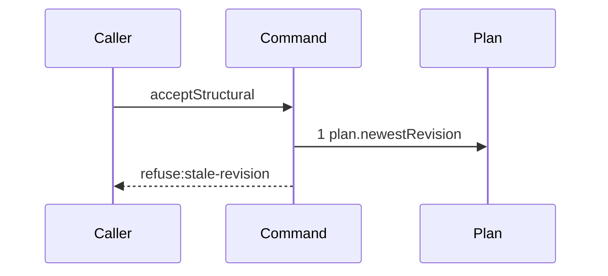

# Story 3 — A stale revision refuses before any graph read

Epic: `.agents/plan/epics/052.1-the-structural-acceptance.md`
Depends on: Story 2 (`02-an-unparsable-patch-reaches-no-seam`), for the command, its error class and
its two pure refusals.
Kind: story-implement

Diagrams: accept-structural-refusal-stale-revision

Seams: accept-structural-refusal-stale-revision: +plan.newestRevision

This story adds the compare and swap. Story 4 adds the graph read the swap protects.

## The path

`acceptStructural` is written from nothing, so this diagram has an empty prior set, it draws no
`baseline-` diagram, and its one token is `+`.

### `accept-structural-refusal-stale-revision`

Fixture: a claimed expansion node `N` running under run `R`, whose `run.graphRevision` names the
revision the claim pinned, and a second `plan_revision` row written after the claim, so the project's
newest revision is not the pinned one. The patch is well-formed and is also structurally invalid, so
the refusal proves an order and not an accident.



**The shape is the whole assertion.** One step, and `plan.readGraph` is not among them. A currentness
check placed after the graph read would draw two steps, so a regression that reorders the two fails
the comparison rather than passing on a matching refusal code.

**The drawn set is every branch of this path.** One refusal stops here. The success branch continues
into Story 4's read, and the two pure refusals never reach step 1 at all.

Add `test/sequence/scenarios/accept-structural-refusal-stale-revision.ts`.

## Change

**`src/commands/checkpoint/accept-structural.ts` — read the project's newest revision and compare it
to the run's pinned one, immediately after the two pure refusals.**

### 1 — the guard

```ts
const newest = dependencies.plan.newestRevision(
  transaction,
  input.node.projectId,
);
if (input.run.graphRevision !== newest) {
  throw new AcceptStructuralError(
    "stale-revision",
    `the run pinned ${String(input.run.graphRevision)}, the newest revision is ${String(newest)}`,
    { guard: "project", expected: newest, actual: input.run.graphRevision },
  );
}
```

`src/commands/node/create-node.ts:101` — `input.fromRevision` is the shipped pattern, and
`src/commands/node/create-node.ts:106` — `guard` is the shipped details shape. The guard value is the
string `"project"`, which is what `revisionGuardFor("create")` yields there and what
`src/commands/node/create-node.test.ts:455` — `guard` asserts.

**Equality is the only comparison.** `src/services/plan/index.ts:80` — `newestRevision` returns a
`string | null`, and EPIC 050 already decided `graph_revision` is compared by equality alone, never by
`<`, `>` or lexical adjacency.

### 2 — why the pinned graph is never read at a past revision

`src/services/plan/index.ts:71` — `readGraph` returns the live graph of a project and takes no
revision. `PlanStore` exposes no read of a graph at a past revision. "Validate against the pinned
graph" is therefore implementable exactly when the live graph **is** the pinned graph, and the
equality above is what establishes that. Every later story reads the live graph and calls it the
pinned graph on the strength of this one comparison.

## Constraints

- The read runs inside the caller's transaction. `src/services/plan/index.ts:80` — `newestRevision`
  takes it as its first parameter.
- Nothing reads the graph before this comparison. That is the property the diagram pins.
- The refusal code is the shipped `stale-revision`. `graph-contended` does not exist and is never
  added: `src/http/contract/errors.ts:14` — `stale-revision` already carries the condition, and a
  second code would split the contract error and the CLI exit code for no behavioural difference.

## Verify

```
node --test src/commands/checkpoint/accept-structural.test.ts test/sequence/conformance.test.ts
```

Extend `src/commands/checkpoint/accept-structural.test.ts` with the fixture Story 2 built. Write a
second `plan_revision` row after the claim with `seedSecondRevisionWithTask` at
`test/helpers/rows.ts:260` — `seedSecondRevisionWithTask`, or by a direct insert when that helper
carries a task the fixture does not want.

Add, each as a separate `it`:

1. `"a pinned revision that is not the newest refuses stale-revision"` — assert `error.refusal` is
   `"stale-revision"` and `error.details` deep-equals
   `{ guard: "project", expected: <the newest id>, actual: <the pinned id> }`, by value.

2. `"the stale refusal never reads the graph"` — the same input behind the recorder. Assert
   `recorder.tokens` deep-equals `["plan.newestRevision"]`, so `plan.readGraph` is provably absent.
   This is the second half of the epic's gate row 9.

3. `"a stale and structurally invalid patch refuses stale-revision"` — a patch that both arrives on a
   stale revision and names a `create` of an id the graph already holds. Assert `error.refusal` is
   `"stale-revision"` and not `"patch-target-invalid"`. This is the epic's gate row 10, the case that
   proves the reordering ruling.

4. `"the control: the same patch on the newest revision refuses patch-target-invalid"` — the input of
   case 3 with the pinned revision equal to the newest. Assert `error.refusal` is
   `"patch-target-invalid"`. Without it, case 3 passes for a command that refuses `stale-revision`
   unconditionally.

Add `test/sequence/scenarios/accept-structural-refusal-stale-revision.ts`, building the fixture the
diagram names, running the real `acceptStructural` directly over real SQLite behind the recorder, and
catching the `AcceptStructuralError` and returning it as `result`.

`pnpm run verify` exits 0.

Proof: PASS line delivered — `src/commands/checkpoint/accept-structural.test.ts` in
`PASS EPIC-052.1`.
