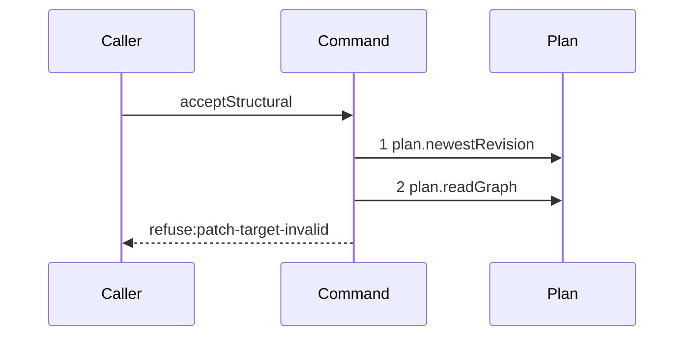

# Story 4 — A resolved target or scope

Epic: `.agents/plan/epics/052.1-the-structural-acceptance.md`
Depends on: Story 3 (`03-a-stale-revision-refuses-before-any-graph-read`), for the currentness guard
that makes the live graph the pinned graph; EPIC 052 Story 2
(`02-the-staged-graph-and-target-legality`), for `stagePatch` and `patchTargetVerdict`; EPIC 052
Story 3 (`03-scope-and-project`), for `patchScopeVerdict`.
Kind: story-implement

Diagrams: accept-structural-refusal-shape-resolved

Seams: accept-structural-refusal-shape-resolved: +plan.newestRevision, +plan.readGraph

This story adds the graph read and the two verdicts that decide on the graph alone. Story 5
(`05-an-unresolved-reference-reaches-the-resolver`) adds the cross-project resolver and the third
verdict. Story 7 (`07-an-invalid-staged-graph-or-an-empty-expansion`) adds the validator.

## The path

`acceptStructural` is written from nothing, so this diagram has an empty prior set, it draws no
`baseline-` diagram, and both of its tokens are `+`.

### `accept-structural-refusal-shape-resolved`

Fixture: a claimed expansion node `N` running under run `R`, the pinned revision equal to the newest,
and a patch holding one `create` whose `id` is the id of a node the pinned graph already holds. The
scope case reuses the fixture with one mutation changed: an `update` naming a node the pinned graph
holds outside `N`'s subtree. **Every id of both fixtures resolves in the staged graph**, so the
cross-project resolver is not read on either.



**Two refusals stop at step 2, so they are one diagram.** `patch-target-invalid` for a `create`
naming an existing id, and `patch-scope-invalid`, are decided by two pure verdicts over the pinned
graph and the staged graph, and the recorder cannot see a pure predicate. The diagram states the
first terminal; `.agents/plan/authoring.md` puts the code that separates them in the refusal test,
and cases 1 and 2 carry it.

**The third shape refusal is not on this path.** `patch-project-invalid`, and `patch-target-invalid`
for an `update` or a `delete` naming an id the pinned graph does not hold, both read
`plan.nodeProjects` first, so they stop one step later and Story 5
(`05-an-unresolved-reference-reaches-the-resolver`) draws them. One refusal group therefore appears
on two diagrams, on two fixtures. That is the fixed refusal order, not two orders: the group is one
position in the chain, and the seam it reaches depends on whether the patch names an id the staged
graph holds.

**The staging is invisible here.** `stagePatch` is a pure function, so it is no message. What it
decides is proven by EPIC 052 Story 2 (`02-the-staged-graph-and-target-legality`)'s own unit test.

**The drawn set is every branch of this path.** Two refusals precede step 1 and one stops at step 1,
each with its own diagram in Stories 2 and 3; every later refusal reads more than the graph and draws
its own. A fixture of either refusal that also names an unresolved id reaches Story 5's trace, and
case 4 asserts that fixture rather than drawing it, per `.agents/plan/authoring.md:187`.

Add `test/sequence/scenarios/accept-structural-refusal-shape-resolved.ts`.

## Change

**`src/commands/checkpoint/accept-structural.ts` — read the pinned graph once, stage the patch onto
it, and run the target and scope verdicts in that order.**

### 1 — the one graph read

```ts
const pinned = dependencies.plan.readGraph(transaction, input.node.projectId);
const staged = stagePatch(pinned, parsed.data);
```

`src/services/plan/index.ts:71` — `readGraph` returns `{ nodes, edges }` for the whole project. It is
read **once**, and every later story reads `pinned` and `staged` from these two locals rather than
calling the seam again. A second `plan.readGraph` in one path is a duplicate token the parser refuses,
and it is also a second answer to a question already asked inside one transaction.

### 2 — the unresolved-id union, computed here and read by Story 5

```ts
const unresolvedIds = patchUnresolvedIds({
  pinned,
  staged,
  patch: parsed.data,
});
```

The set is every id the patch names — a target, a `parentId`, a `dependsOn` entry — that neither the
pinned graph nor the staged graph holds, sorted bytewise by `Buffer.compare` over the utf-8 bytes of
the id. It is computed once, beside the staging, because both verdict groups read it. **It is pure**,
so it is no message, and this story computes it while Story 5
(`05-an-unresolved-reference-reaches-the-resolver`) is the story that reads a seam with it. Ask EPIC
052 for the helper if `stagePatch` does not already expose the set; the amendment bullet of the epic
names the ask.

### 3 — the two verdicts that need no projection

```ts
const target = patchTargetVerdict({
  pinned,
  patch: parsed.data,
  unresolvedIds,
});
if (target !== null && unresolvedIds.length === 0)
  throw new AcceptStructuralError(
    "patch-target-invalid",
    target.message,
    target.details,
  );

const scope = patchScopeVerdict({
  pinned,
  staged,
  patch: parsed.data,
  claimedNodeId: input.node.id,
  subtreeIds: input.subtreeIds,
});
if (scope !== null)
  throw new AcceptStructuralError(
    "patch-scope-invalid",
    scope.message,
    scope.details,
  );
```

The two verdict functions are EPIC 052's, and their exact return shapes are that epic's. This command
adds no predicate: it orders them and maps each to its code.

**A target refusal waits for the projection when an id is unresolved.** `unresolvedIds.length === 0`
is the guard: with no unresolved id the target verdict is final here, and with one the answer may be
`patch-project-invalid` instead, which Story 5 decides after the projection. Reporting the target
first would make `patch-project-invalid` unreachable, which is the reachability hole the epic's
three-way rule closes.

**Scope judges a reference that resolves, and never one that is absent.**
`.agents/plan/epics/052.1-the-structural-acceptance.md:54` — `Scope` states the rule. An id in
`unresolvedIds` is out of this verdict's reach by construction, so no scope refusal ever consumes a
route to the project refusal.

## Constraints

- `plan.readGraph` is called exactly once on every path of this command.
- Both verdicts are pure. Neither opens a read of its own.
- The subtree comes from `input.subtreeIds`, which the prelude read. This command does not call
  `plan.readSubtree`.
- `unresolvedIds` is sorted bytewise and de-duplicated at the point it is built, so Story 5's seam
  argument is deterministic.
- No verdict is skipped when an earlier one passes. Each refusal names its own code.

## Verify

```
node --test src/commands/checkpoint/accept-structural.test.ts test/sequence/conformance.test.ts
```

Extend `src/commands/checkpoint/accept-structural.test.ts`.

Add, each as a separate `it`:

1. `"a create naming an existing id refuses patch-target-invalid"` — assert `error.refusal` is
   `"patch-target-invalid"` and that the message names the id, by value.

2. `"an update outside the pinned subtree refuses patch-scope-invalid"` — an `update` of the sibling
   objective of `N`. Assert `error.refusal` is `"patch-scope-invalid"` and the named id by value.
   Cases 1 and 2 are the epic's gate row 11, first half.

3. `"neither resolved refusal reads the projection or the validation context"` — run cases 1 and 2
   behind the recorder and assert `recorder.tokens` deep-equals
   `["plan.newestRevision", "plan.readGraph"]` for both. This is the second half of the epic's gate
   row 11, and it is what the diagram's two steps assert.

**The longer trace of this diagram's two refusals is Story 5's case 5**
(`05-an-unresolved-reference-reaches-the-resolver`): a scope refusal whose patch also names an
unresolved id refuses the same code one step later. It is asserted there and not drawn anywhere, per
`.agents/plan/authoring.md:187`, and it is what makes this diagram's branch-coverage claim checkable.
It is not a case of this story, because it cannot be green before the resolver exists.

Add `test/sequence/scenarios/accept-structural-refusal-shape-resolved.ts`, building the
target-invalid fixture the diagram names, running the real `acceptStructural` directly over real
SQLite behind the recorder, and catching the `AcceptStructuralError` and returning it as `result`.

`pnpm run verify` exits 0.

Proof: PASS line delivered — `src/commands/checkpoint/accept-structural.test.ts` in
`PASS EPIC-052.1`.
