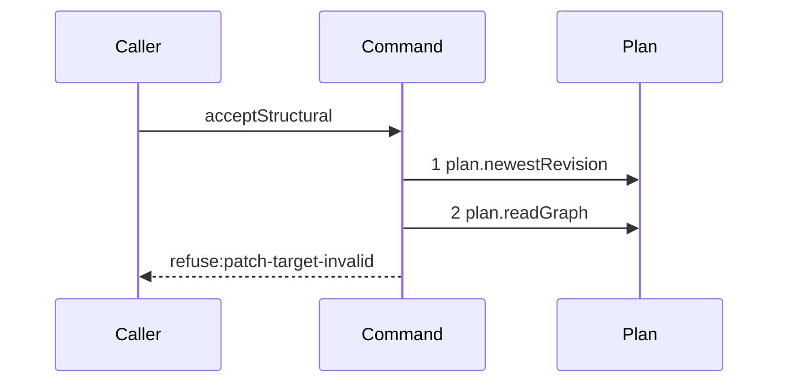

# Story 4 — An illegal target, scope or project

Epic: `.agents/plan/epics/052.1-the-structural-acceptance.md`
Depends on: Story 3 (`03-a-stale-revision-refuses-before-any-graph-read`), for the currentness guard
that makes the live graph the pinned graph; EPIC 052 Story 2
(`02-the-staged-graph-and-target-legality`), for `stagePatch` and `patchTargetVerdict`; EPIC 052
Story 3 (`03-scope-and-project`), for `patchScopeVerdict` and `patchProjectVerdict`.
Kind: story-implement

Diagrams: accept-structural-refusal-patch-illegal

Seams: accept-structural-refusal-patch-illegal: +plan.newestRevision, +plan.readGraph

This story adds the graph read and the three pure verdicts it feeds. Story 5 adds the validator.

## The path

`acceptStructural` is written from nothing, so this diagram has an empty prior set, it draws no
`baseline-` diagram, and both of its tokens are `+`.

### `accept-structural-refusal-patch-illegal`

Fixture: a claimed expansion node `N` running under run `R`, the pinned revision equal to the newest,
and a patch holding one `create` whose `id` is the id of a node the pinned graph already holds. The
scope and project cases reuse the fixture with one mutation changed: an `update` naming a node outside
`N`'s subtree, and a `create` whose `parentId` names a node of a second project seeded beside the
first.



**Three refusals stop at step 2, so they are one diagram.** `patch-target-invalid`,
`patch-scope-invalid` and `patch-project-invalid` are decided by three pure verdicts over the pinned
graph and the staged graph, and the recorder cannot see a pure predicate. The diagram states the first
terminal; `.agents/plan/authoring.md` puts the code that separates them in the refusal test, and cases
1 to 4 carry it.

**The staging is invisible here.** `stagePatch` is a pure function, so it is no message. What it
decides is proven by EPIC 052 Story 2's own unit test.

**The drawn set is every branch of this path.** Two refusals precede step 1 and one stops at step 1,
each with its own diagram in Stories 2 and 3; every later refusal reads more than the graph and draws
its own.

Add `test/sequence/scenarios/accept-structural-refusal-patch-illegal.ts`.

## Change

**`src/commands/checkpoint/accept-structural.ts` — read the pinned graph once, stage the patch onto
it, and run the three verdicts in the fixed order target, scope, project.**

### 1 — the one graph read

```ts
const pinned = dependencies.plan.readGraph(transaction, input.node.projectId);
const staged = stagePatch(pinned, parsed.data);
```

`src/services/plan/index.ts:71` — `readGraph` returns `{ nodes, edges }` for the whole project. It is
read **once**, and every later story reads `pinned` and `staged` from these two locals rather than
calling the seam again. A second `plan.readGraph` in one path is a duplicate token the parser refuses,
and it is also a second answer to a question already asked inside one transaction.

### 2 — the three verdicts, in order

```ts
const target = patchTargetVerdict({ pinned, patch: parsed.data });
if (target !== null)
  throw new AcceptStructuralError(
    "patch-target-invalid",
    target.message,
    target.details,
  );

const scope = patchScopeVerdict({
  pinned,
  staged,
  patch: parsed.data,
  claimedNodeId: input.node.id,
  subtreeIds: input.subtreeIds,
});
if (scope !== null)
  throw new AcceptStructuralError(
    "patch-scope-invalid",
    scope.message,
    scope.details,
  );

const project = patchProjectVerdict({
  pinned,
  staged,
  patch: parsed.data,
  projectId: input.node.projectId,
});
if (project !== null)
  throw new AcceptStructuralError(
    "patch-project-invalid",
    project.message,
    project.details,
  );
```

The three verdict functions are EPIC 052's, and their exact return shapes are that epic's. This
command adds no predicate: it orders the three and maps each to its code.

**Project precedes graph validation, and the order is load-bearing.** A cross-project `dependsOn`
entry is simultaneously an unresolved reference, out of scope and cross-project. `findingScope` at
`src/domain/plan-finding.ts:64` — `reference-unresolved` scopes that finding as structural, so a
project check placed after `validateCandidateStructural` is a refusal no input can reach. Case 4
proves it.

**Scope precedes project because a created node is not in the pinned subtree.** The scope verdict is
the only one that judges a created node's final parent against the staged graph, and a project check
that ran first would answer a question about a node the scope rule has not yet admitted.

## Constraints

- `plan.readGraph` is called exactly once on every path of this command.
- The three verdicts are pure. No verdict opens a read of its own.
- The subtree comes from `input.subtreeIds`, which the prelude read. This command does not call
  `plan.readSubtree`.
- No verdict is skipped when an earlier one passes. Each refusal names its own code.

## Verify

```
node --test src/commands/checkpoint/accept-structural.test.ts test/sequence/conformance.test.ts
```

Extend `src/commands/checkpoint/accept-structural.test.ts`. Seed the second project with
`seedRegistry` at `test/helpers/rows.ts:21` — `seedRegistry` and a second graph, so a cross-project
reference names a node that really exists.

Add, each as a separate `it`:

1. `"a create naming an existing id refuses patch-target-invalid"` — assert `error.refusal` is
   `"patch-target-invalid"` and that the message names the id, by value.

2. `"an update outside the pinned subtree refuses patch-scope-invalid"` — an `update` of the sibling
   objective of `N`. Assert `error.refusal` is `"patch-scope-invalid"` and the named id by value.

3. `"a create whose parent is in another project refuses patch-project-invalid"` — assert
   `error.refusal` is `"patch-project-invalid"`. Cases 1, 2 and 3 are the epic's gate row 11.

4. `"none of the three refusals reads the validation context"` — run each of cases 1, 2 and 3 behind
   the recorder and assert `recorder.tokens` deep-equals `["plan.newestRevision", "plan.readGraph"]`
   for all three. This is the second half of the epic's gate row 11, and it is what the diagram's two
   steps assert.

5. `"a cross-project dependsOn entry refuses patch-project-invalid and not plan-invalid"` — a `create`
   inside `N`'s subtree whose `dependsOn` names a node of the second project, driven through the real
   command. Assert `error.refusal` is `"patch-project-invalid"`. This is the epic's gate row 12.

6. `"the control: the same entry reaches plan-invalid when the project verdict is removed"` — call
   `validateCandidateStructural` directly over the staged graph of case 5 and assert it returns a
   `reference-unresolved` finding. Without it, case 5 passes for an ordering nobody can observe.

Add `test/sequence/scenarios/accept-structural-refusal-patch-illegal.ts`, building the target-invalid
fixture the diagram names, running the real `acceptStructural` directly over real SQLite behind the
recorder, and catching the `AcceptStructuralError` and returning it as `result`.

`pnpm run verify` exits 0.

Proof: PASS line delivered — `src/commands/checkpoint/accept-structural.test.ts` in
`PASS EPIC-052.1`.
