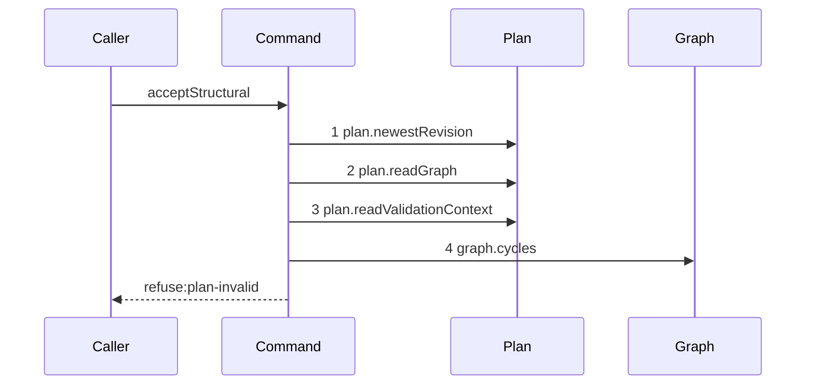

# Story 5 — An invalid staged graph refuses

Epic: `.agents/plan/epics/052.1-the-structural-acceptance.md`
Depends on: Story 4 (`04-an-illegal-target-scope-or-project`), for the pinned graph, the staged graph
and the three verdicts that precede validation.
Kind: story-implement

Diagrams: accept-structural-refusal-plan-invalid

Seams: accept-structural-refusal-plan-invalid: +plan.newestRevision, +plan.readGraph, +plan.readValidationContext, +graph.cycles

This story adds the shipped structural validator. Story 6 adds the two policies that follow it.

## The path

`acceptStructural` is written from nothing, so this diagram has an empty prior set, it draws no
`baseline-` diagram, and all four of its tokens are `+`.

### `accept-structural-refusal-plan-invalid`

Fixture: a claimed expansion node `N` running under run `R`, the pinned revision equal to the newest,
`N` holding two children `C1` and `C2` with the one edge `C1 -> C2`, and a patch that replaces `C2`'s
`dependsOn` with `[C1]` while leaving `C1`'s `dependsOn` as `[C2]`. The staged graph therefore holds
the two-node cycle `C1 -> C2 -> C1`, and every earlier verdict passes because both ids are inside the
claimed subtree and inside the project.



**Step 4 is the only message the validator makes.** `validateCandidateStructural` is a pure domain
function, so its own decisions are invisible at this seam. It reaches the recorder exactly once,
through the `findCycles` capability the command injects, and
`src/domain/plan-candidate.ts:292` — `findCycles` calls it once per validation.

**The drawn set is every branch of this path.** One refusal stops at step 4 — `plan-invalid`, whatever
finding carries it — because `findingScope` at `src/domain/plan-finding.ts:44` — `findingScope` scopes
every structural finding to one code. `pair-illegal` is one of those findings, not a second refusal:
`src/domain/plan-finding.ts:59` — `pair-illegal` is scoped `structural`.

Add `test/sequence/scenarios/accept-structural-refusal-plan-invalid.ts`.

## Change

**`src/commands/checkpoint/accept-structural.ts` — express the staged graph as a `Candidate` and pass
it to the shipped validator, exactly as `create-node` does.**

### 1 — the validation context and the candidate

```ts
const context = dependencies.plan.readValidationContext(
  transaction,
  input.node.projectId,
);
const candidate: Candidate = { nodes: staged.nodes.map(toCandidateNode) };
```

`src/services/plan/index.ts:90` — `readValidationContext` returns `workerKinds`,
`boundRepositories` and `knownRepositories`. `toCandidateNode` maps one staged node to the
`CandidateNode` shape at `src/domain/plan-candidate.ts:15` — `CandidateNode`, carrying `source:
"database"` for a node the pinned graph already held and `source: "submitted"` for one the patch
creates. `repositoryId` on a `CandidateNode` is the repository **name**, as
`src/commands/node/create-node.ts:212` — `repositoryId` shows, so the map resolves each id to its name
from the rows `readValidationContext` already named.

**`CandidateNode` requires three fields the staged graph does not carry, and each has one source.**
`StagedNode` holds nine fields and none of `title`, `instructionBlob` or `acceptanceBlob`.

| field             | source                                                                                            |
| ----------------- | ------------------------------------------------------------------------------------------------- |
| `title`           | the mutation, when it names `title`; the pinned row otherwise                                     |
| `instructionBlob` | `dependencies.blobs.hash(encoder.encode(prose))` for named prose; the pinned row's hash otherwise |
| `acceptanceBlob`  | the same rule, and `null` for a node that is not a task                                           |

**The hash is read, and the blob is not written.** `src/services/blob/index.ts:24` — `hash` computes a
content hash and writes nothing, and `src/services/blob/sqlite.ts:24` — `put` returns that same hash
for the same bytes. So the candidate carries the true hash of a node the patch creates, while every
`blobs.put` stays after the last refusal, which is the epic's Decision at
`.agents/plan/epics/052.1-the-structural-acceptance.md:55` — `orphan`. A fabricated empty string would
be inert — nothing structural reads the field — and it would still be a false value in a domain value.

`blobs.hash` is a seam call, so a patch that creates a node with prose draws it. **No fixture of this
epic creates such a node**: this story's patch replaces a `dependsOn` list, Story 6's changes a
`deliverable`, and Story 7's changes a `title`. The create path's hash calls are asserted by Story 7
(`07-the-accepted-patch`) case 8.

### 2 — the validator, and the shipped refusal

```ts
const findings = validateCandidateStructural(
  { findCycles: (graphInput) => dependencies.graph.cycles(graphInput) },
  { candidate, context },
);
if (findings.length > 0) {
  throw new AcceptStructuralError(
    "plan-invalid",
    "the patch builds an invalid graph",
    { findings },
  );
}
```

`src/commands/node/create-node.ts:220` — `validateCandidateStructural` is the shipped call, and
`src/commands/node/create-node.ts:226` — `plan-invalid` is the shipped refusal with its `findings`
details. This epic adds no second code for a condition the validator already names.

**Completeness is not checked here.** `validateCandidateStructural` at
`src/domain/plan-candidate.ts:304` — `validateCandidateStructural` filters to the `structural` scope,
so `initiative-without-objective` and `objective-without-task` never reach this refusal.
`.agents/plan/epics/052.1-the-structural-acceptance.md:22` — `claim-node.ts` states this epic touches
neither the claim nor `src/domain/plan-completeness.ts`, and the at-least-one-child rule of Story 6 is
what bounds the exemption instead.

## Constraints

- `plan.readValidationContext` is called once, after the three verdicts and before the validator.
- `graph.cycles` reaches the recorder exactly once. A second call is a duplicate token the parser
  refuses, and it is also a second answer to one question inside one transaction.
- The refusal carries `{ findings }` and nothing else, matching
  `src/commands/node/create-node.ts:228` — `findings`.
- No finding code becomes a refusal code of its own.

## Verify

```
node --test src/commands/checkpoint/accept-structural.test.ts test/sequence/conformance.test.ts
```

Extend `src/commands/checkpoint/accept-structural.test.ts`. Use the real `GraphologyGraph` through
`createPlanGraph` at `test/helpers/plan.ts:136` — `createPlanGraph`, never the stub at
`test/helpers/graph.ts:27` — `createGraphService`, because that stub returns `[]` for `cycles` and
would make case 1 pass against a validator that finds nothing.

Add, each as a separate `it`:

1. `"a staged dependency cycle refuses plan-invalid carrying the dependency-cycle finding"` — the
   fixture states the exact initial edge set `[C1 -> C2]` and the exact final closure
   `[C1 -> C2, C2 -> C1]`. Assert `error.refusal` is `"plan-invalid"` and that
   `error.details.findings.map((finding) => finding.code)` deep-equals `["dependency-cycle"]`.

2. `"a patch removing edge A to B while adding B to A passes"` — the same two children, the patch
   replacing `C1`'s `dependsOn` with `[]` and `C2`'s with `[C1]`. Assert the command returns a result
   and throws nothing. Cases 1 and 2 are the epic's gate row 13: staging judges the final graph, never
   a transient one.

3. `"a created node whose kind and deliverable are an illegal pair refuses plan-invalid carrying
pair-illegal"` — a `create` of a task whose `deliverable` is `expansion`, which
   `src/domain/node-pair.ts:54` — `expansion` refuses. Assert `error.refusal` is `"plan-invalid"` and
   the finding codes deep-equal `["pair-illegal"]`. This is the epic's gate row 14: the pair table
   reaches the patch through the shipped validator and not a second code.

4. `"a created node carries the true hash of its instruction prose in the candidate"` — a patch
   creating one node with prose. Assert the `CandidateNode` the command built holds
   `blobs.hash(encoder.encode(instruction))` by value, and assert the `blob` table is unchanged, so
   the hash is read and nothing is written before validation.

5. `"the plan-invalid refusal reads the context and the cycles once each"` — case 1 behind the
   recorder. Assert `recorder.tokens` deep-equals
   `["plan.newestRevision", "plan.readGraph", "plan.readValidationContext", "graph.cycles"]`.

6. `"a task parented under an atomic objective refuses plan-invalid carrying pair-shape-violated"` —
   an `update` that reparents an existing task under an objective whose `deliverable` is
   `implementation`. Assert `error.refusal` is `"plan-invalid"` and the finding codes deep-equal
   `["pair-shape-violated"]`. Then the same reparent under an objective whose `deliverable` is
   `expansion` returns a result. This is the epic's gate row 14a, and the second half is the control
   that proves the rule is not vacuous.
   `docs/proposal/phase-2/deliverables-and-pairs.md:28` — `Shape and children` states the rule.

Add `test/sequence/scenarios/accept-structural-refusal-plan-invalid.ts`, building the fixture the
diagram names, running the real `acceptStructural` directly over real SQLite and the real
`GraphologyGraph` behind the recorder, and catching the `AcceptStructuralError` and returning it as
`result`.

`pnpm run verify` exits 0.

Proof: PASS line delivered — `src/commands/checkpoint/accept-structural.test.ts` in
`PASS EPIC-052.1`.
