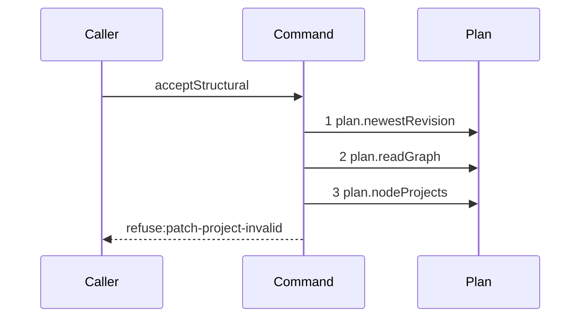

# Story 5 — An unresolved reference reaches the resolver

Epic: `.agents/plan/epics/052.1-the-structural-acceptance.md`
Depends on: Story 4 (`04-a-resolved-target-or-scope`), for the one graph read, the staging and the
`unresolvedIds` set; EPIC 052 Story 3 (`03-scope-and-project`), for `patchProjectVerdict` and the
cross-project projection it takes; EPIC 052 Story 5 (`05-the-seams-the-acceptance-needs`), for
`plan.nodeProjects`.
Kind: story-implement

Diagrams: accept-structural-refusal-shape-unresolved

Seams: accept-structural-refusal-shape-unresolved: +plan.newestRevision, +plan.readGraph, +plan.nodeProjects

This story adds the cross-project resolver and the third shape verdict. It closes the shape group.
Story 6 (`06-a-fixed-pair-refuses-before-the-validator`) adds the pair policy.

## The path

`acceptStructural` is written from nothing, so this diagram has an empty prior set, it draws no
`baseline-` diagram, and all three of its tokens are `+`.

### `accept-structural-refusal-shape-unresolved`

Fixture: a claimed expansion node `N` running under run `R`, the pinned revision equal to the newest,
a **second project** seeded beside the first holding one node `F`, and a patch holding one `create`
inside `N`'s subtree whose `dependsOn` names `F`. `F` is absent from the staged graph, because
`src/services/plan/sqlite.ts:154` — `project_id` scopes `readGraph` to one project, so `F` is in
`unresolvedIds` and the projection resolves it. **`unresolvedIds` holds exactly one id**, so
`plan.nodeProjects` is called once with a one-element set; a longer set is still one call, and case 4
asserts the argument.



**Two refusals stop at step 3, so they are one diagram.** `patch-project-invalid`, and
`patch-target-invalid` for an `update` or a `delete` naming an id the pinned graph does not hold, are
decided by two pure verdicts over the value step 3 returns. The diagram states the first terminal,
and cases 1 and 2 carry the code that separates them.

**Step 3 is a bulk read over an id set, and it fires only when that set is non-empty.** A patch whose
every id resolves in the staged graph asks the projection nothing, so it never reaches this step and
Story 4 (`04-a-resolved-target-or-scope`) draws its trace. Case 4 asserts both halves.
`.agents/plan/epics/052.1-the-structural-acceptance.md:72` — `conditional` states why the read is not
made unconditional to give the two shape fixtures one trace.

**The drawn set is every branch of this path.** The shape group has exactly two traces, this one and
Story 4's, because `unresolvedIds` is either empty or it is not. Every later refusal reads the
validation context and draws its own.

Add `test/sequence/scenarios/accept-structural-refusal-shape-unresolved.ts`.

## Change

**`src/commands/checkpoint/accept-structural.ts` — resolve the unresolved ids across projects, then
decide the target and project verdicts the projection settles.**

### 1 — the conditional bulk read

```ts
const projects =
  unresolvedIds.length === 0
    ? []
    : dependencies.plan.nodeProjects(transaction, unresolvedIds);
```

`plan.nodeProjects(transaction, ids): readonly Readonly<{ id: string; projectId: string }>[]` is the
seam EPIC 052 Story 5 (`05-the-seams-the-acceptance-needs`) adds; the epic's
`## Amendments this epic asks of other epics` carries the ask. It returns one entry per id that
resolves anywhere, and no entry for an id no project holds. **It reads across every project**, which
`plan.readGraph` cannot, and that is the whole reason the seam exists:
`.agents/plan/stories/052-the-graph-patch-and-its-policies/03-scope-and-project.md:97` — `EPIC 052.1`
leaves the choice to this epic.

**It is not `plan.readAllNodes`.** `src/services/plan/sqlite.ts:186` — `readAllNodes` takes no id set
and reads every node and every edge of every project, so it is a full scan inside the acceptance
transaction. `src/services/plan/sqlite.ts:338` — `readSubtreeExecutionFacts` is the shipped
bulk `IN (...)` read over an id set, and `nodeProjects` follows it.

### 2 — the two verdicts the projection settles

```ts
const project = patchProjectVerdict({
  pinned,
  staged,
  patch: parsed.data,
  projectId: input.node.projectId,
  nodeProjects: projects,
});
if (project !== null)
  throw new AcceptStructuralError(
    "patch-project-invalid",
    project.message,
    project.details,
  );

if (target !== null)
  throw new AcceptStructuralError(
    "patch-target-invalid",
    target.message,
    target.details,
  );
```

`target` is the verdict Story 4 (`04-a-resolved-target-or-scope`) computed and held. **The project
refusal is raised first**, because an id the projection holds belongs to another project and reporting
it as an absent target tells a caller to create a node that already exists.
`.agents/plan/epics/052.1-the-structural-acceptance.md:54` — `Scope` states the three-way rule: the
staged graph holds it and it is out of subtree, so `patch-scope-invalid`; the projection holds it and
the staged graph does not, so `patch-project-invalid`; neither holds it, so `patch-target-invalid`
for a mutation target and `plan-invalid` for a reference.

**An unresolved reference that is not a mutation target falls through both verdicts.** A `parentId`
or a `dependsOn` entry no project holds is `src/domain/plan-candidate.ts:107` — `parent-missing` or
`src/domain/plan-candidate.ts:248` — `reference-unresolved`, and Story 7
(`07-an-invalid-staged-graph-or-an-empty-expansion`) raises the shipped `plan-invalid` for it. Case 3
is that fall-through, and without it the project verdict reads as covering every unresolved id.

## Constraints

- `plan.nodeProjects` is called at most once per command run, and never with an empty id set.
- The id set is the bytewise-sorted, de-duplicated `unresolvedIds` Story 4 built. Do not rebuild it
  here, and do not pass the whole patch.
- `patchProjectVerdict` is pure. It never reads the pinned graph and never reads `repositoryId`.
- The project refusal precedes the target refusal on this path. Both were computed before either is
  raised, so no verdict is skipped.
- This command still does not call `plan.readSubtree`, `plan.readAllNodes` or `plan.readNode`.

## Verify

```
node --test src/commands/checkpoint/accept-structural.test.ts test/sequence/conformance.test.ts
```

Extend `src/commands/checkpoint/accept-structural.test.ts`. Seed the second project with
`seedRegistry` at `test/helpers/rows.ts:21` — `seedRegistry` and a second graph, so a cross-project
reference names a node that really exists.

Add, each as a separate `it`:

1. `"a create whose dependsOn names a node of another project refuses patch-project-invalid"` — the
   diagram's fixture, driven through the real command. Assert `error.refusal` is
   `"patch-project-invalid"` and that the details name `F` by value. This is the epic's gate row 12.

2. `"an update naming an id no project holds refuses patch-target-invalid after the projection"` —
   an `update` of an id neither graph holds. Assert `error.refusal` is `"patch-target-invalid"`, and
   behind the recorder assert `recorder.tokens` deep-equals
   `["plan.newestRevision", "plan.readGraph", "plan.nodeProjects"]`. This is the epic's gate row 11a,
   and it is what proves the three-way rule reports the project and not the target.

3. `"an unresolved dependsOn entry no project holds reaches plan-invalid and not patch-project-invalid"`
   — the same fixture as case 1 with `F` removed from the second project. Assert `error.refusal` is
   `"plan-invalid"` and that the findings carry `reference-unresolved`. The control for case 1:
   without it, case 1 passes for a verdict that refuses every unresolved id. It runs green once
   Story 7 (`07-an-invalid-staged-graph-or-an-empty-expansion`) lands and is written there; name it
   here and do not duplicate it.

4. `"the projection is read once over the unresolved union, and not at all when every id resolves"` —
   two runs behind the recorder. The first is a patch naming two unresolved ids: assert
   `plan.nodeProjects` is recorded exactly once and that its `ids` argument deep-equals the two ids
   in bytewise order. The second is a legal patch whose every id resolves: assert `recorder.tokens`
   holds no `plan.nodeProjects`. This is the epic's gate row 12a, and the second half is the control
   that makes the read conditional rather than a prelude.

5. `"a scope refusal whose patch also names an unresolved id refuses patch-scope-invalid one step
later"` — the Story 4 (`04-a-resolved-target-or-scope`) scope fixture plus one `create` whose
   `dependsOn` names an unresolved id. Assert `error.refusal` is `"patch-scope-invalid"` and that
   `recorder.tokens` deep-equals
   `["plan.newestRevision", "plan.readGraph", "plan.nodeProjects"]`. This is the reachable trace
   neither diagram draws, asserted per `.agents/plan/authoring.md:187`, and it is what makes Story 4's
   branch-coverage claim checkable.

Add `test/sequence/scenarios/accept-structural-refusal-shape-unresolved.ts`, building the
project-invalid fixture the diagram names, running the real `acceptStructural` directly over real
SQLite behind the recorder, and catching the `AcceptStructuralError` and returning it as `result`.

`pnpm run verify` exits 0.

Proof: PASS line delivered — `src/commands/checkpoint/accept-structural.test.ts` in
`PASS EPIC-052.1`.
