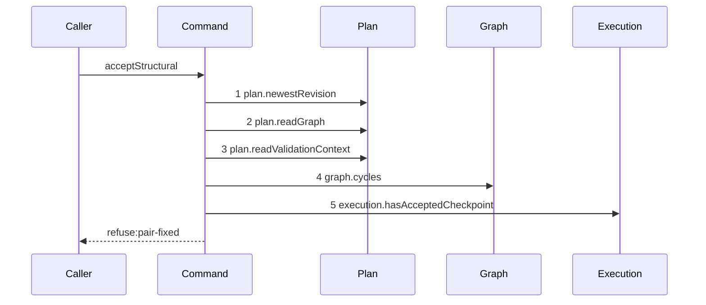

# Story 6 — A fixed pair or an empty expansion

Epic: `.agents/plan/epics/052.1-the-structural-acceptance.md`
Depends on: Story 5 (`05-an-invalid-staged-graph-refuses`), for the validator that precedes the two
policies; EPIC 052 Story 4 (`04-the-two-structural-policies`), for `pairChangeVerdict` and
`expansionVerdict`; EPIC 052 Story 5 (`05-the-seams-the-acceptance-needs`), for
`execution.hasAcceptedCheckpoint`.
Kind: story-implement

Diagrams: accept-structural-refusal-policy

Seams: accept-structural-refusal-policy: +plan.newestRevision, +plan.readGraph, +plan.readValidationContext, +graph.cycles, +execution.hasAcceptedCheckpoint

This story closes the refusal order. Story 7 adds the writes that follow it.

## The path

`acceptStructural` is written from nothing, so this diagram has an empty prior set, it draws no
`baseline-` diagram, and all five of its tokens are `+`.

### `accept-structural-refusal-policy`

Fixture: a claimed expansion node `N` running under run `R`, the pinned revision equal to the newest,
`N` holding one child objective `C` whose `deliverable` is `implementation`, one accepted `checkpoint`
row naming `C`, and a patch holding one `update` of `C` that names `deliverable: "test"`. **Exactly
one node of the patch changes a pair**, so `execution.hasAcceptedCheckpoint` is called once. A patch
changing two pairs calls it twice, which no diagram can draw, and that longer patch is asserted by
case 6 instead.



**Both policy refusals stop at step 5.** `pair-fixed` is decided by `pairChangeVerdict` over the value
step 5 returns, and `expansion-empty` is decided by `expansionVerdict` over the staged graph
immediately after. Both are pure predicates the recorder cannot see, so they are one diagram, and the
code that separates them is proven by cases 1 and 3.

**Step 5 is the last read of the command.** Policy is last because it is the only group needing a
store read beyond the graph, and every write of Story 7 follows it.

**The drawn set is every branch of this path.** The eight refusal groups this command decides are
covered by five diagrams: Story 2 draws the two pure ones, Story 3 the currentness one, Story 4 the
three shape ones, Story 5 the validator one, and this story the two policy ones.

Add `test/sequence/scenarios/accept-structural-refusal-policy.ts`.

## Change

**`src/commands/checkpoint/accept-structural.ts` — decide the two structural policies after the
validator, and refuse before any write.**

### 1 — the pair policy

Compute the set of node ids whose staged pair — the tuple of `kind` and `deliverable` — differs from
the pair the pinned graph holds for that id. A `create` is not in the set: a node with no pinned row
has no pair to fix. Iterate the set in `Buffer.compare` order over the utf-8 bytes of the id, so the
reads are deterministic, and for each:

```ts
const verdict = pairChangeVerdict({
  nodeId,
  hasChild: pinned.nodes.some((node) => node.parentId === nodeId),
  hasAcceptedCheckpoint: dependencies.execution.hasAcceptedCheckpoint(
    transaction,
    nodeId,
  ),
});
if (verdict !== null) {
  throw new AcceptStructuralError(
    "pair-fixed",
    verdict.message,
    verdict.details,
  );
}
```

`hasChild` is read from the **pinned** graph, and `hasAcceptedCheckpoint` from the execution store.
`.agents/plan/epics/052-the-graph-patch-and-its-policies.md:55` — `pairChangeVerdict` decides both.
The fix is permanent: an accepted expansion writes a structural checkpoint on the claimed node, so a
parent objective never becomes atomic. `worker.md:94` states it.

**A node whose pair does not change is never read.** The seam call belongs to the pair change, not to
the mutation, so a patch that changes no pair reaches no `execution.hasAcceptedCheckpoint`. Story 7's
success diagram is that path.

### 2 — the at-least-one-child policy

```ts
const empty = expansionVerdict({
  claimedNodeId: input.node.id,
  pinned,
  staged,
});
if (empty !== null) {
  throw new AcceptStructuralError(
    "expansion-empty",
    empty.message,
    empty.details,
  );
}
```

`.agents/plan/epics/052-the-graph-patch-and-its-policies.md:57` — `expansionVerdict` refuses when the
claimed node held no child in the pinned graph and holds none in the staged graph.
`../docs/workflow/worker.md:385` — `expansion` states that an accepted expansion checkpoint creates at
least one child, and that this bounds the completeness exemption of
`src/commands/node/claim-node.ts:180` — `expansion`.

### 3 — the order is complete here

The command now decides eight groups in this order: `patch-unparsable` and `patch-id-duplicate`,
`stale-revision`, `patch-target-invalid`, `patch-scope-invalid`, `patch-project-invalid`,
`plan-invalid`, `pair-fixed`, `expansion-empty`. The ninth group is the authority prelude of
`reportOutcome`, which runs before this command is called.

## Constraints

- Both policies raise before any write. Nothing this command writes exists yet at this point in the
  body.
- `execution.hasAcceptedCheckpoint` is read once per pair-changing node, in bytewise id order, and
  never for a node whose pair is unchanged.
- `hasChild` reads the pinned graph, never the staged graph. A node that sheds every child in this
  same patch is still fixed, because the child existed when the patch was written.
- No refusal of this command writes anything. Cases 7 and 8 prove it by snapshot.

## Verify

```
node --test src/commands/checkpoint/accept-structural.test.ts test/sequence/conformance.test.ts
```

Extend `src/commands/checkpoint/accept-structural.test.ts`. Build the snapshot helper of cases 7 and 8
on `tableRows` at `test/helpers/database.ts:87` — `tableRows`, the way
`src/http/server/node/list-project-node.test.ts:33` — `snapshotRelevantTables` does, over the eight
tables `node`, `edge`, `plan_revision`, `blob`, `checkpoint`, `run`, `attempt` and `event`.

Add, each as a separate `it`:

1. `"a pair change on a node holding an accepted checkpoint refuses pair-fixed"` — the diagram's
   fixture. Assert `error.refusal` is `"pair-fixed"` and that the message names `C`.

2. `"a pair change refuses on a node holding a child and passes on a node holding neither"` — one
   fixture whose `C` holds a child and no checkpoint, asserting `error.refusal` is `"pair-fixed"`;
   one fixture whose `C` holds neither, asserting the patch returns a result. Cases 1 and 2 are the
   epic's gate row 15, and case 1 supplies its `structural` checkpoint.

3. `"a childless expansion claim whose patch creates no direct child refuses expansion-empty"` — a
   claimed node with no child in the pinned graph, and a patch whose only `create` is finally
   parented on a node other than the claimed node. Assert `error.refusal` is `"expansion-empty"`.

4. `"the control: the same patch leaving the created node under the claimed node passes"` — without
   it, case 3 passes for a command that refuses `expansion-empty` unconditionally.

5. `"the policy refusal reads the checkpoint predicate once"` — case 1 behind the recorder. Assert
   `recorder.tokens` deep-equals `["plan.newestRevision", "plan.readGraph",
"plan.readValidationContext", "graph.cycles", "execution.hasAcceptedCheckpoint"]`.

6. `"a patch changing two pairs reads the predicate twice, in bytewise id order"` — the longer patch
   the diagram cannot draw. Assert the recorded `nodeId` arguments in exact order.

7. `"the ordered refusal table reports the earlier of every pair of conditions"` — the decision table
   over the **real command**, in one `it`. The eight groups this command decides give 28 pairs, and
   the epic's gate row 17 adds one three-way case over shape, currentness and scope, so the table
   holds 29 cases. Each case names its two conditions and its expected code, and each asserts the
   earlier code. Assert the case count is `29`, so a pair dropped from the table fails rather than
   passing silently. The ninth group is the authority prelude, and Story 8
   (`08-the-report-route-carries-a-patch`) case 1 carries its precedence over the shape group.

8. `"every refusal group leaves the eight tables byte-identical"` — snapshot before and after **one
   representative refusal of each of the eight groups** and assert `deepEqual` on every one. The
   group, not the code, is the unit: `patch-unparsable` stands for its group and
   `patch-id-duplicate` is not snapshotted separately. The `blob` table is in
   the set, which is what proves no orphan blob: `src/services/blob/index.ts:22` — `put` takes the
   transaction, so a refusal rolls the put back. This is the epic's gate row 18 for the eight groups
   this command decides; the ninth is gate row 18a, owned by Story 8
   (`08-the-report-route-carries-a-patch`) case 4.

9. `"the control: the snapshot comparison detects a single injected write"` — run one refusal path
   with one deliberate `transaction.run("INSERT INTO blob ...")` before the refusal and assert the
   comparison fails. This is the epic's gate row 19: absence is proven by a detector that
   demonstrably fires.

Add `test/sequence/scenarios/accept-structural-refusal-policy.ts`, building the fixture the diagram
names, running the real `acceptStructural` directly over real SQLite behind the recorder, and catching
the `AcceptStructuralError` and returning it as `result`.

`pnpm run verify` exits 0.

Proof: PASS line delivered — `src/commands/checkpoint/accept-structural.test.ts` in
`PASS EPIC-052.1`.
