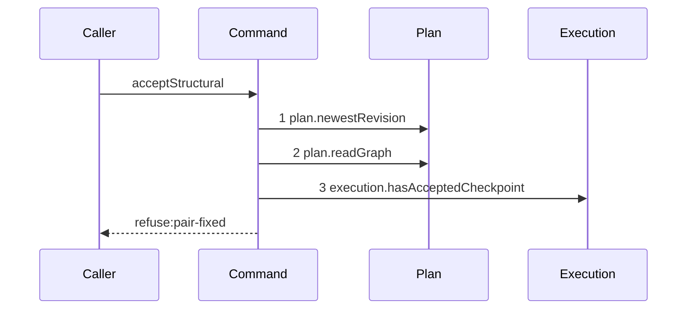

# Story 6 — A fixed pair refuses before the validator

Epic: `.agents/plan/epics/052.1-the-structural-acceptance.md`
Depends on: Story 5 (`05-an-unresolved-reference-reaches-the-resolver`), which closes the shape
group; EPIC 052 Story 4 (`04-the-two-structural-policies`), for `pairChangeVerdict`; EPIC 052
Story 5 (`05-the-seams-the-acceptance-needs`), for `execution.hasAcceptedCheckpoint`.
Kind: story-implement

Diagrams: accept-structural-refusal-pair-fixed

Seams: accept-structural-refusal-pair-fixed: +plan.newestRevision, +plan.readGraph, +execution.hasAcceptedCheckpoint

This story adds the pair policy. It runs **before** the validator, so this diagram holds no
`plan.readValidationContext` and no `graph.cycles`. Story 7
(`07-an-invalid-staged-graph-or-an-empty-expansion`) adds both.

## The path

`acceptStructural` is written from nothing, so this diagram has an empty prior set, it draws no
`baseline-` diagram, and all three of its tokens are `+`.

### `accept-structural-refusal-pair-fixed`

Fixture: a claimed expansion node `N` running under run `R`, the pinned revision equal to the newest,
`N` holding one child objective `C` whose `deliverable` is `implementation`, one `structural`
`checkpoint` row naming `C`, and a patch holding one `update` of `C` that names
`deliverable: "test"`. **Exactly one node of the patch changes a pair**, so
`execution.hasAcceptedCheckpoint` is called once. A patch changing two pairs calls it twice, which no
diagram can draw, and that longer patch is asserted by case 4 instead, per
`.agents/plan/authoring.md:187`. Every id of the fixture resolves, so the resolver is not read.



**The pair policy precedes graph validation, and this diagram is the proof of the order.** Step 3 is
reached with no validator step before it, so an implementation that validates first fails the
comparison. `.agents/plan/epics/052.1-the-structural-acceptance.md:52` — `dominant` states the
ruling: fixation is permanent, so no topology repair ever legalises the pair change, and reporting
`plan-invalid` first would tell a caller to repair a graph that can never become acceptable.

**Step 3 fires only for a node whose pinned pair changes.** The seam call belongs to the pair change,
not to the mutation, so a patch that changes no pair reaches no `execution.hasAcceptedCheckpoint`.
Story 9 (`09-the-accepted-patch`)'s success diagram is that path, and Story 7's is another.

**The drawn set is every branch of this path.** `pair-fixed` is decided by one verdict over the value
step 3 returns, and the verdict's two reasons — `has-accepted-checkpoint` and `has-child` — are
values on one terminal, which `.agents/plan/authoring.md:161` says is no diagram. Cases 1 and 2 carry
both reasons.

Add `test/sequence/scenarios/accept-structural-refusal-pair-fixed.ts`.

## Change

**`src/commands/checkpoint/accept-structural.ts` — decide the pair policy after the shape group and
before the validator.**

### 1 — the pair-changing set

Compute the set of node ids whose staged pair — the tuple of `kind` and `deliverable` — differs from
the pair the pinned graph holds for that id. A `create` is not in the set: a node with no pinned row
has no pair to fix. Iterate the set in `Buffer.compare` order over the utf-8 bytes of the id, so the
reads are deterministic, and for each:

```ts
const verdict = pairChangeVerdict({
  nodeId,
  hasChild: pinned.nodes.some((node) => node.parentId === nodeId),
  hasAcceptedCheckpoint: dependencies.execution.hasAcceptedCheckpoint(
    transaction,
    nodeId,
  ),
});
if (verdict !== null) {
  throw new AcceptStructuralError(
    "pair-fixed",
    verdict.message,
    verdict.details,
  );
}
```

`hasChild` is read from the **pinned** graph, and `hasAcceptedCheckpoint` from the execution store.
`.agents/plan/epics/052-the-graph-patch-and-its-policies.md:53` — `pairChangeVerdict` decides both.
The fix is permanent: an accepted expansion writes a structural checkpoint on the claimed node, so a
parent objective never becomes atomic. `../docs/workflow/worker.md:94` — `pair` states it.

### 2 — the aggregation and its sort key

The verdict reports **every** fixed node of the patch, not the first.
`.agents/plan/epics/052.1-the-structural-acceptance.md:52` — `dominant` and the correction-unit rule
require it, so the loop collects violations and raises once at the end. Each violation carries its
`nodeId` and its `reason`, sorted bytewise by `nodeId` and then by the declared reason order, in which
`has-accepted-checkpoint` precedes `has-child`, because a checkpoint never goes away and a child
sometimes can. Submitted mutation order is never the oracle: `renderGraphPatch` sorts mutations
bytewise by id, so evidence that moved with a permutation would contradict the determinism rule of
`AGENTS.md`.

The seam is still read once per pair-changing node in bytewise id order, and the aggregation changes
no trace: the diagram's fixture holds one such node.

## Constraints

- The pair policy raises before any write and before the validator. Nothing this command writes exists
  yet at this point in the body, and `plan.readValidationContext` has not been called.
- `execution.hasAcceptedCheckpoint` is read once per pair-changing node, in bytewise id order, and
  never for a node whose pair is unchanged.
- `hasChild` reads the pinned graph, never the staged graph. A node that sheds every child in this
  same patch is still fixed, because the child existed when the patch was written.
- The refusal names every fixed node. Do not raise on the first.
- No refusal of this command writes anything. Story 8
  (`08-an-ineligible-delete-refuses`) cases 4 and 5 prove it by snapshot over every group.

## Verify

```
node --test src/commands/checkpoint/accept-structural.test.ts test/sequence/conformance.test.ts
```

Extend `src/commands/checkpoint/accept-structural.test.ts`.

Add, each as a separate `it`:

1. `"a pair change on a node holding an accepted checkpoint refuses pair-fixed"` — the diagram's
   fixture. Assert `error.refusal` is `"pair-fixed"` and that the violations deep-equal
   `[{ nodeId: "<C>", reason: "has-accepted-checkpoint" }]`.

2. `"a pair change refuses on a node holding a child and passes on a node holding neither"` — one
   fixture whose `C` holds a child and no checkpoint, asserting the violation `reason` is
   `"has-child"`; one fixture whose `C` holds neither, asserting the patch returns a result. Cases 1
   and 2 are the epic's gate row 15, and case 1 supplies its `structural` checkpoint.

3. `"a pair change refuses pair-fixed before the validator sees an invalid graph"` — one input that
   is both pair-fixed and structurally invalid, for example the case 1 fixture plus a `create` whose
   kind and deliverable are an illegal pair. Assert `error.refusal` is `"pair-fixed"`, and behind the
   recorder assert `recorder.tokens` deep-equals
   `["plan.newestRevision", "plan.readGraph", "execution.hasAcceptedCheckpoint"]`, so
   `plan.readValidationContext` is demonstrably absent. This is the epic's gate row 15b, and it is
   the row that proves the reorder.

4. `"a patch changing two pairs reads the predicate twice, in bytewise id order, and names both
nodes"` — the longer patch the diagram cannot draw. Assert the recorded `nodeId` arguments in
   exact order, and assert the violations list holds both nodes in bytewise order.

Add `test/sequence/scenarios/accept-structural-refusal-pair-fixed.ts`, building the fixture the
diagram names, running the real `acceptStructural` directly over real SQLite behind the recorder, and
catching the `AcceptStructuralError` and returning it as `result`.

`pnpm run verify` exits 0.

Proof: PASS line delivered — `src/commands/checkpoint/accept-structural.test.ts` in
`PASS EPIC-052.1`.
