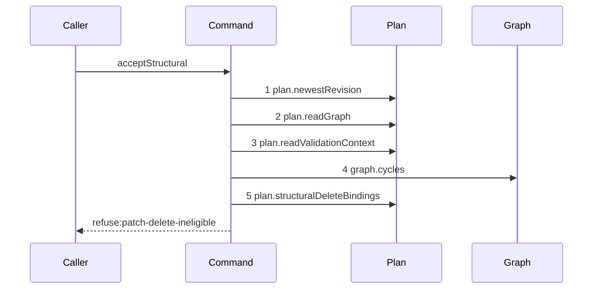

# Story 8 — An ineligible delete refuses

Epic: `.agents/plan/epics/052.1-the-structural-acceptance.md`
Depends on: Story 7 (`07-an-invalid-staged-graph-or-an-empty-expansion`), for the validator that
precedes the delete guard and the `expansion-empty` block the guard is inserted above; EPIC 052
Story 5 (`05-the-seams-the-acceptance-needs`), for `plan.structuralDeleteBindings` and the
`structuralDeleteBindings` tuple.
Kind: story-implement

Diagrams: accept-structural-refusal-delete-ineligible

Seams: accept-structural-refusal-delete-ineligible: +plan.newestRevision, +plan.readGraph, +plan.readValidationContext, +graph.cycles, +plan.structuralDeleteBindings

This story closes the refusal order. Story 9 (`09-the-accepted-patch`) adds the writes that follow
it, and it owns the decision table and the byte-identical database proof for every group.

## The path

`acceptStructural` is written from nothing, so this diagram has an empty prior set, it draws no
`baseline-` diagram, and all five of its tokens are `+`.

### `accept-structural-refusal-delete-ineligible`

Fixture: a claimed expansion node `N` running under run `R`, the pinned revision equal to the newest,
`N` holding two children `C1` and `C2`, one `run` row naming `C1`, and a patch holding one `delete`
of `C1`. `C2` survives, so the staged graph leaves `N` a child and `expansion-empty` does not fire.
Every id resolves and no pair changes, so neither the resolver nor the checkpoint predicate is read.
**The delete set holds exactly one id**, so `plan.structuralDeleteBindings` is called once with a
one-element set; a longer set is still one call, and case 2 asserts the argument.



**Step 5 is the last read of the command, and it fires only for a patch holding a `delete`.** A patch
with no `delete` asks the binding question nothing, so it never reaches this step and Story 7's
diagram is its trace. Case 2 asserts both halves.
`.agents/plan/epics/052.1-the-structural-acceptance.md:72` — `conditional` states why the read is not
made unconditional to give every post-validator refusal one trace.

**The state half of the guard is pure and reaches no seam.** A node's `state` is already on the
pinned graph, so `nodeStates` eligibility is decided in memory. Only the durable-row half needs step 5. Both halves report through one code, because
`.agents/plan/pending/node-delete-refusal-contract.md` records that `binding-in-use` has no field for
a node's illegal state, which is why EPIC 052 gave the patch its own aggregate refusal.

**The drawn set is every branch of this path.** `patch-delete-ineligible` is one terminal whatever
violation kind carries it, and a violation kind is a value on that terminal, which
`.agents/plan/authoring.md:161` says is no diagram. Cases 1 and 4 carry both kinds.

Add `test/sequence/scenarios/accept-structural-refusal-delete-ineligible.ts`.

## Change

**`src/commands/checkpoint/accept-structural.ts` — guard every deleted node on its state and its
durable rows, between the validator and the at-least-one-child rule.**

### 1 — the delete set and the conditional bulk read

```ts
const deleteIds = parsed.data.mutations
  .filter((mutation) => mutation.op === "delete")
  .map((mutation) => mutation.id)
  .sort((left, right) =>
    Buffer.compare(Buffer.from(left, "utf8"), Buffer.from(right, "utf8")),
  );

const bindings =
  deleteIds.length === 0
    ? []
    : dependencies.plan.structuralDeleteBindings(transaction, deleteIds);
```

`plan.structuralDeleteBindings(transaction, nodeIds)` is the seam EPIC 052 Story 5
(`05-the-seams-the-acceptance-needs`) adds; the epic's
`## Amendments this epic asks of other epics` carries the ask. It follows
`src/services/plan/sqlite.ts:338` — `readSubtreeExecutionFacts`, the shipped bulk `IN (...)` read over
a node-id set, and it returns one entry per offending node and blocker.

**A duplicate id cannot reach this set.** `patch-id-duplicate` refuses it in group 2, so `deleteIds`
is already unique and the sort is the only normalisation needed.

### 2 — the two halves of the guard

```ts
const violations = structuralDeleteVerdict({
  deleteIds,
  pinned,
  bindings,
});
if (violations !== null) {
  throw new AcceptStructuralError(
    "patch-delete-ineligible",
    violations.message,
    violations.details,
  );
}
```

`.agents/plan/epics/052-the-graph-patch-and-its-policies.md:59` — `delete` states both conditions:
a deleted node must be `pending`, `ready` or `blocked`, and no durable row may name it.
`../docs/workflow/worker.md:414` — `delete` is the source. The verdict is pure, so it is no message,
and EPIC 052 owns it.

**The schema enforces the binding half already, and that is why the guard exists.**
`checkpoint.node_id` and `run.node_id` are `NOT NULL REFERENCES node(id)` with no `ON DELETE`, and
`src/services/storage/connection.ts:8` — `foreign_keys` turns the pragma on at every open, so the
delete of a bound node raises `FOREIGN KEY constraint failed` mid-transaction. The guard turns that
opaque failure into a typed refusal naming every offending node, before any write.

### 3 — the aggregation and its sort key

The refusal reports **every** offending node, not the first. Each violation is one of two kinds — a
`node-state` violation carrying the node's `state` and the admitted tuple, or a `binding` violation
carrying its blocker — and the list sorts bytewise by `nodeId`, then by the declared reason order.
`.agents/plan/stories/052.2-the-structural-report-route/01-the-contract-carries-the-patch.md` holds
the `patchDeleteIneligibleDetails` schema this list must satisfy. Submitted mutation order is never
the oracle, for the reason `renderGraphPatch` states.

### 4 — the placement

The guard sits **after** the validator of Story 7
(`07-an-invalid-staged-graph-or-an-empty-expansion`) section 2 and **before** its section 3
at-least-one-child block. That is groups 8, 9, 10 in the order
`.agents/plan/epics/052.1-the-structural-acceptance.md:49` fixes. Case 3 asserts it.

## Constraints

- `plan.structuralDeleteBindings` is called at most once per command run, and never with an empty id
  set.
- The id set is the bytewise-sorted delete set. Do not pass the whole patch, and do not pass the
  staged graph.
- The state half reads the **pinned** graph. A node the patch would move to an admitted state is
  still judged on the state it holds.
- The refusal names every offending node. Do not raise on the first.
- The guard raises before any write. Nothing this command writes exists yet at this point in the
  body.

## Verify

```
node --test src/commands/checkpoint/accept-structural.test.ts test/sequence/conformance.test.ts
```

Extend `src/commands/checkpoint/accept-structural.test.ts`. Build the snapshot helper of cases 4 and
5 on `tableRows` at `test/helpers/database.ts:87` — `tableRows`, the way
`src/http/server/node/list-project-node.test.ts:33` — `snapshotRelevantTables` does, over the eight
tables `node`, `edge`, `plan_revision`, `blob`, `checkpoint`, `run`, `attempt` and `event`.

Add, each as a separate `it`:

1. `"a patch deleting a node named by a run refuses patch-delete-ineligible"` — the diagram's
   fixture. Assert `error.refusal` is `"patch-delete-ineligible"` and that the violations deep-equal
   `[{ kind: "binding", nodeId: "<C1>", blocker: "run" }]`. Then the control: the same patch over a
   `pending` `C1` that no durable row names returns a result. This is the epic's gate row 15a.

2. `"the binding read fires once over the delete set, and not at all for a patch holding no delete"`
   — two runs behind the recorder. The first deletes two eligible nodes: assert
   `plan.structuralDeleteBindings` is recorded exactly once and that its `nodeIds` argument
   deep-equals the two ids in bytewise order. The second is the Story 7 `plan-invalid` fixture:
   assert `recorder.tokens` holds no `plan.structuralDeleteBindings`. This is the epic's gate row
   15c, and the second half is the control that makes the read conditional.

3. `"a patch that is both delete-ineligible and expansion-empty refuses patch-delete-ineligible"` —
   a childless claimed node whose patch deletes a bound node and creates nothing under it. Assert
   `error.refusal` is `"patch-delete-ineligible"`. This is what proves group 9 precedes group 10.

4. `"a delete of a node in each ineligible state refuses with its state violation"` — iterate
   `src/domain/state.ts:7` — `nodeStates`, seeding one child per value under one objective with
   `test/helpers/rows.ts:359` — `seedNode`, and **seed no run for any of them**, because
   `src/services/storage/migration-0007-external-execution.ts:15` — `node_id` makes `run.node_id` a
   foreign key and a seeded run turns a state test into a binding test. Assert `pending`, `ready` and
   `blocked` pass and the other five refuse with a `node-state` violation carrying the node's state
   and the admitted tuple. The split is exhaustive because it is iterated from the tuple.

5. `"the ordered refusal table reports the earlier of every pair of conditions"` — the decision table
   over the **real command**, in one `it`. The nine groups this command decides give 36 pairs, and
   the epic's gate row 17 adds one three-way case over shape, currentness and scope, so the table
   holds 37 cases. Each case names its two conditions and its expected code, and each asserts the
   earlier code. Assert the case count is `37`, so a pair dropped from the table fails rather than
   passing silently. The tenth group is the authority prelude, and EPIC 052.2 Story 2
   (`02-the-report-route-carries-a-patch`) gate row 36 carries its precedence over the shape group.

6. `"every refusal group leaves the eight tables byte-identical"` — snapshot before and after **one
   representative refusal of each of the nine groups** and assert `deepEqual` on every one. The
   group, not the code, is the unit: `patch-unparsable` stands for its group and `patch-id-duplicate`
   is not snapshotted separately. The `blob` table is in the set, which is what proves no orphan
   blob: `src/services/blob/index.ts:22` — `put` takes the transaction, so a refusal rolls the put
   back. This is the epic's gate row 18; the tenth group is gate row 18a, owned by EPIC 052.2
   Story 2 (`02-the-report-route-carries-a-patch`).

7. `"the control: the snapshot comparison detects a single injected write"` — run one refusal path
   with one deliberate `transaction.run("INSERT INTO blob ...")` before the refusal and assert the
   comparison fails. This is the epic's gate row 19: absence is proven by a detector that
   demonstrably fires.

Add `test/sequence/scenarios/accept-structural-refusal-delete-ineligible.ts`, building the fixture
the diagram names, running the real `acceptStructural` directly over real SQLite and the real
`GraphologyGraph` behind the recorder, and catching the `AcceptStructuralError` and returning it as
`result`.

`pnpm run verify` exits 0.

Proof: PASS line delivered — `src/commands/checkpoint/accept-structural.test.ts` in
`PASS EPIC-052.1`.
