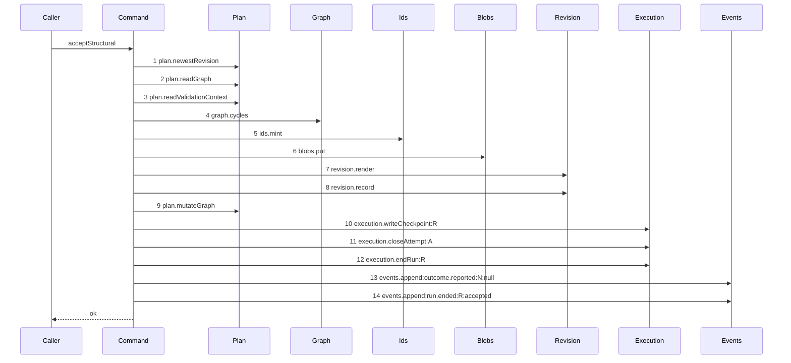

# Story 9 — The accepted patch

Epic: `.agents/plan/epics/052.1-the-structural-acceptance.md`
Depends on: Story 1 (`01-the-lowering`), for `lowerPatch`; Story 8
(`08-an-ineligible-delete-refuses`), for the complete refusal order that precedes every write;
EPIC 051.3 Story 2 (`02-the-checkpoint-row`), for the `checkpoint` table and its structural columns;
EPIC 052 Story 5 (`05-the-seams-the-acceptance-needs`), for `execution.writeCheckpoint` and for the
`deliverable` and `verifyJson` fields of `NodeWrite`; EPIC 050.2 Story 5 (`05-the-release`), for an
`execution.endRun` that raises the fence and for the `run.ended` event type; EPIC 050.4 Story 2
(`02-the-claim-of-an-initiative-drops-the-lease`), for the attempt a structural claim opens, which is
the row `checkpoint.attempt_id` names.
Kind: story-implement

Diagrams: accept-structural-success

Seams: accept-structural-success: +plan.newestRevision, +plan.readGraph, +plan.readValidationContext, +graph.cycles, +ids.mint, +blobs.put, +revision.render, +revision.record, +plan.mutateGraph, +execution.writeCheckpoint:R, +execution.closeAttempt:A, +execution.endRun:R, +events.append:outcome.reported:N:null, +events.append:run.ended:R:accepted

This story completes `acceptStructural`, and it is last in the dispatch order of the drawing stories.
EPIC 052.2 Story 2 (`02-the-report-route-carries-a-patch`) wires the command into `node.report`, and
this story's scenario drives the command directly rather than over the route.

**It registers the epic as shipped.** Append `"052.1"` to `shippedEpics` at
`scripts/epic-sequence-range.ts:19` and to the pinned literal at
`test/sequence/conformance.test.ts:273`. `test/sequence/conformance.test.ts:82` — `liveDiagrams`
replays a diagram only once its epic sits there, so the registration lands in the story after which
all eight scenario files exist, and never before.

## The path

`acceptStructural` is written from nothing, so this diagram has an empty prior set, it draws no
`baseline-` diagram, and all fourteen of its tokens are `+`.

### `accept-structural-success`

Fixture: a claimed expansion node `N` running under run `R` with one open attempt `A`, the pinned
revision equal to the newest, `N` **already holding one child `C`**, and the patch is one `update` of
`C` naming only `title`.

**The fixture states a length of one on purpose.** `test/helpers/sequence-conformance.ts:50` —
`projections` declares no projection for `blobs.put` or for `ids.mint`, so each draws a bare token and
each may appear once. This patch puts one blob — the canonical patch bytes — and mints one id — the
revision. A patch that creates a node also puts its `instruction` prose, and for a task its
`acceptance` prose, and a patch that adds a dependency also mints an edge id; those longer patches are
asserted by cases 2 and 3 and by Story 1 (`01-the-lowering`) case 6, not by a trace.

The claimed node already holds a child, so `expansionVerdict` does not bind, and the `update` changes
no pair, so `execution.hasAcceptedCheckpoint` is not read, and it holds no `delete`, so
`plan.structuralDeleteBindings` is not read either. Every id resolves, so `plan.nodeProjects` is not
read. Story 6 (`06-a-fixed-pair-refuses-before-the-validator`)'s diagram is the path that reads
it.



**Steps 1 to 4 are the refusal prefix, unchanged.** This diagram differs from Story 7
(`07-an-invalid-staged-graph-or-an-empty-expansion`)'s at step 4 and nowhere before it: the ordered
checks do not change shape when they pass.

**A success whose patch changes a pair, holds a legal `delete`, or names a cross-project reference
reaches a longer trace, and none is drawn.** Each is a reachable trace of the one terminal this
diagram states, asserted by case 11 rather than drawn, per `.agents/plan/authoring.md:187`.

**Step 6 sits after the checks and not before them.** `src/services/blob/index.ts:22` — `put` takes
the transaction, and the whole acceptance is one transaction, so a refusal rolls the put back. The
epic requires structural evidence to be the mutation set, and evidence not pinned by content is not
evidence — so the put must happen, and it must happen where no refusal can orphan it.

**Steps 7 and 8 are the shipped revision service.** The `blobs.put` that `revision.record` makes
internally at `src/services/revision/node-write.ts:104` — `put` is invisible here, because the
scenario builds the revision service over the unwrapped blob store and only the outer key is recorded.

**Step 13 carries the label `null`, and that is the harness reading the payload.**
`test/helpers/sequence-conformance.ts:81` — `reason` appends `String(payload.reason)` whenever the
payload holds a `reason` key. `src/commands/outcome/report-outcome.ts:302` — `reason` is one of the
nine keys of the shipped `outcome.reported` payload, and an accepted report carries it as `null`. This
epic registers no event type and changes no payload shape, so the label is `null` by construction.

**The drawn set is every branch of this path.** This is the one path on which no check refuses. Every
refusal has its own diagram in Stories 2 to 8.

Add `test/sequence/scenarios/accept-structural-success.ts`.

## Change

**`src/commands/checkpoint/accept-structural.ts` — write the acceptance, in one transaction, after
the last check.**

### 1 — the revision id and the pinned bytes

```ts
const revisionId = dependencies.ids.mint("planRevision");
const patchBlob = dependencies.blobs.put(
  transaction,
  encoder.encode(renderGraphPatch(parsed.data)),
);
```

`src/domain/identity.ts:13` — `planRevision` is the kind, and its prefix is `revision`.
`renderGraphPatch` is EPIC 052 Story 1's canonical serialiser, so two patches with one meaning hash
identically.

**A `create` puts its prose here too**, with `blobs.put` per `instruction` and, for a task, per
`acceptance`, as `src/commands/node/create-node.ts:116` — `instructionBlob` does. Each put returns the
hash Story 7 (`07-an-invalid-staged-graph-or-an-empty-expansion`)'s candidate already read through
`blobs.hash`, because
`src/services/blob/sqlite.ts:24` — `put` is `INSERT ... ON CONFLICT(hash) DO NOTHING` over the same
bytes. Collect the results into the `prose` map `lowerPatch` takes, keyed by mutation id. **The map is
the only carrier of a blob hash**: `GraphPatch` holds prose, so it can carry none.

### 2 — the revision

```ts
const after = stagedAsStoredNodes(staged, revisionId, input.now);
const documents = dependencies.revision.render(transaction, { nodes: after });
dependencies.revision.record(transaction, {
  projectId: input.node.projectId,
  revisionId,
  parentRevision: input.run.graphRevision,
  documents,
});
```

`src/commands/node/create-node.ts:232` — `render` and `:235` — `record` are the shipped pair.
`src/services/revision/node-write.ts:112` — `origin` writes `origin: "node-write"` with `importId`,
`submittedBlob` and `choicesBlob` null, and puts the canonical document set as `accepted_blob`.
`src/services/storage/migration-0006-revision-origin.ts:13` — `origin` admits no third value without a
rebuild, and a structural patch is an atomic batch of the three single-node writes that already use
that origin.

`parentRevision` is the run's pinned revision. Step 1 proved it equals the project's newest, so the
chain is unbroken.

### 3 — the one mutation

```ts
const lowered = lowerPatch(
  { mintEdgeId: () => dependencies.ids.mint("edge") },
  {
    pinnedNodes: pinned.nodes,
    pinnedEdges: pinned.edges,
    staged,
    patch: parsed.data,
    prose,
    revision: revisionId,
    updatedAt: input.now,
  },
);
dependencies.plan.mutateGraph(transaction, {
  projectId: input.node.projectId,
  ...lowered,
  at: input.now,
  cause: { revision: revisionId, importId: null },
});
```

One call, because the lowering produces one field set.
`src/commands/node/create-node.ts:263` — `mutateGraph` is the shipped shape of the `cause`.
`src/services/plan/sqlite.ts:484` — `readiness` runs the shipped readiness pass over the result and
returns the transitions it applied. Those are the only node states this epic moves, and they belong to
the new children, never to the claimed node.

### 4 — the checkpoint

```ts
dependencies.execution.writeCheckpoint(transaction, {
  kind: "structural",
  nodeId: input.node.id,
  runId: input.run.id,
  attemptId: input.attemptId,
  fence: input.run.fence,
  graphRevision: revisionId,
  patchBlob,
  createdAt: input.now,
});
```

`fence` is `input.run.fence`, which is the **pre-raise** value, mirroring
`.agents/plan/epics/051.3-the-checkpoint-and-the-land.md:41` — `pre-raise`. `accepted_oid` is null and
`repository_id` is null, which is what
`.agents/plan/epics/051.3-the-checkpoint-and-the-land.md:29` — `checkpoint_structural_patch` requires:
`(kind = 'structural') = (patch_blob IS NOT NULL)`.

`graphRevision` is the **new** revision this acceptance recorded, not the pinned one. The checkpoint
names the graph the patch produced, because that is the state the evidence describes.

### 5 — the attempt, the run and the two events

```ts
dependencies.execution.closeAttempt(transaction, {
  attemptId: input.attemptId,
  outcome: "accepted",
  at: input.now,
});
dependencies.execution.endRun(transaction, {
  runId: input.run.id,
  outcome: "done",
  at: input.now,
});
dependencies.events.append(transaction, {
  subjectKind: "node",
  subjectId: input.node.id,
  type: "outcome.reported",
  actorKind: input.actorKind,
  actorId: input.actorId,
  payload: {
    runId: input.run.id,
    attemptId: input.attemptId,
    attemptNo: input.attemptNo,
    outcome: "accepted",
    reason: null,
    objectId: patchBlob,
    attemptsRemaining: Math.max(0, input.run.attemptLimit - input.attemptNo),
    fromState: input.node.state,
    toState: input.node.state,
  },
});
dependencies.events.append(transaction, {
  subjectKind: "run",
  subjectId: input.run.id,
  type: "run.ended",
  actorKind: input.actorKind,
  actorId: input.actorId,
  payload: {
    runId: input.run.id,
    nodeId: input.node.id,
    fence: input.run.fence,
    outcome: "done",
    reason: "accepted",
  },
});
```

`"accepted"` is a legal attempt outcome at `src/domain/attempt.ts:8` — `accepted`. The fence rise is
`endRun`'s, per EPIC 050.2 Story 5 (`05-the-release`); this command raises none of its own.

**`outcome.reported` keeps the shipped nine keys**, in the shipped order of
`src/commands/outcome/report-outcome.ts:297` — `payload`. `objectId` is the patch blob hash, because a
consumer reads `objectId` and joins the `checkpoint` table, and the patch is the object a structural
run produced. `fromState` equals `toState`, because a structural run moves no node state.
`attemptsRemaining` is the one key whose value differs from the result's: the payload schema admits no
null, and the paragraph above states the arithmetic.

**`run.ended` keeps EPIC 050.2's five keys**, with `reason: "accepted"`. It is `subjectKind` `run` and
`subjectId` the run id, matching `.agents/plan/stories/050.2-the-run-renew-release-and-report/05-the-release.md:137`
— `run.ended`.

**No node transition is written.** `../docs/workflow/worker.md:365` — `structural` states a run never
sets an initiative or a parent-objective terminal state, and that the initiative stays `pending` or
`ready`. There is no `plan.setNodeState` call in this command, on any path.

### 6 — the result

```ts
return {
  nodeId: input.node.id,
  kind: input.node.kind,
  state: input.node.state,
  blockReason: input.node.blockReason,
  attemptId: input.attemptId,
  attemptNo: input.attemptNo,
  attemptsRemaining: null,
  objectId: patchBlob,
  objectiveState: null,
  objectiveProjection: null,
};
```

`attemptsRemaining` is `null` **in the result** because the run ends in this transaction, so no
further attempt of it can open, and `src/http/contract/outcome.ts:62` — `attemptsRemaining` is
nullable. **The payload carries a number, because its schema admits no null**:
`src/http/contract/event-payload.ts:168` — `attemptsRemaining` is `z.number().int()`, and
`.agents/plan/epics/054-attempt-classification-and-the-supervisor.md:93` keeps that type. The value is
`Math.max(0, input.run.attemptLimit - input.attemptNo)`. `input.attemptNo` is the counter the shipped
command computes: `src/services/execution/sqlite.test.ts:397` — `openAttempt reads the number from the rows`
mints each attempt at one above the highest, so the one open attempt of a run carries the highest
number, and this command closes exactly that attempt.
`objectiveState` and `objectiveProjection` are `null` because a structural run claims an initiative or
a parent objective, which has no objective above it to project; `src/http/contract/outcome.ts:64` —
`objectiveState` is nullable. Neither field costs a seam call, so this command never reads
`plan.readAllNodes`.

## Constraints

- Every write of this story sits in the caller's transaction, after the last check.
- The command writes no node transition and calls `plan.setNodeState` on no path.
- `plan.mutateGraph` is called once. The lowering produces one field set.
- The checkpoint carries the pre-raise fence, `accepted_oid` null and `graph_revision` set to the new
  revision.
- The command holds no `git` and no `commands` dependency, on any path.

## Verify

```
node --test src/commands/checkpoint/accept-structural.test.ts test/sequence/conformance.test.ts
```

Extend `src/commands/checkpoint/accept-structural.test.ts` with the fixture Stories 2 to 8 built.

Add, each as a separate `it`:

1. `"a successful acceptance writes a plan_revision whose parent is the pinned revision"` — assert the
   new row's `parent_id` equals the run's `graph_revision`, its `origin` equals `"node-write"`, and
   `blobs.get(row.accepted_blob)` resolves to the canonical document set `revision.render` returned.
   This is the epic's gate row 20.

2. `"checkpoint.patch_blob resolves to renderGraphPatch of the submitted patch"` — assert
   `blobs.get(checkpoint.patch_blob).content` equals `encoder.encode(renderGraphPatch(patch))` byte
   for byte. This is the epic's gate row 21.

3. `"the checkpoint carries the node, the run, the attempt, graph_revision and the pre-raise fence"` —
   assert `node_id`, `run_id`, `attempt_id`, `fence`, `graph_revision`, `kind` and `accepted_oid`
   field by field, with `accepted_oid` null and `fence` equal to the run's fence before the end. This
   is the epic's gate row 22.

4. `"a successful acceptance leaves the claimed node's state unchanged, from pending and from ready"` —
   run the acceptance twice against two fixtures whose claimed node starts `pending` and `ready`, and
   assert the stored `state` is unchanged in both. This is the epic's gate row 23, and it is the
   EPIC 053 rule asserted here because this is the command that could break it.

5. `"a successful acceptance closes the attempt as accepted, ends the run and raises the fence by one"`
   — all three in one case: assert the attempt `outcome` is `"accepted"`, the run `state` is `"ended"`
   with `outcome` `"done"`, and the run `fence` is exactly one greater than before. This is the epic's
   gate row 24.

5a. `"the outcome.reported payload carries a numeric attemptsRemaining"` — assert the appended
payload deep-equals a stated literal whose `attemptsRemaining` is `input.run.attemptLimit` minus
the closing attempt's number, and assert the same payload parses against
`src/http/contract/event-payload.ts` — `outcome.reported`. The returned result's
`attemptsRemaining` is `null` in the same case, so the split between the two schemas is asserted
once and in one place. This is the epic's gate row 24a.

6. `"a successful acceptance makes zero git and zero commands.run calls"` — extend the dependency
   object with a `git` double and a `commands` double, record the whole object with `recordSeams` at
   `test/helpers/sequence-conformance.ts:99` — `recordSeams`, and assert no recorded token starts with
   `git.` or `commands.`. The control in the same case drives `acceptExecution` over the same two
   doubles and asserts each recorded at least one call, so the doubles demonstrably fire. This is the
   epic's gate row 25.

7. `"the whole acceptance is one transaction"` — wrap `execution.writeCheckpoint` in a proxy that
   writes the checkpoint and then throws, run the command inside `storage.transact`, catch the throw,
   and assert the graph, the `plan_revision` set, the `blob` set and the `event` count are all
   unchanged from before. This is the epic's gate row 26.

8. `"the claimed node holds at least one child after a successful expansion acceptance"` — a childless
   claimed node whose patch creates one child. Assert the child is present in
   `plan.readGraph`. This is the epic's gate row 27, and it is the `create` path the diagram's fixture
   does not take: assert its three `blobs.put` calls here, one per prose field and one for the patch.

9. `"a patch adding one dependency mints one edge id through the injected function"` — assert the
   stored edge's `id` equals the id the mock generator yielded for the `"edge"` kind, which is the
   `mintEdgeId` wiring of Story 1 (`01-the-lowering`). Assert in the same case that the
   `LoweredPatch` value is assigned to a `MutateGraphInput`-typed local with no cast, which is the
   assignment half of the epic's gate row 6a.

10. `"the success scenario conforms to its diagram by equality"` — call `assertConformance` at
    `test/helpers/sequence-conformance.ts:318` — `assertConformance` directly, over this story's own
    scenario. Then assert it **throws** when one token is removed from the recorder's list and again
    when two are swapped, so equality is proven to be equality.

11. `"the conformance runner replays all eight diagrams of this epic by equality"` — after appending
    `"052.1"` to `shippedEpics` and to the pinned literal, run
    `test/sequence/conformance.test.ts` and assert every one of the eight scenarios replays. Then
    assert the comparison fails when one step is removed from the implementation and again when two
    are reordered. This is the epic's gate row 34, and it is this story's because
    `test/sequence/conformance.test.ts:82` — `liveDiagrams` replays a diagram only once its epic sits
    in `shippedEpics` and this is the story that puts it there.

12. `"a success whose patch changes a pair, deletes an eligible node and names a cross-project
reference still returns a result"` — one longer patch behind the recorder. Assert the command
    returns a result, and assert `recorder.tokens` deep-equals the diagram's list with exactly three
    tokens inserted at their declared positions: `plan.nodeProjects` after `plan.readGraph`,
    `execution.hasAcceptedCheckpoint` after it, and `plan.structuralDeleteBindings` after
    `graph.cycles`. These are the reachable success traces this diagram does not draw, asserted per
    `.agents/plan/authoring.md:187`, and this case is what makes the diagram's branch-coverage claim
    checkable.

Add `test/sequence/scenarios/accept-structural-success.ts`, building the fixture the diagram names,
running the real `acceptStructural` directly over real SQLite, the real `GraphologyGraph` and the real
`NodeWriteRevision` behind the recorder — not over the `node.report` route — aliasing the node, the
run and the attempt as `N`, `R` and `A`, and returning the recorder and the result.

`pnpm run verify` exits 0.

Proof: PASS line delivered — `src/commands/checkpoint/accept-structural.test.ts` in
`PASS EPIC-052.1`.
