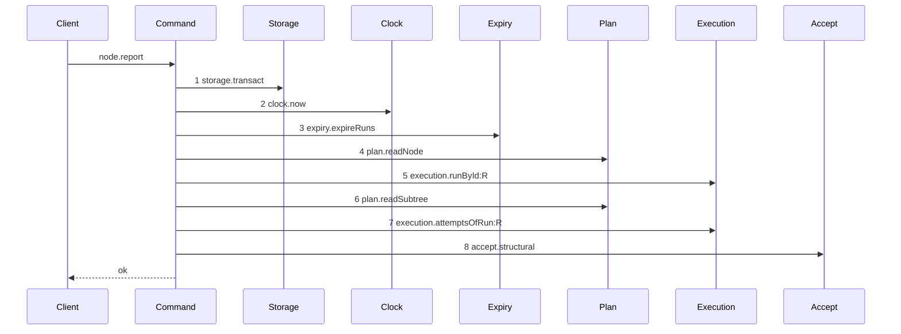

# Story 2 — The report route carries a patch

Epic: `.agents/plan/epics/052.2-the-structural-report-route.md`
Depends on: Story 1 (`01-the-contract-carries-the-patch`), for the seventh `nodeReportRequest` member
and the ten error codes this story maps; EPIC 052.1 Story 9 (`09-the-accepted-patch`), for the
complete command; EPIC 051.4 Story 8 (`08-the-report-route-enforces-the-gate`), for the
`report-checkpoint-gate` prelude and the `accept` dependency key.
Kind: story-implement

Diagrams: report-structural-gate

Seams: report-structural-gate: +storage.transact, +clock.now, +expiry.expireRuns, +plan.readNode, +execution.runById:R, +plan.readSubtree, +execution.attemptsOfRun:R, +accept.structural

This story is last in dispatch order, because it names Story 1
(`01-the-contract-carries-the-patch`)'s contract member and EPIC 052.1 Story 9
(`09-the-accepted-patch`)'s command.

## The path

**The structural member is a seventh member and a wholly new path, so its prior set is empty.**
`.agents/plan/epics/052.2-the-structural-report-route.md:22` — `report-checkpoint-gate` rules it, and
`.agents/plan/epics/053.1-the-review-checkpoint.md:46` — `report-checkpoint-gate` cites that ruling for
the review member. This story therefore draws no `baseline-` diagram, declares no `Supersedes:` line,
and every one of its eight tokens is `+`.

**`report-checkpoint-gate` is not superseded.**
`.agents/plan/stories/051.4-the-acceptance-gate-and-the-report-route/08-the-report-route-enforces-the-gate.md:24`
— `report-checkpoint-gate` draws the `accepted` member on an execution node, and this story changes
nothing on that path. The other five members keep the tail that story left them.

### `report-structural-gate`

Fixture: expansion node `N` — an initiative or a parent objective — running under structural run `R`
with one open attempt `A`, presented by run id and fence, the report `structural` with a well-formed
patch, and every input `acceptStructural` needs already valid: the pinned revision is the newest, the
patch is in scope and in project, the staged graph validates, no pair changes, and `N` already holds
one child.



**Steps 1 to 7 are the shared authority prelude, and step 8 is where this path leaves it.**
`report-checkpoint-gate` reads `execution.runBases:R` between step 7 and its accept, and this path does
not: `src/domain/run.ts:39` — `baseCount` refines a `structural` run to `baseCount === 0`, so a
structural run has no base row to read and a read of one would answer a question the run cannot have.

**`assertRunAuthority` is not a message.**
`.agents/plan/epics/051.4-the-acceptance-gate-and-the-report-route.md:40` — `assertRunAuthority`
records that it is a pure function running inside the command, so the recorder cannot see it. What it
decides is proven by EPIC 050.2 Story 1 (`01-run-authority`) and by case 1 here.

**Step 8 is one step, because `acceptStructural` is a nested command.** The scenario binds `accept` to
unrecorded dependencies, so the fourteen seam calls inside it are invisible at this seam. They are
EPIC 052.1 Story 9 (`09-the-accepted-patch`)'s diagram.

**The drawn set is every branch of this path.** The structural member has one success branch. Every
refusal of `acceptStructural` stops inside step 8 and is drawn by EPIC 052.1 Stories 2 to 8; every refusal of the
prelude is EPIC 050.2's and is unchanged by this story.

Add `test/sequence/scenarios/report-structural-gate.ts`.

## Change

### 1 — `src/commands/outcome/report-outcome.ts` — the injected callable

`ReportOutcomeDependencies` at `src/commands/outcome/report-outcome.ts:52` —
`ReportOutcomeDependencies` gains one member on the `accept` namespace EPIC 051.4 Story 8
(`08-the-report-route-enforces-the-gate`) created:

```ts
accept: Readonly<{
  execution: (
    transaction: Transaction,
    input: AcceptExecutionInput,
  ) => NodeReportResult;
  structural: (
    transaction: Transaction,
    input: AcceptStructuralInput,
  ) => NodeReportResult;
}>;
```

`src/commands/outcome/report-outcome.ts:59` — `reportObjective` is the shape precedent: a callable
taking the caller's transaction first and its input second. `acceptStructural` takes that transaction
because it writes no git and runs no command.

`src/main.ts` binds it beside `boundReportObjective` at `src/main.ts:292` — `boundReportObjective`,
passing `{ plan, blobs, graph, revision, execution, events, ids }` and nothing else.

### 2 — `src/commands/outcome/report-outcome.ts:116` — lift `initiative-not-reportable` for this member

`src/commands/outcome/report-outcome.ts:114` — `initiative` refuses every report on an initiative
today, and `../docs/workflow/worker.md:365` — `structural` states an initiative's run is `structural`,
so `(initiative, expansion)` is unrunnable while that guard stands.
`.agents/plan/epics/052.2-the-structural-report-route.md:31` — `initiative-not-reportable` takes the
ask EPIC 053 raised, and gate row 35 proves it.

Move `const body = input.body;` above the guard, then narrow it:

```ts
if (node.kind === "initiative" && body.report !== "structural") {
  throw new ReportOutcomeError(
    "initiative-not-reportable",
    `the initiative ${node.id} is never reported`,
  );
}
```

The move writes no seam call and reads no new field, so no step of any diagram changes.

### 3 — the structural arm

Branch on `body.report === "structural"` **before** the node-kind branches, so a structural report on
a parent objective never reaches the `body-kind-mismatch` default of
`src/commands/outcome/report-outcome.ts:141` — `body-kind-mismatch`. The arm runs the shared authority
prelude — steps 5, 6 and 7 of the diagram — and then:

```ts
return dependencies.accept.structural(transaction, {
  node,
  subtreeIds,
  run,
  attemptId: open.id,
  attemptNo: open.attemptNo,
  patch: body.patch,
  actorId: input.actorId,
  actorKind: input.actorKind,
  now,
});
```

`body.patch` is passed through untouched. `graphPatch.safeParse` runs inside `acceptStructural`, after
the prelude, which is what makes a stale fence refuse before a malformed patch is read. Case 2 proves
it, and it is why the contract carries the patch as an opaque value.

The arm reads no `execution.runBases`. A structural run holds no base row.

### 4 — `src/http/server/node/refusals.ts` — the refusal mapping

`src/http/server/node/refusals.ts:12` — `toHttpError` dispatches by error class. Add
`AcceptStructuralError` beside `ReportOutcomeError`, `ReportObjectiveError` and `CloseObjectiveError`,
with its own total switch, shaped like `reportOutcomeRefusal` at
`src/http/server/node/refusals.ts:67` — `reportOutcomeRefusal`:

| refusal                 | contract error          | details                         |
| ----------------------- | ----------------------- | ------------------------------- |
| `patch-unparsable`      | `patch-unparsable`      | none                            |
| `patch-id-duplicate`    | `patch-id-duplicate`    | none                            |
| `stale-revision`        | `stale-revision`        | `{ guard, expected, actual }`   |
| `patch-target-invalid`  | `patch-target-invalid`  | `{ mutationId }`                |
| `patch-scope-invalid`   | `patch-scope-invalid`   | `{ mutationId, claimedNodeId }` |
| `patch-project-invalid` | `patch-project-invalid` | `{ mutationId, projectId }`     |
| `plan-invalid`          | `plan-invalid`          | `{ findings }`                  |
| `pair-fixed`            | `pair-fixed`            | `{ nodeId, reason }`            |
| `expansion-empty`       | `expansion-empty`       | `{ claimedNodeId }`             |

The six 409 codes take a required `details` argument, because `src/http/contract/errors.ts:41` —
`PreconditionCode` forces one for every code whose status is 409. Story 1
(`01-the-contract-carries-the-patch`) declares each details schema and adds each code to the
operation's `errors` record.

The handler at `src/http/server/node/report-node.ts:41` — `toHttpError` is unchanged: it already
funnels every command error through that one function, and `body.report === "structural"` carries a
`fence`, so the `presented` argument it builds at `:45` needs no branch.

### 5 — `scripts/epic-sequence-range.ts` — append `"052.2"` to both lists

`scripts/epic-sequence-range.ts:1` — `authoredEpics` gains `"052.2"` after `"052.1"`, and
`scripts/epic-sequence-range.ts:20` — `shippedEpics` gains it after `"052.1"`.
`test/sequence/conformance.test.ts:255` and `:273` — `assert.deepEqual` pin the two matching
literals; update both in the same edit. `test/sequence/conformance.test.ts:275` — `slice` asserts the
shipped list is a prefix of the authored one, so `"052.1"` must already be present in both, which
EPIC 052.1 Story 9 (`09-the-accepted-patch`) is what does.

This is the last edit of the epic. It makes this epic's one diagram due, so it lands only when
`test/sequence/scenarios/report-structural-gate.ts` exists.

## Constraints

- The handler keeps its one injected command. `AGENTS.md` admits a handler to parse, call exactly one
  command and format.
- The structural arm branches before the node-kind branches, and it adds no branch on a domain rule
  inside the handler.
- The five other members are untouched. No step of `report-checkpoint-gate` moves.
- `src/commands/checkpoint/accept-structural.ts` imports no other command.
- The patch reaches `acceptStructural` as the value the wire carried. No re-encoding, no reordering.

## Verify

```
node --test src/commands/outcome/report-outcome.test.ts src/http/server/node/report-node.test.ts test/sequence/conformance.test.ts
```

Extend `src/commands/outcome/report-outcome.test.ts`, whose fixture is built at
`src/commands/outcome/report-outcome.test.ts:185` — `createReportFixture`, and
`src/http/server/node/report-node.test.ts`, whose app is built at
`src/http/server/node/report-node.test.ts:48` — `buildApp`.

Add, each as a separate `it`:

1. `"a structural report on an initiative reaches the command"` — an initiative claimed with
   `deliverable: expansion`, reported `structural`. Assert `accept.structural` recorded one call and
   that no `initiative-not-reportable` error was raised. This is the lift EPIC 053 asks for, and it is
   the control for the guard: a second case reports `accepted` on the same initiative and asserts
   `initiative-not-reportable` still refuses. This is the epic's gate row 35, and the second half
   narrows the lift to the one member.

2. `"a structural member with a stale fence refuses before the patch is parsed"` — present a fence one
   behind the run's, with `patch: "{"`. Assert the refusal is `fence-stale` and that
   `accept.structural` recorded zero calls. This is the epic's gate row 28, and it is what forbids the
   patch schema on the contract.

3. `"the five other members keep the tail EPIC 051.4 drew"` — run the `rejected` member unchanged and
   assert its recorded token sequence equals the one `report-checkpoint-gate`'s sibling path yields
   today, by value. This epic adds a member and changes none. This is the epic's gate row 29.

4. `"the authority prelude writes nothing when it refuses"` — snapshot the eight tables of EPIC
   052.1 Story 8 (`08-an-ineligible-delete-refuses`) case 6 before and after a `run-caller-mismatch`
   refusal on a structural report and assert `deepEqual`. This is the epic's gate row 18a, and
   `run-caller-mismatch` is the **one representative** of the authority group, not all five of its
   codes: the row's unit is the group, and that case takes one representative per group for the other
   nine.

5. `"the conformance runner replays report-structural-gate by equality"` — run
   `test/sequence/conformance.test.ts` after change 5 below and assert this epic's one diagram id
   replays. Then assert the comparison fails when `execution.runBases` is inserted into the
   structural arm, so the one step that separates this path from `report-checkpoint-gate` is proven
   load-bearing, and again when `accept.structural` is removed. This is the epic's gate row 37, and
   this story owns it whole: `test/sequence/conformance.test.ts:82` — `liveDiagrams` replays a
   diagram only once its epic is in `shippedEpics`, which change 5 is what does. EPIC 052.1's eight
   diagrams are that epic's gate row 34 and are not re-asserted here.

6. `"each of the ten refusal groups maps to its own contract error over the wire"` — one case per
   group, driven through the real route in `src/http/server/node/report-node.test.ts`. Assert
   `response.status` and `response.body.error.code` by value for each of `fence-stale`,
   `patch-unparsable`, `patch-id-duplicate`, `stale-revision`, `patch-target-invalid`,
   `patch-scope-invalid`, `patch-project-invalid`, `pair-fixed`, `plan-invalid`,
   `patch-delete-ineligible` and `expansion-empty`.
   **Parse every one of the ten response bodies against `reportErrorEnvelope()` at
   `src/http/server/node/report-node.test.ts:24` — `reportErrorEnvelope`, which builds the envelope
   from `operation.errors`.** `src/http/server/node/report-node.test.ts:324` — `reportErrorEnvelope`
   already does it for a shipped refusal. That parse is what makes an undeclared code mechanically
   red, and it is the only such mechanism in the tree: `src/http/contract/coverage.test.ts:536` —
   `errorStatuses` checks the reverse direction, that a declared code is a known code. Assert the case
   count is `11`, so a dropped group fails rather than passing silently. This is the epic's gate
   row 30.

7. `"the authority prelude precedes the shape group"` — one request carrying both a stale fence and a
   syntactically invalid patch. Assert `response.body.error.code` is `"fence-stale"`. This is the
   epic's gate row 36, and it is the tenth-group half of EPIC 052.1 gate row 17, whose decision table
   covers the nine groups the command itself decides.

Add `test/sequence/scenarios/report-structural-gate.ts`, building the fixture the diagram names,
running the real `reportOutcome` over real SQLite behind the recorder, binding `accept` and `expiry`
to unrecorded dependencies as `test/sequence/scenarios/claim-success-task.ts:81` — `expiry` does,
aliasing the node, the run and the attempt as `N`, `R` and `A`, and returning the recorder and the
result.

`pnpm run verify` exits 0.

Proof: PASS line delivered — `src/commands/outcome/report-outcome.test.ts` and
`src/http/server/node/report-node.test.ts` in `PASS EPIC-052.2`.
