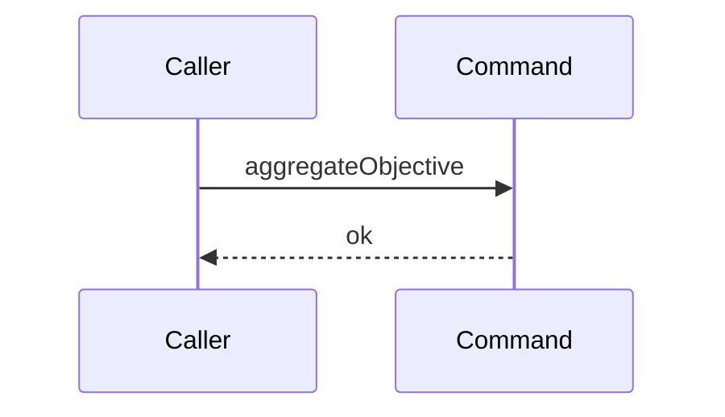

# Story 3 — The aggregation declines a null objective id

Epic: `.agents/plan/epics/053-node-state-ownership.md`
Depends on: Story 1 (`01-the-parent-objective-outcome`), for the `"053"` entry in `authoredEpics`
that makes this story's scenario file legal; EPIC 050.1 Story 1 (`01-the-recorder-and-the-runner`),
for the recorder and the runner.
Kind: story-implement

Diagrams: aggregate-objective-null-id

This story writes the command file, its dependency shape and the null guard. Story 4
(`04-the-aggregation-declines-a-parent-that-is-not-running`) adds the node read and the state guard,
Story 5 (`05-the-aggregation-declines-while-a-task-is-not-terminal`) the child read, Story 6
(`06-the-aggregation-reaches-the-human-gate`) the writes, and Story 7
(`07-the-aggregation-discards-and-rolls-the-initiative-up`) the roll-up.

**It declares no `Seams:` line.** Its diagram holds no token, so there is nothing to sign.

## The path

`aggregateObjective` is written from nothing, so this diagram has an empty prior set and it draws no
`baseline-` diagram.

### `aggregate-objective-null-id`

Fixture: the graph of `test/helpers/rows.ts:102` — `seedGraph`, untouched. `input.objectiveId` is
`null`, which is what a task whose parent is absent yields at the call site.



**The diagram holds no step, and that is the strongest statement available.**
`.agents/plan/authoring.md:188` — `A diagram with no step is legal` says a path that differs from
another only by calling nothing is drawn this way and never described in prose. It asserts the path
reaches **no seam at all**, so any call the implementation makes fails the comparison — including the
`plan.readNode` that Story 4 (`04-the-aggregation-declines-a-parent-that-is-not-running`) adds one
line below the guard.

**Only the two ends appear as participants.** `test/helpers/sequence-conformance.ts:172` —
`sequenceEnds` admits `Command`, `Client` and `Caller`, and the recorded dependency keys supply the
rest. This path touches none of them, so it names none.

**The drawn set is every branch of this path.** A null `objectiveId` has one trace, and the value
carries no further distinction.

Add `test/sequence/scenarios/aggregate-objective-null-id.ts`.

## Change

**Create `src/commands/outcome/aggregate-objective.ts`.** It copies the shape of
`src/commands/outcome/aggregate-initiative.ts:20` — `aggregateInitiative`: three positional
parameters, the caller's transaction second, and `void` returned. It opens no transaction of its own.

### 1 — the dependency and input types

```ts
export type InitiativeRollUpInput = Readonly<{
  initiativeId: string | null;
  at: number;
}>;

export type InitiativeRollUp = Readonly<{
  aggregate(transaction: Transaction, input: InitiativeRollUpInput): void;
}>;

export type AggregateObjectiveDependencies = Readonly<{
  plan: PlanStore;
  events: EventLog;
  initiative: InitiativeRollUp;
  instanceId: string;
}>;

export type AggregateObjectiveInput = Readonly<{
  objectiveId: string | null;
  at: number;
}>;
```

**`initiative` is an object with one method, and not a bare function.**
`test/helpers/sequence-conformance.ts:113` — `typeof capability` returns a non-object dependency
**unwrapped**, so a bare `(transaction, input) => void` records no token and Story 7
(`07-the-aggregation-discards-and-rolls-the-initiative-up`) could not draw it. The shipped precedent
is `Expiry` at `src/commands/node/claim-node.ts`, bound as an object literal in
`test/sequence/scenarios/claim-success-task.ts:81` — `expiry`. The key is `initiative` and the method
is `aggregate`, because `test/helpers/sequence-conformance.ts:259` — the token pattern admits only a
lower-case-initial key of `[a-z][a-z0-9-]*`, which a camelCase key would fail.

**`InitiativeRollUpInput` is declared here and not imported.**
`src/commands/outcome/close-objective.ts:10` — `InitiativeRollUpInput` is the shipped idiom: the
consumer re-declares the structural shape rather than importing `AggregateInitiativeInput`, so no
command imports another command.

**The whole dependency shape lands in this story, `initiative` included, even though nothing calls it
until Story 7.** A key added later would break the scenario files Stories 3 to 6 write, and each
scenario is written once.

### 2 — the null guard

```ts
export function aggregateObjective(
  dependencies: AggregateObjectiveDependencies,
  transaction: Transaction,
  input: AggregateObjectiveInput,
): void {
  if (input.objectiveId === null) {
    return;
  }
}
```

Line for line, this is `src/commands/outcome/aggregate-initiative.ts:25` — `initiativeId` with the id
renamed. It is the **first** statement, before any dependency is touched, which is what the zero-step
diagram asserts.

### 3 — the repair the new file forces

**Edit `src/domain/external-transition.test.ts` to stop asserting the command is absent.**
`src/domain/external-transition.test.ts:655` — `existsSync` asserts
`existsSync(resolve(repoRoot, "src/commands/outcome/aggregate-objective.ts"))` is `false`, and this
story creates that file. Change the expected value to `true`.

**Keep both consumer-map loops exactly as they are.**
`src/domain/external-transition.test.ts:571` — `names no aggregate-objective command` and `:646` —
`no consumer path names aggregate-objective` stay true and stay valuable: this command writes two
**internal** triggers, so `src/domain/external-transition.ts:215` — `externalTriggerConsumer` must
never name it. Inverting the `existsSync` value turns that pair of negative loops into a controlled
proof — the path they compare against now exists, so a typo in it fails rather than passing
vacuously. The epic's Proof block names the file, so the repair runs in `PASS EPIC-053`.

## Constraints

- The command opens no transaction. It takes the caller's, exactly as
  `src/commands/outcome/aggregate-initiative.ts:22` — `transaction` does.
- The dependency object holds four keys and no `clock`. The time arrives as `input.at`.
- `initiative` is an object with an `aggregate` method. Never a bare function.
- The null guard is the first statement of the function body.
- Do not add either new trigger id to `src/domain/external-transition.ts:215` —
  `externalTriggerConsumer`.

## Verify

```
node --test src/commands/outcome/aggregate-objective.test.ts src/domain/external-transition.test.ts test/sequence/conformance.test.ts
```

Create `src/commands/outcome/aggregate-objective.test.ts`, whose fixture is the one of
`src/commands/outcome/aggregate-initiative.test.ts:89` — `createAggregateFixture`: a
`createMigratedStorage()` from `test/helpers/database.ts:32` — `createMigratedStorage` and a
`createRecordingPlanStore(createPlanStore())` from `test/helpers/plan.ts:62` —
`createRecordingPlanStore`. Copy `createRecordingEvents` at
`src/commands/outcome/aggregate-initiative.test.ts:44`, `run` at `:188`, `nodeState` at `:206`,
`setNodeStateCalls` at `:214` and `assertNoWrite` at `:273`. Do **not** copy the unused `Clock` and
`createMockClock` imports at `src/commands/outcome/aggregate-initiative.test.ts:4` and `:17`.

Add, each as a separate `it`:

1. `"a null objective id reaches no seam at all"` — wrap the whole dependency object with `recordSeams`
   at `test/helpers/sequence-conformance.ts:99` — `recordSeams`, run the command with
   `objectiveId: null`, and assert `recorder.tokens` deep-equals `[]` by value. Assert in the same
   case that `databaseBytes(fixture.storage)` is byte-identical. **The control is case 2**, which runs
   the same recorder over an absent id and records exactly one token, so the empty list is proven to be
   a real absence rather than a recorder that never fires.

2. `"an absent objective id reaches plan.readNode and no further"` — the control for case 1. Run the
   same recorded dependency object with an `objectiveId` no row carries, and assert `recorder.tokens`
   deep-equals `["plan.readNode"]` by value. This case is written here and it turns green in Story 4
   (`04-the-aggregation-declines-a-parent-that-is-not-running`), which adds the read; until then it is
   the RED that story opens against.

3. `"the command file exists and no external trigger names it"` — extend
   `src/domain/external-transition.test.ts:646` — `no consumer path names aggregate-objective` rather
   than adding a case beside it: change `assert.equal(existsSync(…), false)` at `:653` to `true` and
   leave the two `assert.notEqual` loops above it untouched.

4. `"the null-id scenario conforms to its diagram by equality"` — call `assertConformance` at
   `test/helpers/sequence-conformance.ts:318` — `assertConformance` directly over this story's own
   scenario, naming this story file and `aggregate-objective-null-id`. Then assert it **throws** when a
   single token is appended to the recorder's list, so the empty comparison is proven to be an
   equality and not a vacuous pass.

Add `test/sequence/scenarios/aggregate-objective-null-id.ts`, following the shape of
`test/sequence/scenarios/claim-success-task.ts:53` — the default export: a synchronous default
function returning `Readonly<{ recorder: Readonly<{ tokens: readonly string[] }>; result: unknown }>`,
built over `createMigratedStorage()` in a `try`/`finally` with `fixture.dispose()`. Seed the fixture,
build the four-key dependency object with a real `SqliteEventLog`, a real `createPlanStore` and an
`initiative` whose `aggregate` calls the real `aggregateInitiative` over the **unwrapped** plan and
events, wrap it with `recordSeams`, run `aggregateObjective` with `objectiveId: null` inside
`storage.transact`, and return the recorder and the result.

`pnpm run verify` exits 0.

Proof: PASS line delivered — `src/commands/outcome/aggregate-objective.test.ts`,
`src/domain/external-transition.test.ts` and `test/sequence/conformance.test.ts` in
`PASS EPIC-053`.
