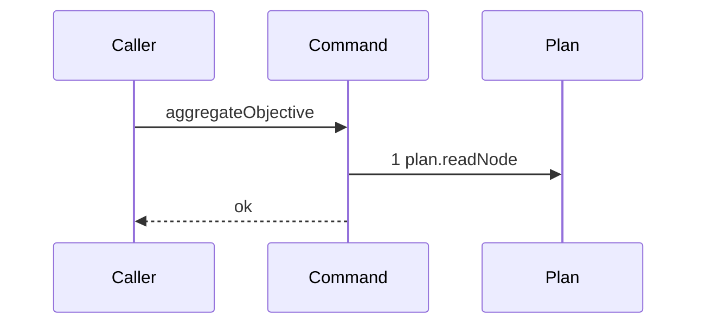

# Story 4 — The aggregation declines a parent that is not running

Epic: `.agents/plan/epics/053-node-state-ownership.md`
Depends on: Story 3 (`03-the-aggregation-declines-a-null-objective-id`), for the command file, its
dependency shape and the null guard, and for the RED its case 2 opens.
Kind: story-implement

Diagrams: aggregate-objective-not-running

Seams: aggregate-objective-not-running: +plan.readNode

This story adds the node read and the state guard. Story 5
(`05-the-aggregation-declines-while-a-task-is-not-terminal`) adds the child read, Story 6
(`06-the-aggregation-reaches-the-human-gate`) the writes, and Story 7
(`07-the-aggregation-discards-and-rolls-the-initiative-up`) the roll-up.

## The path

`aggregateObjective` is written from nothing, so this diagram has an empty prior set, it draws no
`baseline-` diagram, and its one token is `+`.

### `aggregate-objective-not-running`

Fixture: the graph of `test/helpers/rows.ts:102` — `seedGraph`, with the objective `O` moved to
`awaiting_approval` by `test/helpers/rows.ts:329` — `seedNodeState`. `input.objectiveId` is `O`.
**No `PRAGMA ignore_check_constraints` is needed.**
`src/services/storage/migration-0002-graph-and-plan.ts:40` — `awaiting_approval` reads
`CHECK (state <> 'awaiting_approval' OR kind = 'objective')`, so an objective row holds the state
directly; only a task row needs the bypass of
`src/commands/outcome/report-outcome.test.ts:258` — `seedTaskState`.



**One step, and the guard is what stops it.** The command reads the node and returns, so no child
read, no write and no event is reached. `plan.readNode` has no projection entry at
`test/helpers/sequence-conformance.ts:50` — `projections`, so it draws a bare token and may appear at
most once per diagram.
`.agents/plan/stories/050.2-the-run-renew-release-and-report/02-the-authority-seams.md:164` —
`plan.readNode` forbids adding one, and seventy citations across EPICs 050.2 to 052.1 draw the bare
token, so the ruling holds here.

**The terminal is `ok`, and the command returns `undefined`.**
`test/helpers/sequence-conformance.ts:303` — `resultTerminal` reads a non-`Error`, non-`ok:false`
value as `ok`, and a decline is a normal return rather than a refusal.

**The drawn set is every trace of this terminal that reaches a seam.** An absent node and a node in
any non-`running` state reach the same one step, because one guard decides both:
`node === null || node.state !== "running"`. The null-id trace reaches no seam and is Story 3
(`03-the-aggregation-declines-a-null-objective-id`)'s own zero-step diagram.

Add `test/sequence/scenarios/aggregate-objective-not-running.ts`.

## Change

**Edit `src/commands/outcome/aggregate-objective.ts` to read the node and gate on its state.** The
block sits immediately after the null guard Story 3
(`03-the-aggregation-declines-a-null-objective-id`) wrote.

```ts
const node = dependencies.plan.readNode(transaction, input.objectiveId);
if (node === null || node.state !== "running") {
  return;
}
```

Line for line, this is `src/commands/outcome/aggregate-initiative.ts:30` — `running`.

**One guard decides both the absent node and every non-`running` state**, which is why both are one
diagram. Splitting them would need a second `plan.readNode` on one of the two paths, and there is
none.

**The `running` guard is the whole precedence mechanism of this epic.**
`src/services/plan/index.ts:119` — `setNodeState` validates the declared `from` against the stored
state, a closed objective is `done` or `partial` and an attested atomic objective is
`awaiting_approval`, so a later aggregation reaches no write. No provenance column carries it.

## Constraints

- `plan.readNode` is called exactly once, on every path that reaches it. A second read draws a
  duplicate token, which `test/helpers/sequence-conformance.ts:284` — `duplicate token in diagram`
  refuses.
- The absent node and the non-`running` state stay one guard. Do not split them.
- The command reads no run, no lease and no execution row, on any path.
- Do not touch the null guard or the dependency types Story 3
  (`03-the-aggregation-declines-a-null-objective-id`) wrote.

## Verify

```
node --test src/commands/outcome/aggregate-objective.test.ts test/sequence/conformance.test.ts
```

Extend `src/commands/outcome/aggregate-objective.test.ts` with the fixture Story 3
(`03-the-aggregation-declines-a-null-objective-id`) built. Its case 2 is already written and RED; this
story turns it green.

Add, each as a separate `it`:

1. `"an absent node and every non-running state reach plan.readNode and write nothing"` — assert an
   `objectiveId` no row carries leaves `databaseBytes(fixture.storage)` byte-identical and records
   zero write calls, counted through `test/helpers/plan.ts:56` — `RecordedPlanCall`, which records
   `mutateGraph` and `setNodeState` and no read. Then iterate `nodeStates` from
   `src/domain/state.ts:7` — `nodeStates`, skipping `"running"`, seed the objective into each value,
   and assert `databaseBytes` deep-equals the pre-call snapshot,
   `setNodeStateCalls(fixture).length` is unchanged and `fixture.appends.length` is `0` in every
   iteration. Assert `nodeStates.length === 8` in the same case, so a ninth state fails rather than
   being skipped. **The control is case 4 of Story 6
   (`06-the-aggregation-reaches-the-human-gate`)**, which drives the same fixture with the objective
   `running` and asserts the write does happen. This is the epic's gate row 6a.

2. `"a task row still refuses awaiting_approval while an objective row accepts it"` — seed the
   objective to `awaiting_approval` with no PRAGMA bypass and assert the row reads back, then assert
   the same write against `fixtureIds.task` throws. This pins
   `src/services/storage/migration-0002-graph-and-plan.ts:40` — `awaiting_approval`, which is what
   lets this story's scenario fixture skip the bypass of
   `src/commands/outcome/report-outcome.test.ts:258` — `seedTaskState`.

3. `"the not-running scenario conforms to its diagram by equality"` — call `assertConformance` at
   `test/helpers/sequence-conformance.ts:318` — `assertConformance` directly over this story's own
   scenario, naming this story file and `aggregate-objective-not-running`. Then assert it **throws**
   when one token is appended to the recorder's list and again when the list is emptied, so equality is
   proven to be equality. The direct call is what gives the loop a RED before `"053"` reaches
   `shippedEpics`, because `test/sequence/conformance.test.ts:82` — `liveDiagrams` replays a diagram
   only once its epic sits there, and Story 8
   (`08-the-accepted-settle-aggregates-the-parent`) is what puts it there.

Add `test/sequence/scenarios/aggregate-objective-not-running.ts`, in the shape Story 3
(`03-the-aggregation-declines-a-null-objective-id`)'s scenario established: the `awaiting_approval`
objective the diagram names, the real command over real SQLite behind the recorder, the `initiative`
capability bound to the **unwrapped** plan and events, the objective aliased `O`, and the recorder and
the result returned.

`pnpm run verify` exits 0.

Proof: PASS line delivered — `src/commands/outcome/aggregate-objective.test.ts` and
`test/sequence/conformance.test.ts` in `PASS EPIC-053`.
