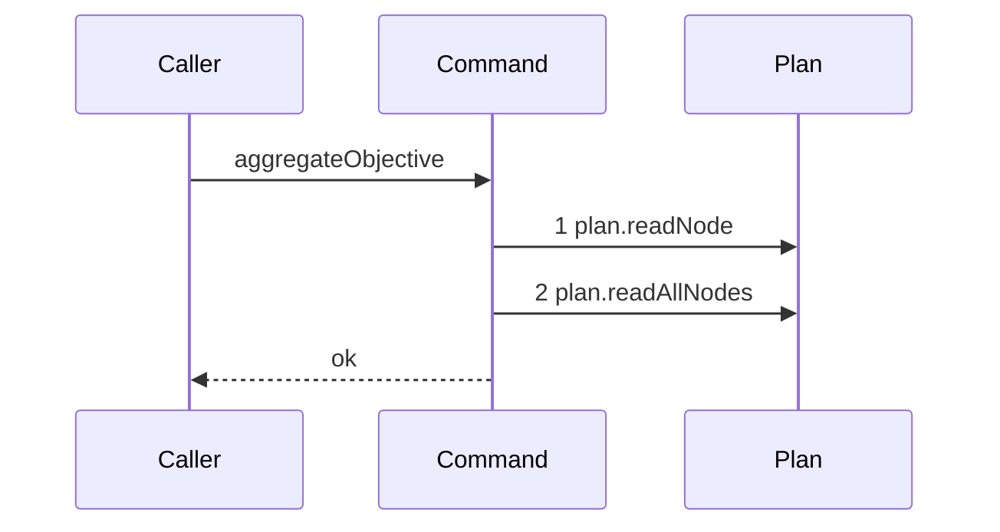

# Story 5 — The aggregation declines while a task is not terminal

Epic: `.agents/plan/epics/053-node-state-ownership.md`
Depends on: Story 4 (`04-the-aggregation-declines-a-parent-that-is-not-running`), for the command,
its dependency shape and its two early returns.
Kind: story-implement

Diagrams: aggregate-objective-not-terminal

Seams: aggregate-objective-not-terminal: +plan.readNode, +plan.readAllNodes

This story adds the child read and the terminal gate. Story 6
(`06-the-aggregation-reaches-the-human-gate`) adds the first write, and Story 7
(`07-the-aggregation-discards-and-rolls-the-initiative-up`) the roll-up.

## The path

`aggregateObjective` is written from nothing, so this diagram has an empty prior set, it draws no
`baseline-` diagram, and both its tokens are `+`.

### `aggregate-objective-not-terminal`

Fixture: the graph of `test/helpers/rows.ts:102` — `seedGraph` with the objective `O` left `running`
and **three** task children of `O`, seeded to `done`, `done` and `running`.
`test/helpers/rows.ts:359` — `seedNode` inserts the two extra tasks with
`parentId: fixtureIds.objective` and an `acceptanceBlob`, which
`src/services/storage/migration-0002-graph-and-plan.ts` requires of every task row.
`input.objectiveId` is `O`.

**The length of three is stated, and it is what makes the gate a gate.** One non-terminal child among
three is the reachable case; a single non-terminal child would not distinguish this path from a
fixture whose only child is running.



**Step 2 is one call for the whole child set.** `src/services/plan/index.ts:79` — `readAllNodes` takes
the transaction alone and returns every node, so the parent filter and the sort are pure work that no
seam sees. `plan.readAllNodes` has no projection entry at
`test/helpers/sequence-conformance.ts:50` — `projections`, so it draws a bare token.

**No write is reached, and that is the whole assertion of this diagram.** The gate sits between the
child read and every mutation, so `plan.setNodeState` and `events.append` are absent by construction
rather than by a fixture accident.

**The drawn set is every branch of this path.** One child that is not terminal stops the command, and
the count of non-terminal children changes no seam call. A childless `running` parent reaches the same
two steps and then **throws**, which is a different terminal and is asserted by case 2 of Story 7
(`07-the-aggregation-discards-and-rolls-the-initiative-up`).

Add `test/sequence/scenarios/aggregate-objective-not-terminal.ts`.

## Change

**Edit `src/commands/outcome/aggregate-objective.ts` to read the children and gate on their states.**
The block sits after the `running` guard Story 4
(`04-the-aggregation-declines-a-parent-that-is-not-running`) wrote, and before anything else.

### 1 — the ordered child states

```ts
const tasks = dependencies.plan
  .readAllNodes(transaction)
  .filter((candidate) => candidate.parentId === node.id)
  .sort((left, right) => compareIds(left.id, right.id));
const states = tasks.map((task) => task.state);
```

with the shipped comparator copied verbatim from
`src/commands/outcome/aggregate-initiative.ts:88` — `compareIds`:

```ts
function compareIds(left: string, right: string): number {
  return Buffer.compare(Buffer.from(left, "utf8"), Buffer.from(right, "utf8"));
}
```

The sort is what makes `taskStates` deterministic in the payload Story 6
(`06-the-aggregation-reaches-the-human-gate`) appends. `AGENTS.md` requires a topological tie-break by
ULID and a bytewise comparison, and `Buffer.compare` is that comparison.

**The order is not observable in this story, and no case of it asserts the order.** The command
returns `void`, reaches no write and appends no event on this path, so the sorted array is a local
value that no seam and no return carries. Story 6 (`06-the-aggregation-reaches-the-human-gate`)
case 5 is the first point at which the order becomes visible, in the `taskStates` member of the
appended payload, and it is the case that proves it.

**The filter is `parentId === node.id` and nothing more.**
`src/commands/outcome/aggregate-initiative.ts:36` — `parentId` filters the same way and does not test
`kind`. A node whose parent is an objective is a task by
`src/domain/node-pair.ts` and by the shape rule of
`docs/proposal/phase-2/deliverables-and-pairs.md:30` — `Shape`, so a `kind` test would be a second
expression of a rule the graph validator already owns.

### 2 — the terminal gate

```ts
const everyTerminal = states.every((state) =>
  (terminalStates as readonly NodeState[]).includes(state),
);
if (!everyTerminal) {
  return;
}
if (states.length === 0) {
  throw new Error(`the objective ${node.id} holds no task`);
}
```

**The length check sits after the terminal gate, and that order is load-bearing.**
`src/commands/outcome/aggregate-initiative.ts:46` — `holds no objective` places it the same way:
`[].every(...)` is `true`, so an empty child list falls through the gate and reaches the throw, and
`src/domain/aggregation.ts:23` — `empty-parent` never fires from this path. Reversing the two would
change which error surfaces, and case 2 of Story 7
(`07-the-aggregation-discards-and-rolls-the-initiative-up`) asserts the message.

The message names a **task**, not an objective, matching
`src/commands/outcome/close-objective.ts:113` — `holds no task` one level down.

## Constraints

- `plan.readAllNodes` is called exactly once, on every path that reaches it.
- The child filter tests `parentId` alone.
- The terminal gate precedes the empty-child throw. Do not reorder them.
- No write and no event is reached on this path.
- `compareIds` is a module-private function of this file, copied from
  `src/commands/outcome/aggregate-initiative.ts:88` — `compareIds`. Do not import it: a command never
  imports another command.

## Verify

```
node --test src/commands/outcome/aggregate-objective.test.ts test/sequence/conformance.test.ts
```

Extend `src/commands/outcome/aggregate-objective.test.ts` with the fixture Story 4
(`04-the-aggregation-declines-a-parent-that-is-not-running`) built, adding a seeder for three task
children of the objective in the shape of
`src/commands/outcome/aggregate-initiative.test.ts:104` — `insertObjective` and `:122` —
`seedObjectiveStates`.

Add, each as a separate `it`:

1. `"a running parent whose three tasks hold one running child writes nothing and appends no event"` —
   seed the three tasks to `done`, `done` and `running`, snapshot `databaseBytes(fixture.storage)` and
   `setNodeStateCalls(fixture).length` before the call, run the command, and assert
   `assert.deepEqual(databaseBytes(fixture.storage), bytes)`,
   `assert.equal(setNodeStateCalls(fixture).length, calls)` and
   `assert.equal(fixture.appends.length, 0)`. **The control is case 4 of Story 5
   (`05-the-aggregation-reaches-the-human-gate`)**, which runs the identical fixture with the third
   task `done` and asserts one write and one event. This is the epic's gate row 7.

2. `"every non-terminal state of a single child stops the aggregation"` — iterate `nodeStates` from
   `src/domain/state.ts:7` — `nodeStates` minus `terminalStates` from `:20`, seeding the third task
   into each value in turn, and assert `nodeState(fixture, fixtureIds.objective)` is still `"running"`
   in every iteration. Assert the iterated set has exactly five members in the same case, so a new
   non-terminal state fails rather than being skipped.

3. `"the not-terminal scenario conforms to its diagram by equality"` — call `assertConformance` at
   `test/helpers/sequence-conformance.ts:318` — `assertConformance` directly over this story's own
   scenario, naming this story file and `aggregate-objective-not-terminal`. Then assert it **throws**
   when the two tokens are swapped and again when `plan.readAllNodes` is removed, so both the set and
   the order are proven.

Add `test/sequence/scenarios/aggregate-objective-not-terminal.ts`, in the shape Story 4
(`04-the-aggregation-declines-a-parent-that-is-not-running`)'s scenario established: the three-task
fixture the diagram names, the real command over real SQLite behind the recorder, the `initiative`
capability bound to the **unwrapped** plan and events, the objective aliased `O`, and the recorder and
the result returned.

`pnpm run verify` exits 0.

Proof: PASS line delivered — `src/commands/outcome/aggregate-objective.test.ts` and
`test/sequence/conformance.test.ts` in `PASS EPIC-053`.
