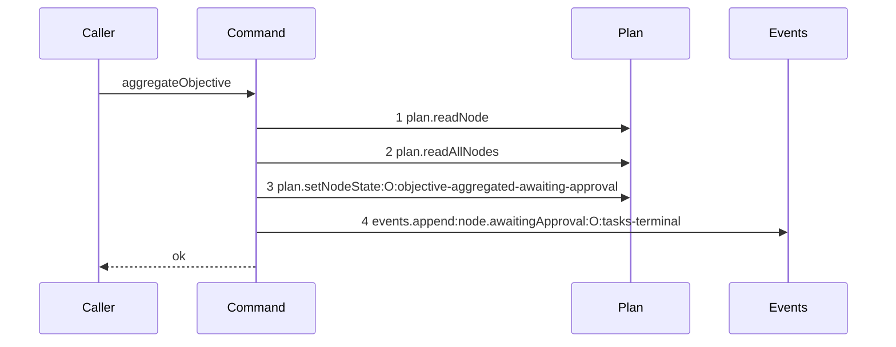

# Story 6 — The aggregation reaches the human gate

Epic: `.agents/plan/epics/053-node-state-ownership.md`
Depends on: Story 5 (`05-the-aggregation-declines-while-a-task-is-not-terminal`), for the ordered
child states and the terminal gate; Story 1 (`01-the-parent-objective-outcome`), for
`parentObjectiveOutcome`; Story 2 (`02-the-triggers-and-the-payload-variant`), for the trigger row
`src/services/plan/sqlite.ts:515` — `triggerTransition` resolves and for the payload variant this
story appends.
Kind: story-implement

Diagrams: aggregate-objective-awaiting-approval

Seams: aggregate-objective-awaiting-approval: +plan.readNode, +plan.readAllNodes, +plan.setNodeState:O:objective-aggregated-awaiting-approval, +events.append:node.awaitingApproval:O:tasks-terminal

This story writes the two rows of the epic's table that reach the human gate. Story 7
(`07-the-aggregation-discards-and-rolls-the-initiative-up`) writes the third and adds the roll-up.

## The path

`aggregateObjective` is written from nothing, so this diagram has an empty prior set, it draws no
`baseline-` diagram, and all four of its tokens are `+`.

### `aggregate-objective-awaiting-approval`

Fixture: the graph of `test/helpers/rows.ts:102` — `seedGraph` with the objective `O` left `running`
and **three** task children of `O`, all seeded `done`. `input.objectiveId` is `O`.

**The fixture states `done` for all three, and the `partial` projection is not drawn.** A mixture of
`done` and `discarded` produces the identical four tokens with the identical labels — the trigger and
the event type are the same, and `projection` sits inside the payload, which
`test/helpers/sequence-conformance.ts:72` — `events.append` does not project. Two fixtures with one
trace are one diagram, per `.agents/plan/authoring.md:150`, and the `partial` projection is asserted
by value in case 2.



**Step 3 carries two labels because `plan.setNodeState` projects two fields.**
`test/helpers/sequence-conformance.ts:51` — `plan.setNodeState` projects `id` and `trigger`, so the
token names the objective alias and the trigger id. The trigger is what makes this token different
from Story 7 (`07-the-aggregation-discards-and-rolls-the-initiative-up`)'s, and the two are separate
declarations for that reason.

**Step 4 carries three labels.** `test/helpers/sequence-conformance.ts:72` — `events.append` projects
`type` and `subjectId`, and appends `String(payload.reason)` whenever the payload holds a `reason`
key. The `tasks-terminal` payload Story 2 (`02-the-triggers-and-the-payload-variant`) added holds one,
so the third label is `tasks-terminal` by construction.

**No fifth step, and that is the assertion.** `aggregateInitiative` is not reached, because
`awaiting_approval` is not in `src/domain/state.ts:20` — `terminalStates` and an initiative aggregates
only over terminal objectives. Case 2 asserts the zero call count, and Story 7
(`07-the-aggregation-discards-and-rolls-the-initiative-up`)'s diagram is the control that the step is
drawable at all.

**The drawn set is every branch of this path.** `parentObjectiveOutcome` returns
`awaiting_approval` for `done` and for `partial`, and both reach these four calls in this order. The
third row of the table, `discarded`, is Story 6's diagram.

Add `test/sequence/scenarios/aggregate-objective-awaiting-approval.ts`.

## Change

**Edit `src/commands/outcome/aggregate-objective.ts` to project the children and write the
transition.** The block sits after the terminal gate Story 5
(`05-the-aggregation-declines-while-a-task-is-not-terminal`) wrote.

### 1 — the projection and the outcome

```ts
const projected = aggregate("objective", states as readonly TerminalState[]);
const outcome = parentObjectiveOutcome(projected);
```

`aggregate("objective", …)` at `src/domain/aggregation.ts:17` — `aggregate` throws
`invalid-child-state` for a `partial` task at `:28`, so a `partial` value here always carries at least
one `done` and at least one `discarded`. That is what makes
`src/domain/transition.ts:156` — `every task is terminal`'s note, "every task is terminal, and at least one
task is `done`", true for the `partial` row of the epic's table as well as the `done` row.

**The `AggregationError` is not caught, and it is not reclassified.** It is an invariant failure
reachable from no legal request, and `src/http/contract/errors.ts:7` — `errorStatuses` holds no code
for it, which Story 1 (`01-the-parent-objective-outcome`) case 3 asserts with its control.

### 2 — the transition

```ts
dependencies.plan.setNodeState(transaction, {
  id: node.id,
  from: "running",
  to: outcome.state,
  trigger: outcome.trigger,
  blockReason: null,
  at: input.at,
  cause: { revision: node.revision, importId: null },
});
```

Seven keys, in the order of `src/commands/outcome/aggregate-initiative.ts:58` — `setNodeState`.
`blockReason` is the literal `null` rather than a member of the outcome: neither state this command
writes is `blocked`, so `ParentObjectiveOutcome` carries no such field, per Story 1
(`01-the-parent-objective-outcome`). `cause.revision` is the node's own revision, matching
`src/commands/outcome/aggregate-initiative.ts:65` — `cause`.

**The returned `ReadinessTransition[]` is discarded**, as it is at
`src/commands/outcome/aggregate-initiative.ts:58`. This command promotes nothing: it writes a parent,
and readiness is derived from dependency edges between siblings.

### 3 — the event

```ts
dependencies.events.append(transaction, {
  subjectKind: "node",
  subjectId: node.id,
  type:
    outcome.state === "awaiting_approval"
      ? "node.awaitingApproval"
      : "node.discarded",
  actorKind: "daemon",
  actorId: dependencies.instanceId,
  payload: {
    from: "running",
    to: outcome.state,
    reason: "tasks-terminal",
    taskStates: states,
    projection: projected,
  },
});
```

Six keys, in the order of `src/commands/outcome/aggregate-initiative.ts:68` — `append`. The event is
appended **in the caller's transaction**, so the transition and its event are never in two
transactions, which `docs/proposal/phase-1/domain.md` requires and `AGENTS.md` restates.

**`subjectId` is the objective id, not a run id and not a node alias.** The daemon derives the
transition from committed child state, so the subject is the node whose state moved.
`src/commands/outcome/aggregate-initiative.ts:70` — `subjectId` is the same choice one level up.

**`actorKind` is `daemon` and `actorId` is the instance id.** No worker and no human named this
transition. `src/commands/outcome/aggregate-initiative.ts:77` — `daemon` is the shipped shape.

**`taskStates` is the ordered array Story 4 built**, and `projection` is the `aggregate` value. Both
are what the human reads at the gate: `docs/proposal/phase-2/gates-and-approval.md:74` — `projected`
requires the projection beside the state, and `:83` requires the discarded children to be listed.

**The `type` ternary already covers Story 6's row**, and Story 7
(`07-the-aggregation-discards-and-rolls-the-initiative-up`) adds no branch to it. It writes the
`discarded` state that selects the other arm, and the roll-up call after it.

## Constraints

- `plan.setNodeState` is called once, and `events.append` once, on this path.
- The write declares `from: "running"`. Never the stored state read back.
- `blockReason` is the literal `null`.
- The event sits in the caller's transaction. The command opens none.
- The payload holds exactly five keys, in the order `from`, `to`, `reason`, `taskStates`,
  `projection`, matching the schema Story 2 (`02-the-triggers-and-the-payload-variant`) registered.
- Do not catch `AggregationError`.
- Do not call `dependencies.initiative.aggregate` on this path.

## Verify

```
node --test src/commands/outcome/aggregate-objective.test.ts src/http/contract/event-payload.test.ts test/sequence/conformance.test.ts
```

Extend `src/commands/outcome/aggregate-objective.test.ts` with the three-task fixture Story 5
(`05-the-aggregation-declines-while-a-task-is-not-terminal`) built, and with an `assertRollUp` helper
in the shape of `src/commands/outcome/aggregate-initiative.test.ts:231` — `assertRollUp`.

Add, each as a separate `it`:

1. `"three done tasks give awaiting_approval with the objective-aggregated-awaiting-approval trigger and one node.awaitingApproval event"`
   — assert `nodeState(fixture, fixtureIds.objective)` is `"awaiting_approval"`; assert the single
   recorded `setNodeState` input deep-equals the seven-key object with
   `trigger: "objective-aggregated-awaiting-approval"`; assert `fixture.appends.length` is exactly
   `1`, its `type` is `"node.awaitingApproval"`, its `subjectKind` is `"node"`, its `subjectId` is the
   objective id, its `actorKind` is `"daemon"` and its `actorId` is the instance id; and assert its
   `payload` **deep-equals**
   `{ from: "running", to: "awaiting_approval", reason: "tasks-terminal", taskStates: ["done", "done", "done"], projection: "done" }`
   with `taskStates` in ULID order. This is the epic's gate row 8.

2. `"two done tasks and one discarded give awaiting_approval with a partial projection and reach the initiative roll-up zero times"`
   — the same fixture with the third task `discarded`. Assert the state is `"awaiting_approval"`, the
   trigger is `"objective-aggregated-awaiting-approval"`, the payload `projection` is `"partial"` and
   `taskStates` deep-equals the ULID-ordered `["done", "done", "discarded"]` by value. Then assert the
   `initiative` capability recorded **zero** calls, by passing an `initiative` double that counts.
   **The control for that zero is case 1 of Story 6
   (`06-the-aggregation-discards-and-rolls-the-initiative-up`)**, which asserts the same double
   records exactly one call. This is the epic's gate row 9.

3. `"the appended payload parses against the registered node.awaitingApproval schema"` — take the
   payload the command appended in case 1 and call
   `eventPayloads["node.awaitingApproval"].parse(payload)` from
   `src/http/contract/event-payload.ts:71` — `eventPayloads`. This is what stops the command and the
   contract drifting: Story 2 (`02-the-triggers-and-the-payload-variant`) case 5 parses a hand-written
   shape, and this case parses the shape the real command produced.

4. `"a running parent with three terminal tasks writes exactly once, and the not-terminal fixture writes not at all"`
   — the control case for Story 4 (`04-the-aggregation-declines-a-parent-that-is-not-running`) case 1
   and Story 5 (`05-the-aggregation-declines-while-a-task-is-not-terminal`) case 1. Run the identical
   three-task fixture twice, once with the third task `running` and once with it `done`, and assert
   `databaseBytes` is unchanged in the first and changed in the second, with
   `setNodeStateCalls(fixture).length` `0` and `1`. Both negative proofs of this epic point at this
   case, so it states both directions in one place.

5. `"taskStates is ordered bytewise by node id, not by insertion order"` — seed three tasks whose
   insertion order disagrees with their id order, one of them carrying a non-ASCII id, drive the
   terminal path, and assert the appended payload's `taskStates` deep-equals the `Buffer.compare`
   order by value. The non-ASCII id is what proves a bytewise comparison rather than a locale one,
   mirroring `src/commands/outcome/aggregate-initiative.test.ts:430` — `ordered bytewise by node id`.
   **This is the first case at which the order Story 4
   (`04-the-aggregation-declines-while-a-task-is-not-terminal`) established becomes observable**: that
   story reaches no write and no event, so the sorted array is a local value there.

6. `"the awaiting-approval scenario conforms to its diagram by equality"` — call `assertConformance`
   at `test/helpers/sequence-conformance.ts:318` — `assertConformance` directly over this story's own
   scenario, naming this story file and `aggregate-objective-awaiting-approval`. Then assert it
   **throws** when steps 3 and 4 are swapped and again when the trigger label is changed to
   `objective-aggregated-discarded`, so the label is proven to be part of the token.

Add `test/sequence/scenarios/aggregate-objective-awaiting-approval.ts`, in the shape Story 4
(`04-the-aggregation-declines-a-parent-that-is-not-running`)'s scenario established: the three-`done`
fixture the diagram names, the real command over real SQLite behind the recorder with a real
`SqliteEventLog`, the `initiative` capability bound to the **unwrapped** plan and events, the objective
aliased `O`, and the recorder and the result returned.

`pnpm run verify` exits 0.

Proof: PASS line delivered — `src/commands/outcome/aggregate-objective.test.ts`,
`src/http/contract/event-payload.test.ts` and `test/sequence/conformance.test.ts` in `PASS EPIC-053`.
