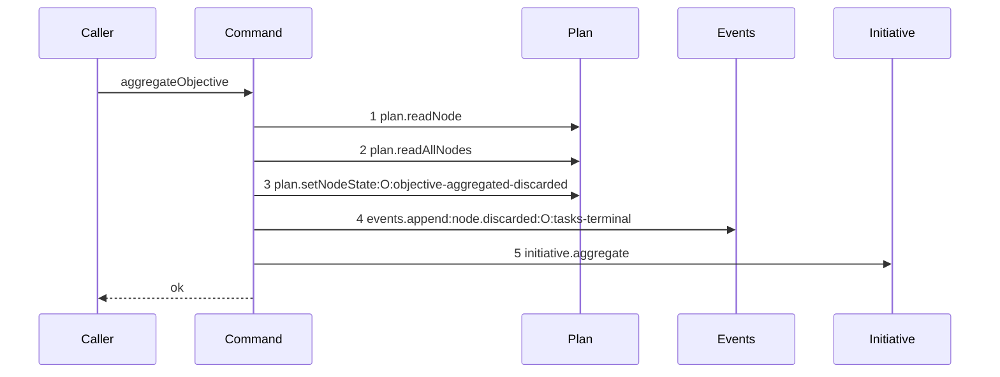

# Story 7 — The aggregation discards and rolls the initiative up

Epic: `.agents/plan/epics/053-node-state-ownership.md`
Depends on: Story 6 (`06-the-aggregation-reaches-the-human-gate`), for the projection, the transition
and the event; Story 2 (`02-the-triggers-and-the-payload-variant`), for the
`objective-aggregated-discarded` row and the `node.discarded` union.
Kind: story-implement

Diagrams: aggregate-objective-discarded

Seams: aggregate-objective-discarded: +plan.readNode, +plan.readAllNodes, +plan.setNodeState:O:objective-aggregated-discarded, +events.append:node.discarded:O:tasks-terminal, +initiative.aggregate

This story completes `aggregateObjective`. Story 8
(`08-the-accepted-settle-aggregates-the-parent`) wires it into `landSettle`'s accepted arm, and this
story's scenario drives the command directly.

## The path

`aggregateObjective` is written from nothing, so this diagram has an empty prior set, it draws no
`baseline-` diagram, and all five of its tokens are `+`.

### `aggregate-objective-discarded`

Fixture: the graph of `test/helpers/rows.ts:102` — `seedGraph` with the initiative `I` and the
objective `O` both left `running`, and **three** task children of `O`, all seeded `discarded`.
`input.objectiveId` is `O`.



**Steps 1 to 4 are Story 6 (`06-the-aggregation-reaches-the-human-gate`)'s shape with two labels
changed.** The trigger and the event type differ, and nothing else does: the same four calls fire in
the same order, because `parentObjectiveOutcome` decides a value and not a control flow.

**Step 5 is a nested command, and it is one step.** `test/helpers/sequence-conformance.ts:50` —
`projections` declares no entry for `initiative.aggregate`, so it draws a bare token and may appear
once. The scenario binds it to **unrecorded** dependencies, so `aggregateInitiative`'s own
`plan.readNode`, `plan.readAllNodes`, `plan.setNodeState` and `events.append` produce no token here.
Those calls are drawn by the diagrams of `aggregateInitiative`, and duplicating them would make this
diagram unparsable: `test/helpers/sequence-conformance.ts:284` — `duplicate token in diagram` refuses
a repeated token, and `plan.readNode` is already step 1.

**Step 5 sits after step 4 and not before it.** The initiative aggregates over committed objective
state, and `src/services/plan/sqlite.ts:526` — `before.state` compares the stored value, so the
objective must be `discarded` in the database before the initiative reads it. Both writes are in one
transaction, so a failure in either loses both.
`src/commands/outcome/close-objective.ts:157` — `aggregateInitiative` is the shipped ordering, after
the event and inside the caller's transaction.

**Step 5 fires only on this path.** `awaiting_approval` is not in
`src/domain/state.ts:20` — `terminalStates`, so a call after Story 5's row would find every objective
non-terminal and return at `src/commands/outcome/aggregate-initiative.ts:42` — `everyTerminal`
anyway. Calling it unconditionally would be harmless and would add an unmodelled fifth step to Story
5's diagram, so the command guards it.

**The drawn set is every branch of this path.** `discarded` is the one projection that reaches step 5,
and the count of `discarded` children changes no seam call. A `running` parent that holds no task
reaches steps 1 and 2 and then **throws**, which is a different terminal, and case 2 asserts it by
message rather than drawing it.

Add `test/sequence/scenarios/aggregate-objective-discarded.ts`.

## Change

**Edit `src/commands/outcome/aggregate-objective.ts` to roll the initiative up after a discard.** The
block is the last statement of the command.

### 1 — the guarded roll-up

```ts
if (outcome.state === "discarded") {
  dependencies.initiative.aggregate(transaction, {
    initiativeId: node.parentId,
    at: input.at,
  });
}
```

`node.parentId` is the initiative id, and it is passed through unchanged.
`src/commands/outcome/aggregate-initiative.ts:25` — `initiativeId` returns for a null value, so a
parent objective whose `parentId` is null costs one call and writes nothing. The command performs no
null test of its own, matching `src/commands/outcome/close-objective.ts:158` — `initiativeId`, which
passes `node.parentId` the same way.

**`at` is `input.at`, the caller's time, and not a second clock read.** The whole report transaction
stamps one time, and this command holds no `clock` key for that reason.

**The walk stops here, and the stop is by construction.** A task report aggregates its parent
objective; that objective moves the initiative only when it reaches `discarded`; and an initiative has
no parent. `../docs/workflow/worker.md:365` — `A run never sets` states that a run never sets an
initiative or a parent objective terminal state, and the `awaiting_approval` row of Story 6
(`06-the-aggregation-reaches-the-human-gate`) satisfies it because `awaiting_approval` is not
terminal. No ordered transition list and no generic ancestor walk exists, and none is added.

**`src/commands/outcome/aggregate-initiative.ts` changes by not one line.** It gains one caller.

## Constraints

- The roll-up is guarded on `outcome.state === "discarded"`. Do not call it unconditionally.
- `initiativeId` is `node.parentId`, passed through with no null test.
- `at` is `input.at`. The command reads no clock.
- The roll-up is the last statement, after the event append.
- Do not edit `src/commands/outcome/aggregate-initiative.ts`.
- The command still returns `void`.

## Verify

```
node --test src/commands/outcome/aggregate-objective.test.ts src/commands/outcome/aggregate-initiative.test.ts src/http/contract/event-payload.test.ts test/sequence/conformance.test.ts
```

Extend `src/commands/outcome/aggregate-objective.test.ts` with the fixture Story 6
(`06-the-aggregation-reaches-the-human-gate`) built, adding an `initiative` double that records
`{ transaction, input }` per call, in the shape of
`src/commands/outcome/report-outcome.test.ts:197` — `reportObjective`.

Add, each as a separate `it`:

1. `"three discarded tasks give discarded, one node.discarded event, and exactly one initiative roll-up carrying the parent id"`
   — assert `nodeState(fixture, fixtureIds.objective)` is `"discarded"`; assert the recorded
   `setNodeState` input carries `trigger: "objective-aggregated-discarded"` and `to: "discarded"`;
   assert `fixture.appends.length` is exactly `1` with `type` `"node.discarded"` and a payload that
   **deep-equals**
   `{ from: "running", to: "discarded", reason: "tasks-terminal", taskStates: ["discarded", "discarded", "discarded"], projection: "discarded" }`;
   and assert the `initiative` double recorded exactly **one** call whose `input` deep-equals
   `{ initiativeId: fixtureIds.initiative, at: NOW }` by value. Assert in the same case that
   `typeof call.transaction.get === "function"` and that the transaction is the caller's, by having
   the double write a probe row and reading it back, as
   `src/commands/outcome/report-outcome.test.ts:855` — `delegated_probe` does. This is the epic's
   gate row 10, and it is the control for Story 5 case 2's zero call count.

2. `"a running parent objective holding no task throws by message"` — seed the objective `running`
   with no child, run the command, and assert it throws with the message
   `` `the objective ${fixtureIds.objective} holds no task` ``, asserted by string equality. Assert in
   the same case that `databaseBytes` is byte-identical afterwards, so the throw is proven to leave
   nothing behind. This is the epic's gate row 11, and it is the shipped behaviour of
   `src/commands/outcome/aggregate-initiative.ts:46` — `holds no objective` one level up.

3. `"a discarded parent objective whose parentId is null costs one roll-up call and writes nothing"` —
   pass a fixture whose objective has a null `parentId`, and assert the `initiative` double recorded
   one call with `initiativeId: null`, and that the real `aggregateInitiative` behind it left the node
   table unchanged beyond the objective's own row. This pins the no-null-test decision of `## Change`.

4. `"the appended payload parses against the registered node.discarded schema"` — take the payload
   case 1 appended and call `eventPayloads["node.discarded"].parse(payload)` from
   `src/http/contract/event-payload.ts:71` — `eventPayloads`. Assert in the same case that the shipped
   `objectives-terminal` payload of
   `src/commands/outcome/aggregate-initiative.ts:82` — `objectives-terminal` still parses against the
   same schema, which is the control that the union admits both writers and neither lost its arm.

5. `"an initiative holding one all-discarded objective reaches discarded through two writes in one transaction"`
   — drive the real `aggregateInitiative` behind `initiative.aggregate` rather than the double, over
   an initiative holding exactly one objective. Assert both node rows read `discarded`, assert exactly
   **two** events were appended — the objective's `node.discarded` and the initiative's
   `node.discarded` — and assert both carry `actorKind: "daemon"`. Then wrap `events.append` in a
   proxy that appends and throws on its **second** call, run the command inside `storage.transact`,
   catch, and assert the objective state, the initiative state and every event are unchanged from
   before, which proves the two levels are one transaction.

6. `"the discarded scenario conforms to its diagram by equality"` — call `assertConformance` at
   `test/helpers/sequence-conformance.ts:318` — `assertConformance` directly over this story's own
   scenario, naming this story file and `aggregate-objective-discarded`. Then assert it **throws**
   when `initiative.aggregate` is removed from the recorder's list and again when it is moved ahead of
   `events.append`, so both the presence and the position of step 5 are proven.

Add `test/sequence/scenarios/aggregate-objective-discarded.ts`, in the shape Story 4
(`04-the-aggregation-declines-a-parent-that-is-not-running`)'s scenario established: the
three-`discarded` fixture the diagram names, the real command over real SQLite behind the recorder,
and an `initiative` capability whose `aggregate` calls the **real** `aggregateInitiative` over the
**unwrapped** plan and events, so the nested command's own seam calls record no token. Alias the
objective `O`, and return the recorder and the result.

`pnpm run verify` exits 0.

Proof: PASS line delivered — `src/commands/outcome/aggregate-objective.test.ts`,
`src/commands/outcome/aggregate-initiative.test.ts`, `src/http/contract/event-payload.test.ts` and
`test/sequence/conformance.test.ts` in `PASS EPIC-053`.
