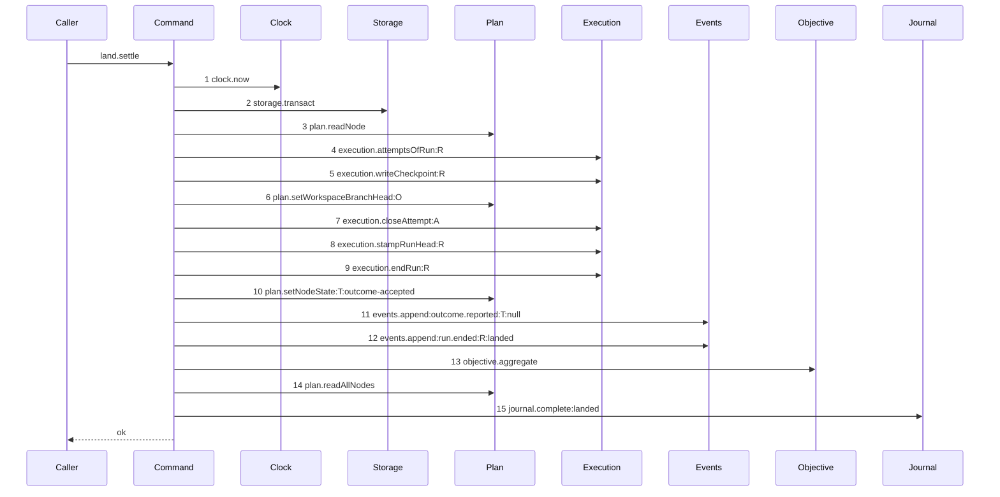

# Story 8 — The accepted settle aggregates the parent

Epic: `.agents/plan/epics/053-node-state-ownership.md`
Depends on: Story 7 (`07-the-aggregation-discards-and-rolls-the-initiative-up`), for the finished
`aggregateObjective`; EPIC 051.3 Story 4 (`04-the-accepted-settle`), for `landSettle`, its accepted
arm and the diagram this one supersedes; EPIC 051.4 Story 8
(`08-the-report-route-enforces-the-gate`), for the report route that reaches it.
Kind: story-implement

Diagrams: land-settle-aggregate

Supersedes: EPIC 051.3 land-settle-accepted

Seams: land-settle-aggregate: +objective.aggregate

This story is the last drawing story of the epic. Story 9
(`09-the-proposal-records-state-ownership`) records the behaviour and edits no range.

**It registers the epic as shipped.** Append `"053"` to `shippedEpics` at
`scripts/epic-sequence-range.ts:20` — `shippedEpics` and to the pinned literal at
`test/sequence/conformance.test.ts:274` — `["050", "050.1"]`. **Append the entry and delete the
superseded scenario file in the same turn.** `test/sequence/conformance.test.ts:39` — `shipped` marks
a diagram superseded only when the naming epic sits in `shippedEpics`, so a deletion that lands first
leaves `land-settle-accepted` due with no scenario, which
`test/sequence/conformance.test.ts:126` — `scenario files` refuses. **Verify that `"052.2"` is the
last entry of `shippedEpics` before appending**, because
`test/sequence/conformance.test.ts:275` — `authoredEpics.slice` requires it to stay a prefix.

## The path

`landSettle`'s accepted arm is drawn by EPIC 051.3, so this diagram has that diagram as its prior set.
It draws no `baseline-` diagram, and it declares `Supersedes:` where a first change declares
`Baselines:`.

### `land-settle-aggregate`

Supersedes: EPIC 051.3 land-settle-accepted

Fixture: the fixture of `land-settle-accepted`. Task `T` landing under run `R` with one open attempt
`A`, its journal row open, and the objective `O` above it `running`. **The two sibling tasks of `T`
are already `done`**, so `T`'s own terminal write makes every task of `O` terminal and the aggregation
reaches its write. A fixture whose siblings are not terminal reaches step 13 and returns inside it,
which is Story 5 (`05-the-aggregation-declines-while-a-task-is-not-terminal`)'s diagram and not this
one.



**Steps 1 to 12 and steps 14 and 15 are EPIC 051.3's, unchanged.** One step is inserted, and
`.agents/plan/authoring.md` states that a renumbered call is not a moved call, so `plan.readAllNodes`
and `journal.complete:landed` stay context tokens and this story signs neither.

**Step 13 sits before step 14, and that ordering is the whole design.**
`.agents/plan/stories/051.3-the-checkpoint-and-the-land/04-the-accepted-settle.md:239` —
`readAllNodes` builds the `NodeReportResult` from that read, and `objectiveState` is one of its ten
fields. Placing the aggregation **after** it would make `objectiveState` a pre-transition value, and
the only repair would be a second `plan.readNode` — which is already step 3, draws a bare token, and
`test/helpers/sequence-conformance.ts:284` — `duplicate token in diagram` refuses a repeat.
`.agents/plan/stories/050.2-the-run-renew-release-and-report/02-the-authority-seams.md:164` —
`plan.readNode` forbids giving it a projection, so no discriminator can rescue a second read. **One
read, placed after the write, is the answer.**

**Step 13 sits after step 10, and not before it.** The aggregation reads the child states through
`plan.readAllNodes` inside `aggregateObjective`, and
`src/services/plan/sqlite.ts:526` — `before.state` compares the **stored** value, so `T` must already
be `done` in the database. Step 10 is what puts it there.

**Step 13 is one step, because a nested command is one step.** The scenario binds `aggregateObjective`
to unrecorded dependencies, so its own `plan.readNode`, `plan.readAllNodes`, `plan.setNodeState` and
`events.append` produce no token here. Each is drawn by Stories 3 to 7, and duplicating them would be
unparsable: `plan.readNode` is already step 3 and `plan.readAllNodes` is step 14.

**The whole settle is one transaction, and step 2 is what opens it.** `landSettle` opens its own
transaction, so a caller further out could not be atomic with the task's terminal write. That is why
this diagram and not the report route carries the aggregation.

**The same insertion serves the startup path, and it needs no second diagram.**
`.agents/plan/stories/051.3-the-checkpoint-and-the-land/06-startup-reconciles-an-open-merge-row.md:11`
— `land.settle:accepted` reaches this unit from `reconcile-merge-land`, so a crash between the git
write and the settle still aggregates on recovery. That path draws `land.settle:accepted` as one step
and never its interior, so it is unchanged by this story.

**The drawn set is every branch of this path that changes.** `land-settle-contended` writes
`plan.setNodeState:T:land-contended`, which is not a terminal state, so no aggregation belongs on it
and EPIC 051.3 Story 5 (`05-the-contended-settle`) keeps its diagram unchanged.

Add `test/sequence/scenarios/land-settle-aggregate.ts`, and delete
`test/sequence/scenarios/land-settle-accepted.ts`.

## Change

**Edit `src/commands/checkpoint/land-execution.ts` to aggregate the parent inside the accepted
settle.**

### 1 — the dependency key

```ts
export type ObjectiveRollUpInput = Readonly<{
  objectiveId: string | null;
  at: number;
}>;

export type ObjectiveRollUp = Readonly<{
  aggregate(transaction: Transaction, input: ObjectiveRollUpInput): void;
}>;
```

`LandSettleDependencies` at
`.agents/plan/stories/051.3-the-checkpoint-and-the-land/04-the-accepted-settle.md:124` —
`LandSettleDependencies` gains one key, `objective: ObjectiveRollUp`, beside its six.

**It is an object capability, not a bare callable.**
`test/helpers/sequence-conformance.ts:113` — `typeof capability` returns a function dependency
unwrapped, so a bare callable draws no step and the epic's gate row 17 could not hold. The key is
`objective` and the method is `aggregate`, matching the `initiative.aggregate` of Story 3
(`03-the-aggregation-declines-a-null-objective-id`) and the `Expiry` idiom of
`test/sequence/scenarios/claim-success-task.ts:81` — `expiry`.

**`ObjectiveRollUpInput` is declared here and not imported**, exactly as
`src/commands/outcome/close-objective.ts:10` — `InitiativeRollUpInput` re-declares its own.

### 2 — the call

Between the second `events.append` and the `plan.readAllNodes` of
`.agents/plan/stories/051.3-the-checkpoint-and-the-land/04-the-accepted-settle.md:239` —
`readAllNodes`:

```ts
dependencies.objective.aggregate(transaction, {
  objectiveId: node.parentId,
  at: now,
});
```

`node.parentId` is the objective, and it is passed through with no null test:
`src/commands/outcome/aggregate-objective.ts` returns on a null id, which Story 3
(`03-the-aggregation-declines-a-null-objective-id`) draws as a zero-step path. `at` is the `now` the
settle already read at step 1, so the settle stamps one time onto every write it makes.

**The `NodeReportResult` built from the following `plan.readAllNodes` needs no other change.**
`objectiveState` reads the objective row the aggregation may have just moved, and
`objectiveProjection` keeps its `aggregate` value over the sibling states, which
`docs/proposal/phase-2/gates-and-approval.md:74` — `projected` requires beside the state.

### 3 — the composition root

**Edit `src/main.ts` to bind the two roll-ups.** `src/main.ts:271` — `boundAggregateInitiative` is the
shipped bound callable; add beside it

```ts
const boundAggregateObjective = {
  aggregate(transaction: Transaction, input: AggregateObjectiveInput): void {
    aggregateObjective(
      {
        plan,
        events,
        initiative: { aggregate: boundAggregateInitiative },
        instanceId,
      },
      transaction,
      input,
    );
  },
};
```

and pass `objective: boundAggregateObjective` into the `landSettle` dependency object.
`src/main.ts:286` — `aggregateInitiative` shows the shipped placement of a bound roll-up inside a
command's dependency literal. **`reportOutcome` gains no key**, and
`src/main.ts:301` — `boundReportOutcome` is unchanged.

## Constraints

- `objective.aggregate` is called exactly once, and only on the accepted arm.
- It sits after the second `events.append` and before `plan.readAllNodes`. Neither neighbour moves.
- Do not add a second `plan.readNode` to this unit, on any path.
- The contended arm is untouched. `land-settle-contended` keeps its eight steps.
- `landSettle` opens one transaction. The aggregation joins it and opens none.
- `reportOutcome` gains no dependency key.
- Append `"053"` to `shippedEpics` only when `"052.2"` is already its last entry, and delete
  `test/sequence/scenarios/land-settle-accepted.ts` in the same turn.
- The ``Add `test/sequence/scenarios/land-settle-accepted.ts`.`` line of
  `.agents/plan/stories/051.3-the-checkpoint-and-the-land/04-the-accepted-settle.md:113` **stays**.
  Deleting it would leave EPIC 051.3 owning a live diagram with no scenario.

## Verify

```
node --test src/commands/checkpoint/land-execution.test.ts src/commands/outcome/aggregate-objective.test.ts src/main.test.ts test/sequence/conformance.test.ts
```

Extend `src/commands/checkpoint/land-execution.test.ts`, the test EPIC 051.3 Story 4
(`04-the-accepted-settle`) created, with a sibling-task seeder in the shape of
`src/commands/outcome/report-outcome.test.ts:240` — `seedTwoTaskFixture`.

Add, each as a separate `it`:

1. `"an initiative holding one objective whose three tasks all end discarded reaches discarded in one settle transaction"`
   — the last task lands `discarded`, its two siblings already `discarded`. Assert the task row, the
   objective row and the initiative row all read `discarded`, and assert exactly **three** events were
   appended for the three nodes — the task's `outcome.reported`, the objective's `node.discarded` and
   the initiative's `node.discarded` — each asserted by `type` and `subjectId`. This is the epic's gate
   row 12.

2. `"the same fixture with three done tasks leaves the initiative unchanged"` — assert the objective
   reads `awaiting_approval`, the initiative reads its seeded `running` by value, and exactly **two**
   node-transition events were appended. `awaiting_approval` is not in
   `src/domain/state.ts:20` — `terminalStates`, so the roll-up stops at the objective. This is the
   epic's gate row 13.

3. `"a settle whose parent objective is already done leaves it done and appends no objective event"` —
   seed the objective `done` through a close-shaped fixture that writes `awaiting_approval` then
   `done`, land the last task, and assert the objective row still reads `done` and that no event names
   it. **The control is case 1**, which appends an objective event over the same code path. This is the
   precedence with no column, and it is the epic's gate row 14.

4. `"a failure at the objective's events.append leaves the task state, the objective state and every event absent"`
   — wrap `events.append` in a proxy that appends and throws on the call whose `subjectId` is the
   objective, run `landSettle`, catch, and assert the task row, the objective row, the attempt row,
   the run row and the event count are all byte-identical to the pre-call `databaseBytes`. This proves
   the settle and the aggregation are one transaction, and it is the epic's gate row 15.

5. `"objectiveState of the returned NodeReportResult is the post-transition state"` — assert
   `result.objectiveState` equals `"awaiting_approval"` on the last `done` task and `"discarded"` on
   the last `discarded` task, and that `result.objectiveProjection` equals the aggregate value in
   both. Drive it over the real route through the daemon `src/main.ts` builds, in the shape of
   `src/main.test.ts:331` — `the production handler map implements node.report`, so the case proves the
   binding as well as the value. **The control is the ordering**: assert the same case fails when
   `objective.aggregate` is moved after `plan.readAllNodes`. This is the epic's gate row 16.

6. `"the conformance runner replays all six diagrams of this epic by equality"` — after the
   `shippedEpics` entry lands, run `test/sequence/conformance.test.ts:278` — `every due scenario conforms`
   and assert every scenario file this epic added replays. Then assert the comparison **fails** when
   `objective.aggregate` is removed from the accepted settle and again when it is moved after
   `plan.readAllNodes`. This is the epic's gate row 17.

7. `"land-settle-accepted is superseded and holds no scenario file"` — assert
   `.agents/plan/stories/051.3-the-checkpoint-and-the-land/04-the-accepted-settle.md` holds
   `Superseded by: EPIC 053 land-settle-aggregate` inside its `` ### `land-settle-accepted` `` section,
   that this story holds the matching `Supersedes:`, and that
   `test/sequence/scenarios/land-settle-accepted.ts` does not exist. **The control is the restore
   direction**: write that scenario file into an `mkdtemp` fixture tree and assert
   `validateScenarioFiles` at `test/sequence/conformance.test.ts:104` — `validateScenarioFiles` throws
   `names a superseded live diagram`, in the shape of
   `test/sequence/conformance.test.ts:188` — `a live diagram superseded by a shipped epic holding a scenario file fails`.
   This is the epic's gate row 18.

8. `"shippedEpics ends with 053 and is still a prefix of authoredEpics"` — extend
   `test/sequence/conformance.test.ts:254` — `shippedEpics is a prefix of authoredEpics`: append
   `"053"` to the pinned literal at `:274` and leave
   `assert.deepEqual(authoredEpics.slice(0, shippedEpics.length), shippedEpics)` at `:275` untouched.
   That line is the prefix proof, and it is what fails if the epics between `"050.1"` and `"053"` have
   not shipped.

Add `test/sequence/scenarios/land-settle-aggregate.ts`, building the fixture the diagram names,
running the real `landSettle` over real SQLite behind the recorder with the real journal, binding
`objective.aggregate` to the real `aggregateObjective` over **unrecorded** dependencies, aliasing the
task, the objective, the run and the attempt as `T`, `O`, `R` and `A`, and returning the recorder and
the result. Delete `test/sequence/scenarios/land-settle-accepted.ts` in the same turn.

`pnpm run verify` exits 0.

Proof: PASS line delivered — `src/commands/checkpoint/land-execution.test.ts`, `src/main.test.ts`
and `test/sequence/conformance.test.ts` in `PASS EPIC-053`.
