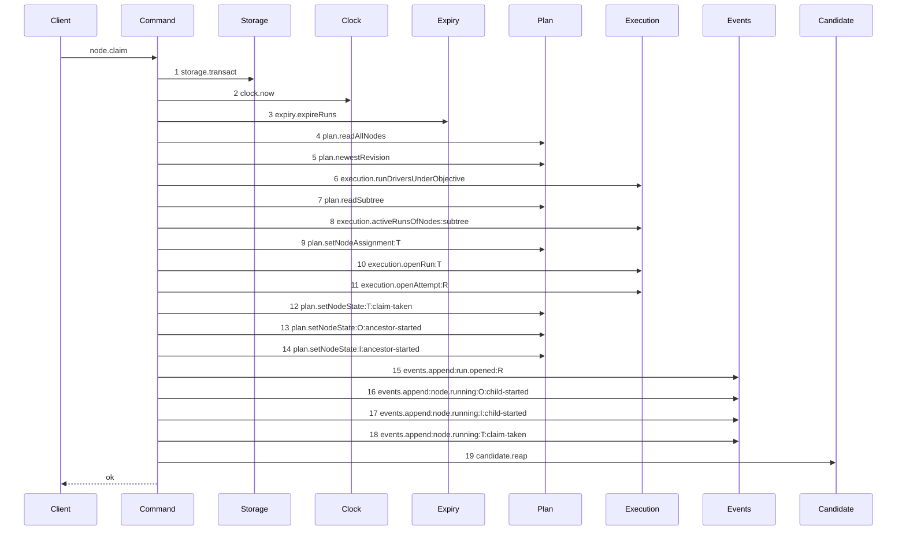

# Story 2 — A review claim is admitted

Epic: `.agents/plan/epics/053.1-the-review-checkpoint.md`
Depends on: Story 1 (`01-the-three-read-seams`), for the `authoredEpics` entry that makes this
story's diagram legal to the range gate; EPIC 050.4 Story 1
(`01-the-claim-of-a-task-drops-the-lease`), for the lease-free claim; EPIC 051 Story 3
(`03-the-claim-reads-the-workspace-head`), for the branch read a review claim does not make and for
the `run_base` writer this story's control needs; EPIC 051.5 Story 6
(`06-the-branch-base-claim-reaps`), for the `candidate.reap` tail of every claim; EPIC 050.4 Story 2
(`02-the-claim-of-an-initiative-drops-the-lease`), for the attempt an admitted run of any kind opens.
Kind: story-implement

Diagrams: claim-success-review

Seams: claim-success-review: +storage.transact, +clock.now, +expiry.expireRuns, +plan.readAllNodes, +plan.newestRevision, +execution.runDriversUnderObjective, +plan.readSubtree, +execution.activeRunsOfNodes:subtree, +plan.setNodeAssignment:T, +execution.openRun:T, +execution.openAttempt:R, +plan.setNodeState:T:claim-taken, +plan.setNodeState:O:ancestor-started, +plan.setNodeState:I:ancestor-started, +events.append:run.opened:R, +events.append:node.running:O:child-started, +events.append:node.running:I:child-started, +events.append:node.running:T:claim-taken, +candidate.reap

This story leaves the review report and its attestation to Stories 3 to 10; it opens the run and
writes no checkpoint.

**It depends on one upstream repair, and it does not perform that repair.** A review checkpoint needs
`attempt_id`, which `.agents/plan/stories/051.3-the-checkpoint-and-the-land/01-migration-14.md:49` —
`attempt_id` declares `NOT NULL` under a composite foreign key, and Story 7
(`07-the-attestation-with-a-reason`) closes that attempt. **The repair is that an admitted run opens
exactly one attempt whatever its kind, and EPIC 050.4 Story 2
(`02-the-claim-of-an-initiative-drops-the-lease`) carries it** — the epic's Decision at
`.agents/plan/epics/050.4-the-node-lease-removal.md:62` — `openAttempt` rules it, and that story is
the one that redraws the trace the change moves. EPIC 050.4 ships long before this epic. This story
draws the trace the repair produces and edits no gate itself.

## The path

### `claim-success-review`

Fixture: the three-node graph of `test/helpers/rows.ts:102` — `seedGraph`, every node `ready`, and
`fixtureIds.task` projected to `deliverable: "review"`, which
`src/domain/run-kind.ts:13` — `runKindFor` maps to the run kind `review` through
`src/domain/run-kind.ts:6` — `runKindByDeliverable`. The claimant is `claude@1`, which
`src/domain/worker-registry.ts:25` — `deliverables` already authorises for `review`. No run is
expired, so `candidate.reap` finds nothing to delete and still fires.



**Its prior set is empty, so every token is `+`.** Every review claim refuses today at
`src/commands/node/claim-node.ts:210` — `review-head-unavailable`, so no shipped code walks this
path and there is nothing to draw a `baseline-` diagram of.

**Two tokens of the shipped task claim are absent, and each absence is a guard the review kind
fails.** Measured against EPIC 051.5 Story 6 (`06-the-branch-base-claim-reaps`)
`claim-branch-base-reap`, which is the same command's execution-task path:

- `execution.activeRunsOfNodes:siblings` is gated on `node.kind === "task" && runKind === "execution"`
  at `src/commands/node/claim-node.ts:279` — `runKind`, so a review task reaches no sibling read and
  therefore no `objective-busy` refusal.
- `plan.readWorkspaceBranch` is not reached, because EPIC 051 Story 3
  (`03-the-claim-reads-the-workspace-head`) makes the branch read conditional on the `execution`
  kind, and a review run passes `base: null`.

**`execution.openAttempt:R` is present, and it is not this story's edit.** It arrives from EPIC
050.4 Story 2 (`02-the-claim-of-an-initiative-drops-the-lease`), which made the open unconditional.
If a later epic instead makes `checkpoint.attempt_id` nullable, this diagram loses step 11 and
Stories 7 and 8 lose their `execution.closeAttempt:A` step; the story is then re-authored, not
patched.

**The drawn set is every branch of the review-task claim.** `src/domain/node-pair.ts:43` — `review`
also legalises `(objective, review)` with the state owner `attestation-then-human`, and the lift
admits that claim too. Its token set differs, so it is a second path, and **EPIC 054.5 owns it**
together with the objective attestation lifecycle. `index.md` records the split.

Add `test/sequence/scenarios/claim-success-review.ts`.

## Change

**`src/commands/node/claim-node.ts` — delete the `review` run-kind refusal.** The boundary is the
five statements of the throw and nothing else: every guard before it and every write after it already
handles the `review` kind by the conditions quoted above.

### 1 — narrow the throw to the objective pair

**Edit `src/commands/node/claim-node.ts`.** The condition at
`src/commands/node/claim-node.ts:208` — `runKind` gains one term:

```ts
if (runKind === "review" && node.kind !== "task") {
```

Everything inside the block is unchanged, and `const runKind = runKindFor(deliverable);` at
`src/commands/node/claim-node.ts:207` — `runKindFor` stays:
`src/commands/node/claim-node.ts:389` — `kind` passes it to `execution.openRun`, and
`src/commands/node/claim-node.ts:279` — `runKind` branches on it.

**Deleting the block outright would admit a second path this epic does not draw.** The throw is
keyed on the run kind alone, and `src/domain/node-pair.ts:43` — `review` legalises
`(objective, review)`, so a plain deletion admits the objective review claim too. Its token set
differs from this diagram's, so it is a second path, and EPIC 054.5 owns it. **Omitting a diagram
does not defer a behaviour**; the gate is what defers it.

**The code's surviving meaning is narrower than its name.** For the objective pair it now says the
daemon does not yet admit an objective review claim, not that a head is missing. EPIC 054.5 removes
this gate when it adds the objective attestation lifecycle. The epic's Decision and its gate row 5
state the same narrowing.

**Nothing replaces the data the block read.** It reads `node.id` and `runKind`, and now `node.kind`,
all three of which the surrounding code already holds at
`src/commands/node/claim-node.ts:207` — `runKind`,
`src/commands/node/claim-node.ts:222` — `targetId` and the node view.

**Do not touch the attempt open at `src/commands/node/claim-node.ts:401` — `attempt`.** EPIC 050.4
Story 2 (`02-the-claim-of-an-initiative-drops-the-lease`) already made it unconditional. A claim that
reaches this story still gated on the run kind is an EPIC 050.4 defect to report, not a change to
make here.

### 2 — the refusal code stays wired, and stays unreachable from the task pair

Do **not** edit `src/http/contract/errors.ts:27` — `review-head-unavailable`,
`src/cli/exit-code.ts:37` — `review-head-unavailable`,
`src/http/contract/execution.ts:321` — `review-head-unavailable` or
`src/http/server/node/refusals.ts:153` — `review-head-unavailable`. Removing the code would be a wire
change for no product gain, and `docs/proposal/api/README.md` governs a removal.

`src/commands/node/claim-node.ts:39` — `review-head-unavailable` stays in `ClaimRefusal`, and
`src/commands/node/claim-node.ts:47` — `claimRefusalCodes` stays whole, so
`src/http/server/node/refusals.ts:67` — `reportOutcomeRefusal` keeps an exhaustive switch.

### 3 — the three shipped tests that assert the refusal

**Re-target `src/commands/node/claim-node.test.ts:868` — `review-head-unavailable`** — the `it` named
`"a review claim refuses review-head-unavailable and writes nothing"`. Project
`fixtureIds.objective` to `deliverable: "review"` instead of `fixtureIds.task`, and rename the `it`
to `"an objective review claim refuses review-head-unavailable and writes nothing"`. Its premise
survives for the objective pair, so it is re-aimed and not deleted.

**Re-target the `review-head-unavailable` case at
`src/commands/node/claim-node.test.ts:1184` — `review-head-unavailable`**, inside the `it` at
`src/commands/node/claim-node.test.ts:1116` — `byte-identical`. It projects `fixtureIds.task` to
`deliverable: "review"`; it now projects `fixtureIds.objective`, so the refusal still fires.

**Leave `CLAIM_REFUSAL_ORDER` at eleven codes.**
`src/commands/node/claim-node.test.ts:298` — `CLAIM_REFUSAL_ORDER` holds eleven entries including
`src/commands/node/claim-node.test.ts:304` — `review-head-unavailable`, and the pair count at
`src/commands/node/claim-node.test.ts:1304` — `55` is `C(11, 2)`. **The code stays reachable** for
the objective pair after section 1, so the tuple, both count literals and the test name are all
unchanged.

**Re-target the two arms that stage it**, at
`src/commands/node/claim-node.test.ts:464` — `review-head-unavailable` and
`src/commands/node/claim-node.test.ts:494` — `review-head-unavailable`. Each projects
`fixtureIds.task` to `deliverable: "review"`; both now project `fixtureIds.objective` instead, so the
condition still arms under the narrowed gate.

**`src/commands/node/claim-node.test.ts:892` — `judged_oid`** — `judged_oid` survives untouched. It claims an
`implementation` task, so its `WHERE kind = 'review'` count of zero stays true.

## Constraints

- `execution.openRun` keeps `judgedOid: null` at `src/commands/node/claim-node.ts:394` — `judgedOid`.
  This epic adds no writer for that column.
- The claim writes no `run_base` row for a review run. `src/domain/run.ts:34` — `refine` fixes the
  cardinality at exactly none for a `review` run, and the claim reaches no base write on this path.
- No guard moves. The refusal order of every other code is unchanged, and the ten survivors keep
  their positions.
- Do not lift the `(initiative, review)` refusal. `src/domain/node-pair.ts:29` — `pair-illegal` refuses it
  `pair-illegal` at `src/commands/node/claim-node.ts:164` — `nodePairLegality`, before the deleted block, and it stays.
- Do not admit the `(objective, review)` claim. The narrowed gate of section 1 is what refuses it,
  and EPIC 054.5 removes that gate.

## Verify

```
node --test src/commands/node/claim-node.test.ts test/sequence/conformance.test.ts
```

Extend `src/commands/node/claim-node.test.ts`, whose suite is at
`src/commands/node/claim-node.test.ts:677` — `describe`, whose fixture builder is
`src/commands/node/claim-node.test.ts:100` — `createClaimFixture` over real SQLite, whose seeder is
`src/commands/node/claim-node.test.ts:125` — `seedReadyFixture`, and whose deliverable projector is
`src/commands/node/claim-node.test.ts:339` — `projectClaimNodes`. Success calls go through
`src/commands/node/claim-node.test.ts:228` — `claim`. Dispose with `t.after(() => fixture.dispose())`.

Add, each as a separate `it`:

1. `"a review claim opens a review run that pins no judged oid"` — project `fixtureIds.task` to
   `deliverable: "review"`, claim it, and read the `run` row with
   `src/commands/node/claim-node.test.ts:570` — `runRows`. Assert the row deep-equals a stated
   literal in which `kind` is `"review"`, `judged_oid` is `null`, `node_id` is `"task_a"`, `worker`
   is `"claude@1"`, `fence` is `1`, `workspace_id` is `null`, `state` is `"active"`, `outcome` is
   `null` and `ended_at` is `null`. This is the epic's gate row 3.

2. `"a review claim writes no run_base row and an implementation claim writes one"` — two fixtures.
   The review claim asserts `SELECT COUNT(*) AS c FROM run_base` is `0`; the `implementation` claim on
   the same seeded fixture asserts it is `1`. **The second half is the control**, and it is what
   proves the assertion detects a written base rather than passing on an empty table. This is the
   epic's gate row 3.

3. `"a review claim opens one attempt"` — assert
   `src/commands/node/claim-node.test.ts:616` — `attemptRows` holds exactly one row whose `run_id` is
   the claimed run id, whose `attempt_no` is `1` and whose `outcome` is `null`, and assert the
   result's `attemptNo` is `1`. **This case fails until the upstream attempt repair lands**, and that
   is deliberate: it is the assertion that pins the dependency Stories 7 and 8 rely on.

4. `"a review claim leaves the candidate namespace untouched"` — list
   `refs/kanthord/candidate` against the loopback fixture with
   `root.git("fixture.git", ["for-each-ref", "--format=%(refname)", "refs/kanthord/candidate"])`, as
   `test/helpers/remote/seed.test.ts:128` — `for-each-ref` does, before and after the claim, and
   assert the two listings deep-equal `[]`. **The control is a second fixture** in which a ref named
   `refs/kanthord/candidate/<the claimed run id>/1` is hand-seeded before the claim; assert the same
   predicate reports it, so the absence oracle is proven to fire on the exact forbidden name. An
   `implementation` claim is **not** a control here: `../docs/workflow/worker.md:562` — `candidate`
   states the worker pushes the candidate, so no claim of any kind writes one. This is the epic's
   gate row 4.

5. `"review-head-unavailable is reachable from no review-task claim"` — claim a review **task** and
   assert it succeeds, then project `fixtureIds.objective` to `deliverable: "review"`, claim it, and
   assert `error.refusal` is `"review-head-unavailable"` with `error.details` of
   `{ nodeId: "objective_a", runKind: "review" }`. **Both halves in one case**, because the narrowed
   gate is one condition with two outcomes. This is the epic's gate row 5, which names both
   outcomes.

6. `"review-head-unavailable is still declared in both registers"` — assert
   `"review-head-unavailable"` is a key of `src/http/contract/errors.ts:7` — `errorStatuses` with the
   status `409`, and a key of `src/cli/exit-code.ts:13` — `exitCodes` with the exit code `167`. This
   is the epic's gate row 5, second half.

7. `"the refusal decision table names one winner per pair"` — the existing `it` is unchanged. Assert
   `src/commands/node/claim-node.test.ts:298` — `CLAIM_REFUSAL_ORDER` still holds eleven codes and
   the pair count at `src/commands/node/claim-node.test.ts:1304` — `55` is still `55`, with the two
   re-targeted arms of section 3 supplying the objective fixture. A story that shrank the tuple would
   silently delete ten pairs of coverage.

Add `test/sequence/scenarios/claim-success-review.ts`, building the fixture the diagram names,
running the real `claimNode` over real SQLite behind the recorder, binding `expiry` and `candidate` to
unrecorded dependencies as `test/sequence/scenarios/claim-success-task.ts:81` — `expiry` does,
declaring the set `subtree` as its third `recordSeams` argument, aliasing `fixtureIds.initiative` to
`I`, `fixtureIds.objective` to `O`, `fixtureIds.task` to `T` and the minted run id to `R`, and
returning the recorder and the result.

`pnpm run verify` exits 0.

Proof: PASS line delivered — `src/commands/node/claim-node.test.ts` in `PASS EPIC-053.1`.
