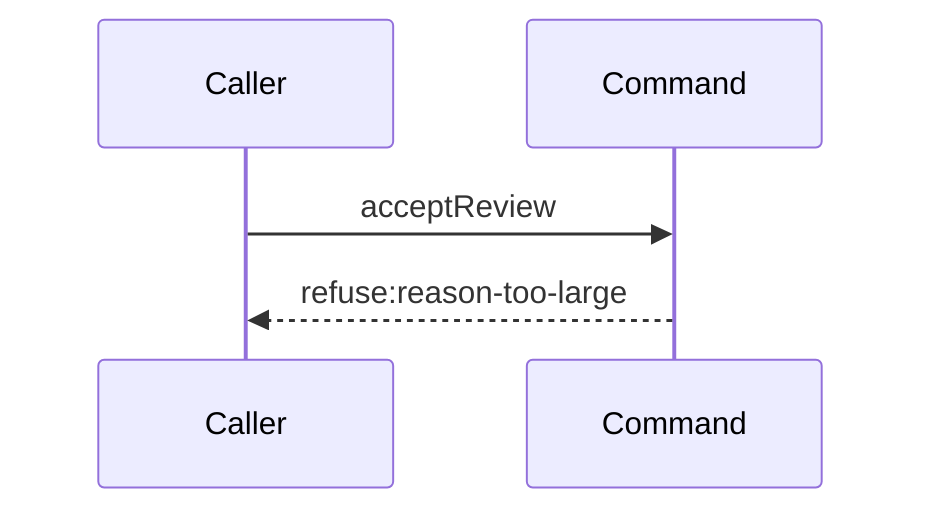

# Story 3 — An oversized reason reaches no seam

Epic: `.agents/plan/epics/053.1-the-review-checkpoint.md`
Depends on: Story 1 (`01-the-three-read-seams`), for the three read seams this command names in its
dependency type; EPIC 051.4 Story 7 (`07-the-gate-accepts-and-writes-the-checkpoint`), for the
`src/commands/checkpoint/` directory and the nested-callable precedent; EPIC 052.1 Story 2
(`02-an-unparsable-patch-reaches-no-seam`), for the shape of a nested acceptance command that opens
no transaction; EPIC 053, for the `objective` roll-up capability this command receives.
Kind: story-implement

Diagrams: accept-review-refusal-reason-too-large

It declares no `Seams:` line, because it holds no token to sign.

This story leaves every judged-checkpoint refusal to Stories 4 to 6 and the whole terminal tail to
Stories 7 and 8; it adds the command, its error class and the one pure check that precedes every
seam.

## The path

### `accept-review-refusal-reason-too-large`

Fixture: a claimed review task `N` running under run `R` with one open attempt `A`, the authority
prelude already passed, `judgedCheckpointId` naming a real accepted execution checkpoint of a
declared node, and `reason` a string whose `Buffer.byteLength(reason, "utf8")` is `65537`. The
boundary case of `65536` bytes uses the same fixture and is not this diagram: it succeeds.



**A diagram with no step is the strongest statement available.** It asserts the path reaches no seam
at all, so any call the implementation makes fails the comparison. That is exactly the property this
story owns: the byte measurement is pure over the request value, it runs before the checkpoint read,
and an oversized body therefore costs no lookup.

**Its prior set is empty**, because `acceptReview` does not exist and no shipped path refuses this
code.

Add `test/sequence/scenarios/accept-review-refusal-reason-too-large.ts`.

## Change

**Create `src/commands/checkpoint/accept-review.ts`, taking the caller's transaction and opening
none.**

### 1 — the dependency object and the input

```ts
export type AcceptReviewDependencies = Readonly<{
  plan: PlanStore;
  blobs: BlobStore;
  execution: Execution;
  events: EventLog;
  objective: Readonly<{
    aggregate(transaction: Transaction, input: AggregateObjectiveInput): void;
  }>;
}>;

export type AcceptReviewInput = Readonly<{
  nodeId: string;
  parentId: string | null;
  runId: string;
  runFence: number;
  attemptId: string;
  actorId: string;
  at: number;
  verdict: "accept" | "reject";
  judgedCheckpointId: string;
  reason?: string;
  attemptNo: number;
  subject: string;
}>;

export function acceptReview(
  dependencies: AcceptReviewDependencies,
  transaction: Transaction,
  input: AcceptReviewInput,
): NodeReportResult;
```

**There is no `storage` key and no `clock` key.**
`src/commands/outcome/report-outcome.ts:107` — `transact` opens the one transaction and reads `now`
before the prelude, and both reach this command through its parameters — `now` as `input.at`. The
transaction is the second positional parameter, exactly as
`src/commands/outcome/report-outcome.ts:59` — `reportObjective` takes it. A review acceptance
performs no git write, so it is not a journaled write and it needs no second transaction.

**It returns `NodeReportResult`, not a checkpoint record.** EPIC 052.1 Story 9
(`09-the-accepted-patch`) returns `NodeReportResult` from `acceptStructural`, and
`src/commands/outcome/report-outcome.ts:77` — `ReportOutcomeResult` is that same type, so the review
arm returns what the command returns with no adaptation. **`CheckpointRecord` therefore does not
widen**: nothing outside `execution` reads the written row's review columns.

**`objective` is an object capability, never a bare callable.**
`.agents/plan/epics/053-node-state-ownership.md:34` — `objective` states it, because
`test/helpers/sequence-conformance.ts:112` — `wrapCapability` returns a non-object dependency value unwrapped, so a bare
callable records no token and Stories 7 and 8 could not draw the aggregation.

**`events` is present because this command appends the report events.** Group 1 of this epic's
re-authoring settled that the nested acceptance owns the terminal tail:
`.agents/plan/stories/051.4-the-acceptance-gate-and-the-report-route/08-the-report-route-enforces-the-gate.md:13`
— `Seams` removes `execution.closeAttempt:A`, `plan.setNodeState:T:outcome-accepted`,
`execution.endRun:R`, `events.append:outcome.reported:T:null` and `plan.readAllNodes` from the report
route, and EPIC 052.1 Story 9 (`09-the-accepted-patch`) holds all of them in the nested command.

**The dependency key for the blob store is `blobs`, not `blob`.** `src/main.ts:268` — `blobs` is the
constructed name, `src/queries/plan/validate-plan.ts:38` — `blobs` is the shipped key, and EPIC 052.1
Story 9 (`09-the-accepted-patch`) draws `blobs.put`. A second spelling would give one service two
participant names across two diagrams of one epic.

**`runFence` is the run fence, and there is no lease fence.** EPIC 050.4 Story 6
(`06-the-report-drops-the-lease`) deletes `fence` from five members of `nodeReportRequest`, and
EPIC 050.2 Story 7 (`07-the-worker-contract`) makes `runId` and `runFence` required on every member.
Story 7 (`07-the-attestation-with-a-reason`) writes `fence: input.runFence` into the checkpoint row,
so the persisted `fence` column carries the run fence and never a lease fence.

### 2 — the error class

```ts
export type AcceptReviewRefusal =
  | "reason-too-large"
  | "judged-checkpoint-unknown"
  | "judged-checkpoint-not-execution"
  | "judged-checkpoint-undeclared"
  | "judged-checkpoint-superseded";

export class AcceptReviewError extends Error {
  readonly refusal: AcceptReviewRefusal;
  readonly details: Readonly<Record<string, unknown>>;

  constructor(
    refusal: AcceptReviewRefusal,
    message: string,
    details: Readonly<Record<string, unknown>>,
  ) {
    super(message);
    this.name = "AcceptReviewError";
    this.refusal = refusal;
    this.details = details;
  }
}
```

**Five codes, not six.** `judged-checkpoint-unaccepted` is not in the union, and this epic does not
add it. EPIC 052 Story 5 (`05-the-seams-the-acceptance-needs`) settled that every checkpoint row is
an accepted checkpoint —
`.agents/plan/stories/052-the-graph-patch-and-its-policies/05-the-seams-the-acceptance-needs.md:138`
— `accepted` — and `checkpoint_execution_accepted_oid` forces `accepted_oid IS NOT NULL` for every
execution row, so a real-SQLite fixture cannot seed the row the code would name.

**From EPIC 054.3 on the command returns its refusal and does not throw it.** EPIC 054.3 Story 5
(`05-a-review-rejection-pays-its-attempt`) adds

```ts
export type AcceptReviewRejection = Readonly<{
  ok: false;
  refusal: AcceptReviewRefusal;
  details: Readonly<Record<string, unknown>>;
}>;

export type AcceptReviewResult = NodeReportResult | AcceptReviewRejection;
```

and rewrites all five refusal sites as a `return` of that shape, so `reportOutcome` can write the
attempt's termination in the prelude transaction and commit before it raises. `AcceptReviewError`
survives with `reportOutcome` as its only thrower, and the five codes, their statuses, their details
schemas and the mapping of Story 10 (`10-the-report-route-carries-a-verdict`) are unchanged.
`test/helpers/sequence-conformance.ts:303` — `resultTerminal` reads a returned rejection as well as a
thrown error, so none of the four refusal diagrams of this epic moves. **Only `AcceptReviewError`
becomes a return.** The staging placeholder below is a plain `Error` and stays a throw.

**`attemptNo` and `subject` are input fields and never reads.** `attemptNo` is the open attempt's
number, which the route's prelude already holds and which the `outcome.reported` payload needs once
`end-attempt` is the closer and no closed record is returned; `subject` is the run's worker, which the
`checkpoint` row records from EPIC 054.3 Story 9 (`09-the-checkpoint-pair-is-derived`) on. This
command reads no run row, so both arrive from the caller and no drawn path gains a token.

**`details` is required, not optional.** Every one of the five refusals carries an object, so the
field is non-optional and Story 9 (`09-the-contract-the-cli-and-the-proposal`) declares a schema for
each, `reason-too-large` included.

**The field name `refusal` is load-bearing.**
`test/helpers/sequence-conformance.ts:305` — `refusal` is what the harness reads to derive a
diagram's terminal.

### 3 — the one pure refusal, before anything else

```ts
if (
  input.reason !== undefined &&
  Buffer.byteLength(input.reason, "utf8") > 65536
) {
  throw new AcceptReviewError(
    "reason-too-large",
    "the reason exceeds 65536 UTF-8 bytes",
    { bytes: Buffer.byteLength(input.reason, "utf8"), limit: 65536 },
  );
}
```

Nothing precedes this statement. No read, no write and no seam call.

**After the guard, this story throws a deterministic placeholder, and Story 4 replaces it.**

```ts
throw new Error("acceptReview is incomplete: no judged checkpoint read yet");
```

The command's declared return type is `NodeReportResult`, so the body must terminate. A placeholder
that is a plain `Error` and not an `AcceptReviewError` keeps this story's cases honest: they assert
the refusal or they assert this message, and neither can pass by accident. Story 4
(`04-an-unusable-judged-checkpoint-refuses-after-one-read`) deletes the line when it adds the read.

**The unit is bytes, measured on the encoded body.** `Buffer.byteLength` counts what the blob store
hashes: `src/services/blob/index.ts:22` — `put` takes a `Uint8Array`. A zod `.max()` counts
characters, so a character cap would refuse a valid 65000-byte ASCII body and admit a 200000-byte
multi-byte one. Story 9 (`09-the-contract-the-cli-and-the-proposal`) therefore declares
`reason: z.string().min(1).optional()` with no character cap, which diverges from the four shipped
`reason` fields at `src/http/contract/outcome.ts:32` — `reason`, `src/http/contract/outcome.ts:37` — `reason` and
`src/http/contract/outcome.ts:42` — `reason`.

## Constraints

- The byte check is the first statement of the command. A read placed before it makes this diagram
  fail, which is the intent.
- `65536` is inclusive. A body of exactly `65536` bytes is accepted.
- `reason` absent and `reason` present are the only two shapes. The command never treats an empty
  string as absent; Story 9's `.min(1)` refuses it at the wire.
- The command opens no transaction and constructs no service.
- The command returns `NodeReportResult`. A signature returning `CheckpointRecord` does not compose
  with `src/commands/outcome/report-outcome.ts:77` — `ReportOutcomeResult`.

## Verify

```
node --test src/commands/checkpoint/accept-review.test.ts test/sequence/conformance.test.ts
```

Add `src/commands/checkpoint/accept-review.test.ts`. Build the fixture over real SQLite with
`test/helpers/database.ts:32` — `createMigratedStorage`, seed with
`test/helpers/rows.ts:21` — `seedRegistry`, `test/helpers/rows.ts:102` — `seedGraph` and
`test/helpers/rows.ts:906` — `seedExecution`, seed edges with
`test/helpers/rows.ts:421` — `seedEdge`, and seed checkpoints with the `seedCheckpointRow` Story 1
(`01-the-three-read-seams`) adds. Take the byte snapshot with
`test/helpers/database.ts:117` — `databaseBytes`. Dispose with `t.after(() => fixture.dispose())`.

**Every checkpoint id in this file is a prefixed ULID**, because
`src/domain/identity.ts:49` — `ulidPattern` requires 26 Crockford characters and Story 9
(`09-the-contract-the-cli-and-the-proposal`) declares `judgedCheckpointId: identity("checkpoint")`.
Use `checkpoint_01JQ8Z7G3HZZZZZZZZZZZZZZZA` for the older row and
`checkpoint_01JQ8Z7G3HZZZZZZZZZZZZZZZB` for the newer, so the id order is explicit and byte-ordered.

Add, each as a separate `it`:

1. `"a reason of exactly 65536 bytes passes the byte guard"` — pass `"a".repeat(65536)` and assert
   the thrown value is a plain `Error` whose message is
   `"acceptReview is incomplete: no judged checkpoint read yet"`, and **not** an
   `AcceptReviewError`. It proves the guard admits the boundary value without requiring the read
   Story 4 (`04-an-unusable-judged-checkpoint-refuses-after-one-read`) adds. The accepted boundary —
   that the same reason reaches a written checkpoint — is Story 7
   (`07-the-attestation-with-a-reason`) case 10, because only that story completes the command. Both
   halves together are the epic's gate row 6.

2. `"a reason of 65537 bytes refuses reason-too-large"` — pass `"a".repeat(65537)` and assert
   `error.refusal` is `"reason-too-large"` and `error.details` deep-equals
   `{ bytes: 65537, limit: 65536 }`. This is the upper side of the boundary and the epic's gate
   row 6.

3. `"a multi-byte reason under the character cap and over the byte cap refuses"` — pass
   `"漢".repeat(40000)`, which is `40000` characters and `120000` UTF-8 bytes, and assert
   `error.refusal` is `"reason-too-large"` and `error.details` deep-equals
   `{ bytes: 120000, limit: 65536 }`. **This is the case a character cap would admit**, and it is the
   epic's gate row 6.

4. `"a reason-too-large refusal reaches no seam and writes nothing"` — wrap the whole dependency
   object in a recorder built with `test/helpers/sequence-conformance.ts:99` — `recordSeams`, assert
   `recorder.tokens` deep-equals `[]`, assert `SELECT COUNT(*) AS c FROM checkpoint` is `0`, and
   assert `databaseBytes` is byte-identical under `Buffer.compare`. This is the epic's gate row 7.

5. `"the control: the recorder detects a call this command does not make"` — build a second recorder
   over a one-method stub dependency object, call that method once, and assert its `tokens`
   deep-equals `["stub.probe"]`. It proves the empty-token oracle of case 4 can report a call at all,
   without naming a seam a later story adds. This is the epic's gate row 7 control.

Add `test/sequence/scenarios/accept-review-refusal-reason-too-large.ts`, building the fixture the
diagram names, running the real `acceptReview` **directly** over real SQLite behind the recorder —
not over the `node.report` route — and catching the `AcceptReviewError` and returning it as `result`,
as `test/sequence/scenarios/claim-refusal-objective-busy.ts:161` — `catch` does.

`pnpm run verify` exits 0.

Proof: PASS line delivered — `src/commands/checkpoint/accept-review.test.ts` in `PASS EPIC-053.1`.
