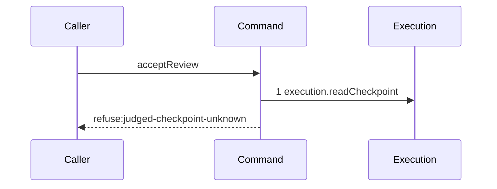

# Story 4 — An unusable judged checkpoint refuses after one read

Epic: `.agents/plan/epics/053.1-the-review-checkpoint.md`
Depends on: Story 3 (`03-an-oversized-reason-reaches-no-seam`), for the command, its error class and
the pure check that precedes this read; Story 1 (`01-the-three-read-seams`), for
`execution.readCheckpoint`.
Kind: story-implement

Diagrams: accept-review-refusal-judged-unknown

Seams: accept-review-refusal-judged-unknown: +execution.readCheckpoint

This story leaves the dependency check to Story 5 and the supersession check to Story 6; it adds the
one read and the two refusals that read decides.

## The path

### `accept-review-refusal-judged-unknown`

Fixture: a claimed review task `N` running under run `R` with one open attempt `A`, the authority
prelude already passed, `reason` absent, and `judgedCheckpointId` the string
`"checkpoint_01JQ8Z7G3HZZZZZZZZZZZZZZZX"`, which the `checkpoint` table holds no row for. The
`not-execution` case uses the same fixture with one seeded `structural` checkpoint and that row's id.



**Two refusals stop at this step, so they are one diagram.** `judged-checkpoint-unknown` fires when
the read returns `null`, and `judged-checkpoint-not-execution` fires when it returns a row whose
`kind` is not `"execution"`. Both are decided by the same call's return value and neither reaches a
second seam, so drawing them separately would give one story two live diagrams and assert nothing
new. The code that separates them is proven by cases 1 and 2 below, not by this trace.

**`execution.readCheckpoint` has no projection**, so it draws a bare token.
`test/helpers/sequence-conformance.ts:50` — `projections` holds fifteen entries and none for it, and
a method with no projection admits one call per diagram. This command calls it once, so the bare
token is exact.

**Its prior set is empty, so its one token is `+`.**

Add `test/sequence/scenarios/accept-review-refusal-judged-unknown.ts`.

## Change

**Extend `src/commands/checkpoint/accept-review.ts` with the judged-checkpoint read and its two
refusals.** The boundary is the read and the two throws it decides; the dependency membership test is
Story 5's.

### 1 — the read, immediately after the byte check

```ts
const judged = dependencies.execution.readCheckpoint(
  transaction,
  input.judgedCheckpointId,
);
if (judged === null) {
  throw new AcceptReviewError(
    "judged-checkpoint-unknown",
    `no checkpoint ${input.judgedCheckpointId}`,
    { judgedCheckpointId: input.judgedCheckpointId },
  );
}
if (judged.kind !== "execution") {
  throw new AcceptReviewError(
    "judged-checkpoint-not-execution",
    `the checkpoint ${input.judgedCheckpointId} is ${judged.kind}, not execution`,
    { judgedCheckpointId: input.judgedCheckpointId, kind: judged.kind },
  );
}
```

**Move the placeholder of Story 3 (`03-an-oversized-reason-reaches-no-seam`) below the new code.**
It stays a plain `Error` with the same message until Story 7
(`07-the-attestation-with-a-reason`) completes the command, so every case of this story asserts
either a refusal of its own or that message.

**The order of the two throws is forced by the data, not chosen.** `judged.kind` cannot be read
before the null check narrows the type, so `unknown` precedes `not-execution` by construction and no
precedence case is needed between them.

**A `review` row and a `structural` row both refuse `not-execution`.**
`../docs/workflow/worker.md:447` — `depends_on` states the daemon refuses a judged checkpoint that is
not an accepted **execution** checkpoint of a node the review node depends on, so a review verdict
never judges another verdict and never judges a graph patch.

### 2 — `judged` is the source of two later values

The record this read returns is what Story 7 (`07-the-attestation-with-a-reason`) copies
`judged.acceptedOid` from, and what Story 5 (`05-an-undeclared-subject-refuses-after-the-dependency-read`)
reads `judged.nodeId` from. **No second read replaces it**, which is why `readCheckpoint` returns
`CheckpointRow` and not the narrower `CheckpointRecord`.

## Constraints

- The read is the first seam call of the command, on every path that passes the byte check.
- Neither throw reaches `plan.readDependencies`. A refusal here costs exactly one read.
- `judged-checkpoint-unaccepted` is not raised and is not declared. Every checkpoint row is an
  accepted checkpoint, per
  `.agents/plan/stories/052-the-graph-patch-and-its-policies/05-the-seams-the-acceptance-needs.md:138`
  — `accepted`.
- Both throws carry a `details` object. Story 9 (`09-the-contract-the-cli-and-the-proposal`) declares
  a `strictObject` schema for each, and a looser command would describe a response the daemon never
  sends.

## Verify

```
node --test src/commands/checkpoint/accept-review.test.ts test/sequence/conformance.test.ts
```

Extend `src/commands/checkpoint/accept-review.test.ts`, added by Story 3
(`03-an-oversized-reason-reaches-no-seam`), with its fixture builder and its `seedCheckpointRow`
helper from Story 1 (`01-the-three-read-seams`).

Add, each as a separate `it`:

1. `"a judgedCheckpointId naming no row refuses judged-checkpoint-unknown"` — pass
   `"checkpoint_01JQ8Z7G3HZZZZZZZZZZZZZZZX"`, assert `error.refusal` is
   `"judged-checkpoint-unknown"`, and assert `error.details` deep-equals
   `{ judgedCheckpointId: "checkpoint_01JQ8Z7G3HZZZZZZZZZZZZZZZX" }`. Assert
   `recorder.tokens` deep-equals `["execution.readCheckpoint"]`, so `plan.readDependencies` is
   reached zero times. This is the epic's gate row 8.

2. `"a judgedCheckpointId naming a structural checkpoint refuses judged-checkpoint-not-execution"` —
   seed one `structural` checkpoint, pass its id, assert `error.refusal` is
   `"judged-checkpoint-not-execution"` and `error.details` deep-equals
   `{ judgedCheckpointId: "<the id>", kind: "structural" }`. Assert `recorder.tokens` deep-equals
   `["execution.readCheckpoint"]`. This is the epic's gate row 8.

3. `"a judgedCheckpointId naming a review checkpoint refuses judged-checkpoint-not-execution"` — the
   same as case 2 with a seeded `review` row, asserting `kind` is `"review"` in the details. It is
   what proves a verdict never judges a verdict.

4. `"both refusals leave the database byte-identical"` — assert `Buffer.compare` of `databaseBytes`
   before and after each of cases 1 and 2 is `0`, and assert `SELECT COUNT(*) AS c FROM checkpoint`
   is unchanged. Case 6 below is the control that the comparison fires.

5. `"the control: an execution checkpoint passes this step"` — seed one `execution` checkpoint, pass
   its id, and assert the thrown value is a plain `Error` whose message is
   `"acceptReview is incomplete: no judged checkpoint read yet"`. It names no later seam, so it
   passes at this story's increment. Without it, cases 1 to 3 are satisfied by a command that refuses
   everything.

6. `"the control: the byte-identical oracle detects a committed write"` — take the snapshot of
   case 4, insert one `blob` row through the same transaction, and assert `Buffer.compare` of the two
   `databaseBytes` values is **non-zero**. A negative-only oracle ships with a control that proves it
   fires, per `.agents/plan/authoring.md:317` — `control case`.

Add `test/sequence/scenarios/accept-review-refusal-judged-unknown.ts`, building the fixture the
diagram names, running the real `acceptReview` directly over real SQLite behind the recorder, and
catching the `AcceptReviewError` and returning it as `result`.

`pnpm run verify` exits 0.

Proof: PASS line delivered — `src/commands/checkpoint/accept-review.test.ts` in `PASS EPIC-053.1`.
