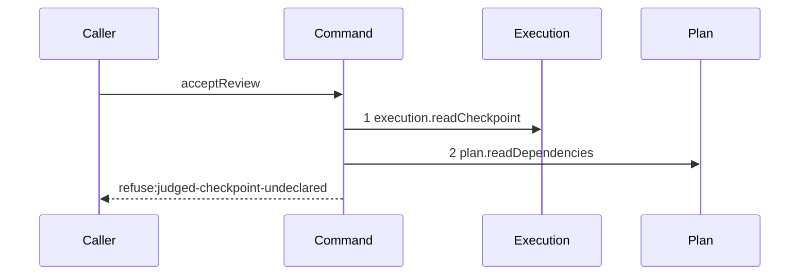

# Story 5 — An undeclared subject refuses after the dependency read

Epic: `.agents/plan/epics/053.1-the-review-checkpoint.md`
Depends on: Story 4 (`04-an-unusable-judged-checkpoint-refuses-after-one-read`), for the judged
record this story reads `nodeId` from; Story 1 (`01-the-three-read-seams`), for
`plan.readDependencies`.
Kind: story-implement

Diagrams: accept-review-refusal-judged-undeclared

Seams: accept-review-refusal-judged-undeclared: +execution.readCheckpoint, +plan.readDependencies

This story leaves the supersession check to Story 6; it adds the dependency read and the one refusal
that read decides.

## The path

### `accept-review-refusal-judged-undeclared`

Fixture: a claimed review task `N` running under run `R` with one open attempt `A`, the authority
prelude already passed, `reason` absent, one edge `N -> D` so `N` depends on `D` alone, and
`judgedCheckpointId` naming an `execution` checkpoint whose `node_id` is a third task `X` that no
edge from `N` names.



**One refusal stops at this step, and it is the only one.** The step before it already refused every
row that is absent or not an execution checkpoint, and the step after it needs a declared node to
have anything to compare.

**Its prior set is empty, so both tokens are `+`.** `execution.readCheckpoint` is `+` here as well as
in Story 4's diagram: a sign is relative to the path, and each of these two diagrams has an empty
prior set.

**`plan.readDependencies` has no projection**, so it draws a bare token, and this command calls it
once.

**This is the case that replaces the subtree lookup.** `../docs/workflow/worker.md:447` —
`depends_on` states a review node is atomic, so it holds no child and its own subtree can never
contain an execution checkpoint. A subtree lookup would be unsatisfiable, and an implicit lookup
would let the reviewer choose its own subject.

Add `test/sequence/scenarios/accept-review-refusal-judged-undeclared.ts`.

## Change

**Extend `src/commands/checkpoint/accept-review.ts` with the dependency read and its refusal.**

### 1 — the read, after the kind check

```ts
const declared = dependencies.plan.readDependencies(transaction, input.nodeId);
if (!declared.includes(judged.nodeId)) {
  throw new AcceptReviewError(
    "judged-checkpoint-undeclared",
    `the review node ${input.nodeId} does not depend on ${judged.nodeId}`,
    { nodeId: input.nodeId, judgedNodeId: judged.nodeId },
  );
}
```

**Move the placeholder of Story 3 (`03-an-oversized-reason-reaches-no-seam`) below the new code.**
It stays a plain `Error` with the same message until Story 7
(`07-the-attestation-with-a-reason`) completes the command, so every case of this story asserts
either a refusal of its own or that message.

**The membership test is over the review node's own `depends_on`, and over nothing else.** It reads
`input.nodeId`, which the authority prelude of `reportOutcome` already proved is the claimed node,
so a reviewer cannot widen its own subject set.

**`judged.nodeId` comes from Story 4's read.** No second checkpoint read supplies it, and no node
read is needed: the test compares two ids.

**A waived edge still declares the dependency.** Story 1
(`01-the-three-read-seams`) fixes `readDependencies` to apply no `waived_at` filter, and its case 9
pins that. A waiver relaxes readiness, not the reviewer's subject set.

## Constraints

- The read happens once, whatever the length of the dependency list. The membership test is pure over
  its result.
- The refusal reaches `execution.newestExecutionCheckpoint` zero times.
- The order is fixed: `judged-checkpoint-not-execution` precedes `judged-checkpoint-undeclared`,
  because a structural row on an undeclared node satisfies both conditions and the earlier one is
  reported. Story 7 (`07-the-attestation-with-a-reason`) case 6 enumerates that pair, and its case 7
  enumerates the three-way `reason-too-large` with both of them.

## Verify

```
node --test src/commands/checkpoint/accept-review.test.ts test/sequence/conformance.test.ts
```

Extend `src/commands/checkpoint/accept-review.test.ts`. Seed edges with
`test/helpers/rows.ts:421` — `seedEdge`.

Add, each as a separate `it`:

1. `"a judged checkpoint of an undeclared node refuses judged-checkpoint-undeclared"` — the diagram's
   fixture. Assert `error.refusal` is `"judged-checkpoint-undeclared"`, `error.details` deep-equals
   `{ nodeId: "<N>", judgedNodeId: "<X>" }`, and `recorder.tokens` deep-equals
   `["execution.readCheckpoint", "plan.readDependencies"]`, so
   `execution.newestExecutionCheckpoint` is reached zero times. This is the epic's gate row 9.

2. `"the control: a declared node passes this step"` — the same fixture with the edge `N -> X`
   instead of `N -> D`. Assert the thrown value is a plain `Error` whose message is
   `"acceptReview is incomplete: no judged checkpoint read yet"`, and assert `recorder.tokens`
   deep-equals `["execution.readCheckpoint", "plan.readDependencies"]` so the read did happen. It
   names no later seam, so it passes at this story's increment. This is the epic's gate row 9
   control, and without it case 1 passes for a command that refuses every subject.

3. `"a review node with no declared dependency refuses every subject"` — no edge from `N`, and a
   judged execution checkpoint of any node. Assert `error.refusal` is
   `"judged-checkpoint-undeclared"` and `recorder.tokens` has length `2`. An empty list must refuse
   rather than pass vacuously.

4. `"a judged checkpoint of a node declared through a waived edge raises no undeclared refusal"` —
   seed the edge `N -> X` with `test/helpers/rows.ts:702` — `seedWaivedEdge`, and assert as case 2
   does. This pins that the seam takes no waiver predicate.

5. `"the refusal leaves the database byte-identical"` — assert `Buffer.compare` of `databaseBytes`
   before and after case 1 is `0`, and assert `SELECT COUNT(*) AS c FROM checkpoint` is unchanged.

6. `"the control: the byte-identical oracle detects a committed write"` — take the same snapshot,
   insert one `blob` row through the same transaction, and assert `Buffer.compare` is **non-zero**.
   `.agents/plan/authoring.md:317` — `control case` requires it of an absence-only oracle.

Add `test/sequence/scenarios/accept-review-refusal-judged-undeclared.ts`, building the fixture the
diagram names, running the real `acceptReview` directly over real SQLite behind the recorder, and
catching the `AcceptReviewError` and returning it as `result`.

`pnpm run verify` exits 0.

Proof: PASS line delivered — `src/commands/checkpoint/accept-review.test.ts` in `PASS EPIC-053.1`.
