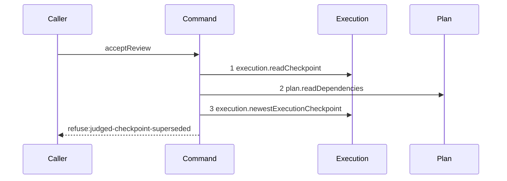

# Story 6 — A superseded subject refuses last

Epic: `.agents/plan/epics/053.1-the-review-checkpoint.md`
Depends on: Story 5 (`05-an-undeclared-subject-refuses-after-the-dependency-read`), for the declared
subject this story compares; Story 1 (`01-the-three-read-seams`), for
`execution.newestExecutionCheckpoint`.
Kind: story-implement

Diagrams: accept-review-refusal-judged-superseded

Seams: accept-review-refusal-judged-superseded: +execution.readCheckpoint, +plan.readDependencies, +execution.newestExecutionCheckpoint

This story leaves the attestation write to Stories 7 and 8; it adds the last read and the refusal
that closes the retrospective selection.

## The path

### `accept-review-refusal-judged-superseded`

Fixture: a claimed review task `N` running under run `R` with one open attempt `A`, the authority
prelude already passed, `reason` absent, one edge `N -> X`, and two `execution` checkpoints on `X`
with the ids `checkpoint_01JQ8Z7G3HZZZZZZZZZZZZZZZA` and `checkpoint_01JQ8Z7G3HZZZZZZZZZZZZZZZB`.
`judgedCheckpointId` is the first, which the second supersedes.



**Step 3 is a different method from step 1, so the two tokens do not collide.** A single
`readCheckpoint` called twice would need a projection to separate the calls, and
`test/helpers/sequence-conformance.ts:50` — `projections` declares none for either; two named methods
is what makes this path drawable without adding a parameter to a production interface.

**Its prior set is empty, so all three tokens are `+`.**

**This is the diagram that closes the retrospective selection.** Naming the checkpoint at report time
would otherwise let a reviewer choose an older accepted checkpoint of the same dependency after a
re-run. EPIC 056 uses the same idiom for the close, refusing `checkpoint-stale` when the named
checkpoint is not the latest accepted one, so the product states one rule twice and not two rules.

Add `test/sequence/scenarios/accept-review-refusal-judged-superseded.ts`.

## Change

**Extend `src/commands/checkpoint/accept-review.ts` with the supersession read and its refusal.**

### 1 — the read, after the dependency check

```ts
const newest = dependencies.execution.newestExecutionCheckpoint(
  transaction,
  judged.nodeId,
);
if (newest === null) {
  throw new Error(
    `newestExecutionCheckpoint returned null for ${judged.nodeId}, which holds ${input.judgedCheckpointId}`,
  );
}
if (newest.id !== input.judgedCheckpointId) {
  throw new AcceptReviewError(
    "judged-checkpoint-superseded",
    `the checkpoint ${input.judgedCheckpointId} is not the newest execution checkpoint of ${judged.nodeId}`,
    {
      judgedCheckpointId: input.judgedCheckpointId,
      newestCheckpointId: newest.id,
      nodeId: judged.nodeId,
    },
  );
}
```

**Move the placeholder of Story 3 (`03-an-oversized-reason-reaches-no-seam`) below the new code.**
It stays a plain `Error` with the same message until Story 7
(`07-the-attestation-with-a-reason`) completes the command, so every case of this story asserts
either a refusal of its own or that message.

**The read is scoped to `judged.nodeId`, not to `input.nodeId`.** The rule is that the named
checkpoint is the newest execution checkpoint of **its own** node. Scoping it to the review node
would compare across dependencies and refuse a legal verdict whenever a sibling dependency was newer.

**`newest === null` is unreachable, so it throws a defect and not a refusal.** Step 1 already
returned a row whose `kind` is `"execution"` and whose `node_id` is `judged.nodeId`, so at least that
row satisfies the query. A plain `Error` is right because the condition means the seam is broken, not
that the caller did anything wrong — and it is what lets
`judgedCheckpointSupersededDetails` declare `newestCheckpointId` non-null in Story 9
(`09-the-contract-the-cli-and-the-proposal`). A refusal carrying `null` there would describe a
response the daemon never sends.

**The comparison is by id, not by `created_at`.** Story 1 (`01-the-three-read-seams`) fixes
`ORDER BY id DESC LIMIT 1` as the whole of "newest", and a checkpoint id is a prefixed ULID whose
binary order agrees with `Buffer.compare`.

## Constraints

- The read is the third and last seam call before the accepted branch. No refusal follows it.
- The refusal reaches `blobs.put` and `execution.writeCheckpoint` zero times.
- `judged-checkpoint-undeclared` precedes `judged-checkpoint-superseded`, and the two **can** both
  hold: supersession is a fact about the judged node, not about whether the review node declared it.
  Story 7 (`07-the-attestation-with-a-reason`) case 6 enumerates that pair and asserts the earlier
  code. `judged-checkpoint-not-execution` and `judged-checkpoint-superseded` cannot both hold, because
  supersession is defined over an execution checkpoint and a structural row is simply not one.
- The refusal names the newer checkpoint in its details, and that value is never `null`. A refusal
  that does not say which checkpoint won is unusable to a reviewer that must re-read and re-judge.

## Verify

```
node --test src/commands/checkpoint/accept-review.test.ts test/sequence/conformance.test.ts
```

Extend `src/commands/checkpoint/accept-review.test.ts`.

Add, each as a separate `it`:

1. `"a superseded judged checkpoint refuses judged-checkpoint-superseded"` — the diagram's fixture.
   Assert `error.refusal` is `"judged-checkpoint-superseded"`, `error.details` deep-equals
   `{ judgedCheckpointId: "checkpoint_01JQ8Z7G3HZZZZZZZZZZZZZZZA", newestCheckpointId:
"checkpoint_01JQ8Z7G3HZZZZZZZZZZZZZZZB", nodeId: "<X>" }`, and
   `recorder.tokens` deep-equals
   `["execution.readCheckpoint", "plan.readDependencies", "execution.newestExecutionCheckpoint"]`.
   This is the epic's gate row 10, and it is the assertion that answers EPIC 051.4's deleted ask.

2. `"the control: the newest checkpoint of the same fixture passes this step"` — the same
   two-checkpoint fixture naming the newer id. Assert the thrown value is a plain `Error` whose
   message is `"acceptReview is incomplete: no judged checkpoint read yet"`, and assert
   `recorder.tokens` deep-equals the diagram's three tokens. It names no later seam, so it passes at
   this story's increment. This is the epic's gate row 10 control.

3. `"a structural checkpoint newer than the judged execution checkpoint does not supersede it"` —
   seed the `...ZA` id as `execution` on `X` and the `...ZB` id as `structural` on `X`, and pass the
   `...ZA` id. Assert as case 2 does. The structural id sorts after the execution one, so a query
   with no kind predicate refuses here and this case fails.

4. `"a newer execution checkpoint of another node does not supersede the judged one"` — seed the
   `...ZA` id on `X` and the `...ZB` id on a second declared node `Y`, and pass the `...ZA` id.
   Assert as case 2 does. This pins the node scoping of the read.

5. `"the refusal leaves the database byte-identical"` — assert `Buffer.compare` of `databaseBytes`
   before and after case 1 is `0`, and assert `SELECT COUNT(*) AS c FROM checkpoint` is unchanged.

6. `"the control: the byte-identical oracle detects a committed write"` — take the same snapshot,
   insert one `blob` row through the same transaction, and assert `Buffer.compare` is **non-zero**.
   `.agents/plan/authoring.md:317` — `control case` requires it of an absence-only oracle.

Add `test/sequence/scenarios/accept-review-refusal-judged-superseded.ts`, building the fixture the
diagram names, running the real `acceptReview` directly over real SQLite behind the recorder, and
catching the `AcceptReviewError` and returning it as `result`.

`pnpm run verify` exits 0.

Proof: PASS line delivered — `src/commands/checkpoint/accept-review.test.ts` in `PASS EPIC-053.1`.
