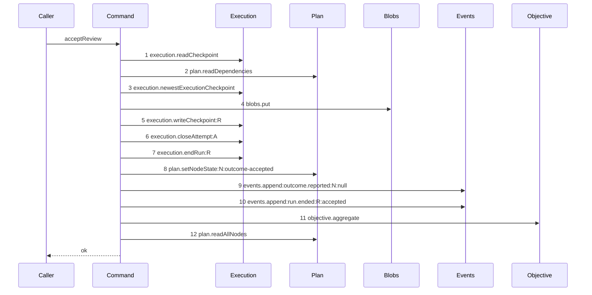

# Story 7 — The attestation with a reason

Epic: `.agents/plan/epics/053.1-the-review-checkpoint.md`
Depends on: Story 6 (`06-a-superseded-subject-refuses-last`), for the three reads this path
completes; EPIC 051.3 Story 2 (`02-the-checkpoint-row`), for `execution.writeCheckpoint` and its
`WriteCheckpointInput`; EPIC 052.1 Story 9 (`09-the-accepted-patch`), for the terminal tail a nested
acceptance owns; EPIC 053, for `objective.aggregate` and the `land-settle-aggregate` order this tail
copies.
Kind: story-implement

Diagrams: accept-review-success-with-reason

Seams: accept-review-success-with-reason: +execution.readCheckpoint, +plan.readDependencies, +execution.newestExecutionCheckpoint, +blobs.put, +execution.writeCheckpoint:R, +execution.closeAttempt:A, +execution.endRun:R, +plan.setNodeState:N:outcome-accepted, +events.append:outcome.reported:N:null, +events.append:run.ended:R:accepted, +objective.aggregate, +plan.readAllNodes

This story leaves the conditional blob write to Story 8 and the route to Story 10; it writes the
attestation, delivers the node, and owns the refusal precedence table.

## The path

### `accept-review-success-with-reason`

Fixture: a claimed review task `N` under objective `O` running under run `R` with one open attempt
`A`, the authority prelude already passed, one edge `N -> X`, exactly one `execution` checkpoint
`checkpoint_01JQ8Z7G3HZZZZZZZZZZZZZZZA` on `X` whose `accepted_oid` is `"a1"` repeated twenty times,
`judgedCheckpointId` naming it, `verdict` of `"accept"`, and `reason` the eleven-byte string
`"looks good\n"`. `N` is the only task under `O`, so the aggregation reaches its own terminal in one
pass.



**The tail order is copied from EPIC 053's `land-settle-aggregate`, not invented.** That diagram runs
`execution.writeCheckpoint:R`, `execution.closeAttempt:A`, `execution.stampRunHead:R`,
`execution.endRun:R`, `plan.setNodeState:T:outcome-accepted`,
`events.append:outcome.reported:T:null`, `events.append:run.ended:R:landed`, `objective.aggregate`,
`plan.readAllNodes`. This path drops `execution.stampRunHead:R`, because a review pins no oid, and
drops `plan.setWorkspaceBranchHead:O`, because a review moves no branch. The `run.ended` reason is
`accepted` and not `landed`, matching EPIC 052.1 Story 9 (`09-the-accepted-patch`), because a review
acceptance is not a land.

**The blob is written before the checkpoint, because the checkpoint references it.** `reason_blob` is
`TEXT REFERENCES blob(hash)`, so the row cannot name a hash the `blob` table does not hold yet.

**No refusal follows step 3, so no refusal can orphan the blob.** Every check that can fail has
already run when step 4 fires, and every write sits in the caller's one transaction, so a failure
anywhere after step 4 rolls all of them back.

**Step 12 is what fills the result.** `objective.aggregate` returns `void`, so
`objectiveState` and `objectiveProjection` of the returned `NodeReportResult` are read from
`plan.readAllNodes` **after** the aggregation, which is exactly why `land-settle-aggregate` puts the
read last.

**Step 5 carries the label `:R`.** `test/helpers/sequence-conformance.ts:50` — `projections` declares
no entry for `execution.writeCheckpoint` today; EPIC 051.3 Story 4 (`04-the-accepted-settle`) draws
`execution.writeCheckpoint:R` and EPIC 053's `land-settle-aggregate` draws it too, so the run-id
projection lands with the first of those and this diagram follows it.

**`objective.aggregate` carries no label**, because
`test/helpers/sequence-conformance.ts:50` — `projections` declares none for it, and this command
calls it once.

**Its prior set is empty, so all twelve tokens are `+`.**

Add `test/sequence/scenarios/accept-review-success-with-reason.ts`.

## Change

**Extend `src/commands/checkpoint/accept-review.ts` with the accepted branch.**

### 1 — the reason blob, written unconditionally in this story

```ts
const reasonBlob = dependencies.blobs.put(
  transaction,
  new TextEncoder().encode(input.reason ?? ""),
);
```

**This story writes the put unconditionally, and Story 8 makes it conditional.** That is deliberate
staging: this story's diagram holds `blobs.put`, and the reasonless path does not become a distinct
trace until Story 8 (`08-the-attestation-with-no-reason`) removes the call. A conditional written
here would leave Story 8 with a diagram and no edit.

**The bytes are what the store hashes.** `src/services/blob/index.ts:22` — `put` takes a
`Uint8Array`, and it is the same encoding the byte cap of Story 3
(`03-an-oversized-reason-reaches-no-seam`) measured, so the cap and the stored size agree exactly.

### 2 — the checkpoint write

```ts
const checkpoint = dependencies.execution.writeCheckpoint(transaction, {
  kind: "review",
  nodeId: input.nodeId,
  runId: input.runId,
  attemptId: input.attemptId,
  fence: input.runFence,
  createdAt: input.at,
  verdict: input.verdict,
  judgedCheckpointId: input.judgedCheckpointId,
  judgedOid: judged.acceptedOid,
  reasonBlob,
});
```

**`fence` receives the run fence.** `WriteCheckpointInput` names the persisted column `fence`, and
after EPIC 050.4 Story 6 (`06-the-report-drops-the-lease`) there is no lease fence to confuse it
with. `input.runFence` is the only fence the command holds.

**`createdAt` is `input.at`.** `WriteCheckpointInput` declares `createdAt: number` and migration 14
declares `created_at INTEGER NOT NULL`, and this command holds no clock:
`src/commands/outcome/report-outcome.ts:108` — `now` reads it once and it arrives as `input.at`.

**`judgedOid` is copied from the referenced row, inside the same transaction.**
`judged.acceptedOid` came from step 1's read, and `checkpoint_execution_accepted_oid` guarantees it is
non-null for an `execution` row. The copy is what lets a reader answer "which commit was judged" with
no join, and the reference beside it keeps the commit repository-qualified:
`docs/workflow/worker.md:447` — `depends_on` states the attestation stores the checkpoint
reference for that reason.

**Every execution and structural column is `NULL`.** `repository_id`, `base_oid`, `accepted_oid`,
`landed_oid`, `graph_revision` and `patch_blob` are not passed. Passing a value for any of them is a
CHECK failure under `checkpoint_execution_accepted_oid`, `checkpoint_execution_repository` or
`checkpoint_structural_patch`, not a preference.

### 3 — `WriteCheckpointInput` widens, and the SQLite writer gains a review branch

**Extend `src/services/execution/index.ts`.** Add a review member to `WriteCheckpointInput`. EPIC 051.3
Story 2 (`02-the-checkpoint-row`) declares it with the literal `kind: "execution"`, and EPIC 052
Story 5 (`05-the-seams-the-acceptance-needs`) records that it widens to a discriminated union rather
than gaining a second method. This story adds the third member:

```ts
| Readonly<{
    kind: "review";
    nodeId: string;
    runId: string;
    attemptId: string;
    fence: number;
    createdAt: number;
    verdict: "accept" | "reject";
    judgedCheckpointId: string;
    judgedOid: string;
    reasonBlob: string | null;
  }>
```

**Add the matching branch to `src/services/execution/sqlite.ts`'s `writeCheckpoint`.** It binds
`verdict`, `judged_checkpoint_id`, `judged_oid` and `reason_blob`, and binds `repository_id`,
`base_oid`, `accepted_oid`, `landed_oid`, `graph_revision` and `patch_blob` as `NULL`. The insert
follows the one-`INSERT ... RETURNING` idiom of
`.agents/plan/stories/051.3-the-checkpoint-and-the-land/02-the-checkpoint-row.md:134` — `openAttempt`.
**`CheckpointRecord` does not widen**: nothing outside `execution` reads the review columns, and this
command returns `NodeReportResult`.

### 4 — the terminal tail

**Delete the placeholder Story 3 (`03-an-oversized-reason-reaches-no-seam`) left**, and write the
tail in full:

```ts
const accounting = accountAttempts({
  attempts: input.attempts,
  limit: input.attemptLimit,
});
const effect = taskReportEffect({ outcome: "accepted", accounting });

const attempt = dependencies.execution.closeAttempt(transaction, {
  attemptId: input.attemptId,
  outcome: effect.attemptOutcome,
  at: input.at,
  headOid: null,
});
dependencies.execution.endRun(transaction, {
  runId: input.runId,
  outcome: effect.runEnd,
  at: input.at,
});
dependencies.plan.setNodeState(transaction, {
  id: input.nodeId,
  from: "running",
  to: effect.nodeState,
  trigger: effect.trigger,
  blockReason: effect.blockReason,
  at: input.at,
  cause: { revision: input.revision, importId: null },
});
dependencies.events.append(transaction, {
  subjectKind: "node",
  subjectId: input.nodeId,
  type: "outcome.reported",
  actorKind: "harness",
  actorId: input.actorId,
  payload: {
    runId: input.runId,
    attemptId: attempt.id,
    attemptNo: attempt.attemptNo,
    outcome: "accepted",
    reason: null,
    objectId: null,
    attemptsRemaining: Math.max(0, input.attemptLimit - accounting.counter),
    fromState: "running",
    toState: effect.nodeState,
  },
});
dependencies.events.append(transaction, {
  subjectKind: "run",
  subjectId: input.runId,
  type: "run.ended",
  actorKind: "harness",
  actorId: input.actorId,
  payload: { runId: input.runId, reason: "accepted" },
});
dependencies.objective.aggregate(transaction, {
  objectiveId: input.parentId,
  at: input.at,
});
const nodes = dependencies.plan.readAllNodes(transaction);
const objective =
  input.parentId === null
    ? undefined
    : nodes.find((candidate) => candidate.id === input.parentId);

return {
  nodeId: input.nodeId,
  kind: "task",
  state: effect.nodeState,
  blockReason: effect.blockReason,
  attemptId: attempt.id,
  attemptNo: attempt.attemptNo,
  attemptsRemaining: null,
  objectId: null,
  objectiveState: objective?.state ?? null,
  objectiveProjection: null,
};
```

**`AcceptReviewInput` gains three fields** beyond Story 3
(`03-an-oversized-reason-reaches-no-seam`)'s declaration: `attempts` — the attempt list the route's
prelude already read — `attemptLimit`, and `revision`, the node revision `setNodeState` needs as its
cause. `accountAttempts` and `taskReportEffect` are both pure, so neither adds a seam and the
diagram is unchanged.

**`taskReportEffect` is called, and its triple is not hardcoded.**
`src/domain/outcome-report.ts:41` — `taskReportEffect` owns the mapping from an outcome to
`nodeState`, `trigger`, `runEnd` and `attemptOutcome`. Writing `"done"` and `"outcome-accepted"` as
literals would put a domain rule in a command. `outcome` is the literal `"accepted"`, never
`input.verdict`: the narrowing at `src/commands/outcome/report-outcome.ts:147` — `switch` admits only the four
`TaskReportOutcome` values, and the verdict decides nothing.

**`attemptsRemaining` is `null` in the result and a number in the payload, and the two schemas force
the split.** The result carries `null` because the run ends in this transaction, so no further attempt
of it can open, and `src/http/contract/outcome.ts:62` — `attemptsRemaining` is nullable. **The payload
cannot carry `null`**: `src/http/contract/event-payload.ts:168` — `attemptsRemaining` is
`z.number().int()` and admits none, and `.agents/plan/epics/054-attempt-classification-and-the-supervisor.md:93`
keeps that type, so no later epic widens it. The payload therefore carries
`Math.max(0, input.attemptLimit - accounting.counter)` over the list the route already read, which is
the value `.agents/plan/stories/051.3-the-checkpoint-and-the-land/04-the-accepted-settle.md:227` —
`attemptsRemaining` computes for the same event on the accepted land. No attempt read pays for it:
`accountAttempts` is pure over `input.attempts`.

**`headOid: null` is present and null, never omitted.**
`src/services/execution/sqlite.ts:291` — `writesHeadOid` flags on `!== undefined`, so passing `null`
clears `head_oid` and omitting the key leaves it untouched.

**No `execution.stampRunHead` call exists on this path.** A review report has no object id to stamp,
and `src/domain/outcome-report.ts:32` — `objectIdRequired` has no production reader, so no branch
consults it.

**`objectiveState` is read after the aggregation, and `objectiveProjection` stays `null`.** The
aggregation returns `void`, so the post-transition state is only readable from the `plan.readAllNodes`
that follows it — which is why EPIC 053's `land-settle-aggregate` puts that read last.
`objectiveProjection` is the projection a report computes for a parent whose children are all
terminal; EPIC 053 moved that decision into the aggregation, so this command reports `null` rather
than recomputing it.

**The node state comes from the report, never from the verdict.** `effect.nodeState` is `"done"` for
both verdict values because `outcome` is the literal `"accepted"`:
`docs/workflow/worker.md:449` — `done` states both deliver the node, and
`docs/workflow/worker.md:729` — `Trusted` places the verdict under Trusted, so a daemon that acted
on it would be verifying it.

**The new module imports** `accountAttempts` from `src/domain/attempt-accounting.ts`,
`taskReportEffect` and `NodeReportResult` from `src/domain/outcome-report.ts`, and the four service
interfaces from `src/services/*/index.ts`. It imports no vendor package.

### 5 — the fixed refusal order, and what it can prove

The command's five refusals run in this order: `reason-too-large`, `judged-checkpoint-unknown`,
`judged-checkpoint-not-execution`, `judged-checkpoint-undeclared`, `judged-checkpoint-superseded`.
The first is pure, and the last four follow the order of the reads that decide them. Every terminal
write of section 4 follows all five, so no refusal reaches one.

**Six of the ten pairs can trigger at once, and four cannot.** Write `R` for
`reason-too-large`, `U` for `judged-checkpoint-unknown`, `N` for
`judged-checkpoint-not-execution`, `D` for `judged-checkpoint-undeclared` and `S` for
`judged-checkpoint-superseded`.

| pair    | co-triggerable | reason                                                                       |
| ------- | -------------- | ---------------------------------------------------------------------------- |
| `R`/`U` | yes            | an oversized reason naming an absent id                                      |
| `R`/`N` | yes            | an oversized reason naming a structural row                                  |
| `R`/`D` | yes            | an oversized reason naming an undeclared node's execution row                |
| `R`/`S` | yes            | an oversized reason naming a superseded execution row                        |
| `N`/`D` | yes            | a structural row on a node no edge from `N` names                            |
| `D`/`S` | yes            | supersession is a fact about the judged node, not about the declaration      |
| `U`/`N` | no             | `N` needs the row `U` proved absent                                          |
| `U`/`D` | no             | `D` needs the row `U` proved absent                                          |
| `U`/`S` | no             | `S` needs the row `U` proved absent                                          |
| `N`/`S` | no             | `S` is defined over an execution checkpoint, and a structural row is not one |

**Two three-way interactions are feasible, so the pair table does not cover them.**
`.agents/plan/authoring.md:349` — `three-way` requires the cases: `R`/`N`/`D` and `R`/`D`/`S`. There
is no feasible four-way, because any set holding both `N` and `S` is impossible.

`body-kind-mismatch` precedes all five and is decided by the report prelude, so its precedence
belongs to Story 10 (`10-the-report-route-carries-a-verdict`) and not to this table.

## Constraints

- Every write sits in the caller's transaction. The command opens none.
- `judgedOid` is read from the referenced row and never taken from the request. A request-supplied oid
  would let a reviewer name a commit the daemon never accepted.
- `plan.readAllNodes` runs after `objective.aggregate`. Reading first returns the pre-transition
  objective state, which is the defect EPIC 053's gate row 17 mutates for.
- The command reads `judged.acceptedOid`, `judged.kind` and `judged.nodeId`, and no other field.
- `blobs.put` is unconditional in this story. Story 8 (`08-the-attestation-with-no-reason`) makes it
  conditional, and that is the whole of Story 8's production change.

## Verify

```
node --test src/commands/checkpoint/accept-review.test.ts src/services/execution/sqlite.test.ts test/sequence/conformance.test.ts
```

Extend `src/commands/checkpoint/accept-review.test.ts`. Read the written row back with a raw
`SELECT` inside `fixture.storage.transact`, separately from the returned result, and resolve the blob
with `src/services/blob/index.ts:23` — `get`.

Add, each as a separate `it`:

1. `"an accepted review with a reason writes one review checkpoint"` — the diagram's fixture. Assert
   `SELECT COUNT(*) FROM checkpoint WHERE kind = 'review'` is `1`, and assert the row deep-equals a
   stated literal: `verdict` of `"accept"`, `judged_checkpoint_id` of
   `"checkpoint_01JQ8Z7G3HZZZZZZZZZZZZZZZA"`, `judged_oid` equal to that row's `accepted_oid`
   **read back separately**, `node_id` of `"task_a"`, `run_id` and `attempt_id` of the fixture's
   values, `fence` of the run fence, `created_at` of `input.at`, and `repository_id`, `base_oid`,
   `accepted_oid`, `landed_oid`, `graph_revision` and `patch_blob` all `null`. This is the epic's
   gate row 11.

2. `"the reason blob resolves to the exact bytes"` — resolve `reason_blob` through `blob.get` and
   assert `Buffer.compare(record.content, Buffer.from("looks good\n", "utf8"))` is `0`. Byte
   equality, not string equality. This is the epic's gate row 11.

3. `"an accepted review delivers the node and returns the post-aggregation result"` — assert the
   returned `NodeReportResult` deep-equals a stated literal in which `state` is `"done"`,
   `objectId` is `null`, `attemptId` is the fixture attempt, `attemptsRemaining` is `null`, and
   `objectiveState` is `"awaiting_approval"` — the value the aggregation writes for a single `done`
   task. Reading before the aggregation yields `"running"`, so this case is what pins step 12 after
   step 11. Assert in the same case that the appended `outcome.reported` payload carries
   `attemptsRemaining` of `2` and parses against `src/http/contract/event-payload.ts`, so the split
   between the nullable result field and the non-nullable payload field is asserted once and in one
   place. This is the epic's gate row 11a.

4. `"a reject verdict writes the same row with verdict reject and the same node state"` — the same
   fixture with `verdict` of `"reject"`, asserting `verdict` is `"reject"`, that every other
   checkpoint column is identical to case 1's row except `id`, and that `state` is still `"done"`.
   The verdict is one column and nothing else moves with it.

5. `"the review branch of writeCheckpoint binds every column"` — extend
   `src/services/execution/sqlite.test.ts` and assert the returned record and the read-back row for a
   `kind: "review"` input, column by column, including the six `NULL`s. This is the concrete SQLite
   branch, asserted by full row value.

6. `"the ordered refusal table reports the earlier of every co-triggerable pair"` — the decision
   table over the **real command**, in one `it`. Six cases, each arming two conditions at once and
   asserting the earlier code: `R`/`U`, `R`/`N`, `R`/`D` and `R`/`S` each report
   `reason-too-large`; `N`/`D` reports `judged-checkpoint-not-execution`; `D`/`S` reports
   `judged-checkpoint-undeclared`. Assert the case count is `6`, so a pair dropped from the table
   fails rather than passing silently. Assert in the same `it` that the four impossible pairs are
   impossible, by constructing each and asserting the fixture cannot be built or the second condition
   cannot hold. This is the epic's gate row 12.

7. `"the ordered refusal table covers both three-way interactions"` — two cases, `R`/`N`/`D` and
   `R`/`D`/`S`, each asserting `reason-too-large`. Assert the case count is `2`.
   `.agents/plan/authoring.md:349` — `three-way` requires them, because a pair table does not cover
   a three-way interaction.

8. `"the control: each condition alone reports its own code"` — five sub-cases, each arming exactly
   one of the five conditions and asserting that condition's own code. Without it, a case of case 6
   or 7 passes when no condition armed, and the table proves an order nobody exercised. This is the
   epic's gate row 12 control.

9. `"a reason of exactly 65536 bytes is accepted and stored"` — pass `"a".repeat(65536)` and assert
   the written `checkpoint` row's `reason_blob` equals
   `` `sha256:${createHash("sha256").update("a".repeat(65536)).digest("hex")}` ``, computed in the
   test and not copied, and that the returned `state` is `"done"`. This is the accepted half of the
   epic's gate row 6; Story 3 (`03-an-oversized-reason-reaches-no-seam`) cases 1 to 3 carry the
   refused half.

10. `"a failure after the checkpoint write rolls every effect back"` — bind `objective` to a capability
    that writes one row through the supplied transaction and then throws. Assert the thrown error
    escapes, and assert `databaseBytes` is byte-identical to the pre-call snapshot under
    `Buffer.compare`, so the blob, the checkpoint, the attempt close, the run end, the node transition
    and both events are all rolled back. A diagram proves no transaction property; this case does.

Add `test/sequence/scenarios/accept-review-success-with-reason.ts`, building the fixture the diagram
names, running the real `acceptReview` directly over real SQLite behind the recorder, binding
`objective` to an unrecorded capability wrapping the real `aggregateObjective`, and returning the
recorder and the returned result.

`pnpm run verify` exits 0.

Proof: PASS line delivered — `src/commands/checkpoint/accept-review.test.ts` in `PASS EPIC-053.1`.
