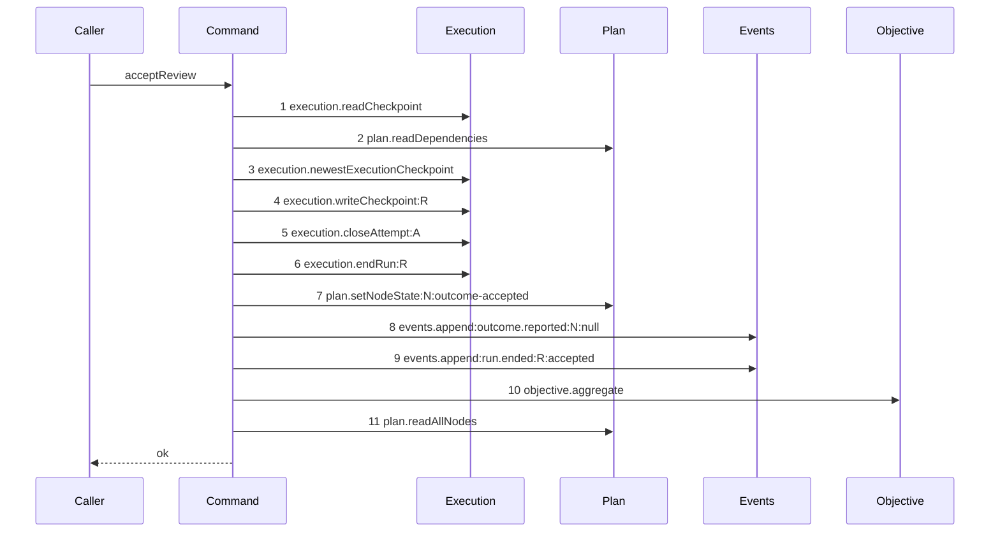

# Story 8 — The attestation with no reason

Epic: `.agents/plan/epics/053.1-the-review-checkpoint.md`
Depends on: Story 7 (`07-the-attestation-with-a-reason`), for the accepted branch and the
unconditional blob write this story makes conditional; EPIC 051.3 Story 1 (`01-migration-14`), for the
two named CHECKs this story asserts.
Kind: story-implement

Diagrams: accept-review-success-no-reason

Seams: accept-review-success-no-reason: +execution.readCheckpoint, +plan.readDependencies, +execution.newestExecutionCheckpoint, +execution.writeCheckpoint:R, +execution.closeAttempt:A, +execution.endRun:R, +plan.setNodeState:N:outcome-accepted, +events.append:outcome.reported:N:null, +events.append:run.ended:R:accepted, +objective.aggregate, +plan.readAllNodes

This story leaves the route to Story 10; it makes the reason optional at the seam and proves the two
review CHECKs are biconditional.

## The path

### `accept-review-success-no-reason`

Fixture: the fixture of Story 7 (`07-the-attestation-with-a-reason`) with `reason` absent from the
input. Every other value is identical, so the two diagrams differ by exactly one token.



**`Blobs` is not a participant, and that absence is the whole assertion.** The path differs from
`accept-review-success-with-reason` only by calling nothing where that one calls `blobs.put`, so it
is drawn rather than described. Any `blobs.put` the implementation makes on a reasonless report fails
the comparison, which is what proves the reason is optional at the seam and not merely optional in
the schema.

**Its prior set is empty, so all eleven tokens are `+`.** This path does not exist before this story:
Story 7 (`07-the-attestation-with-a-reason`) writes the blob unconditionally, so a reasonless input
takes that story's twelve-token trace with an empty-string blob. The reasonless trace becomes a
distinct path only when this story's edit lands, so it has no prior and no `baseline-` diagram.

Add `test/sequence/scenarios/accept-review-success-no-reason.ts`.

## Change

**Edit `src/commands/checkpoint/accept-review.ts`.** Make the blob write conditional, replacing the
unconditional call Story 7 (`07-the-attestation-with-a-reason`) section 1 wrote:

```ts
const reasonBlob =
  input.reason === undefined
    ? null
    : dependencies.blobs.put(
        transaction,
        new TextEncoder().encode(input.reason),
      );
```

**Two things change together, and neither is cosmetic.** The `?? ""` fallback disappears, so the
command no longer encodes an empty string, and `reasonBlob` becomes `null` instead of the hash of
zero bytes. A reasonless attestation therefore names no blob, and the `blob` table gains no row.

**This is the whole production change of this story.** Everything else — the checkpoint write, the
attempt close, the run end, the node transition, both events and the aggregation — Story 7
(`07-the-attestation-with-a-reason`) already wrote and this story does not touch.

## Constraints

- `reason_blob` is `null` for a reasonless attestation, and the `blob` table gains no row.
- `verdict` is still required. A reasonless attestation is a complete attestation:
  `docs/workflow/worker.md:449` — `done` makes both verdict values a delivered verdict, and no
  sentence requires a reason.
- The conditional tests `=== undefined`, never falsiness. `src/http/contract/outcome.ts`'s
  `.min(1)` refuses an empty string at the wire, so an empty string reaching the command is a defect
  and must not be silently treated as absent.
- `checkpoint_review_verdict` and `checkpoint_review_judged` are created by EPIC 051.3's migration
  `14`. This epic creates no second CHECK and edits neither.

## Verify

```
node --test src/commands/checkpoint/accept-review.test.ts src/services/storage/migration-0014-checkpoint.test.ts test/sequence/conformance.test.ts
```

Extend `src/commands/checkpoint/accept-review.test.ts` for cases 1 to 4, and
`src/services/storage/migration-0014-checkpoint.test.ts` — added by EPIC 051.3 Story 1
(`01-migration-14`) — for cases 5 to 7. Assert a CHECK failure with the `SQLITE_CONSTRAINT` idiom of
`src/services/execution/sqlite.test.ts:106` — `assertConstraint`, which masks `errcode` with `0xff`
and compares to `19`.

Add, each as a separate `it`:

1. `"an accepted review with no reason writes reason_blob of null"` — the diagram's fixture. Assert
   the written row deep-equals Story 7 (`07-the-attestation-with-a-reason`) case 1's stated literal
   with `reason_blob` of `null` and a different `id`, column by column. This is the epic's gate
   row 13.

2. `"an accepted review with no reason reaches blobs.put zero times"` — assert `recorder.tokens`
   deep-equals the diagram's eleven tokens, by value and in order. This is the epic's gate row 13.

3. `"an accepted review with no reason adds no blob row"` — assert `SELECT COUNT(*) AS c FROM blob`
   is equal before and after, by value. Story 7 (`07-the-attestation-with-a-reason`) case 1 on the
   same fixture raises the count by one, which is the control that the count detects a written blob.
   This is the epic's gate row 13.

4. `"a reject verdict with no reason is a complete attestation"` — `verdict` of `"reject"` and
   `reason` absent, asserting the row is written with `verdict` of `"reject"` and `reason_blob` of
   `null`, and that the returned result's `state` is `"done"`.

5. `"an execution checkpoint carrying a verdict is refused by checkpoint_review_verdict"` — insert an
   `execution` row with `verdict` of `"accept"` by raw SQL and assert the raised message matches
   `/checkpoint_review_verdict/`. This is the epic's gate row 14.

6. `"a review checkpoint with no verdict is refused by checkpoint_review_verdict"` — insert a
   `review` row with `verdict` of `null` and assert the same named CHECK by message. Cases 5 and 6
   together prove the CHECK is a biconditional and not a one-way implication, which is why this epic
   creates no second one. This is the epic's gate row 14.

7. `"a review checkpoint with no judged_checkpoint_id is refused by checkpoint_review_judged"` —
   insert a `review` row with `judged_checkpoint_id` of `null` and assert the message matches
   `/checkpoint_review_judged/`, then insert an `execution` row carrying a `judged_checkpoint_id` and
   assert the same. Both directions of the second review CHECK.

Add `test/sequence/scenarios/accept-review-success-no-reason.ts`, building the fixture the diagram
names with `reason` absent, running the real `acceptReview` directly over real SQLite behind the
recorder, binding `objective` to an unrecorded capability wrapping the real `aggregateObjective`, and
returning the recorder and the returned result.

`pnpm run verify` exits 0.

Proof: PASS line delivered — `src/commands/checkpoint/accept-review.test.ts` in `PASS EPIC-053.1`.
