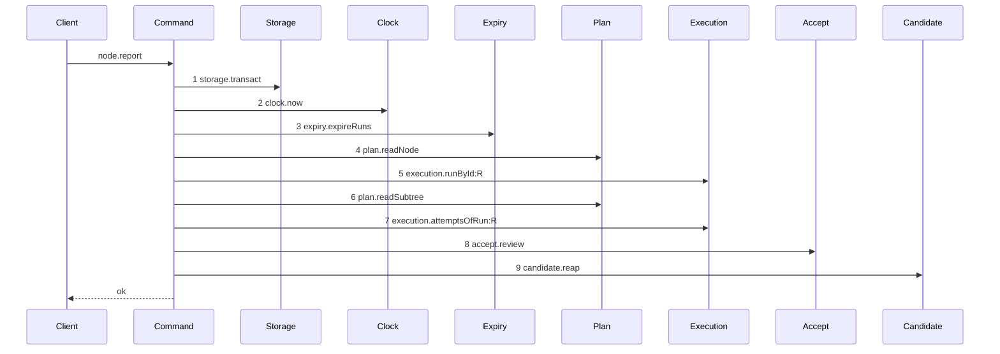

# Story 10 — The report route carries a verdict

Epic: `.agents/plan/epics/053.1-the-review-checkpoint.md`
Depends on: Story 9 (`09-the-contract-the-cli-and-the-proposal`), for the eighth
`nodeReportRequest` member and the five error codes this story maps; Story 8
(`08-the-attestation-with-no-reason`), for the complete command; EPIC 051.4 Story 8
(`08-the-report-route-enforces-the-gate`), for the authority prelude and the `accept` dependency key;
EPIC 051.6 Story 3 (`03-the-report-reaps-on-every-settled-terminal`), for the `candidate.reap` tail
and the diagram this one is measured against.
Kind: story-implement

Diagrams: report-review-gate

Seams: report-review-gate: +storage.transact, +clock.now, +expiry.expireRuns, +plan.readNode, +execution.runById:R, +plan.readSubtree, +execution.attemptsOfRun:R, +accept.review, +candidate.reap

This story is last in dispatch order; it wires the route, appends `shippedEpics`, and makes all eight
diagrams of this epic scenario-due.

## The path

### `report-review-gate`

Fixture: a review task `N` claimed by `claude@1` under run `R` at run fence `1` with one open attempt
`A`, one edge `N -> X`, exactly one `execution` checkpoint
`checkpoint_01JQ8Z7G3HZZZZZZZZZZZZZZZA` on `X`, and a body of
`{ report: "review", runId: "<R>", runFence: 1, verdict: "accept", judgedCheckpointId: "<that id>" }`
with no reason. No run is expired, so `candidate.reap` finds nothing to delete and still fires.



**It is EPIC 051.6's `report-checkpoint-reap` with two changes.** That diagram is the report route at
dispatch: the same seven-step prelude, then `execution.runBases:R`, `accept.execution` and
`candidate.reap`. This path drops `execution.runBases:R` and substitutes `accept.review`.

**`execution.runBases:R` is absent because a review run holds no base.**
`.agents/plan/epics/050-the-run-the-fence-and-exclusion.md:34` — `runBaseRow` fixes the cardinality at
exactly none for a `review` run, so the read would return an empty list and decide nothing. It exists
on the execution route to supply the repository and base facts `acceptExecution` needs; a review
acceptance gets its repository-qualified subject through `judged_checkpoint_id` instead.

**Step 8 is one step, because `acceptReview` is a nested command.** The scenario binds `accept` to
unrecorded dependencies, so the eleven or twelve seam calls inside it are invisible at this seam.
They are Stories 7 and 8's diagrams.

**Step 9 is outside the transaction of step 1.** `candidate.reap` deletes refs of runs the expiry pass
of step 3 committed as expired, and it has nothing to do with the reported review run — a review
pushes no candidate. An `AcceptReviewError` thrown inside the transaction rolls the expiry pass back
and therefore reaches no reap, which is why every refusal diagram of Stories 3 to 6 ends before it.

**No terminal write appears on this route.**
`.agents/plan/stories/051.4-the-acceptance-gate-and-the-report-route/08-the-report-route-enforces-the-gate.md:13`
— `Seams` removed `execution.closeAttempt:A`, `plan.setNodeState:T:outcome-accepted`,
`execution.stampRunHead:R`, `execution.endRun:R`, `events.append:outcome.reported:T:null` and
`plan.readAllNodes` from the report route. The nested acceptance owns them, and Stories 7 and 8 draw
them.

**The refusal branch of this route is deliberately undrawn.**
`.agents/plan/authoring.md:340` — `guard` states that a story inserting a refusal draws the path that
still succeeds, because that is the path whose order changed, and that drawing the refusal would give
the story a second live diagram. EPIC 051.4 does exactly this: its `report-refusal-*` diagrams all
end `Command-->>Caller`, so they belong to the nested `acceptExecution`, and it draws no
`Client`-ended refusal for the route. What proves this route's refusals is case 9 below — each code,
its status, and a byte-identical database — not a trace.

**Its prior set is empty, so every token is `+`.** The review member is a wholly new path: the six
shipped members and the structural member keep the tails their own epics drew, and this story adds a
member and changes none.

Add `test/sequence/scenarios/report-review-gate.ts`.

## Change

### 1 — `src/commands/outcome/report-outcome.ts` — the injected callable

**Edit `src/commands/outcome/report-outcome.ts`.** Add `review` to the `accept` namespace of
`ReportOutcomeDependencies`, beside the `execution` and
`structural` members EPIC 051.4 Story 8 (`08-the-report-route-enforces-the-gate`) and EPIC 052.2
Story 2 (`02-the-report-route-carries-a-patch`) add:

```ts
review: (transaction: Transaction, input: AcceptReviewInput) =>
  NodeReportResult;
```

**`accept` is an object key and not three function keys.** That is what makes `accept.review` a
recorded token: `test/helpers/sequence-conformance.ts:112` — `wrapCapability` returns a non-object dependency value
unwrapped, so a bare function-valued dependency is invisible at the recorder.

### 2 — the review arm, before the node-kind branches

Branch on `body.report === "review"` **before** the node-kind branches, as EPIC 052.2 Story 2
(`02-the-report-route-carries-a-patch`) does for `structural`, so a review report on a node the kind
switch would reject never reaches the `body-kind-mismatch` default at
`src/commands/outcome/report-outcome.ts:141` — `body-kind-mismatch`.

The arm, in order:

1. run the authority prelude EPIC 051.4 Story 8 (`08-the-report-route-enforces-the-gate`) added —
   `execution.runById`, `plan.readSubtree`, `execution.attemptsOfRun` — and refuse
   `body-kind-mismatch` when `run.kind` is not `"review"` **or when `node.kind` is not `"task"`**.
   The second term is what keeps the objective review pair out of this epic: Story 2
   (`02-a-review-claim-is-admitted`) refuses its claim, and this refuses its report, so no half of
   the pair is half-admitted. EPIC 053.2 removes both terms together;
2. select the one open attempt from the prelude's list, as the shipped arm does at
   `src/commands/outcome/report-outcome.ts:216` — `filter`;
3. call `dependencies.accept.review(transaction, { nodeId: node.id, parentId: node.parentId,
revision: node.revision, runId: run.id, runFence: body.runFence, attemptId: open.id,
attempts: attempts.map((row) => ({ attemptNo: row.attemptNo, outcome: row.outcome })),
attemptLimit: run.attemptLimit, actorId: input.actorId, at: now, verdict: body.verdict,
judgedCheckpointId: body.judgedCheckpointId, reason: body.reason })` and return its result.
   `attempts` is the prelude's own list, so the nested command needs no second read and there is one
   authority for the attempt set;
4. reap outside the transaction, as EPIC 051.6 Story 3
   (`03-the-report-reaps-on-every-settled-terminal`) does for the other members.

**The arm computes nothing and decides nothing.** Every state effect is Story 7
(`07-the-attestation-with-a-reason`)'s, so the arm parses, invokes and returns — which is what
`AGENTS.md` requires of a handler and, after EPIC 051.4, of this command's members.

**Refuse `body-kind-mismatch` in both directions.** A `review` member naming a run whose kind is not
`review` refuses it, and an `accepted` member naming a `review` run refuses it too. The shipped code
at `src/commands/outcome/report-outcome.ts:82` — `body-kind-mismatch` already carries a
member-against-node mismatch, and this adds the member-against-run-kind case to the same code.

### 3 — `src/http/server/node/refusals.ts` — the refusal mapping

**Edit `src/http/server/node/refusals.ts`.** Add an `AcceptReviewError` arm to
`src/http/server/node/refusals.ts:12` — `toHttpError`, beside
the `ReportOutcomeError` arm, and an `acceptReviewRefusal` function in the shape of
`src/http/server/node/refusals.ts:67` — `reportOutcomeRefusal`, an exhaustive `switch` over
`AcceptReviewRefusal`:

| refusal                           | contract error                    | details                                              |
| --------------------------------- | --------------------------------- | ---------------------------------------------------- |
| `reason-too-large`                | `reason-too-large`                | `{ bytes, limit }`                                   |
| `judged-checkpoint-unknown`       | `judged-checkpoint-unknown`       | `{ judgedCheckpointId }`                             |
| `judged-checkpoint-not-execution` | `judged-checkpoint-not-execution` | `{ judgedCheckpointId, kind }`                       |
| `judged-checkpoint-undeclared`    | `judged-checkpoint-undeclared`    | `{ nodeId, judgedNodeId }`                           |
| `judged-checkpoint-superseded`    | `judged-checkpoint-superseded`    | `{ judgedCheckpointId, newestCheckpointId, nodeId }` |

Each arm passes `error.details` through unchanged, so the emitted envelope matches the schema Story 9
(`09-the-contract-the-cli-and-the-proposal`) declares. **`reason-too-large` carries details too**, and
a mapping that discarded them would emit a body its own contract entry no longer describes.

**The mapping belongs to the refusals module, not to the handler.**
`src/http/server/node/report-node.ts:41` — `toHttpError` holds one delegation and no switch, and
EPIC 052.2 Story 2 (`02-the-report-route-carries-a-patch`) maps its ten codes in `refusals.ts`. The
epic named the handler and has been corrected to name the refusals module.

**Add `AcceptReviewError` to the `details` union** at `src/http/server/node/refusals.ts:268` —
`details`, which is a closed union of error classes. It routes to no `leaseHeld` arm, so the union at
`src/http/server/node/refusals.ts:237` — `leaseHeld` is untouched.

`src/http/server/node/report-node.ts` needs no edit. Its branch at
`src/http/server/node/report-node.ts:43` — `closed` tests `body.report === "closed"`; after EPIC 050.4 Story 6
(`06-the-report-drops-the-lease`) it no longer reads a lease fence, so a `review` member needs no
special case.

### 4 — `src/main.ts` — the binding

**Edit `src/main.ts`.** Add a `bound*` closure in the shape of
`src/main.ts:292` — `boundReportObjective`:

```ts
const boundAcceptReview = (
  transaction: Transaction,
  input: AcceptReviewInput,
): NodeReportResult =>
  acceptReview(
    {
      plan,
      blobs,
      execution,
      events,
      objective: { aggregate: boundAggregateObjective },
    },
    transaction,
    input,
  );
```

and add `review: boundAcceptReview` to the `accept` object of
`src/main.ts:301` — `boundReportOutcome`. `execution`, `plan` and `blobs` are constructed at
`src/main.ts:265` — `SqliteExecution`, `src/main.ts:267` — `SqlitePlanStore` and `src/main.ts:268` — `SqliteBlobStore`, and `events` at `src/main.ts:263` — `SqliteEventLog`.
`boundAggregateObjective` is EPIC 053's binding; wrap it in the one-method object the capability
declares rather than passing it bare.

### 5 — `scripts/epic-sequence-range.ts` — append `"053.1"` to `shippedEpics`

**Edit `scripts/epic-sequence-range.ts`.** Append `"053.1"` to its `shippedEpics` tuple, and to
the pinned literal at `test/sequence/conformance.test.ts:274` — `shippedEpics`. Story 1
(`01-the-three-read-seams`) already put it in `authoredEpics`, and
`test/sequence/conformance.test.ts:275` — `slice` requires `shippedEpics` to stay a prefix of `authoredEpics`,
so this edit is legal only when every earlier epic of the range is already shipped.

**This is what makes all eight diagrams scenario-due.**
`test/sequence/conformance.test.ts:83` — `shipped` scopes `liveDiagrams` to `shippedEpics`, so the
runner replays `claim-success-review`, the five `accept-review-*` diagrams and `report-review-gate`
for the first time here. Every scenario file must already exist, which is why this story is last.

## Constraints

- The review arm parses, invokes one nested command and returns. A branch on a domain rule in it is a
  defect.
- The arm calls `execution.attemptsOfRun` once, through the prelude. A second call repeats the drawn
  token, and there is no second authority for selecting the open attempt.
- `candidate.reap` runs outside the transaction, after it commits. Inside it, a rolled-back expiry
  pass would leave the reap deleting refs of runs that are still active.
- The five shipped members and the structural member keep their arms byte-for-byte. This story adds a
  branch above them and edits none of them.
- `accept` stays one object key. Splitting it into three function keys makes step 8 invisible.
- `runFence` reaches `acceptReview` from the body, and `at` from `clock.now` at
  `src/commands/outcome/report-outcome.ts:108` — `now`. The arm constructs neither.
- `attempts` and `attemptLimit` reach `acceptReview` from the prelude's read and the run row. The arm
  derives nothing from them; Story 7 (`07-the-attestation-with-a-reason`) calls `accountAttempts`
  over them.
- The arm refuses `body-kind-mismatch` when the node kind is not `task`. Removing that term admits
  the objective review pair, which EPIC 053.2 owns.

## Verify

```
node --test src/commands/outcome/report-outcome.test.ts src/http/server/node/report-node.test.ts src/main.report.test.ts src/main.test.ts test/sequence/conformance.test.ts
```

Extend `src/commands/outcome/report-outcome.test.ts`, whose suite is at
`src/commands/outcome/report-outcome.test.ts:558` — `describe`, whose fixture builder is
`src/commands/outcome/report-outcome.test.ts:185` — `createReportFixture` over real SQLite, whose
report driver is `src/commands/outcome/report-outcome.test.ts:322` — `report`, whose refusal driver is
`src/commands/outcome/report-outcome.test.ts:348` — `refused`, and whose no-write oracle is
`src/commands/outcome/report-outcome.test.ts:494` — `assertNoWrite`. The route cases extend
`src/main.report.test.ts`, whose fixture factory is `src/main.report.test.ts:556` — `createFixture`.

Add, each as a separate `it`:

1. `"a review report delegates to accept.review in the same transaction"` — assert exactly one call
   to the canned `accept.review` and zero to `accept.structural` and `accept.execution`, assert
   `deepEqual` on the whole input object against a stated literal holding `nodeId`, `parentId`,
   `runId`, `runFence`, `attemptId`, `actorId`, `at`, `verdict`, `judgedCheckpointId` and no `reason`
   key, assert `typeof call.transaction.get` is `"function"`, and assert a `probeNodeTitle` written
   inside the canned callable is readable after `reportOutcome` returned, in the idiom of
   `src/commands/outcome/report-outcome.test.ts:826` — `same transaction`.

2. `"a review report reaches the seams of the diagram and no terminal write"` — over the recorder,
   assert `recorder.tokens` deep-equals the diagram's nine tokens by value and in order. It is what
   proves the arm adds no `execution.closeAttempt`, no `plan.setNodeState` and no `events.append` of
   its own.

3. `"an accepted review report moves the review node to done for accept and for reject"` — two
   fixtures over the real `acceptReview`, one per verdict, each asserting `nodeState` is `"done"`,
   and asserting every other node row in the fixture is byte-identical between the two under
   `Buffer.compare`. The verdict is thereby proven to change no state. This is the epic's gate
   row 15.

4. `"an accepted review report calls no stampRunHead and closes the attempt with a null head"` —
   assert the recorder of the nested command holds no `execution.stampRunHead` token, assert the
   `attempt` row's `head_oid` is `null` and its `outcome` is `"accepted"`, and assert the `run` row's
   `outcome` is `"done"` and `ended_at` is the fixture clock's value. The shipped `accepted` member on
   the same fixture stamps a head, which is the control. This is the epic's gate row 16.

5. `"body-kind-mismatch refuses both directions"` — a `review` member naming an `execution` run, and
   an `accepted` member naming a `review` run. Each asserts `error.refusal` is
   `"body-kind-mismatch"` and `assertNoWrite`. Both directions, so neither is a blanket refusal. This
   is the epic's gate row 17.

6. `"each review refusal maps to its code over the real route"` — add five rows to the table at
   `src/http/server/node/report-node.test.ts:170` — `cases`, one per `AcceptReviewError` refusal, each
   asserting the status, the code, the details by value, and
   `src/http/server/node/report-node.test.ts:24` — `reportErrorEnvelope` parses the response. Four at
   `409` and `reason-too-large` at `400`.

7. `"the handler branches on no domain rule for eight members"` — add the `review` member to
   `src/http/server/node/report-node.test.ts:331` — `bodies` and assert the handler calls the command
   exactly once and answers `200`. This array holds six members today and gains the `structural`
   member from EPIC 052.2 Story 2 (`02-the-report-route-carries-a-patch`), which names no such edit;
   both land here or the sweep stops being exhaustive.

8. `"an accepted review report resolves over the real route to a checkpoint row"` — over the daemon
   `src/main.ts` builds. **Seed in this order, because every row below is a foreign key of the next**:
   `seedRegistry` for the repository, project and profile; `seedGraph` for `initiative_a`,
   `objective_a` and `task_a`; a second task `X` under `objective_a` with `deliverable` of
   `"implementation"`; `task_a` projected to `deliverable` of `"review"`; one `edge` row
   `task_a -> X`; then a claim of `X` and an accepted execution report of `X` **through the real
   route**, which is what writes `X`'s execution checkpoint with a non-null `accepted_oid` and gives
   the judged id its real ULID. Only then claim `task_a` and post the `review` member naming that id.
   Read the `checkpoint` row back from `kanthord.db` with `DatabaseSync` and assert `kind` is
   `"review"`, `verdict` is `"accept"`, `node_id` is `"task_a"` and `judged_oid` equals the judged
   row's `accepted_oid`, read back in the same query. **Seeding the judged checkpoint by raw SQL would
   not do**: `checkpoint` references `node`, `run` and `attempt(id, run_id)`, so the run and attempt
   must exist, and driving the execution report is what creates them consistently. This is the epic's
   gate row 18, and it proves the handler mapping and the `src/main.ts` binding together.

9. `"each of the five refusals answers its own status over the real route"` — five requests over the
   same daemon, asserting the status and the code of each by value, and asserting `databaseBytes` is
   byte-identical before and after each. Four answer `409` and `reason-too-large` answers `400`. This
   is the epic's gate row 18.

10. `"body-kind-mismatch precedes every acceptReview condition"` — a decision table over the route,
    in one `it`, holding the five pairs of `body-kind-mismatch` against each single condition and the
    two three-way cases `body-kind-mismatch` with `R`/`N`/`D` and with `R`/`D`/`S`. Every case asserts
    `body-kind-mismatch`. Assert the case count is `7`. This is the half of the epic's gate row 12
    that the report prelude decides; Story 7 (`07-the-attestation-with-a-reason`) cases 6 and 7 own
    the other eight.

11. `"every preceding member keeps the tail its own epic drew"` — **seven sub-cases**: the six
    shipped members `accepted`, `rejected`, `failed`, `cancelled`, `attested` and `closed`, plus
    `structural`. `src/http/contract/outcome.ts:23` — `nodeReportRequest` holds six members today and
    EPIC 052.2 Story 1 (`01-the-contract-carries-the-patch`) adds the seventh, so `review` is the
    eighth and seven precede it. Assert each recorded token list equals the list its own epic's
    diagram draws. Running only `accepted` would leave six members unproven. This is the epic's gate
    row 19.

12. `"the conformance runner replays all eight diagrams of this epic"` — append `"053.1"` to
    the `shippedEpics` tuple of `scripts/epic-sequence-range.ts` and to
    `test/sequence/conformance.test.ts:274` — `shippedEpics`, then assert
    `test/sequence/conformance.test.ts:278` — `every due scenario conforms` passes. This is the epic's
    gate row 22.

13. `"the control: a removed blobs.put token fails the comparison"` — take the recorder token list of
    `test/sequence/scenarios/accept-review-success-with-reason.ts`, copy it, remove
    `"blobs.put"` from the copy, and assert
    `test/helpers/sequence-conformance.ts:318` — `assertConformance` throws
    `sequence mismatch for diagram accept-review-success-with-reason`. It mutates an in-memory copy
    and never a checked-out file, so it is hermetic. This is the epic's gate row 22 control.

Add `test/sequence/scenarios/report-review-gate.ts`, building the fixture the diagram names, running
the real `reportOutcome` over real SQLite behind the recorder, binding `expiry`, `accept` and
`candidate` to unrecorded dependencies as
`test/sequence/scenarios/claim-success-task.ts:81` — `expiry` does, aliasing the run id to `R` and
the attempt id to `A`, and returning the recorder and the result.

`pnpm run verify` exits 0.

Proof: PASS line delivered — `src/commands/outcome/report-outcome.test.ts`, `src/main.test.ts` and
`test/sequence/conformance.test.ts` in `PASS EPIC-053.1`.
