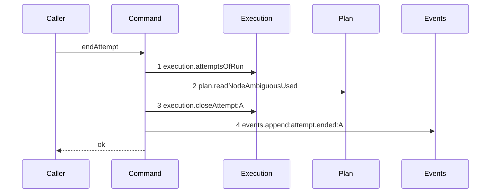

# Story 1 — A semantic ending, and an accepted one

Epic: `.agents/plan/epics/054.1-the-end-attempt-command.md`
Depends on: EPIC 054 Story 3 (`03-the-close-writes-the-termination`), for `CloseAttemptInput.termination`
and `AttemptRecord.termination`; EPIC 054 Story 4 (`04-the-node-ambiguous-counter`), for
`plan.readNodeAmbiguousUsed`; EPIC 054 Story 6 (`06-the-evidence-union-and-the-classifiers`), for
`Termination`, `TerminationEvidence`, `internalEvidenceKinds`, `externalEvidenceKinds`,
`InternalEvidence`, `ExternalEvidence`, `classifyInternal`, `classifyExternal` and
`convertOnExhaustion`; EPIC 054 Story 7 (`07-accounting-by-class`), for `AttemptRecord.termination` and
`accountAttempts().semanticCount`; EPIC 054 Story 9 (`09-the-budget-and-the-supervisor`), for
`ambiguousBudget`. **It depends on no EPIC 054 story for the event type**: EPIC 054 decides the type,
the subject and the payload, and section 7 of this story registers them.
Kind: story-implement

Diagrams: end-attempt-semantic

Seams: end-attempt-semantic: +execution.attemptsOfRun, +plan.readNodeAmbiguousUsed, +execution.closeAttempt:A, +events.append:attempt.ended:A

This story writes the command, the semantic ending and the accepted ending. It leaves the counter
increment to Story 2 (`02-an-ambiguous-ending-increments-the-counter`) and the no-op settlement to
Story 3 (`03-a-settlement-over-a-closed-attempt-writes-nothing`), and it calls the command from no
product path, because every caller belongs to EPIC 054.2, EPIC 054.3 or EPIC 054.4.

**This story classifies and converts, and it does not charge.** The full classification, including
`convertOnExhaustion`, lands here, because the stored termination depends on the counter this story
already reads. Only `plan.incrementNodeAmbiguousUsed` is absent, so Story 2 adds exactly one seam
call. An ambiguous ending therefore stores its class here and charges nothing until Story 2 lands, and
no case of this story asserts an ambiguous ending.

**The drawn set of this path is one diagram, because the accepted ending has the drawn seam set.**
The accepted arm makes the same four calls in the same order and differs only in what it stores and
what the payload holds, so it is case 9 and case 10 of this story rather than a fourth diagram.
`.agents/plan/stories/050.2-the-run-renew-release-and-report/05-the-release.md:16` — `projected.exhausted`
already rules that a branch which changes a value and not the call set is not a diagram.

**Two further paths exist and both are deliberately undrawn.** A named attempt no row of the run
carries, and evidence whose kind the attempt's driver cannot produce, are invariant breaches, and the
command throws a bare `Error` on each. Every invariant breach of a shipped command throws the same
way and none is drawn — `src/commands/outcome/report-outcome.ts:218` — `throw` is the shipped form —
so this story proves them by case 12 and case 13 and not by a diagram.

## The path

### `end-attempt-semantic`

Fixture: `test/helpers/rows.ts:102` — `seedGraph` for the three-node graph, one `execution` run
`run_b` over `task_a` with `driver` of `"external"`, `attempt_limit` of `3` and `state` of `"active"`,
and one open attempt `attempt_a` at `attempt_no` `1` with a null `outcome` and a null `termination`.
`node.ambiguous_used` is null. `ambiguousBudget` is `2`. The input carries
`outcome: "failed"`, `evidence: { kind: "worker-reported-failure" }`, `at: 1700000005000` and
`attemptLimit: 5`. **The run row's `attempt_limit` is `3` and the input's `attemptLimit` is `5`, and
they differ on purpose**: the payload must publish `5`, so a command that read the run instead of the
input fails the assertion rather than passing on a coincidence. The evidence classifies `semantic`, so the conversion is a no-op and no charge is
due. The alias table maps `attempt_a` to `A`.



**No step opens a transaction.** The command receives the caller's transaction and holds no `Storage`
key, so `storage.transact` cannot appear. `src/commands/outcome/aggregate-initiative.ts:9` —
`AggregateInitiativeDependencies` holds no `storage` for the same reason.

**Step 1 precedes step 2 because step 2 is not what selects the classifier.** Step 1 answers two
questions at once: the attempt rows the projected accounting needs, and the `driver` of this attempt,
at `src/services/execution/index.ts:31` — `driver`. Step 2 answers the counter the conversion and the
payload need. Both precede step 3 because the stored termination is the converted class, and
`convertOnExhaustion` cannot run before the counter is read.

**Steps 1, 2 and 4 draw bare tokens, and each for its own reason.**
`execution.attemptsOfRun(transaction, runId)` and
`plan.readNodeAmbiguousUsed(transaction, id)` both pass a string as the last argument, and
`test/helpers/sequence-conformance.ts:121` — `args.at(-1)` projects only an object, so the entry at
`test/helpers/sequence-conformance.ts:61` — `execution.attemptsOfRun` never fires.
`test/helpers/sequence-conformance.ts:50` — `projections` holds no entry for
`plan.readNodeAmbiguousUsed` either. Each may therefore be called once per path, which is what the
command does.

**Step 4 follows step 3 because of the settlement guard, and not because the payload reads the
closed record.** The payload is built from `input` and from the projected accounting, never from
`closed`, so nothing in the payload forces the order. What forces it is that a close answering `null`
must append nothing, which Story 3 reads.

**Step 3 carries the attempt alias and step 4 carries the type and the same alias.**
`test/helpers/sequence-conformance.ts:64` — `execution.closeAttempt` projects `attemptId`, and
`test/helpers/sequence-conformance.ts:72` — `events.append` projects `type` then `subjectId`. The
`attempt.ended` payload holds no top-level `reason` key, so
`test/helpers/sequence-conformance.ts:81` — `reason` appends no third label and the token stays
`events.append:attempt.ended:A`.

**Its prior set is empty, so all four tokens are `+`.** `src/commands/attempt/end-attempt.ts` does not
exist — no directory `src/commands/attempt/` exists at all — so there is nothing to draw a `baseline-`
diagram of, and this story declares no `Baselines:` line.

**The terminal is `ok`.** `test/helpers/sequence-conformance.ts:303` — `resultTerminal` reads `ok`
from any object that is not an `Error` and does not carry `ok: false`, and `EndAttemptResult` carries
neither key.

Add `test/sequence/scenarios/end-attempt-semantic.ts`.

## Change

**Add `src/commands/attempt/end-attempt.ts` — one nested command that ends one attempt.** The
boundary is the transaction: the command takes the caller's transaction and opens none, so a caller
already inside one can call it, and the expiry path — which runs inside `claimNode`'s transaction —
has a legal caller.

### 1 — the file, its dependencies and its two-member input

Create `src/commands/attempt/end-attempt.ts`. Import `Execution` and `AttemptRecord` from
`../../services/execution/index.ts`, `PlanStore` from `../../services/plan/index.ts`, `EventLog` from
`../../services/event/index.ts`, `Transaction` from `../../services/storage/index.ts`,
`AttemptOutcome` from `../../domain/attempt.ts`, `accountAttempts` from
`../../domain/attempt-accounting.ts`, and `Termination`, `TerminationEvidence`, `InternalEvidence`,
`ExternalEvidence`, `internalEvidenceKinds`, `externalEvidenceKinds`, `classifyInternal`,
`classifyExternal` and `convertOnExhaustion` from `../../domain/termination.ts`.

**Import no other command, and no vendor package.**
`src/domain/layout.test.ts:184` — `no file under src/commands/` refuses a relative import into
`src/commands/` from any file under it, and the check reads a type-only import as an import, so a
caller of this command receives it as an injected function and never imports it.

```ts
export type EndAttemptDependencies = Readonly<{
  execution: Execution;
  plan: PlanStore;
  events: EventLog;
  ambiguousBudget: number;
  instanceId: string;
}>;

type EndAttemptCommon = Readonly<{
  attemptId: string;
  runId: string;
  nodeId: string;
  attemptNo: number;
  at: number;
  attemptLimit: number;
}>;

export type EndAttemptInput =
  | (EndAttemptCommon &
      Readonly<{
        outcome: Exclude<AttemptOutcome, "accepted">;
        evidence: TerminationEvidence;
      }>)
  | (EndAttemptCommon &
      Readonly<{ outcome: "accepted"; headOid: string | null }>);

export type EndAttemptResult =
  | Readonly<{
      settlement: "ended";
      termination: Termination | null;
      semanticCountAfter: number;
      ambiguousUsedAfter: number;
      exhausted: boolean;
    }>
  | Readonly<{ settlement: "already-settled" }>;

export function endAttempt(
  dependencies: EndAttemptDependencies,
  transaction: Transaction,
  input: EndAttemptInput,
): EndAttemptResult;
```

**Neither member carries a class, and neither carries a driver.** The command selects the classifier
from the attempt row it reads, so a caller that could pass a class would make the classifier
optional.

**`at` and `attemptLimit` are input members, and this amends the epic's Decisions. They are two
decisions, not one.**

`at` is the caller's instant for its whole transaction. No run row carries it, so a run read could not
supply it, and the shipped nested-command idiom passes it in:
`src/commands/outcome/aggregate-initiative.ts:17` — `at`, whose dependency object holds no `Clock`.
This decision is settled.

`attemptLimit` is durable run state, at `src/services/execution/index.ts:16` — `attemptLimit`, and it
decides `exhausted`. Taking it from the input means the command trusts the caller for the value that
prices the attempt, and cannot detect a stale one. **The reason it is an input member is the epic's
non-goal — `Execution` declares no read by run id, and the epic forbids a new seam — and not that the
product is safer this way.** The drawn step count is a consequence of that decision and never an
argument for it: a diagram is the contract of the code, so a design may not be chosen to fit a step
count. Every shipped caller already reads `run.attemptLimit` for exactly this purpose —
`src/commands/outcome/report-outcome.ts:245` — `attemptLimit` and
`src/commands/node/release-node.ts:121` — `attemptLimit` — so the value is caller-supplied in effect
today. **A run read would settle `attemptLimit`, `nodeId` ownership and `attemptNo` in one step, and
the report of this epic raises that as a blocker.**
**Both amendments are recorded in `index.md` and a human applies them before dispatch.**

**Hold no `Git` key and no `Candidate` key.** The candidate ref is attempt-scoped, and every discard
belongs to the caller after its transaction commits. The absence is provable rather than asserted,
because the type declares five keys and none of them reaches git.

### 2 — the two reads, and the attempt this call names

```ts
const attempts = dependencies.execution.attemptsOfRun(transaction, input.runId);
const subject = attempts.find((attempt) => attempt.id === input.attemptId);
if (subject === undefined) {
  throw new Error(`run ${input.runId} holds no attempt ${input.attemptId}`);
}
const ambiguousUsedBefore = dependencies.plan.readNodeAmbiguousUsed(
  transaction,
  input.nodeId,
);
if (ambiguousUsedBefore === null) {
  throw new Error(`node ${input.nodeId} is not found`);
}
```

Assert the two input members step 1 can already check, immediately after `subject` is found:

```ts
if (subject.runId !== input.runId || subject.attemptNo !== input.attemptNo) {
  throw new Error(
    `attempt ${input.attemptId} is not attempt ${input.attemptNo} of run ${input.runId}`,
  );
}
```

**These two cost no seam call and close two of three coherence holes.** `subject.runId` and
`subject.attemptNo` come from the read step 1 already made, and the payload publishes
`input.attemptNo` rather than `subject.attemptNo`, so an unchecked mismatch writes a false event with
no error branch. **The third hole stays open**: nothing here proves `input.nodeId` owns `input.runId`,
so a valid-but-wrong `nodeId` charges the wrong node's budget, and nothing proves `input.attemptLimit`
equals the run's. Both need the run this command does not read, and the report of this epic raises it
as a blocker.

**Every throw of this section is a bare `Error` and none is a refusal.** Each states that the caller
named a row that does not exist or does not match, which no correct caller produces;
`src/commands/node/release-node.ts:104` — `throw` is the shipped form for exactly this class of
breach.

**The null check on the read is not defensive.**
`.agents/plan/stories/054-attempt-classification-and-the-supervisor/04-the-node-ambiguous-counter.md:32`
— `readNodeAmbiguousUsed` returns `number | null`, where `null` is "no node carries that id" and `0`
is "the node carries a null or a zero counter". Treating `null` as `0` would let an unknown node id
classify as a fresh crash loop.

### 3 — the classification, and the conversion

Add two module-local type predicates over the exported kind arrays:

```ts
function isInternalEvidence(
  evidence: TerminationEvidence,
): evidence is InternalEvidence {
  return (internalEvidenceKinds as readonly string[]).includes(evidence.kind);
}

function isExternalEvidence(
  evidence: TerminationEvidence,
): evidence is ExternalEvidence {
  return (externalEvidenceKinds as readonly string[]).includes(evidence.kind);
}
```

**The predicates are needed, and they live here rather than in `src/domain/`.**
`InternalEvidence` and `ExternalEvidence` are `Extract` subsets —
`.agents/plan/stories/054-attempt-classification-and-the-supervisor/06-the-evidence-union-and-the-classifiers.md:84`
— `export type InternalEvidence` — so a `TerminationEvidence` is assignable to neither classifier and
the command cannot compile without a narrowing. That story already exports
`internalEvidenceKinds` and `externalEvidenceKinds` as run-time arrays, so no amendment to it is
needed, and one command classifies, so a domain guard would have one caller.

```ts
const rawClass: Termination | null =
  input.outcome === "accepted"
    ? null
    : subject.driver === "internal"
      ? isInternalEvidence(input.evidence)
        ? classifyInternal(input.evidence)
        : mismatch(subject.driver, input.evidence.kind)
      : isExternalEvidence(input.evidence)
        ? classifyExternal(input.evidence)
        : mismatch(subject.driver, input.evidence.kind);

const termination =
  rawClass === null
    ? null
    : convertOnExhaustion({
        termination: rawClass,
        ambiguousUsed: ambiguousUsedBefore,
        ambiguousBudget: dependencies.ambiguousBudget,
      });
```

**An accepted ending reaches no classifier.** `docs/workflow/worker.md:467` — `A daemon rejection`
classifies a failure, and an acceptance is none, so `rawClass` is `null` and `termination` is `null`.

**`mismatch` throws a bare `Error` naming the driver and the kind**, as a module-local function
returning `never`. It states a precondition of this command: the caller supplies evidence the
attempt's driver can produce, and the command refuses to store a class no classifier decided.

**That precondition is violated by an epic already authored, and the contradiction is a blocker, not
a caveat.** EPIC 054.4 Story 1 (`01-the-expiry-pass-ends-the-attempt`) passes `run-expired`, which
`.agents/plan/stories/054-attempt-classification-and-the-supervisor/06-the-evidence-union-and-the-classifiers.md:73`
— `externalEvidenceKinds` lists and `internalEvidenceKinds` does not, on a pass that also ends an
internal run's attempt. A path cannot be both outside this command's product set and reached by an
intended product caller. **The resolution is EPIC 054.4's, not this story's**: the expiry pass selects
`process-exit` for an internal-driver attempt and `run-expired` for an external one, or EPIC 054's
evidence table makes `run-expired` a `both` kind. The report of this epic raises it, and a human
settles it before EPIC 054.4 dispatches. Case 12 asserts the throw either way.

**The conversion is applied here, and the stored value is what was charged.** A conversion applied at
read time would leave the row and the accounting disagreeing.

### 4 — the close, which is the settlement guard

```ts
const closed: AttemptRecord | null = dependencies.execution.closeAttempt(
  transaction,
  input.outcome === "accepted"
    ? {
        attemptId: input.attemptId,
        outcome: "accepted",
        at: input.at,
        termination: null,
        headOid: input.headOid,
      }
    : {
        attemptId: input.attemptId,
        outcome: input.outcome,
        at: input.at,
        termination,
      },
);
```

**The non-accepted arm omits the `headOid` key, and this is deliberate.**
`src/services/execution/sqlite.ts:291` — `writesHeadOid` flags on `!== undefined`, so omitting the key
leaves `head_oid` untouched while `headOid: null` would clear it.
`src/commands/node/release-node.ts:124` — `closeAttempt` omits it the same way.

**The annotation is `AttemptRecord | null`, and that is an amendment this story depends on.**
EPIC 054 Story 3 (`03-the-close-writes-the-termination`) currently states the opposite at
`.agents/plan/stories/054-attempt-classification-and-the-supervisor/03-the-close-writes-the-termination.md:118`
— `The zero-row path does not change`. Story 3 of this epic carries that amendment and reports it.

**Nothing here fails to compile if the amendment does not land, and that is the risk.** An
`AttemptRecord` is assignable to a variable annotated `AttemptRecord | null`, and this story consumes
`closed` only for its narrowed value, so an unamended close type-checks against this annotation and
throws at run time instead. What fails is Story 3's scenario and its case 1, behaviourally. Do not
treat the annotation as a build-time guard.

### 5 — the projected accounting, and the append

```ts
const projected = accountAttempts({
  attempts: attempts.map((attempt) =>
    attempt.id === input.attemptId
      ? { attemptNo: attempt.attemptNo, outcome: input.outcome, termination }
      : {
          attemptNo: attempt.attemptNo,
          outcome: attempt.outcome,
          termination: attempt.termination,
        },
  ),
  limit: input.attemptLimit,
});
const ambiguousUsedAfter = ambiguousUsedBefore;
```

**The accounting is projected over the rows read at step 1, not re-read after the close.** The read
order the epic fixes puts step 1 before step 3, so counting after the close would need a second
`execution.attemptsOfRun`, and both calls draw the one bare token of step 1.
`src/commands/node/release-node.ts:113` — `projected` is the shipped counterfactual idiom, and
`src/commands/node/release-node.ts:118` — `cancelled` is where it substitutes the row it is about to
write. `attempt.termination` on the surviving rows is the field EPIC 054 Story 3 adds to
`AttemptRecord`.

```ts
dependencies.events.append(transaction, {
  subjectKind: "attempt",
  subjectId: input.attemptId,
  type: "attempt.ended",
  actorKind: "daemon",
  actorId: dependencies.instanceId,
  payload:
    input.outcome === "accepted"
      ? {
          attemptId: input.attemptId,
          runId: input.runId,
          nodeId: input.nodeId,
          attemptNo: input.attemptNo,
          outcome: "accepted",
          headOid: input.headOid,
          semanticCountAfter: projected.semanticCount,
          attemptLimit: input.attemptLimit,
          ambiguousUsedAfter,
          ambiguousBudget: dependencies.ambiguousBudget,
        }
      : {
          attemptId: input.attemptId,
          runId: input.runId,
          nodeId: input.nodeId,
          attemptNo: input.attemptNo,
          outcome: input.outcome,
          termination,
          evidence: input.evidence,
          semanticCountAfter: projected.semanticCount,
          attemptLimit: input.attemptLimit,
          ambiguousUsedAfter,
          ambiguousBudget: dependencies.ambiguousBudget,
        },
});

return {
  settlement: "ended",
  termination,
  semanticCountAfter: projected.semanticCount,
  ambiguousUsedAfter,
  exhausted: projected.exhausted,
};
```

**`subjectKind` is `"attempt"` and `subjectId` is the attempt id.** One cascade close ends the
attempts of several runs in one transaction, so a run subject is provably wrong.

**The actor is the daemon.** `src/commands/outcome/aggregate-initiative.ts:77` — `daemon` and
`src/commands/outcome/aggregate-initiative.ts:78` — `instanceId` are the shipped pair for a write no
external caller requested, and this command is reached only from inside another command.

**No payload member is named `reason`.** A top-level `reason` would enter the seam token through
`test/helpers/sequence-conformance.ts:81` — `reason` and split one drawn path per reason.

**`semanticCountAfter` reads `projected.semanticCount`**, the field EPIC 054 Story 7
(`07-accounting-by-class`) adds at
`.agents/plan/stories/054-attempt-classification-and-the-supervisor/07-accounting-by-class.md:45` —
`semanticCount: number`. It is not `counter`, which counts attempts and not semantic terminations.

### 6 — the range entry

**Insert `"054.1"` into the `authoredEpics` array of `scripts/epic-sequence-range.ts`**, after
`"054"`.

**Add `"054.1"` to the `authoredEpics` literal in `test/sequence/conformance.test.ts:255` —
`authoredEpics`**, in the same position. That case asserts the whole list by value, so the two edits
land together or the case fails. Leave `test/sequence/conformance.test.ts:274` — `shippedEpics`
untouched; Story 4 appends it.

**Assert the end state, not the edit.** The EPIC 054 family is being authored beside this epic and
`scripts/epic-sequence-range.ts` moves under it, so check whether `"054.1"` is already present before
inserting, and never write a duplicate entry.

### 7 — `attempt.ended` joins the two registers

**This section moved here from EPIC 054**, whose Decisions decide the type, the subject and the
payload and whose non-goals ship no producer.
`src/http/contract/event-payload.test.ts:430` — `every declared type except the retired ones is produced` scans `src/commands` and `src/services` for the type literal, so a registration without a
producer is a red `pnpm run verify`. This story writes the producer at section 5, so the registration
lands with it.

**Add one entry to `src/domain/event-type.ts:1`** — `eventTypes`, between
`src/domain/event-type.ts:4` — `actor.tokenRotated` and `src/domain/event-type.ts:5` —
`lease.released`. `src/domain/event-type.test.ts:7` — `eventTypes is sorted bytewise` requires that
position: `"actor"` sorts before `"attempt"` on the third byte, and `"attempt"` before `"lease"` on
the first. `src/domain/event-type.ts:45` — `retiredEventTypes` stays `[]`.

**Add one variant to `src/http/contract/event-payload.ts:71`** — `eventPayloads`, keyed
`"attempt.ended"` and placed in the same bytewise position, as the two-member union EPIC 054's
Decisions state:

```ts
const attemptEndedCommon = {
  attemptId: z.string(),
  runId: z.string(),
  nodeId: z.string(),
  attemptNo: z.number().int(),
  semanticCountAfter: z.number().int(),
  attemptLimit: z.number().int(),
  ambiguousUsedAfter: z.number().int(),
  ambiguousBudget: z.number().int(),
};

const attemptEndedAccepted = z.strictObject({
  ...attemptEndedCommon,
  outcome: z.literal("accepted"),
  headOid: objectId,
});

const attemptEndedFailed = z.strictObject({
  ...attemptEndedCommon,
  outcome: z.enum(["rejected", "failed", "timed-out", "cancelled"]),
  termination: z.enum(terminations),
  evidence: terminationEvidenceSchema,
});
```

registered as `"attempt.ended": z.union([attemptEndedAccepted, attemptEndedFailed])`.

**`z.union` and not `z.discriminatedUnion`.** Every multi-shape payload of that file is a plain
union — `src/http/contract/event-payload.ts:125` — `node.done`,
`src/http/contract/event-payload.ts:130` — `node.partial` and
`src/http/contract/event-payload.ts:224` — `recovery.leaseRecovered` — and
`src/http/contract/openapi.ts:60` — `eventPayloads` emits either form as a named component whose
`$ref`s `src/http/contract/schema-reachability.ts` walks. A discriminated union here would diverge
from three siblings and would add a `discriminator.mapping` no consumer reads.

**Neither member holds a top-level `reason`.**
`test/helpers/sequence-conformance.ts:81` — `reason` appends `payload.reason` to the compared token of
`events.append`, so a top-level reason would put a value inside the seam token and split this story's
one drawn path per reason. The accepted member carries `headOid` and no `termination` and no
`evidence`; the non-accepted member carries both and no `headOid`.

**`evidence` needs a zod schema, and EPIC 054 Story 6 (`06-the-evidence-union-and-the-classifiers`)
declares none.** That story states the reason: the union is plain TypeScript because no value is ever
parsed from the wire. This contract entry is a **serialization** schema, not a parse boundary, so
declare `terminationEvidenceSchema` **in `src/http/contract/event-payload.ts`** as a
`z.discriminatedUnion("kind", …)` over the ten kinds, with `providerId` and `responseHash` on
`provider-quota` and `ancestorRunId` on `ancestor-ended`. Keeping it here and not in `src/domain/`
holds EPIC 054's decision intact: `src/domain/termination.ts` still exports no schema, and
`src/http/contract/` is where a wire shape belongs.

**Add the `recordedPayloads` fixture.**
`src/http/contract/event-payload.test.ts:499` — `assert.deepEqual(Object.keys(recordedPayloads), [...eventTypes])` requires an `"attempt.ended"` key in the same sorted position, and
`:500` — `recordedPayloads["node.done"]?.length` is the precedent for a union carrying two recorded
shapes. Record **two**: one accepted and one `provider-quota` failure.

**Raise the two pinned catalogue counts from `39` to `40`.**
`src/http/contract/openapi-source.test.ts:363` asserts the count by value and
`src/http/contract/openapi-source.test.ts:348` spells "thirty-nine" in its `it` name;
`scripts/publish-contract.source.test.ts:217` asserts the same value. All three move. Nothing else
registers the type: `src/http/contract/openapi.ts:233` — `eventPayloadCatalogue` iterates
`Object.keys(eventPayloads)`, so the catalogue and the component follow the one variant.

## Constraints

- The command opens no transaction and holds no `Storage` key. A second `storage.transact` inside the
  caller's transaction is not a transaction.
- The command holds no `Git` key and no `Candidate` key, and deletes no ref.
- The state transition, the close and the append are the caller's one transaction. A failure anywhere
  after step 1 leaves no partial write.
- `execution.attemptsOfRun` and `plan.readNodeAmbiguousUsed` are each called exactly once. A second
  call of either repeats a bare token.
- Do not add a projection entry to `test/helpers/sequence-conformance.ts:50` — `projections`. All four
  tokens of this diagram are obtainable today.
- Do not branch on `subject.outcome`. The close is the settlement guard, and Story 3 reads its return.
- Do not change `src/domain/termination.ts`. The two type predicates are module-local to this command.

## Verify

```
node --test src/commands/attempt/end-attempt.test.ts test/sequence/conformance.test.ts
```

Add `src/commands/attempt/end-attempt.test.ts`. Build the fixture over real SQLite with
`test/helpers/database.ts:32` — `createMigratedStorage`, seed with `test/helpers/rows.ts:21` —
`seedRegistry` and `test/helpers/rows.ts:102` — `seedGraph`, construct the plan store with
`test/helpers/plan.ts:22` — `createReadiness` and `test/helpers/plan.ts:50` — `createPlanStore`, and
mint ids with `test/helpers/ids.ts:8` — `createMockIdGenerator`. Seed the run and the attempt with raw
`INSERT`, as `test/sequence/scenarios/expiry-pass-one-due.ts:24` — `transaction.run` does, because
`test/helpers/rows.ts:759` — `seedRunRow` writes `driver = 'internal'` and this suite needs both
drivers. Read every row back with a raw `SELECT` inside `fixture.storage.transact`, separately from
the returned result. Dispose with `t.after(() => fixture.dispose())`.

Add, each as a separate `it`:

1. `"a semantic ending stores the semantic termination and leaves the counter unchanged"` — the
   diagram's fixture. Assert the attempt row deep-equals a stated literal in which `outcome` is
   `"failed"`, `termination` is `"semantic"`, `ended_at` is `1700000005000` and `head_oid` is `null`.
   Assert `SELECT ambiguous_used FROM node WHERE id = 'task_a'` is still `null`, read back
   separately, and not `0`. The unchanged counter is what separates this path from Story 2. This is
   the epic's gate row 2.

2. `"endAttempt opens no transaction span of its own"` — wrap `fixture.storage` in a counting double
   whose `transact` increments a span counter and delegates, drive a full semantic ending through it,
   and assert the counter is exactly `1` — the span the case itself opened. Assert in the same `it`
   that `Object.keys` of the dependency object the command received holds no `storage` key. This is
   the epic's gate row 1, and it is the control that the command is a nested write.

3. `"one attempt.ended event carries the whole evidence value"` — a `provider-quota` case with
   `evidence: { kind: "provider-quota", providerId: "provider_a", responseHash: "b".repeat(64) }` on
   an internal-driver attempt. Assert `SELECT COUNT(*) FROM event WHERE type = 'attempt.ended'` is
   `1`, that its `subject_kind` is `"attempt"` and its `subject_id` is `"attempt_a"`, and that the
   parsed payload deep-equals the stated object with `termination` of `"infrastructure"`,
   `evidence` deep-equal to the whole value including `providerId` and `responseHash`,
   `semanticCountAfter` of `0`, `attemptLimit` of `5` — the input's value and not the run row's `3` —
   `ambiguousUsedAfter` of `0` and
   `ambiguousBudget` of `2`. Assert the payload key set holds no `reason`. This is the epic's gate
   row 3.

4. `"a failure injected at the event append leaves the attempt row and the counter unchanged"` — bind
   `events` to an `EventLog` whose `append` throws after the caller's transaction has written the
   close. Assert the thrown error escapes `fixture.storage.transact`, and assert
   `test/helpers/database.ts:117` — `databaseBytes` is byte-identical to the pre-call snapshot under
   `Buffer.compare`. A diagram proves no transaction property; this case does. This is the epic's
   gate row 4. **On this path the counter is never written, so the unchanged counter proves nothing
   about rollback**; the byte-identical comparison covers the attempt row, and Story 2 case 8 carries
   the counter half over an ambiguous ending, which is the only ending that writes it.

5. `"the control: the same ending with no injected failure writes both"` — the identical fixture with
   the real `EventLog`. Assert `databaseBytes` differs from the pre-call snapshot, and assert the
   attempt row carries `termination` of `"semantic"` and one `attempt.ended` row exists. Without it
   case 4 passes for a command that writes nothing at all. This is the epic's gate row 4 control.

6. `"EndAttemptDependencies holds no Git and no Candidate key"` — assert the sorted `Object.keys` of
   the dependency object the command is constructed with deep-equals
   `["ambiguousBudget", "events", "execution", "instanceId", "plan"]`, by value and not by shape, so
   a later key arrives visibly. Add a type-level assertion that
   `"git" extends keyof EndAttemptDependencies ? true : false` is `false` and the same for
   `"candidate"`. This is the epic's gate row 5, first half.

7. `"an ending leaves an existing candidate ref present"` — seed a real repository with
   `test/helpers/remote/tools.ts:102` — `resolveTools` and `test/helpers/remote/seed.ts:124` —
   `seedRepositories`, write `refs/kanthord/candidate/run_b/1` in it, drive a full semantic ending,
   and assert the ref still resolves to the same object id afterwards, read back with the fixture
   tools. This is the epic's gate row 5, second half, and it proves the absence rather than asserting
   it.

8. `"an ancestor-ended ending carries ancestorRunId through to the payload"` — evidence
   `{ kind: "ancestor-ended", ancestorRunId: "run_a" }`. Assert `termination` on the row is
   `"infrastructure"`, and assert the parsed payload's `evidence` deep-equals
   `{ kind: "ancestor-ended", ancestorRunId: "run_a" }`, by value. The audit-bearing member of the
   union survives the write. This is the epic's gate row 6.

9. `"an accepted ending stores accepted with a null termination and reaches no classifier"` — input
   `{ outcome: "accepted", headOid: "c".repeat(40) }`. Assert the attempt row's `outcome` is
   `"accepted"`, `termination` is `null` and `head_oid` is `"c".repeat(40)`. Assert one
   `attempt.ended` event exists whose payload deep-equals the accepted member with `headOid` of
   `"c".repeat(40)`, and assert its key set holds no `evidence` key and no `termination` key. This is
   the epic's gate row 6a. **Do not bind a classifier double**: `classifyInternal` and
   `classifyExternal` are pure module imports and no dependency key of
   `EndAttemptDependencies` — case 6 asserts that five-key shape — so no double can observe them.
   What proves the classifier is unreached is the stored `termination` of `null` together with a
   type-level assertion that the accepted member of `EndAttemptInput` has no `evidence` property, so
   no evidence value exists for a classifier to receive. State that limit rather than claiming a call
   count.

10. `"an accepted ending leaves node.ambiguous_used byte-identical and reports the count before the
close"` — the same fixture over a node whose `ambiguous_used` is `1`. Assert the column reads `1`
    afterwards, and assert `semanticCountAfter` in the payload equals the count over the rows before
    the close, by value. The control is Story 2's case 1, which increments. This is the epic's gate
    row 6b.

11. `"an internal-driver attempt selects classifyInternal"` — seed the attempt with
    `driver = 'internal'` and the four provider columns non-null, as
    `test/helpers/rows.ts:789` — `seedAttemptRow` does, and pass
    `evidence: { kind: "process-exit" }`. Assert the stored `termination` is `"ambiguous"`. A
    `process-exit` is internal-only, so a command reading the driver from anywhere but the attempt row
    could not classify it. Assert in the same `it` that the external-driver fixture with
    `evidence: { kind: "run-expired" }` also stores `"ambiguous"`, so the case pins the selection and
    not the class.

12. `"an internal-driver attempt given external-only evidence throws"` — the internal-driver fixture
    with `evidence: { kind: "run-expired" }`. Assert a bare `Error` is thrown whose message names
    `internal` and `run-expired`, assert it is not an instance of any refusal class, and assert
    `databaseBytes` is byte-identical to the pre-call snapshot. Add the reverse direction in the same
    `it`: the external-driver fixture with `evidence: { kind: "process-exit" }`, which
    `internalEvidenceKinds` lists and `externalEvidenceKinds` does not, asserting a bare `Error` and a
    byte-identical database. One direction alone passes for a command that narrows on one branch only.
    This is the first undrawn path, and the case is what keeps it out of the diagram set.

13. `"an attempt no row of the run carries throws, and an unknown node throws"` — two sub-cases. The
    first passes `attemptId` of `"attempt_zzz"` against the diagram's fixture; the second passes
    `nodeId` of `"task_zzz"`. Assert each throws a bare `Error` whose message names the missing id,
    and assert `databaseBytes` is byte-identical after each. The second sub-case is what proves the
    `null` from `readNodeAmbiguousUsed` is not coerced to `0`. This is the second undrawn path.

14. `"authoredEpics holds 054.1 and shippedEpics does not"` — assert `authoredEpics` includes
    `"054.1"` exactly once, that it sits immediately after `"054"`, and that `shippedEpics` does not
    include it. Extend the existing case at `test/sequence/conformance.test.ts:255` — `authoredEpics`
    rather than adding a second list assertion.

Add `test/sequence/scenarios/end-attempt-semantic.ts`, building the fixture the diagram names,
running the real `endAttempt` directly over real SQLite behind the recorder, passing
`{ execution, plan, events }` to `test/helpers/sequence-conformance.ts:99` — `recordSeams` with the
alias `{ attempt_a: "A" }` and passing `ambiguousBudget` and `instanceId` outside the recorder as
`test/sequence/scenarios/expiry-pass-one-due.ts:75` — `instanceId` does, opening the transaction with
`fixture.storage.transact` as `test/sequence/scenarios/expiry-pass-one-due.ts:70` — `transact` does,
and returning the recorder and the result.

15. `"eventTypes holds attempt.ended once, in bytewise order, and no second attempt-close type"` —
    assert `eventTypes.includes("attempt.ended")`, assert `eventTypes.filter(...)` for any type
    starting `"attempt."` deep-equals `["attempt.ended"]` by value, and assert
    `retiredEventTypes` deep-equals `[]`. The bytewise sweep at
    `src/domain/event-type.test.ts:7` — `eventTypes is sorted bytewise` already covers the position
    and needs no new assertion. Extend `src/domain/event-type.test.ts`. **This case and case 16 moved
    from EPIC 054 gate row 19.**

16. `"each attempt.ended member parses its stated object and neither holds a top-level reason"` —
    add the two `recordedPayloads` shapes, then four sub-cases: the accepted shape parses; the
    `provider-quota` failure shape parses; the accepted shape with `termination` added is refused by
    the `strictObject`; and the failure shape missing `semanticCountAfter` is refused with the issue
    path `["semanticCountAfter"]`. Assert the key set of each recorded shape recursively holds no
    `reason` key, in the idiom of
    `src/http/contract/event-payload.test.ts:516` — `an outcome.reported payload with a tenth key fails`. Extend `src/http/contract/event-payload.test.ts`.

17. `"the event payload catalogue holds forty entries and names attempt.ended"` — update the two
    pinned counts and the `it` name at `src/http/contract/openapi-source.test.ts:348`, then assert
    `Object.keys(catalogue).length` is `40`, assert
    `catalogue["attempt.ended"]` deep-equals
    `{ $ref: "./components/attempt.yaml#/schemas/attempt.ended" }`, and assert
    `Object.hasOwn(document.components.schemas, "attempt.ended")` through
    `src/http/contract/event-payload.test.ts:627` — `each payload schema emits as a named component`.
    The control is that every `$ref` of the catalogue resolves inside the emitted document, which is
    the transitive-closure claim. This is the epic's gate row 6d.

`pnpm run verify` exits 0.

Proof: PASS line delivered — `src/commands/attempt/end-attempt.test.ts` in `PASS EPIC-054.1`.
