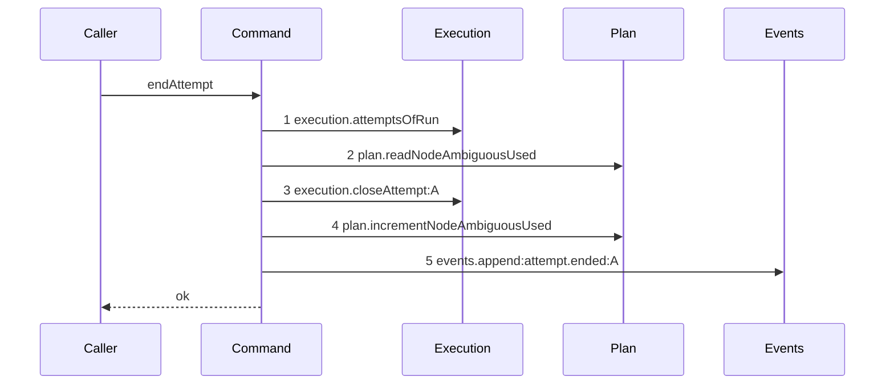

# Story 2 — An ambiguous ending increments the counter

Epic: `.agents/plan/epics/054.1-the-end-attempt-command.md`
Depends on: Story 1 (`01-a-semantic-ending-and-an-accepted-one`), for the command, its two reads, its
classification and its append; EPIC 054 Story 4 (`04-the-node-ambiguous-counter`), for `plan.incrementNodeAmbiguousUsed`.
Kind: story-implement

Diagrams: end-attempt-ambiguous

Seams: end-attempt-ambiguous: +execution.attemptsOfRun, +plan.readNodeAmbiguousUsed, +execution.closeAttempt:A, +plan.incrementNodeAmbiguousUsed, +events.append:attempt.ended:A

This story adds one seam call and nothing else. It leaves the no-op settlement to Story 3
(`03-a-settlement-over-a-closed-attempt-writes-nothing`) and the proposal to Story 4
(`04-the-proposal-records-the-command`), and it calls the command from no product path.

**The conversion is a case of this story and not a diagram.** A converted ambiguous ending makes the
same five calls in the same order and stores `semantic` instead of `ambiguous`, so it is case 3 and
case 4 here.
`.agents/plan/stories/050.2-the-run-renew-release-and-report/05-the-release.md:16` — `projected.exhausted`
already rules that a branch which changes a value and not the call set is not a diagram.

**The increment keys on the class before the conversion, and that is the whole point of the story.**
`../docs/workflow/worker.md:455` — `## 9. Attempt` states that an exhausted budget converts the next
ambiguous termination, so the charge is what the counter counts. A conversion that also suppressed
the charge would leave a crash loop unbounded past the budget.

## The path

### `end-attempt-ambiguous`

Fixture: Story 1's fixture with two changes — the input carries `outcome: "timed-out"` and
`evidence: { kind: "run-expired" }`, which the evidence table classifies `ambiguous` for an
`external` driver. `node.ambiguous_used` is null, so the read answers `0` and `ambiguousBudget` of
`2` leaves `0 < 2`: the class is stored unconverted. The alias table maps `attempt_a` to `A`.



**Only one of step 4's two neighbours is load-bearing, and the story says which.** The charge
**must** follow the close, because a close that answers `null` must charge nothing and Story 3 reads
that return. The charge **need not** precede the append: both writes are in one transaction, neither is
visible to any reader until it commits, and `ambiguousUsedAfter` is computed arithmetically as
`ambiguousUsedBefore + 1` rather than read back. Charge-before-append is therefore the epic's chosen
total order over a product-required partial order, and the diagram pins the choice so the
implementation cannot drift from it. Do not read it as a constraint the code imposes.

**Step 4 draws a bare token.** `plan.incrementNodeAmbiguousUsed(transaction, { id })` passes an object
as its last argument, but `test/helpers/sequence-conformance.ts:50` — `projections` holds no entry for
the method, so `test/helpers/sequence-conformance.ts:125` — `labels` is empty and the token carries no
label. The command may therefore charge once per path, which is exactly the product rule: one ending
charges one attempt.

**The four tokens this diagram shares with `end-attempt-semantic` are `+` here too.** A sign is
relative to the path, and this path's prior set is empty, so every one of its five tokens is `+`.
`plan.incrementNodeAmbiguousUsed` appears in no diagram of Story 1, so this story owns the only
declaration of it.

**Its prior set is empty, so this story declares no `Baselines:` line.** The path is written from
nothing: `src/commands/attempt/end-attempt.ts` did not exist before Story 1, and Story 1 draws a
different path of the same command.

Add `test/sequence/scenarios/end-attempt-ambiguous.ts`.

## Change

**Edit `src/commands/attempt/end-attempt.ts` — charge the node when the class before conversion is
`ambiguous`.** The boundary is one statement between the close and the append, and no other line of
the command moves.

### 1 — the charge

Insert between the close of Story 1's step 4 and the append of its step 5:

```ts
if (rawClass === "ambiguous") {
  dependencies.plan.incrementNodeAmbiguousUsed(transaction, {
    id: input.nodeId,
  });
}
const ambiguousUsedAfter =
  ambiguousUsedBefore + (rawClass === "ambiguous" ? 1 : 0);
```

**The predicate reads `rawClass` and never `termination`.** `termination` is the converted value, so a
predicate on it would stop charging at exactly the point the budget is exhausted and the counter would
freeze one below the boundary for ever.

**Delete the `const ambiguousUsedAfter = ambiguousUsedBefore;` line Story 1 wrote.** It is the orphan
this change creates, and the payload and the result both read the new binding unchanged.

**An accepted ending charges nothing**, because `rawClass` is `null` on that arm.

### 2 — no compare and set

**Write no zero-row check on the increment, and no restart.** The read at step 2 and the update at
step 4 are in one write transaction and SQLite admits one writer at a time, so a zero-row result is
unreachable and the guard it would justify is dead logic. Two attempts of one node cannot be open at
once: `src/commands/node/release-node.ts:103` — `openAttempts` throws on more than one open attempt of
a run.

## Constraints

- The increment is one call per ending. A second call would double-charge one crash.
- The increment keys on the class before the conversion, and the stored termination is the class after
  it. The two disagree by design at the boundary, and case 3 asserts both in one case.
- Do not move, add or remove any other seam call of the command. This story's `Seams:` line declares
  one token Story 1 does not draw, and the other four are the same tokens in the same order.
- Do not clear the counter. `node.unblock` does not clear it, and the worker switch of EPIC 056 owns
  the only clear.
- Do not add a projection entry to `test/helpers/sequence-conformance.ts:50` — `projections`.

## Verify

```
node --test src/commands/attempt/end-attempt.test.ts src/services/plan/sqlite.test.ts test/sequence/conformance.test.ts
```

Extend `src/commands/attempt/end-attempt.test.ts`, reusing Story 1's fixture builder. Read
`node.ambiguous_used` back with a raw `SELECT` inside `fixture.storage.transact`, separately from the
returned result, and assert it as a number or as `null` by value rather than through a coercion.

Add, each as a separate `it`:

1. `"a null ambiguous_used increments to one and two sequential ambiguous endings leave it at two"` —
   the diagram's fixture. Assert `SELECT ambiguous_used FROM node WHERE id = 'task_a'` is `1` after
   the first ending, and that the parsed payload's `ambiguousUsedAfter` is `1`. Then open a second
   attempt on the same node, end it the same way, and assert the column is exactly `2` and the second
   payload's `ambiguousUsedAfter` is `2`. The first half proves `COALESCE` over a null column, the
   second proves the charge is not idempotent. This is the epic's gate row 7.

2. `"a semantic ending charges nothing"` — the control for case 1: Story 1's semantic fixture over a
   node whose `ambiguous_used` is `1`. Assert the column reads `1` afterwards. Without it case 1
   passes for a command that charges on every ending.

3. `"after a conversion the stored termination is semantic and the counter still increments"` — the
   diagram's fixture with `ambiguous_used` seeded to `2`, which is `ambiguousBudget`. Assert the
   attempt row's `termination` is `"semantic"`, read from the row and not `"ambiguous"`, assert
   `ambiguous_used` reads `3`, and assert the payload's `termination` is `"semantic"` and its
   `ambiguousUsedAfter` is `3`. This is the epic's gate row 8, first direction.

4. `"at one below the budget the stored termination is ambiguous and the counter still increments"` —
   the same fixture with `ambiguous_used` seeded to `1`, which is `ambiguousBudget - 1`. Assert
   `termination` is `"ambiguous"` and `ambiguous_used` reads `2`. Cases 3 and 4 together prove the
   `>=` boundary in both directions, so a `>` implementation fails case 3 and a `>=` implementation
   at the wrong operand fails case 4. This is the epic's gate row 8, second direction.

5. `"a budget of zero converts the first ambiguous termination"` — the diagram's fixture with
   `ambiguousBudget` of `0` and a null `ambiguous_used`. Assert `termination` is `"semantic"` and
   `ambiguous_used` reads `1`. The boundary is `>=`, so `0 >= 0` converts, and the charge still runs.

6. `"the ambiguous counter survives the run that produced it"` — end run `run_b` by an ambiguous
   termination, assert the column reads `1`, then open a second `execution` run `run_c` over the same
   `task_a` with its own attempt, end it the same way, and assert the column is exactly `2`. The
   counter belongs to the node, so a per-run counter would report `1` here. This is the epic's gate
   row 9.

7. `"the two counter seams compose inside one transaction"` — extend
   `src/services/plan/sqlite.test.ts`. In one `fixture.storage.transact`, call
   `plan.readNodeAmbiguousUsed(transaction, 'task_a')` and assert `0` over a null column, call
   `plan.incrementNodeAmbiguousUsed(transaction, { id: 'task_a' })`, then call the read again in the
   **same** transaction and assert `1`. EPIC 054 Story 4 (`04-the-node-ambiguous-counter`) asserts
   each statement on its own; this asserts that the read sees the increment before the transaction
   commits, which is the ordering this command's `ambiguousUsedAfter` depends on. Assert in the same
   `it` that `plan.readNodeAmbiguousUsed(transaction, 'task_zzz')` answers `null` and not `0`, which
   is the control that Story 1's null guard has a reachable input.

8. `"a failure injected at the event append leaves the counter unchanged"` — the diagram's fixture
   with `events` bound to an `EventLog` whose `append` throws. Assert the thrown error escapes
   `fixture.storage.transact`, assert `SELECT ambiguous_used FROM node WHERE id = 'task_a'` is still
   `null` and not `1`, and assert `test/helpers/database.ts:117` — `databaseBytes` is byte-identical
   to the pre-call snapshot under `Buffer.compare`. **This is the counter half of the epic's gate
   row 4**, and it cannot live in Story 1: the semantic path Story 1 asserts never writes the
   counter, so an unchanged counter there proves nothing. The control is case 1, which writes it.

Add `test/sequence/scenarios/end-attempt-ambiguous.ts`, building the fixture the diagram names,
running the real `endAttempt` directly over real SQLite behind the recorder, passing
`{ execution, plan, events }` to `test/helpers/sequence-conformance.ts:99` — `recordSeams` with the
alias `{ attempt_a: "A" }`, passing `ambiguousBudget` of `2` and `instanceId` outside the recorder,
opening the transaction with `fixture.storage.transact`, and returning the recorder and the result.

`pnpm run verify` exits 0.

Proof: PASS line delivered — `src/commands/attempt/end-attempt.test.ts` and
`src/services/plan/sqlite.test.ts` in `PASS EPIC-054.1`.
